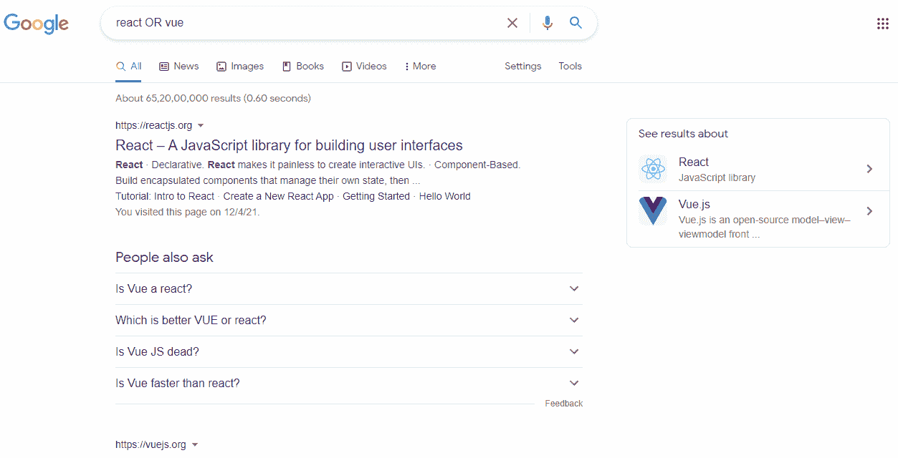
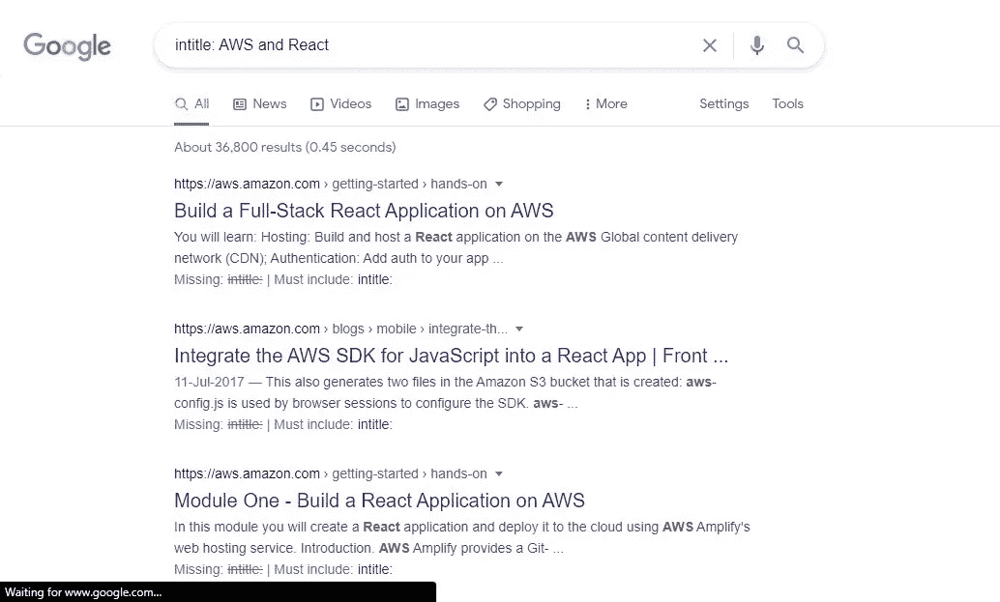
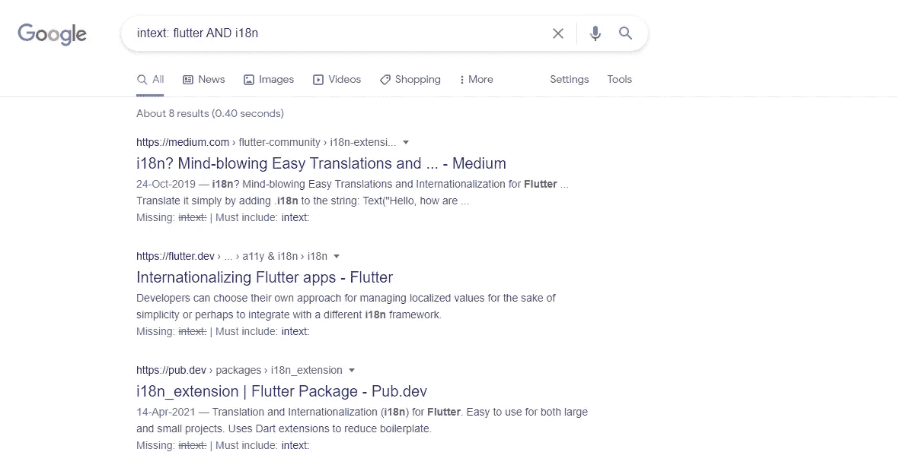
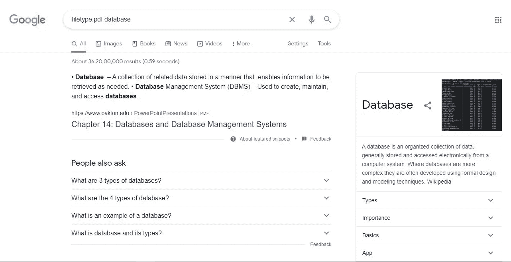
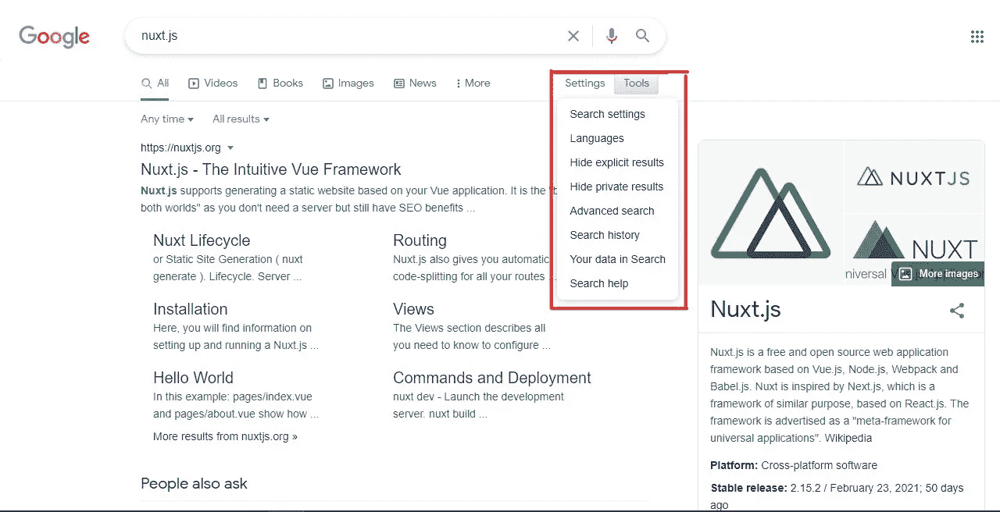

# 快速找到解决方案和答案的 5 个谷歌搜索技巧

> 原文：<https://javascript.plainenglish.io/5-google-search-techniques-to-quickly-find-solutions-answers-532974c2a196?source=collection_archive---------8----------------------->

## 专业开发人员使用的技巧和诀窍是在几分钟内找到答案，而不是没完没了地浏览几个小时。

Photo by [Elizaveta Dushechkina](https://unsplash.com/@kallyua?utm_source=medium&utm_medium=referral) on [Unsplash](https://unsplash.com?utm_source=medium&utm_medium=referral)

如果有人告诉你他们不用谷歌搜索解决方案，他们是在撒谎，即使他们是高级开发人员。句号。

初学者经常认为高级开发人员不在网上寻求帮助，这样做是“欺骗”。

因为这个神话，许多人患上了冒名顶替综合症。

即使你正在开发你过去已经创建的应用程序，仍然存在你遇到错误的可能性，特别是如果你已经在相当长的时间以前创建了应用程序。

现代的应用程序和网站需要复杂的框架、第三方库、扩展、调试器等才能问世。

总有可能会突然出现一些不可预见的错误。

这时，开发人员就要依赖最值得信赖的资源:互联网。

虽然像 StackOverflow 这样的论坛提供了大多数问题的答案，但有时它们还不够，您可能需要访问其他网站来找到答案。

我们大多数人都知道如何使用谷歌搜索，但有一些隐藏的、鲜为人知的技术和技巧会让我们更容易找到答案。

下面是你需要知道的 5 个技巧，来找到相关的有用的结果:

# 1.引号和布尔运算符

使用引号向您的搜索引擎发出信号，表明您正在查找特定的短语。

例如，您可以在引号中提及您正在使用的库的版本，如“10.0.4 ”,以获得与该特定版本相关的结果。

就像编程语言一样，Google 也支持 AND 和 OR 等布尔运算符。

如果您搜索“反应和节点”，您将只得到与反应*和*节点相关的结果。

运算符在一般搜索查询中作用不大，但可以与运算符结合使用，以获得更好的结果。

OR 运算符显示包含任一项的结果。如果你搜索“React 或 Vue ”,你会得到其中提到 React 或 Vue 的结果。

‘React OR Vue’ query. Source: Author.

还有一个' * '操作符，它充当通配符，将匹配任何相关的单词或短语。

例如，如果你搜索“三个*”，你会得到与“三个火枪手”和“三个臭皮匠”相关的结果。

类似地，我们有一个'-'运算符，它基本上排除了术语。如果你想搜索如何开始写博客，但不是用 WordPress，你可以搜索“博客初学者-WordPress”。

# 2.在网站的标题、内容或 URL 中搜索文本

谷歌允许你搜索出现在网页标题、内容甚至网站 URL 中的特定短语。

**标题:**使用`intitle`关键字，您可以搜索标题中的文本。例如，“intitle: React 和 AWS”。

Source: Author.

**内容:**你也可以使用`intext`关键字搜索内容，忽略网站的标题。

Source: Author

**URL:** 同样，你也可以使用`inurl`关键字搜索 URL。

# 3.按文件类型搜索

使用`filetype`关键字，你可以很容易地查找文件。

这只显示你提到的文件类型的结果。

由于附近的书店都关门了，我在一级防范禁闭时经常用这个下载电子书。

Source: Author

像“文件类型:pdf 数据库”这样的简单查询显示了与数据库主题相关的 PDF 列表。

# 4.在站点内搜索&连接的站点

有时你意识到某样东西一定被某个特定的网站所覆盖，但似乎在这个网站上找不到它。

幸运的是，Google 索引了所有的站点和页面，允许你使用我们上面已经讨论过的一些关键字和操作符直接通过 Google 查询它们。

您还可以使用`site`关键字在特定网站内进行搜索。

例如，使用`site`的查询可能是这样的:“Node 10.0.4 site: github.com”。

但有时这还不够，您可能需要访问与您指定的网站相关和/或相似的网站。这是通过`related`关键字完成的。

例如- 'Node 10.0.4 related: github.com '不仅会显示*GitHub，还会显示相关站点*。来吧，试试看！

还有一个关键字`link`，它显示了哪些页面链接到了一个特定的页面。

# 5.过滤和排序结果

这是列表中提到的所有技术中最常见的，因为你可以直观地使用它。

Settings and Tools button. Source: Author.

使用“设置和工具”按钮，您可以过滤搜索结果。

隐藏私人结果，按上传日期排序，改变每页的结果，以及改变区域，这些只是你可以使用的众多选项中的一部分。

有了这个，你可以很容易地微调你的搜索。

# 结论

初学者经常会认为高级开发人员什么都知道，在网上搜索答案是“作弊”。

甚至会导致冒名顶替综合症。

然而，在现实中，搜索互联网以找到解决方案和实现在编程中起着很大的作用。

当然，**在没有完全理解的情况下，不要盲目的复制粘贴代码**。

通过使用本文中提到的方法和技术，您可以微调搜索结果并节省大量时间。

希望你喜欢阅读这篇文章。

*更多内容看* [***说白了. io***](http://plainenglish.io)