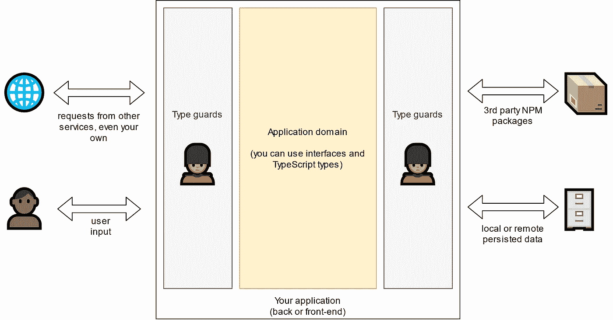

# 打字新手的 5 个陷阱

> 原文：<https://javascript.plainenglish.io/5-gotchas-for-typescript-new-comers-10e7b99dc23b?source=collection_archive---------7----------------------->

## 来自其他静态类型语言时你可能会忽略的东西

Photo by [Carla Anne](https://unsplash.com/@carly31?utm_source=medium&utm_medium=referral) on [Unsplash](https://unsplash.com?utm_source=medium&utm_medium=referral)

所以你已经做出了重大决定:你的下一个项目将利用 TypeScript，因为你已经到处阅读了[当你需要维护大型代码库时](https://medium.com/javascript-in-plain-english/typescript-with-node-and-express-js-why-when-and-how-eb6bc73edd5d)它将如何拯救你。真的，我完全同意你的观点:我的编程背景主要是建立在静态类型语言之上的，比如 C#，所以转向 TypeScript 就像回到了家。哦，当 web 前端需要时，我是用纯 JavaScript 编写的，但是很快转向 TypeScript 以获得所有自动完成和静态错误预防的好处是有意义的。

然而，如果你正在经历类似的旅程，有一些陷阱需要注意:根据你的背景，其中一些陷阱对你来说可能比其他的更明显，所以请在评论中告诉我你的建议。

# 1.防御性地使用接口或类型

TypeScript 接口或类型帮助我们构建更可靠的代码库，但是我想你很清楚，那些漂亮的类型定义在运行时消失了。事实上，编译器会在生成 JavaScript 文件时丢弃它们——正如您自己可能经历过的那样，它会拒绝任何在代码中使用带有接口的`typeof`或`instanceof`的尝试。

一方面，如果您直观地看到编译器如何转换您的代码，这个问题就很简单了，但另一方面，我发现根据您的背景，很容易适应 IDE 的智能感知，并忘记您的类型在运行时可能不成立。让我们看一个例子来说明接口(或类型)是如何欺骗我们的。

## 让太多的数据进入

在下面的示例中，您可以看到一个用 NestJS 编写的 API 控制器，但这可能是任何框架，甚至是前端代码。

现在可以想象，当在`/user`端点上执行 POST 请求时，`UserService`的`create`方法会将我们的用户对象持久化到某种数据库中。如果一切顺利，我们将存储一个用户名……但是请记住,`CreateUserDto`数据模型纯粹是开发时间的保障。TypeScript 中没有任何东西可以确保提供了用户名，甚至更令人担心的是，没有任何东西可以确保没有提供额外的数据！如果这是一个公共 API 端点，那么任何人都可以在您的数据库中存储任何东西，这是一个拥有不一致数据并使您的服务面临安全威胁的好方法！

Your API service when it expects a property according to your interface… and yet it’s not there at runtime

## 验证，验证，验证

经验丰富的软件工程师知道不要相信外部输入，这一点在 TypeScript 中肯定成立。如果你想验证，你需要构建你自己的类型保护，或者使用现有的库，比如 [IO-TS](https://github.com/gcanti/io-ts) ，或者 [class-validator](https://github.com/typestack/class-validator) 。有了这些工具，您现在可以过滤所有传入的数据，以便您的应用程序域可以安全地依赖类型和接口，并假设运行时对象满足它们的接口。

Any data that you manipulate in your application domain should be validated. If you limit yourself to user input, you may be surprised when some of the package or API service you use returns malformed content!

如果您对验证数据库对象感兴趣，并且正在使用 MongoDb，那么您很幸运:我这里有一篇专门为您准备的关于用 Mongoose 验证复杂嵌套类型的文章。

 [## 利用 Nest.js 和 Mongoose 进行多态数据验证

### 验证填充了不同数据模型的文档数组的实践指南

javascript.plainenglish.io](/leverage-polymorphic-data-validation-with-nest-js-and-mongoose-10ae1dcbcf6d) 

## 泄露太多数据

在继续之前，让我强调一下上图中的箭头是双向的。因此，如果从数据库中检索用户并将其作为 JSON 返回，就要非常小心。

Similarly, interfaces — or even classes- won’t limit the fields of a returned object at runtime. It sounds straightforward but can easily be forgotten when you are using and forwarding directly objects from 3rd party packages.

# 2.不使用 ESLint

如果你来自 C#世界，你可能熟悉 StyleCop、Resharper——或者如果你是一个 Java 爱好者，你可能熟悉 Checkstyle:这些 linters 在这里帮助标准化我们在团队中编码的方式，但是我不会确切地称它们为所有开发项目的基本。

虽然 ESLint 看起来是一个可选的噱头，但它却是 TypeScript 程序员工具箱中的一个重要武器。事实上，一些打字错误和错误可能仍然是有效的类型脚本代码，不会被编译器突出显示。你调用了一个方法，却忘了加括号？您将实例方法作为参数传递，而没有将其绑定到实例本身？所有这些错误仍然会编译成有效的 Typescript 代码，所以只有使用正确的 ESLint 配置才能发现它们。

## 承诺的例子

我感到惊讶的一种情况是 TypeScript 对`async`方法没有帮助。在 C#中，编译器会警告您没有在等待异步方法。在 TypeScript 中，`async`方法返回承诺，这些承诺是常规对象，与任何返回的对象一样，不关心函数返回什么是合理的用例。但是在承诺的情况下，这通常意味着你忘记了`await`一个功能的执行。

A sample of what might go unnoticed if ESLint is not setup. When your program reaches line 15, you are potentially still busy sending emails — and an unhandled exception could be thrown.

我认为这个例子特别有意义，因为根据上下文的不同，即使是单元测试也可能无法发现问题。单元测试中的`async`函数经常被嘲笑为用`Promise.resolve()`立即解决的承诺，这可能导致测试中的函数行为有些同步。一旦应用程序用真正的异步代码运行，调试就成了一个完整的旅程…

# 3.仅启用基本严格模式

启用严格模式对于利用类型检查的能力非常重要。因为这在 TypeScript 文章中已经讨论过了，所以让我进一步强调有时被忽略的一步:严格模式是不够的！如果您正在用最新的 TypeScript 版本(在撰写本文时是 4.2)开始一个全新的项目，那么这就是您想要的:

Since a few versions, the TypeScript team tends to refer to those additional checks as “Linter Rules”. It’s true that it is blurring the line between compiler and linter — was there ever a line though?

诚然，我理解`noUnusedLocals`有多烦人。如果你经常需要注释掉一些代码来进行快速测试，编译器会对你大喊大叫，因为一些变量现在还没有被使用。公平。但是我用`noUncheckedIndexedAccess`给你举个例子。

## 注意你的直接索引数组访问

我喜欢 TypeScript 的一点是它如何处理[空指针十亿美元错误](https://hinchman-amanda.medium.com/null-pointer-references-the-billion-dollar-mistake-1e616534d485):如果你设置了严格模式，那么你必须显式标记一个对象何时可能是`null`或`undefined`。如果你也执行输入验证，你应该做得很好…直到你使用数组。见下文:

如果不打开`noUncheckedIndexedAccess`，TypeScript 将假设您可以获取任何索引，这可能会在运行时导致令人不快的意外。幸运的是，在大多数情况下，数组的作用是通过`for .. of`或其他映射函数迭代它们，但是如果你需要直接访问一个特定的项，不要被编译器愚弄！

# 4.应为名义类型特征

这一条真的取决于你的其他语言经验，虽然听起来很直白，但它会在你最意想不到的时候偷袭你。如果您习惯于 C#或 Java 之类的静态类型语言，那么您可能会认为 Typescript 也适用于名义类型。来自所有强大的[维基百科](https://en.wikipedia.org/wiki/Nominal_type_system):

> 名义类型化意味着两个变量是类型兼容的 ***当且仅当它们的声明命名了相同的类型***

TypeScript 绝对不是这种情况。TypeScript 完全是关于形状的:您描述了一个对象必须具有的形状，无论是在类型、接口还是类中，只要变量具有相似的形状，它们就是类型兼容的。下面是一个用 C#实现的标称输入效果的例子:

Demonstrating the concept of nominal typing in C#

现在，打字稿的对应物:

The *greet* function does not expect a person, it just wants a name property

如您所见，TypeScript 编译器并不关心您是否传递了由实际的`Person`类构造函数创建的内容。它只关心你提供给`greet()`的对象上是否有一个`name`字符串属性。

## 为什么你应该拥抱它

如果您习惯于名义上的类型化语言，这是非常令人不安的，如果您通过防御性编程来进行编码，情况就更是如此。在我总结一些替代方法之前，让我首先声明:你需要改变你的思维模式，拥抱结构化类型。结构类型化的一个优点是允许无限的界面分离。如果你不从坚实的原理中回忆起“我”，看看[这篇文章](https://severinperez.medium.com/avoiding-interface-pollution-with-the-interface-segregation-principle-5d3859c21013)。

使用结构化类型，您可以定义每个函数期望的参数，但是您不需要像在 C#中那样为每个对象添加`implements MyInterface`。TypeScript 的编译器将检查形状是否匹配，这非常方便，因为它减少了接口及其实现之间存在的静态耦合。

## 绕过它

Structural typing, as illustrated by the “Square Hole” meme (@brock1137 on TikTok): if the shape you define is not specific enough, then you might allow anything to go through.

有时你可能会面临这样一种情况，你的对象的形状是相似的，但它们在逻辑上应该是不同的。让我们想象一下，在前面的`Pet` / `Person`示例中，我们想要阻止一个开发人员用宠物来调用`greet`。你可以这样解决它:

This technique is sometimes called “branded types”. Notice how we use ECMAScript’s symbols to make sure the nominal type name is unique.

这种技术的要点是，在想要在名义样式中使用的值或对象类型上添加一个文字类型的属性。因此，当 TypeScript 检查对象的形状时，它将确保`_nominalType`属性匹配。但是请记住:这都是在开发时发生的，一旦程序运行，这些信息都将不复存在！

# 5.信任确定类型的包

TypeScript 成功的原因之一在于它与裸 JavaScript 库集成得非常好。当你需要的库没有提供类型定义时，你很有可能通过使用`npm install -D @types/your-package-name`在[明确类型化的回购](https://github.com/DefinitelyTyped/DefinitelyTyped)中找到它们。

而且很多时候，尤其是知名的图书馆，一切都会运转良好。但是，您必须记住，那些类型定义是由社区维护的，这意味着:

*   如果你正在使用的 JavaScript 库得到了更新并改变了它的 API，你将不得不等待有人更新类型定义…如果它曾经被更新过的话
*   因为类型定义的作者和库的作者可能是不同的，并且因为原始源代码不是用 TypeScript 编写的，所以在类型定义中可能会有打字错误或诚实的错误
*   您要使用的库的类型定义可能根本不存在

## 如果你想得到很好的服务，请自便

如果你发现自己处于前面三点中的一点，不要绝望。如果你需要让事情快速运行，你总是可以[为一个导入的包](https://www.typescriptlang.org/docs/handbook/2/type-declarations.html#your-own-definitions)声明定义。

如果您有更多的时间，这是一个很好的机会，您可以自己在明确类型化的存储库上创建或更新类型定义！信不信由你，修复声明类型文件并不复杂:除了改进开源代码，我可以向你保证它有助于揭开 TypeScript 类型在幕后是如何工作的。

# 结论

好了，我希望你已经学到了一些东西。也许你还遇到了其他的打字稿陷阱，所以不要犹豫，在评论里分享或者用文章回复吧！感谢您的阅读。

*更多内容请看*[***plain English . io***](http://plainenglish.io)