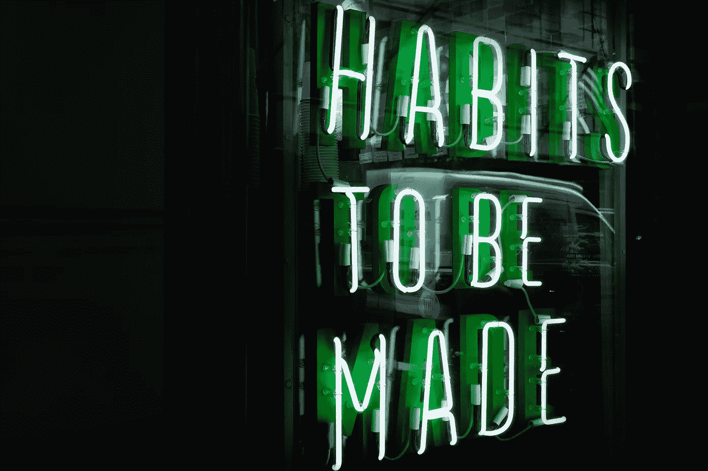

# 伟大软件工程师的 5 个习惯

> 原文：<https://javascript.plainenglish.io/5-habits-of-great-software-engineers-65ee4ac5b235?source=collection_archive---------0----------------------->

Photo by [Drew Beamer](https://unsplash.com/@drew_beamer?utm_source=unsplash&utm_medium=referral&utm_content=creditCopyText) on [Unsplash](https://unsplash.com/s/photos/habit?utm_source=unsplash&utm_medium=referral&utm_content=creditCopyText)

我第一次作为软件工程师开始我的旅程是在 2008 年，当时我加入了 ADP，为建筑商开发软件。这是我第一次在一家科技公司工作，作为一个刚接触这个行业的人，我分不清哪些是我应该从同事身上学到的好习惯，哪些是他们的坏习惯。

从第一个角色开始，我就在 7 家不同的公司工作，涉及不同的行业，因此，我有机会和一些不可思议的工程师一起工作，从中我学到了一些好习惯。

今天，我想和大家分享其中的一些习惯，重点放在我认为所有开发人员都会受益的五个习惯上。

# 1.当你不知道的时候，承认吧

Photo by [Jon Tyson](https://unsplash.com/@jontyson?utm_source=unsplash&utm_medium=referral&utm_content=creditCopyText) on [Unsplash](https://unsplash.com/s/photos/question?utm_source=unsplash&utm_medium=referral&utm_content=creditCopyText)

灌输给自己的第一个重要习惯是当你不知道某件事时承认，并接受你永远不可能知道所有的事情。

为了让你对此有所了解，如果我们看一下维基百科，我们会发现它仅列出了超过 [700 种编程语言](https://en.wikipedia.org/wiki/List_of_programming_languages)，当我们考虑到每一种都有自己的框架和语言时，很明显没有人能了解所有的东西。

不要假装你知道所有的答案，相反，当你不确定并且向团队反馈时，你应该承认你需要花时间学习和研究你探索的领域。除了在你需要的时候让你得到帮助之外，当你不知道某件事的时候被人所知的承认可以在你的团队中灌输信任，当你说你知道某件事的时候，你实际上知道了。

# 2.从团队的错误中学习，而不是指责

Photo by [Sarah Kilian](https://unsplash.com/@rojekilian?utm_source=unsplash&utm_medium=referral&utm_content=creditCopyText) on [Unsplash](https://unsplash.com/s/photos/mistake?utm_source=unsplash&utm_medium=referral&utm_content=creditCopyText)

作为软件工程师，我们经常每天构建复杂的系统并解决复杂的问题。不可避免地，有时我们会犯错误；然而，重点不应该是责备犯了错误的个人，而是确定我们作为一个团队从错误中能学到什么，以防止它再次发生。

我在团队中这样做的方式是，对于导致影响我们用户的事件的错误，我们将写一份事后分析。在本次尸检中，我们将记录发生了什么，原因是什么，影响是什么，以及采取了什么措施来防止这种情况再次发生。

在其他情况下，如果错误没有影响到我们的用户，我们通常会作为团队回顾的一部分来讨论它，在这里我们可以安全地讨论出了什么问题，以及我们可以从中学到什么。

这种方法意味着我们把时间花在团队发展上，而不是把责任归咎于犯错的人。作为一个团队，我们可以分享学到的东西，作为一个整体，整个团队的士气更高。

# 3.将用户需求置于自身需求之上

Photo by [Taras Shypka](https://unsplash.com/@bugsster?utm_source=unsplash&utm_medium=referral&utm_content=creditCopyText) on [Unsplash](https://unsplash.com/s/photos/user?utm_source=unsplash&utm_medium=referral&utm_content=creditCopyText)

作为软件工程师，我们经常需要决定使用什么技术。我们每天做出的选择对我们作为开发者的体验和用户使用我们产品的体验都有影响。这意味着我们应该始终考虑我们所做决策的用户成本。

让我们举一个为用户提供新特性的例子。作为开发该特性研究的一部分，我们找到了一个库，它将使我们能够更快地交付该特性。乍一看，这对用户和开发人员来说都是一个胜利，用户将从特性的快速准备中受益。为了验证这一点，考虑使用库的成本是很重要的，这可能会导致几种情况:

*   也许是一个 1KB 的库，对用户的应用体验影响微乎其微。
*   或者，可能是一个 1MB 的库会对应用程序的性能产生负面影响。

如果是第一种选择，那么选择这个库可能对用户和工程师都有好处，但是，如果是后者，那么只有开发人员能看到使用这个库的好处。在这个例子中，我总是把用户放在第一位，以确保他们有很好的体验，即使这意味着我要花更多的时间来提供这个功能。

# 4.有很强的观点，但持有的观点很弱

Photo by [Steve Johnson](https://unsplash.com/@steve_j?utm_source=unsplash&utm_medium=referral&utm_content=creditCopyText) on [Unsplash](https://unsplash.com/s/photos/opinion?utm_source=unsplash&utm_medium=referral&utm_content=creditCopyText)

在你的一生中，你可能会遇到这样一句话，“强烈的观点，微弱的坚持”。这个短语源于 Paul Saffo 在 2008 年写的一篇关于他如何撰写长期技术预测的文章，其中，面对不确定性，重要的是形成对某事的观点，即使这个观点后来被证明是不正确的。这篇文章可以在保罗·萨佛的博客上找到。

虽然它起源于技术预测，但它很快被用作思考的框架。

如果我们将此应用于软件工程，您可能会提出一个您认为对当前问题正确的解决方案。沿着这条路走下去，你可能会发现原来的解决方案行不通；然而，有了你学到的额外信息，你就可以找到解决用户问题的正确方法。

# 5.先听，后说

Photo by [Brett Jordan](https://unsplash.com/@brett_jordan?utm_source=unsplash&utm_medium=referral&utm_content=creditCopyText) on [Unsplash](https://unsplash.com/s/photos/listen?utm_source=unsplash&utm_medium=referral&utm_content=creditCopyText)

有一种普遍的误解，认为软件工程师是不喜欢与人交流的封闭者。成为一名成功的软件工程师的现实是完全相反的；我们在多功能团队中工作，将不同学科的人聚集在一起，我们一起为我们的用户创造伟大的产品。

当以这种方式工作时，团队中每个人之间的沟通非常重要，这样每个人都可以很好地理解团队想要实现的目标。这种交流必须是双向的，强调首先倾听团队中的所有意见，然后给出你的意见。

随着你成为一名更高级的工程师，这一点变得更加重要，你的话会更有分量，很难不影响谈话。倾听你的同事们的意见，他们会有很好的想法，作为一个团队，你可以在此基础上开发优秀的产品。

# 结论

不言而喻，作为一个伟大的软件工程师，除了我在这里写的五个习惯之外，还有更多。软件工程是一个广泛而复杂的领域，在一家公司有效的方法可能在另一家公司无效。

这些习惯来自我自己的经历，我很想听听你自己的经历，你认为什么样的习惯才能成为一个伟大的软件工程师？

*多内容于* [***浅显易懂***](http://plainenglish.io)