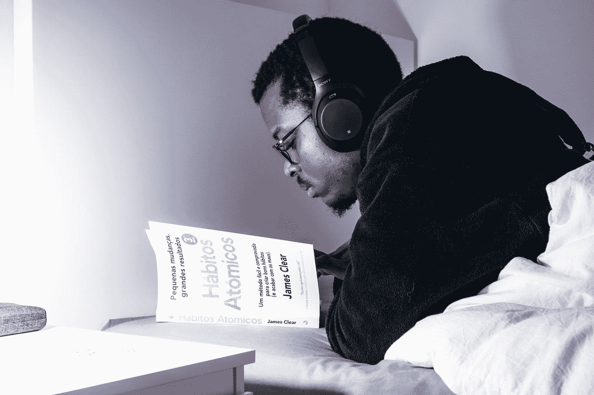

# 区分优秀开发人员和优秀开发人员的 5 个习惯

> 原文：<https://javascript.plainenglish.io/5-habits-that-separate-great-developers-from-good-developers-bc7187e7529f?source=collection_archive---------7----------------------->

## 专业开发人员遵循的惯例和实践。

Photo by [Nubelson Fernandes](https://unsplash.com/@nubelsondev?utm_source=medium&utm_medium=referral) on [Unsplash](https://unsplash.com?utm_source=medium&utm_medium=referral)

成为一名熟练的开发人员需要花费大量的时间和精力，其中一个行之有效的超越方法是从杰出的、久负盛名的开发人员所遵循的实践和惯例中学习。

专业开发人员实践的一些习惯非常不受欢迎，因为他们遵循起来很乏味，需要投入大量的时间和精力。

然而，掌握这些习惯确实能确保你现有技能的增长，并保证你有更好的机会树立自己。

由于数据科学和其他类似领域的兴起，编码如今变得越来越普遍，甚至更加普遍。

因此，如果你想找到一份工作，甚至想成为自由职业者，对差异化因素的需求比以往任何时候都更加重要。

专业开发人员遵循的一些习惯和惯例如下:

## 1.不要重复自己。

这个习惯在构建大型项目时很有用，并且是基于 DRY 的。

这个原则最早是在《务实的程序员》一书中介绍的。

“不要重复自己”的原则是一种实践，旨在减少代码、组件、架构和其他与软件开发有关的方面的重复。

事实上，这种方法很容易实现，因为大多数框架和库都非常支持函数和组件，甚至鼓励代码拆分的习惯。

例如，在 React 中，您可以轻松地为可重用组件(如菜单按钮)创建一个单独的文件夹，然后只需导入它，就可以在项目中的任何地方重用它。

尽管这听起来很简单，但在实践中最初很难实现，因为您并不真正了解您最终可能会使用哪些组件和代码。

因此，我建议规划和设计最终产品，我将在本文后面讨论。

## 2.每天编码

每天编码可以带来一些巨大的进步，如果你正在学习如何编码或掌握新的算法或语言，这是至关重要的。

值得注意的是，围绕这种实践的一个最常见的误区是，您必须在日常编程中花费大量时间。

然而，在实践中，事情是不同的，因为每天只写 15 分钟的代码也可以使它成为一种习惯，同时，帮助你积累知识。

当我在学习 web 开发时，我决定参加流行的#100DaysOfCode 挑战，并致力于坚持编码，连续 100 天没有错过一天。

尽管仅仅 56 天之后，我没能完成并输掉了挑战，但我的编程技能确实有了巨大的提高。

每天写代码也能带来潜在的职业转变和令人兴奋的机会。

## 3.永远保持学习

如果您已经开始了您的编码之旅，那么您一定非常清楚，围绕软件开发和编程的课程通常是动态的，并且会在几年后发生变化。

今天 [Node.js](https://nodejs.org/en/) 非常受欢迎，但几年后，我们可能会看到 [Deno](https://deno.land/) 完全取代 Node。

因此，成为一名开发人员是一个终生学习的旅程，只有不断的变化。

您不需要学习所有的堆栈、算法或框架，但是学习其中最重要的，并跟上行业中的现代实践和库，对您来说可能是一个游戏改变者。

在我看来，当谈到区分优秀和伟大的开发人员时，这个习惯是最关键的因素之一，因为如果你从未停止学习，你将最终在许多领域和技术中获得宝贵的经验。

## 4.规划最终产品

在深入研究代码之前，保留最终产品是非常重要的。

通常，我们会投入到那些刺激我们的次要项目中，但最终却因为我们没有考虑周全而中途退出。

这一点也与清单中提到的第一个习惯——不重复自己联系在一起。

当你知道并设计了最终产品后，你就可以计划配色方案、按钮布局、导航菜单样式等等，这样可以节省你标记将在几个地方使用的组件的时间。

随着您构建更多的项目并提前计划它们，您将对库和开发模式有一个很好的理解，这些都是制作各种产品所需要的。

此外，您将能够编写更干净的代码。

## 5.休息并避免过度劳累

很多时候，开发人员认为他们对编码感到厌倦，失去了兴趣，但他们感觉到的只是疲惫，这是很自然的。

了解倦怠的确切含义是很重要的。它是由于长时间的压力或单调的工作而引起的身体和精神疲惫的状态。

我们不仅会因为编码而精疲力尽，还会因为长时间没有丝毫变化的其他活动而精疲力尽。

事实上，这很常见，我看到许多开发人员从社交媒体手柄或辅助项目中抽出时间来弥补疲惫。

避免精疲力尽的一个关键是倾听你的身心。一个伟大的开发人员知道什么时候停下来休息一下。

有必要充实你的头脑和兴趣，休息一下或留出几天做一些与编码完全不同的事情是避免精疲力尽的好方法。

## 最后的想法

我们都有一些开发人员作为我们的榜样，我们努力成为他们那样的人，但严酷的事实是，这需要耐心、牺牲，最重要的是纪律。

> 冰冻三尺非一日之寒。

伟大的开发人员花了无数的时间来掌握他们的技术，成为伟大的开发人员的唯一方法就是做同样的事情。

我已经讨论了你应该遵循的一些核心习惯，以充分发挥你的能力，但这些习惯也可以转移到其他领域。

例如，养成每天写代码的习惯可以让你的生活更有规律，时间管理更好。

虽然我已经讨论了与伟大的开发人员的个性和惯例相关的习惯，但是如果你对学习如何在技术上改进感兴趣，我也有一个关于这方面的博客，你可能会感兴趣。

 [## 作为开发人员成长的 5 种方式

### 明确的方法来提高你的游戏和推进你的职业生涯

javascript.plainenglish.io](/5-ways-to-grow-as-a-developer-b147336debb6) 

编码是一生的旅程，你应该永远记住这一点。

希望你喜欢看我的文章！