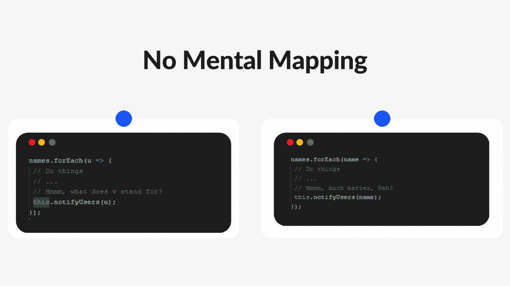

# 写干净的 JavaScript 代码需要记住的 5 个“黑客”

> 原文：<https://javascript.plainenglish.io/5-hacks-to-keep-in-mind-for-writing-a-clean-javascript-code-76b4caf5b4b6?source=collection_archive---------4----------------------->

## 干净的 JavaScript 代码清单。

By FAM

你是一个网络开发人员，他不仅关心如何编写代码，还关心代码是如何编写的吗？你在乎写*干净的*代码吗？欢迎，本文是给你的！

您知道普通开发人员和专业人员之间的区别吗？区别可以用一句话来概括:一个专业的开发人员为未来和 ***【其他开发人员】编写代码。***

为了编写干净的代码，我们需要学习，学习，并继续学习。作为一名网络开发人员，在我的旅程中，我收集了一些我需要每次检查的要点，以确保我的代码能够记住未来，也确保其他开发人员最终能够检查出来。

# 计划:

1.  **使代码可读**
2.  **使用有意义的名称**
3.  **忌心算**
4.  **功能做一件事**
5.  **使用强力型检查**

# 让我们潜入…

## **1。如何使代码可读？**

让我们挑战你的开发者的眼睛。从第一眼看，你的眼睛能更好地理解哪些代码？

Readability

格式会改变代码的可读性。这就是为什么代码格式化工具非常有用，并且非常重要。使用 Linter 和更漂亮的工具可以让所有开发人员都可以阅读您的代码，反之亦然。

## **2 .使用有意义的名字**

[***【干净代码】***](https://www.amazon.com/Clean-Code-Handbook-Software-Craftsmanship/dp/0132350882) 的作者关注的重点之一是变量的仔细命名。这非常重要，因为它让你的代码很容易被其他人读取。毕竟，我们开发人员会说机器语言，但我们仍然是人类！我们需要一起工作。让代码更“人性化”将极大地简化您和其他开发人员的生活。

Variable naming

## **3 .无思维导图**

当快速编写代码时，我们通常会进行思维映射。当然，事情对我们来说是可读和清晰的，但这不是专业的，因为你未来的自己或未来的开发者不会马上理解你的映射！

No mental mapping

## **4 .功能做一件事**

函数名应该是一个动词或一个短语，充分暴露其背后的意图和参数的意图。他们的名字应该说明他们做了什么。您可以检查您的功能是否干净和成功，它是否做了一件事并且做得很好，以及是否有一个清晰和有意义的名称！

Functions

## **5 .使用强力类型检查(**使用`===`代替`==)`

bug 往往来自程序逻辑。检查时的一个简单错误会对程序产生巨大的影响。

Use `===` instead of `==`

通过应用这 5 个技巧，你可以确保你的代码是可读的、有意义的、专业的！

我希望这是有用的。谢谢大家！

## 亲爱的读者，我希望这是明确和有用的。

不管你在哪里，我都希望你和你的家人平安无事！坚持住。明天会更好！

**联系一下** [**中**](https://medium.com/@famzil/)**[**Linkedin**](https://www.linkedin.com/in/fatima-amzil-9031ba95/)**[**脸书**](https://www.facebook.com/The-Front-End-World)**[**insta gram**](https://www.instagram.com/the_frontend_world/)**，或者**[**Twitter**](https://twitter.com/FatimaAMZIL9)**。********

 ****[## 前面

### 欢迎来到❤家庭前线

www.fam-front.com](http://www.fam-front.com/)**** 

******FAM******

****[*更多内容请看 plainenglish.io*](http://plainenglish.io/)****