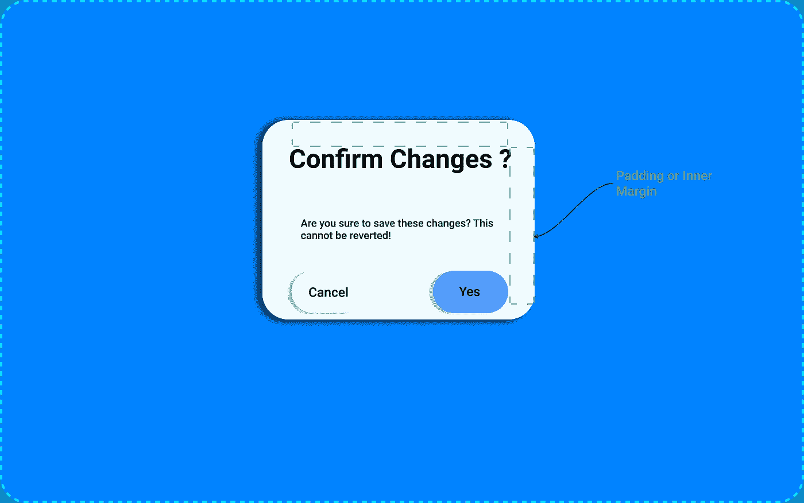
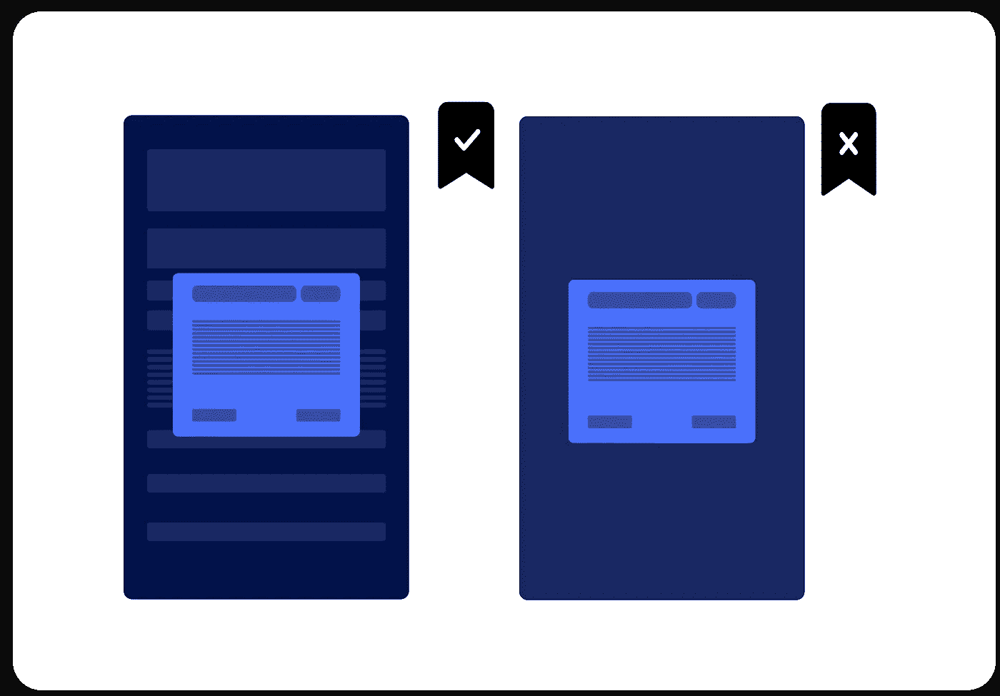
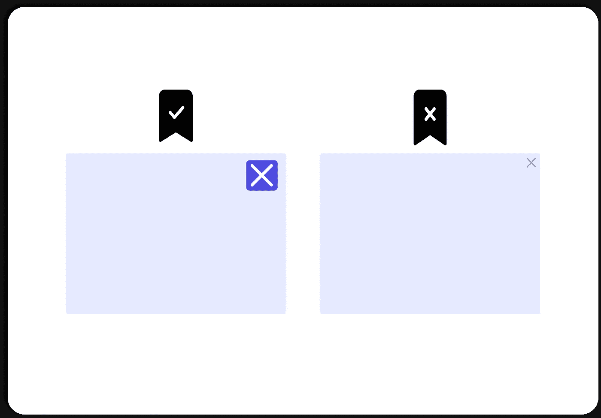
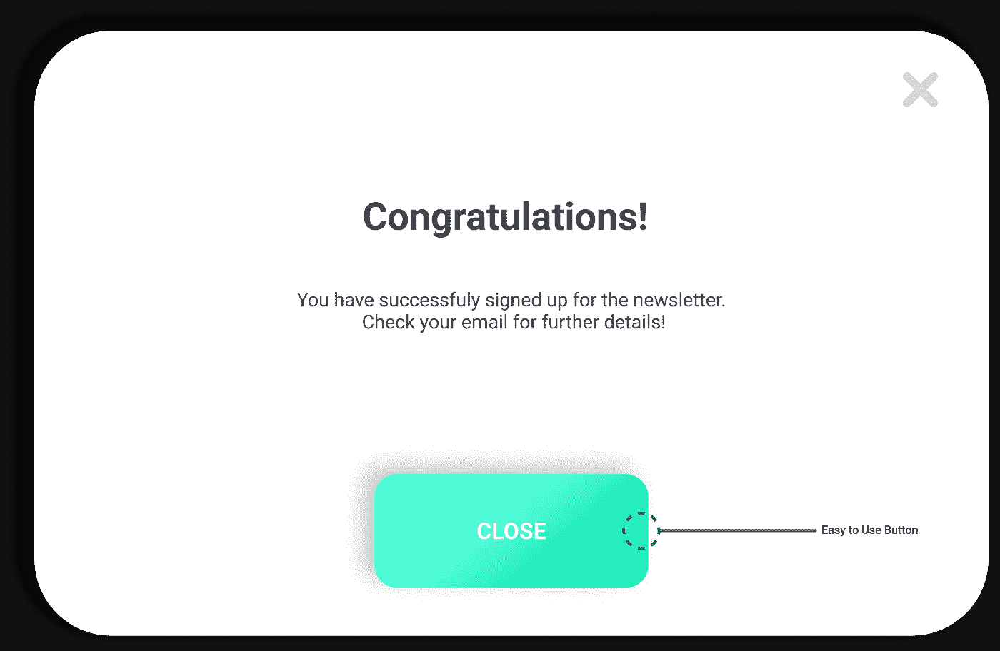
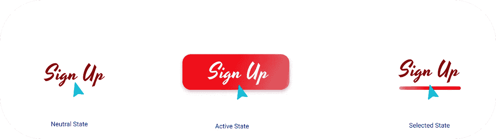
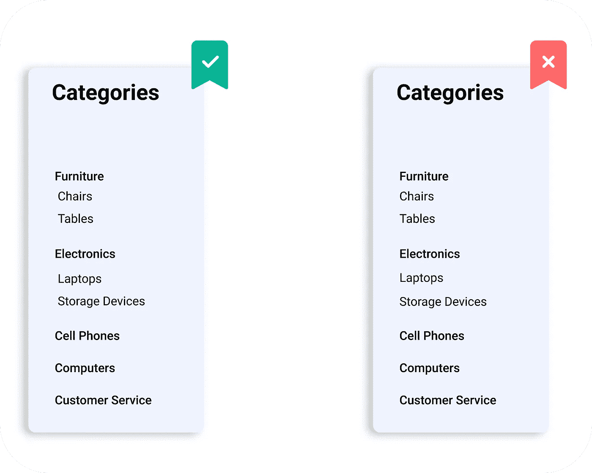

# 网站开发人员避免常见错误的 5 个便捷的网站设计技巧

> 原文：<https://javascript.plainenglish.io/5-handy-web-desing-tips-for-web-developers-f36bcb3fdaf4?source=collection_archive---------20----------------------->

网页设计中要避免的常见错误

# 弹出窗口

弹出窗口用于显示额外的操作或信息，在显示顶级提示时非常流行。通常有三种类型的弹出窗口，包括**成功**或**失败**、**确认、**和**注册**动作。

## 不要淹没你的弹出窗口

**Confirmation Popup**

很多时候，我看到应用程序的弹出窗口中充满了元素和信息——不要这样做。确保你的弹出窗口提供最少的信息，并且开门见山。

*   提供一条**消息***(‘确认更改’)*，告诉用户他们的操作即将产生的结果，以及与这些操作相关的按钮**(在一个*弹出窗口中不应超过 3 个* )** 。

## 使用合适的背景

**Background Overlay**

如果有合适的背景，弹出窗口更容易被看到。你可以很容易地在它下面的背景上添加一些覆盖层。你可以用一个**暗色调**和一个 **70% *不透明度*** 的值来保持事物简单平滑。

给一个稍微透明的背景可以让你的用户区分整个屏幕的不同上下文，简单地说，你的用户会记住弹出窗口在屏幕上的位置。

*   你也可以使用全黑 **(#000000)** 、70%不透明度或应用程序颜色的暗色调来获得更一致的结果。

## X 按钮

你的关闭按钮应该足够大，这样用户不会沮丧地点击它，它应该有足够的**对比度**和**大的活动区域**。一个很好的方法是简单地创建一个 **X** 作为你选择背景的按钮，这是一个简单的方法，并且总是开箱即用。

*   可点击区域应该总是大于 X 本身，对于移动设备，活动区域的推荐值大约为 **44x44 磅**，对于桌面设备，推荐值大约为 **32x32 磅**。
*   不要添加一个 ***低对比度*** 的小按钮，并且在它周围有一个小的可点击区域，这可能会让你的用户感到沮丧，因为他们必须非常精确地实现想要的动作。
*   另一个让你站起来的好方法是在弹出窗口中使用一个额外的关闭按钮，如下所示。

**Extra Closing Buttons**

> ***注意:*** *如果你正在使用任何带有* ***注册*** *表单的弹出窗口，请确保你没有用自动弹出窗口打扰用户，因为用户不希望出现这些弹出窗口，并且他们中的大多数会本能地关闭窗口。这很容易导致令人沮丧的用户体验。*
> 
> *但是，建议使用注册表单页面本身，而不使用任何弹出窗口。*

# 航行

用户界面的重要组成部分，它决定了用户如何与拥有多个屏幕元素的应用程序进行交互。一个小小的导航问题会导致大量的用户流失，因为你让用户很难使用应用程序。为了构建具有良好细节的导航，你需要注意导航的三种主要类型，并且让每个人都简单。

*   **可见:**始终在屏幕上可见，可以是一组标签，当前活动的标签会高亮显示。
*   **隐藏:**导航菜单，除非启动激活动作，否则不可见。
*   **上下文:**它们是活动链接或按钮，可将您从当前页面导航到其他页面。

## 基于文本的标签总是更好

在应用程序中提供导航的最简单的方法之一是使用基于文本的选项卡，但开发人员仍然会犯一些大错误，使他们的产品在导航方面不那么有吸引力。

总是从最低高度为 **44p** 的移动和最低高度为**24–32p**的桌面图案开始。你必须确保你的标签包含三种状态(**中立，活跃，选中**)。

*   即使标签页本身只是文本*，你的可点击区域也应该足够大，在 ***链接*** 的两边留有足够的空间。*

**

## *只有在必要的时候才使用边栏*

**

*侧边导航(侧边栏)应该只考虑长标签列表，就像我们在电子商务应用程序中一样。如果您有许多具有嵌套结构的选项卡，这种模式非常方便。*

*   *在设计这样的边栏时，你很容易陷入在没有类别层次的情况下安装太多元素的陷阱。避免使用密集堆叠的文本，因为用户需要更长的时间来浏览和理解，并且你的用户很容易因为这个问题点击错误的标签。*

* [## 作为软件开发人员，你正在犯的 5 个 UI 错误

### 开发人员在前端应用程序中经常犯的 UI 错误

javascript.plainenglish.io](/5-ui-mistakes-you-are-making-as-a-software-developer-6e311d769a77)  [## 让你成为前端忍者的 6 个 UI 概念

### 构建具有出色 UI 的应用程序的基本概念

javascript.plainenglish.io](/6-ui-concepts-that-makes-you-a-frontend-ninja-c6c0a29fa954)  [## 3 个隐藏的 CSS 功能

### 对前端开发者有用的 CSS 特性

javascript.plainenglish.io](/3-hidden-features-of-css-566e8c27597f) 

*更多内容看*[***plain English . io***](http://plainenglish.io/)*