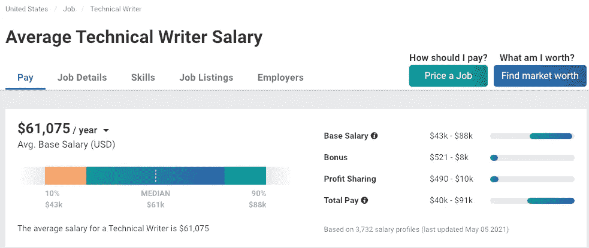
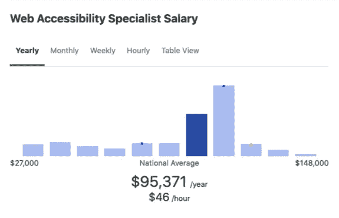
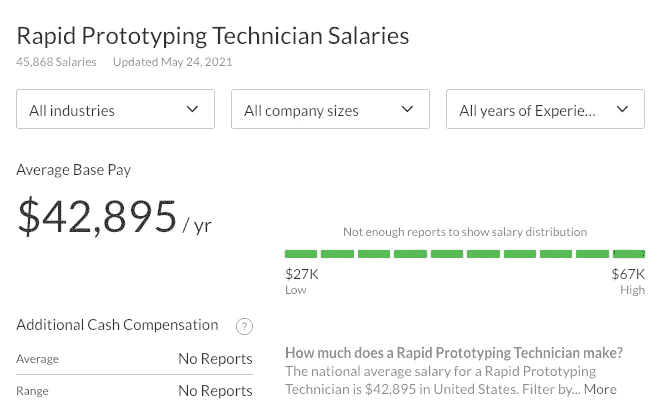
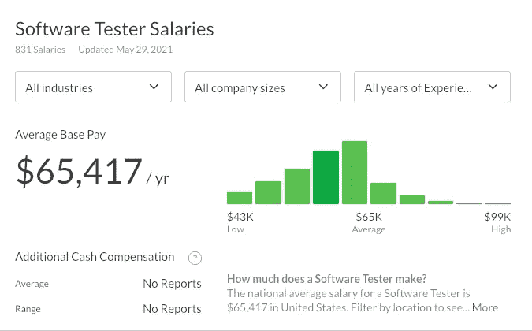

# 5 项不需要编程的高要求 IT 工作

> 原文：<https://javascript.plainenglish.io/5-high-demand-jobs-in-it-that-dont-require-programming-60266ee91d8f?source=collection_archive---------18----------------------->

## 是的，这些工作是存在的，而且报酬很高。

Photo by [Helena Lopes](https://unsplash.com/@wildlittlethingsphoto?utm_source=medium&utm_medium=referral) on [Unsplash](https://unsplash.com?utm_source=medium&utm_medium=referral)

许多年来，不同的媒体都宣称“在编程的世界里，没有失业。”如果我们在此基础上再加上一点，在这个世界上开始，你所需要的只是时间和一台电脑。学习几乎没有障碍，因为在互联网上可以找到很多信息。因此，很高比例的失业人员在某个时候考虑成为程序员是正常的。

然而，并不是每个人都有一个有条理的头脑。因此，学习编程既容易又有挑战性。在许多情况下，这可能是一项令人沮丧和令人畏惧的任务。

如果你属于这第二类，不要放弃。IT 行业很广阔，有些技术性工作你不需要写一行代码。

下面，你会发现 5 个你不需要编程的工作，但是你仍然可以在这个领域工作:

# 1.作家/技术文献学家

虽然今天许多人认为技术写作是创建软件手册，但这种类型的写作几乎可以应用于任何行业。它是关于用一种可理解的语言来交流想法、概念或复杂的过程。但是，不幸的是，只有一小部分技术文章能到达最终用户手中。

公司使用这种类型的文档来解释他们的内部程序、设计和生产他们的产品、实现他们的过程等等。因此，这里的机会范围很广。你只需要对技术和文字(尤其是书面文字)的天赋有所喜爱。

Image screenshot by the author on [Payscale](https://www.payscale.com/research/US/Job=Technical_Writer/Salary)

# 2.网页无障碍专家

如果除了喜欢技术之外，你还关心每个人都可以访问它，也许你应该专攻可用性和可访问性。

虽然我们认为应用程序或网站的可用性应该从项目的一开始就考虑在内，因此，它应该在开发者的脑海中以及它的功能中，但不幸的是，在这个问题上仍然非常缺乏知识，这需要在项目的大部分完成后进一步工作。

因此，在这里你可以找到你的市场定位，建议设计师，程序员，甚至网页内容创作者，让他们的作品可以被所有人使用和访问。

Image screenshot by the author on [ZipRecruiter](https://www.ziprecruiter.com/Salaries/Web-Accessibility-Specialist-Salary)

# 3.快速原型生成器

另一种选择是专门设计快速原型，也称为线框。这些模型可以包含从简单的草图到完整应用程序的原型。这完全取决于我们需要用它们来表示的精确程度。

例如，在设计阶段，为同一个网站呈现不同的选项是很常见的。相比之下，在我们寻求客户反馈的应用程序开发阶段，通常会呈现一个完整的原型。

快速原型是一个项目的不同参与者之间的一种方便的交流工具，因为它们允许在许多情况下似乎不使用相同语言的各方之间的理解。

此外，为了帮助您完成任务，许多工具将使您不必“手工”绘制草图。

Image screenshot by the author on [GlassDoor](https://www.glassdoor.com/Salaries/rapid-prototyping-technician-salary-SRCH_KO0,28.htm).”

# 4.产品技术支持

如果你决定做这份工作，就要保密！或者你最终会支持你的伴侣、朋友、家人、家庭朋友、亲戚或家庭朋友，你永远不知道你的一天什么时候结束。

我们都知道这份工作的内容，对吧？粗略地说，我们可以说它是关于帮助人们使用某些软件，通过多种方式解决他们的疑问:电子邮件，电话，社交网络。这些用户可以是你工作的公司的客户(外部支持)，也可以是你自己的同事(内部支持)。

因此，99%的时候，你的沟通和移情能力将占上风，与拥有丰富的编程语言知识相比，决定性的事实也是如此。

Image screenshot by the author on [Payscale](https://www.payscale.com/research/US/Job=Technical_Support_Specialist/Salary)

# 5.软件测试

有人可能会先验地认为，为了测试一个应用程序，有必要进行编程，事实上，有一个精确的测试角色需要编程。但实际上，这项工作还包括测试一个程序或一个应用程序，寻找错误，检查它是否符合客户的规格，也许是最有趣同时也是最困难的部分，测试软件，就像你是一个简单的用户名一样。

后者至关重要。事实上，如果程序员在编写代码时能够设身处地为用户着想，我们可以说出现在客户端的 bug 数量将会减少到几乎为零。

这就是为什么应用程序测试人员执行如此重要的工作，因为他们告诉开发人员程序的哪些部分不工作，防止这些错误出现在普通人身上。

Image screenshot by the author on [GlassDoor](https://www.glassdoor.com/Salaries/software-tester-salary-SRCH_KO0,15.htm)

总之，如果你是一个在开发者和用户之间游刃有余的人，并且有沟通技巧，你将能够完美地适应上述任何工作。

*更多内容尽在*[*plain English . io*](http://plainenglish.io/)