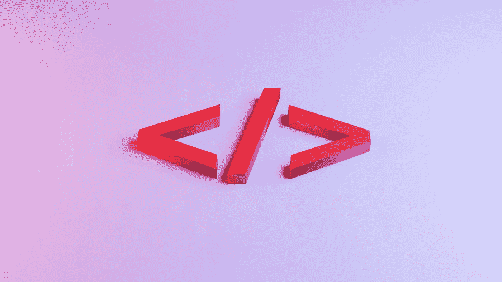

# 你可能不知道的 5 个 HTML 标签

> 原文：<https://javascript.plainenglish.io/5-html-tags-you-probably-didnt-know-about-f2425a0a888c?source=collection_archive---------17----------------------->

## 有用但不受欢迎的 HTML 标签

Photo by [Jackson So](https://unsplash.com/@jacksonsophat?utm_source=unsplash&utm_medium=referral&utm_content=creditCopyText) on [Unsplash](https://unsplash.com/s/photos/html5?utm_source=unsplash&utm_medium=referral&utm_content=creditCopyText)

我已经多次听到“ *HTML 很简单*”这句话，但是尽管我同意它比其他编程语言更容易学习，但是你不应该认为它是理所当然的。

HTML 是一种强大的**标记语言**，它可以用来构建我们的在线应用程序，并提供显著的可访问性优势，但只有在正确使用的情况下。

存在如此多的 HTML 标签，以至于几乎不可能知道所有的标签，这意味着有几个标签大多数人都不熟悉。

以下是我发现的五个最少使用但很有用的 HTML5 标签:

1.  **kbd>**
2.  **<进度>**
3.  **<子>** 和 **<子>**
4.  **<细节>** 和 **<概要>**
5.  **<数据表>**

# **大骨节病**

元素表示键盘上的一个键。这些标签包围的文本通常以浏览器的默认等宽字体显示。这是一个未被充分利用的元素，如果您必须编写任何类型的用户文档，它会非常有用。

# **进度**

元素显示了一个任务进度的指示器。它通常显示为进度条。

例如，如果要显示完成 55%的任务，可以指定值为 55，最大值为 100。

# **Sub & Sup**

标签``定义了**下标**文本。下标文本出现在正常行的下方半个字符**处，大部分时间以较小的字体呈现。这种标签可以用于化学公式，如 H2O。**

同样，``标签定义了**上标**文本。上标文本出现在普通行上方半个字符**处，并且以较小的字体呈现。您可以使用此元素来表示指数或序数。**

# 详细信息详细信息**摘要**

`
`和`
`标签一起用于创建一个披露小部件。

`
`用作小部件的标签，点击它可以查看/隐藏细节，包裹在`
`标签中。

您可以通过设置/删除它的`open`属性，以编程方式打开和关闭小部件。

# 数据列表

`<datalist>`元素用于为`<input>`元素提供“自动完成”特性。它为用户提供了一个预定义选项的列表来选择数据。它既可以作为搜索，也可以作为下拉菜单。

为了连接`input`和`datalist` , `input`字段的列表属性必须与`datalist`的 ID 相同。

# 结论

感谢阅读，希望你学到了新的东西！你知道有哪些不常用却很有用的 HTML 标签吗？留言评论！

*考虑* [***成为中等成员***](https://ebelinggianmarco.medium.com/membership)**如果你喜欢看这样的故事，想帮助我这个作家。每月 5 美元，你可以无限制地访问媒体内容。如果你通过* [***我的链接注册，我会得到一点佣金。***](https://ebelinggianmarco.medium.com/membership)*

**更多内容请看*[***plain English . io***](http://plainenglish.io/)*