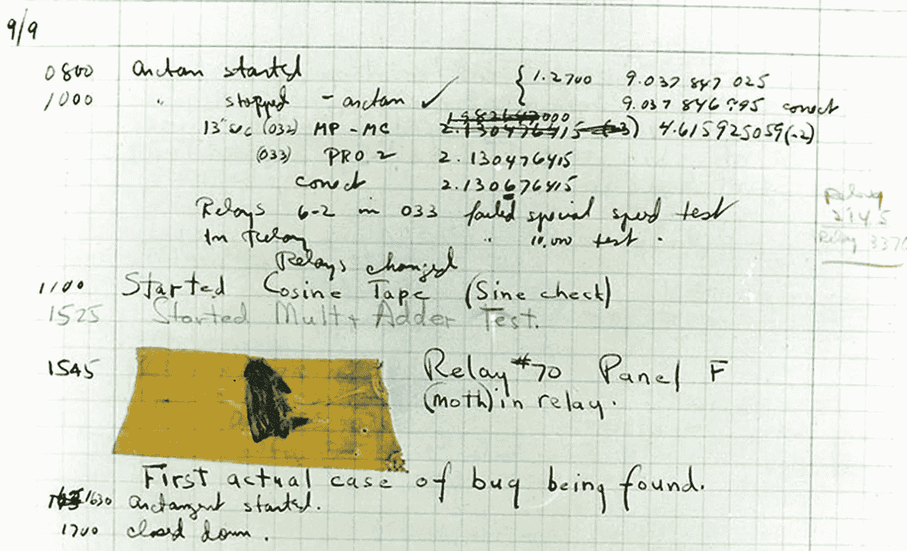

# 5 个幽默又恐怖的虫子

> 原文：<https://javascript.plainenglish.io/5-humorous-and-horrifying-bugs-8776b7e90d69?source=collection_archive---------11----------------------->

找个机会问一个程序员“你最喜欢的 bug 是什么？”你可能会得到一些精彩的故事。它们可能是一些不幸的故事，其中一些恶棍得到了应有的惩罚。他们可能很难解决导致个人胜利感的难题。但是，它们经常是在开发过程中遇到的绝对怪异行为的幽默轶事。

## 1."我们一圈又一圈地走，虫子在哪里，没人知道."

松弛——我们喜欢它，我们讨厌它。Slack 最近出现了一些非常明显的中断，但我最喜欢的用户界面错误之一是几年前的这个珍品。

Round and Round it goes…

## 2.当虫子在硅里的时候

必须解决的最糟糕的问题之一是可怕的“零星问题”。一个挑剔的测试可能会在运行的 20 次中有 1 次失败，但是在“我的机器”上似乎从来没有失败过。当我在 MathWorks 工作时，一个这样的 bug 成为了一个绝对的传奇。

它始于图形测试，这本身并不令人惊讶。众所周知，MathWorks 的图形测试很难被锁定，因为对许多测试来说，你必须等待渲染发生。如果你没有等待足够长的时间，渲染可能不会发生。如果你避免这种情况，并给你的测试增加长时间的等待，你的测试将会花费很长时间。有时运行测试的服务器会承受额外的负载，所以你几乎不会失败。

正在讨论的测试有 1%的失败率。第一步是在本地运行测试几千次。没有失败。在测试服务器上的“相同”机器上尝试测试几千次。没有失败。

然后，质量工程师有了追踪故障机器的想法。这听起来似乎是一个显而易见的步骤，但是对于现代测试系统中的所有抽象(测试在容器中运行，容器在服务器之间是可移植的)这可能是一个挑战。一旦她发现一台机器出了故障，她就建立一个测试循环来运行测试几千次。

机器通过 4 次测试后关闭。

这是一个巨大的线索。在接下来的几个星期里，她将出现这种故障的特定机器与之前六个月的测试故障进行了交叉对比。

在这项测试中，有五台机器(从数千台机器中)的失败次数明显多于其他机器，而且它们都使用了相同的显卡，来自供应商的同一批芯片。这些卡会过热而失效。

## 3.第一个计算机臭虫是一只蛾子

大多数人在职业生涯的某个时候都会遇到“bug”的起源。1946 年，格蕾丝·赫柏正在指导一个小组诊断马克 2 号计算机的问题。操作员追踪到故障原因是嵌入计算机继电器中的文字蛀虫。

The First Computer Bug (Courtesy of the Naval Surface Warfare Center, Dahlgren, VA., 1988.)

## 4.“腐败血液”事件

“魔兽世界疫情”的起源是当一个团队首领用一个可以在玩家之间转移的强力诅咒攻击玩家。它原本只打算在老板周围活动，但编程中的疏忽导致它逃入普通人群和虚拟的疫情。诅咒会从一个玩家跳到另一个玩家，并破坏游戏中大多数人口密集的区域。

花了一周时间才安装好合适的补丁。在此期间，游戏中的混乱和破坏反映了实际流行病的几个方面。一些学术论文是关于利用来自“腐败血液”的数据来理解现实世界中的人类行为。

## 5.谈带宽的重要性——“我在塞拉利昂引起了一场骚乱”

作为开发人员，我们通常有大显示器、高网速和快的机器。我们忘记了我们的用户并不一定有这些东西处于极大的危险之中。我和一个朋友兼导师聊起如何经营 post mortems，他不经意地提到，“哦，有一次我引起了一场骚乱。”

我的回答大致是“(听得见的喘息)…。你现在什么？”他一直在负责应对塞拉里昂的埃博拉疫情病毒。数据库依赖关系中的一个错误导致大量数据传输回远程数据库。在德国测试期间，它没有造成带宽问题。该软件被运送到塞拉利昂的医院，用于跟踪埃博拉疫苗试验的参与者。

不幸的是，试图传输整个数据库，而不仅仅是通过互联网的涓涓细流传输更改，可能会导致低带宽连接。在许多其他任务中，该软件负责告诉志愿者何时可以为他们在临床试验中的角色获得报酬。因此，大量的男性请了一天假，注射了一种实验性疫苗，然后被告知他们拿不到工资。引发一场骚乱。

有时候 bug 的后果会大得惊人。这位朋友引起骚乱的故事是我每次看到测试失败都会想起的一个故事。