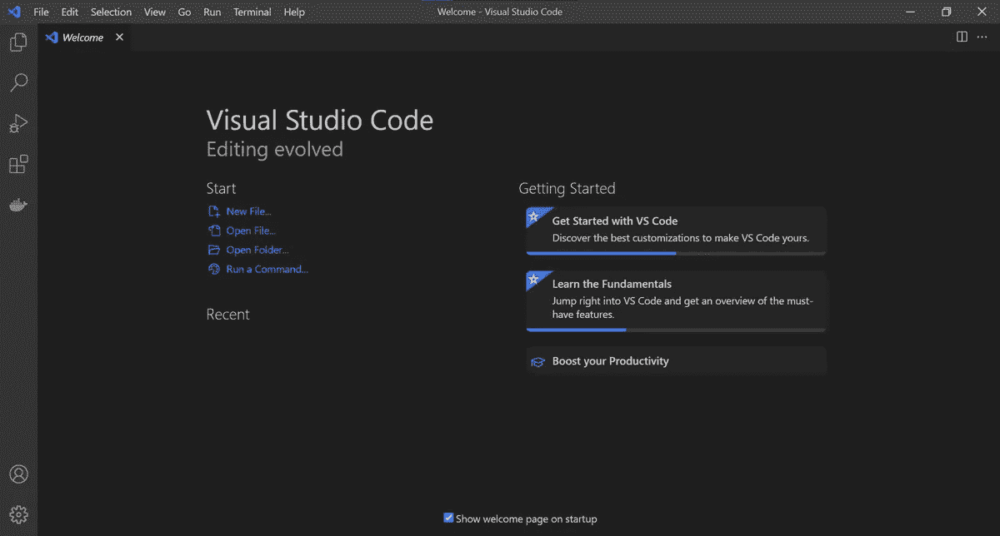
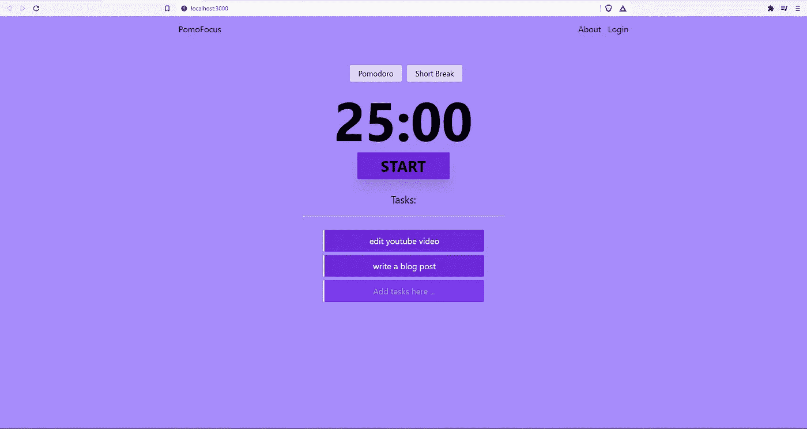
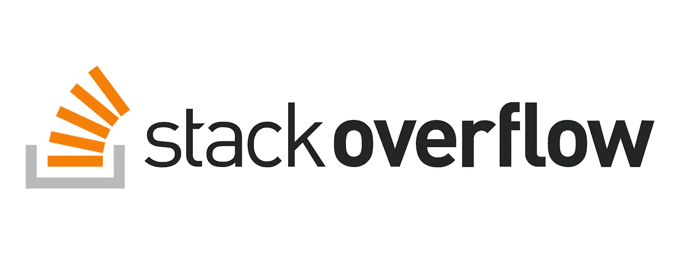

# 5 个帮助我编码的惊人工具

> 原文：<https://javascript.plainenglish.io/5-insanely-amazing-tools-that-help-me-code-a0656a0a5ad5?source=collection_archive---------11----------------------->

## 我每天使用的 5 个帮助我编码的工具。

Photo by [Christopher Gower](https://unsplash.com/@cgower?utm_source=medium&utm_medium=referral) on [Unsplash](https://unsplash.com?utm_source=medium&utm_medium=referral)

作为一名程序员，拥有合适的工作工具可以极大地改变你的游戏规则。尤其是当你想在保持工作效率的同时完成工作的时候。

如果你有合适的工具，你就能轻松完成任务。

我几乎每天都会使用一些帮助我编码的工具，我无法想象没有它们我会怎样编码。

## **1。VS 代码。**

Image by [Wikipidea](https://www.google.com/url?sa=i&url=https%3A%2F%2Fen.wikipedia.org%2Fwiki%2FVisual_Studio_Code&psig=AOvVaw3BaMN8kGQRZTuPjjiaUCr7&ust=1630400752964000&source=images&cd=vfe&ved=0CAwQjhxqFwoTCJCD9qWy2PICFQAAAAAdAAAAABAD)

我并不是 IDE 和代码编辑器的狂热爱好者，在我的大多数日常编码程序中，我发现 VS Code 对我来说是一个游戏改变者。

有了一个很大的池和大量惊人的扩展，点击一下就可以安装，它为我提供了编码所需的环境。

我曾经是一个记事本迷，然后跳到 atom，再跳到 VS 代码，我在过去的几年里疯狂地爱上了它们。

我认为与我之前使用的其他 IDE 和编辑器相比，它提供了最好的开发体验。

## **2。Git/GitHub。**

Image by [Munira Omar](https://medium.com/u/a7a3f091a372?source=post_page-----a0656a0a5ad5--------------------------------)

作为开源工作的超级粉丝和受益者，我也喜欢把我的代码发布出去。我使用 GitHub 主要是为了公共存储库，这让我很惊讶。

它还为我提供了托管代码的平台。到目前为止，Git 和 GitHub 在我的编码之旅中发挥了巨大的作用，尤其是在现代远程工作和求职方面。

我可以很容易地给别人发送我的回购，就像他们可以看到我的代码和我过去一直在做的项目。

## **3。PomoFocus(番茄工作狂 App)。**

Screenshot by Author

这是一个我一般大部分时间都在用的应用。这项技术是由 Francesco Cirillo 开发的，实现了一种时间管理技术。

因此，我制作的这个应用程序实现了 25 分钟的使用，每个任务中有 5 分钟的休息时间。

从应用程序中，您可以添加您想要完成的任务并启动计时器，计时器将运行 25 分钟并播放通知，让您休息 5 分钟。

这个应用程序在通过做更少的事情来帮助做更多的事情方面是惊人的。它只是把大任务分解成更小的可管理的任务。

如果你没有使用番茄红素，我建议你试试这个方法。

## **4。堆栈溢出/GitHub 问题。**

Image by [WP Tavern](https://www.google.com/url?sa=i&url=https%3A%2F%2Fwptavern.com%2Fstack-overflow-documentation-is-now-in-beta%2Fstack-overflow&psig=AOvVaw1-CwZ8wR9mdQ7T9-gCV6mL&ust=1630400984356000&source=images&cd=vfe&ved=0CAwQjhxqFwoTCKCDxpGz2PICFQAAAAAdAAAAABAc)

嗯，每个人都同意，一个开发人员的生活充满了错误和压力，从在我的机器上工作的'*'到' ***哦，那不是一个错误，那是一个特性*** '，我们总有一段时间必须找到代码的解决方案。*

*每当我遇到问题时，堆栈溢出和 GitHub 问题是我个人的最爱。他们是我在日常编码中遇到的任何问题的首选。*

*我甚至很确定，当其中一家公司倒闭一个月的时候，我会去其他公司寻找职业。*

## ***5。勇敢的浏览器。***

**

*Screenshot by Author.*

*可能是我最喜欢的浏览器。作为 chrome 的超级粉丝，在我第一次尝试 Brave 时，我就放弃了 chrome。*

*勇敢更好，尤其是为你提供一点隐私，而 chrome 每次都从我们这里夺走隐私。此外，值得注意的是，我认为 brave 在速度上胜过 Chrome。*

*就我个人而言，这是我最喜欢的浏览器，我想我会继续使用它。*

## ***结论***

*这些是我使用的一些神奇的工具，也是我个人最喜欢的，它们每次都帮助我编码和保持生产力。*

*我很想知道你每天使用什么样的工具。*

*感谢您花时间阅读本文。*

## ***多读。***

* [## 你可以在一周内完成 5 个项目，让你被录用

### 如何建立一个基于项目的编程组合，给招聘人员留下深刻印象并吸引他们，让你被聘用。

javascript.plainenglish.io](/5-projects-you-can-build-in-a-week-that-will-get-you-hired-c9e88c17753b)  [## 如何在 Vue.js 中发出事件

### 通过一个例子了解如何在 Vue.js 中发出事件。

javascript.plainenglish.io](/how-to-emit-events-in-vue-js-4595c1078503) 

*更多内容请看*[***plain English . io***](http://plainenglish.io/)*