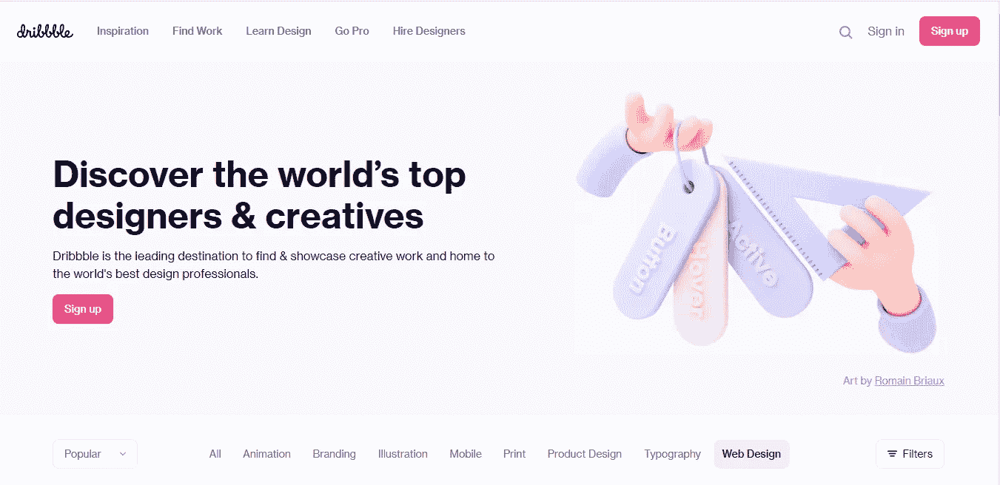
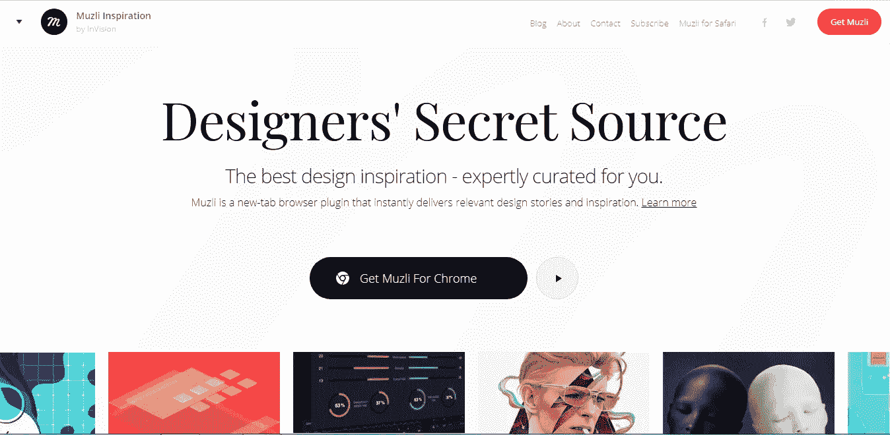
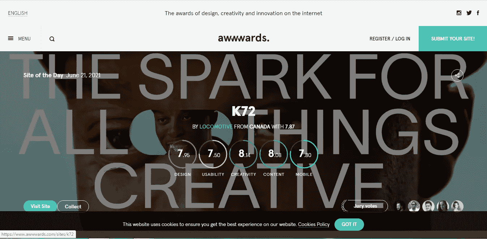
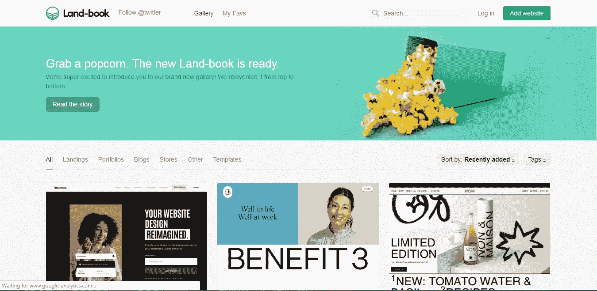
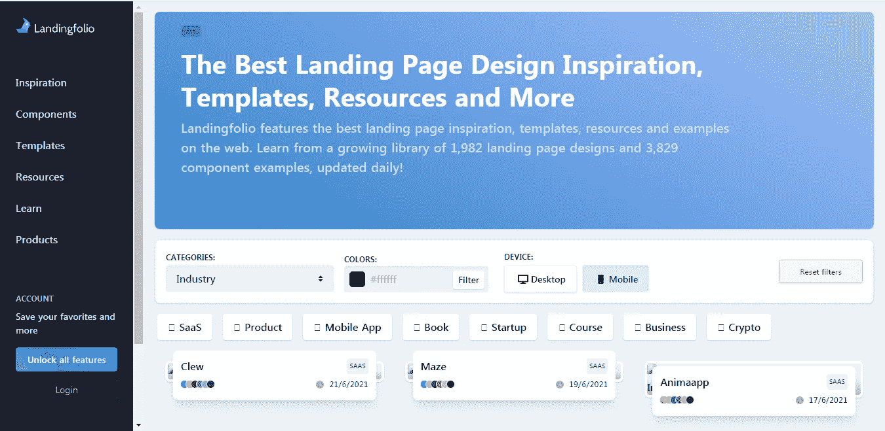

# 5 个鼓舞人心的网站来提升你的网站或投资组合设计

> 原文：<https://javascript.plainenglish.io/5-inspirational-websites-to-boost-your-website-or-portfolio-design-f8de753869cd?source=collection_archive---------18----------------------->

## 设计灵感网站。

Photo by [Alice Dietrich](https://unsplash.com/@alicegrace?utm_source=medium&utm_medium=referral) on [Unsplash](https://unsplash.com?utm_source=medium&utm_medium=referral)

对任何人来说，想出一个伟大且近乎完美的设计都不是一件容易的事情。

一次又一次，你将不得不改造你的网站或投资组合。这些资源中的一些可以帮助你利用你的第三只眼进行设计，并提出一个伟大的设计。

另一方面，如果你不像我一样擅长设计，外包并提出像素级的完美设计有时是地狱。

有很多网站可以为你的下一个网站提供设计灵感。这些网站或平台大多提供设计和网络灵感，你可以自由使用。

对这些免费资源的设计者和贡献者给予肯定，或者对他们所做的令人惊叹的工作给予奖励，都被认为是好的做法。同样，你可以拿出一些钱，出于同样的目的赞助他们，激励他们继续做他们基本上免费提供的工作。

在这篇文章中，我们将看看我们可以利用的各种网站和平台，为你的下一个网站或作品集获得设计灵感。

## **1。运球**

Dribble landing page

根据 Dribbble 的说法，它是寻找和展示创意作品的主要目的地，也是世界上最好的设计专业人士的家园。

运球是设计灵感的顶级在线网站之一。许多令人惊叹的设计师在这里展示他们的作品，这里也有令人惊叹的项目。

看看运球[这里](https://dribbble.com/shots/popular/web-design)

## **2。穆兹利**

Muz.li

Muzli 是获得网络灵感的最佳平台之一。这是每个设计师都应该使用的工具之一。

他们的时事通讯包含了改善 UI/UX 的技巧。他们还经常提供设计，并在网上展示一些最好的设计。

要查看 Muzli，请使用此[链接](https://muz.li/)访问

## **3。Awwwards**

Awwwawards

Awwwards 平台展示了互联网上一些设计精美、制作精良的网站。

互联网领域也有一些制作精良的作品集和各种利基网站。

要查看奖项，请使用此[链接](https://www.awwwards.com)访问

## **4。土地簿**

Land book

这个平台由精选的具有最佳设计灵感的网站组成。

这个平台还拥有互联网领域中制作精美的最佳网站之一。

使用此[链接](https://land-book.com/)查看土地登记簿

## **5。落地对开**

Landingfolio

Landingfolio 在网上提供了最好的登录页面灵感、模板、资源和示例。

从每天更新的 1，982 个登录页面设计和 3，829 个组件示例中学习！。

点击查看登陆页

## **出发前**

简单回顾一下，我们已经查看了一些平台，以获取设计灵感。

如果你认为我漏掉了一些，请不要犹豫，在评论区评论它们。

我希望这篇文章对你有所帮助。

## **更多内容:**

 [## 4 个后端 JavaScript 框架，看看你是不是前端开发人员

### 想学后端？然后查看这些框架。

javascript.plainenglish.io](/4-backend-javascript-frameworks-to-check-out-if-you-are-a-frontend-developer-bb09cfa6d25b)  [## 每个前端开发人员需要知道的 3 个设计概念

### 面向每个前端开发人员的设计理念。

javascript.plainenglish.io](/3-design-concepts-every-front-end-developer-needs-to-know-fccb072e675c) 

*更多内容请看*[***plain English . io***](http://plainenglish.io/)