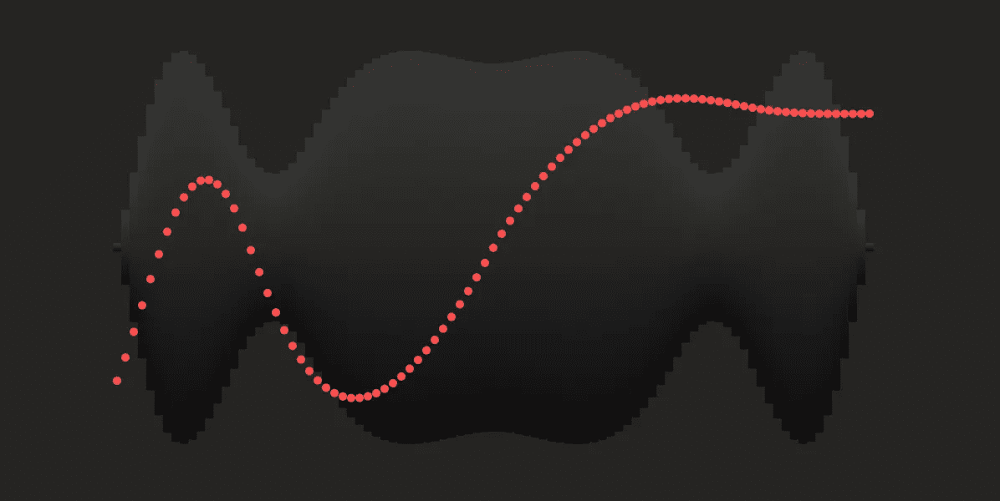
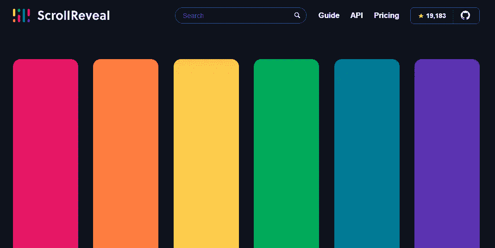
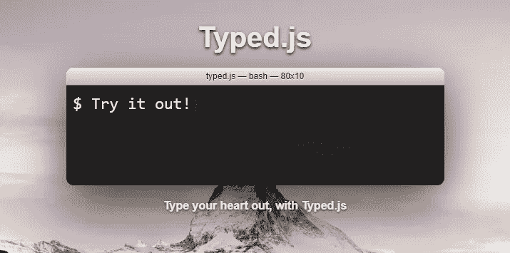
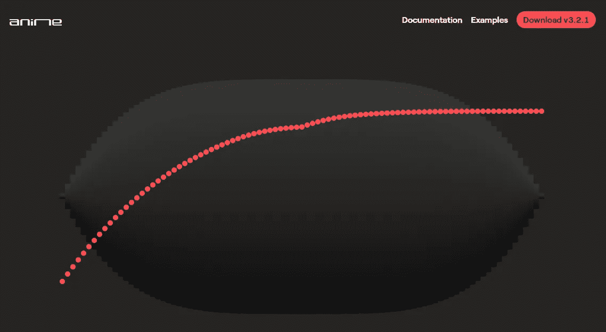
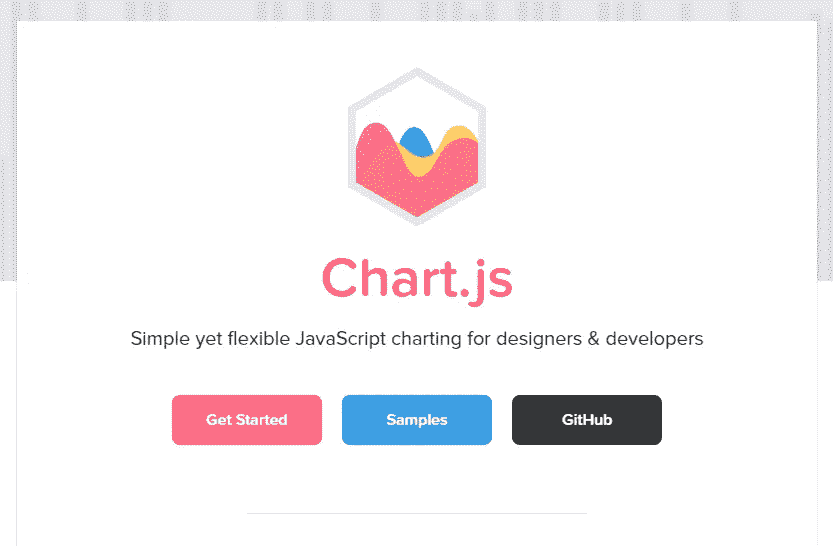
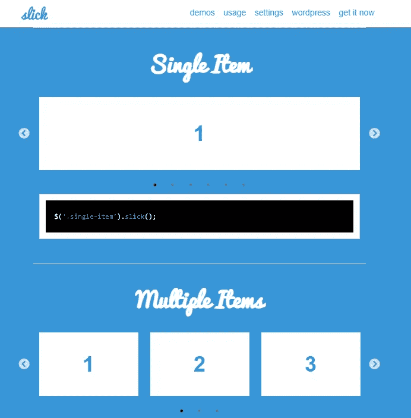

# 5 个你想放在网站上的 JavaScript 动画库

> 原文：<https://javascript.plainenglish.io/5-javascript-animation-libraries-youll-want-on-your-website-eed5bee13ad8?source=collection_archive---------14----------------------->



JavaScript 动画库处理复杂的动画，快速创建强大的视觉组件。使用内置属性在几分钟内将旋转、平移、缓动和揭示添加到您的网站。

我们收集了一些视觉上最有趣的动画库，它们给页面负载带来了强烈的第一印象。

为了快速开发，本文通篇将使用 cdn(内容交付网络),但是所有这些 JavaScript 库都可以下载到您的项目中。

*注意:我们鼓励你花些时间在你网站的小部分中实现这些 JavaScript 库。如果你对动画过于苛求，用户可能会发现网站势不可挡，动画可能看起来像噱头。*

# **滚动显示**

ScrollReveal 是由 Julian Lloyd 创建的 JavaScript 库。实现时，JS 库在 HTML 元素进入或离开视区时显示它们。它兼容所有主流浏览器，可以轻松添加到任意数量的 HTML 元素中。



(1)将 ScrollReveal CDN 添加到`<head>`元素:

```
<!DOCTYPE html>
<html>
  <head>
    <!-- Required meta tags -->
    <meta charset="utf-8">
    <meta name="viewport" content="width=device-width, initial-scale=1.0">
    <title>Title</title>
    <!--ScrollReveal JS-->
    <script src="https://unpkg.com/scrollreveal"></script>
  </head>
  <body> ...

  </body>
</html>
```

一般来说，JavaScript CDNs 可以添加到`<head>`元素中，或者就在结束的`<body>`标签之前。然而，ScrollReveal 文档建议将 CDN 添加到`<head>`元素中，以防止在实现 ScrollReveal 之前内容闪烁。

*如果您使用引导程序:*

```
<!DOCTYPE html>
<html>
  <head>
    <!-- Required meta tags -->
    <meta charset="utf-8">
    <meta name="viewport" content="width=device-width, initial-scale=1.0">
    <title>Title</title>
    <!--Bootstrap CSS-->
    <link rel="stylesheet" href="https://stackpath.bootstrapcdn.com/bootstrap/4.4.1/css/bootstrap.min.css" integrity="sha384-Vkoo8x4CGsO3+Hhxv8T/Q5PaXtkKtu6ug5TOeNV6gBiFeWPGFN9MuhOf23Q9Ifjh" crossorigin="anonymous">
    <!--ScrollReveal JS-->
    <script src="https://unpkg.com/scrollreveal"></script>
  </head>
  <body>
 ...

    <!-- Optional Javascript -->
    <script src="https://code.jquery.com/jquery-3.4.1.slim.min.js" integrity="sha384-J6qa4849blE2+poT4WnyKhv5vZF5SrPo0iEjwBvKU7imGFAV0wwj1yYfoRSJoZ+n" crossorigin="anonymous"></script>
    <script src="https://cdn.jsdelivr.net/npm/popper.js@1.16.0/dist/umd/popper.min.js" integrity="sha384-Q6E9RHvbIyZFJoft+2mJbHaEWldlvI9IOYy5n3zV9zzTtmI3UksdQRVvoxMfooAo" crossorigin="anonymous"></script>
    <script src="https://stackpath.bootstrapcdn.com/bootstrap/4.4.1/js/bootstrap.min.js" integrity="sha384-wfSDF2E50Y2D1uUdj0O3uMBJnjuUD4Ih7YwaYd1iqfktj0Uod8GCExl3Og8ifwB6" crossorigin="anonymous"></script>
  </body>
</html>
```

如果使用 Bootstrap，只需在 Bootstrap CSS CDN 之后添加 ScrollReveal CDN。

*生产用:*

```
<!DOCTYPE html>
<html>
  <head>
    <!-- Required meta tags -->
    <meta charset="utf-8">
    <meta name="viewport" content="width=device-width, initial-scale=1.0">
    <title>Title</title>
    <!--ScrollReveal JS-->
    <script src="https://unpkg.com/scrollreveal@4.0.0/dist/scrollreveal.min.js"></script>
  </head>
  <body> ...

  </body>
</html>
```

将 ScrollReveal CDN 添加到`<head>`元素中，指定 ScrollReveal 的固定版本并使用缩小的发行版。

(2)确定您希望动画化的元素:

```
<div class="container p-4">
    <div class="card reveal-card"> #custom ScrollReveal class
      <div class="card-body">
        <h5 class="card-title">Card title</h5>
        <p class="card-text">Some quick example text to build on the card title and make up the bulk of the card's content.</p>
        <a href="#" class="btn btn-primary">Go somewhere</a>
      </div>
  </div>
</div>
```

ScrollReveal 根据元素的类属性值调用元素。我们将为这个例子添加一个名为`reveal-card`的定制类。

(3)使用 ScrollReveal 构造函数:

```
// Card reveal
ScrollReveal().reveal('.reveal-card');
```

添加了 CDN 并标识了 class 属性值后，我们现在可以使用构造函数`ScollReveal()`。添加构造函数，然后添加`reveal()`方法来创建显示动画。在此方法中，将自定义类指定为目标。

(4)在 *script.js* 文件或`<script>`元素中添加构造函数:

```
<!DOCTYPE html>
<html>
  <head>
    <!-- Required meta tags -->
    <meta charset="utf-8">
    <meta name="viewport" content="width=device-width, initial-scale=1.0">
    <title>Title</title>
    <!--ScrollReveal JS-->
    <script src="https://unpkg.com/scrollreveal@4.0.0/dist/scrollreveal.min.js"></script>
  </head>
  <body> ...
    <script>
    // Card reveal
    ScrollReveal().reveal('.reveal-card');
    </script>
  </body>
</html>
```

该脚本可以添加到一个单独的 JS 文件中，也可以直接放在 HTML 模板中。上面的代码显示它直接放在 HTML 模板中。如果您有兴趣将其添加到一个单独的 JS 文件中，请学习如何使用 [Django 静态资产](https://www.ordinarycoders.com/blog/article/django-static-files-img-js-css)。

(5)向 ScrollReveal 添加可定制的选项:

*添加延迟:*

```
// Card reveal
ScrollReveal().reveal('.reveal-card', {delay:500});
```

您也可以选择向显示方法添加选项，如延迟。这以毫秒为单位。

*添加持续时间:*

```
// Card reveal
ScrollReveal().reveal('.reveal-card', {duration:500});
```

持续时间是另一个以毫秒为单位的 ScrollReveal 选项。它控制动画完成所需的时间。

*添加间隔:*

```
// Card reveal
ScrollReveal().reveal('.card', {interval:500});
```

如果你想一次显示一组卡片或物品，间隔选项是很好的选择。与使用自定义类属性值不同，使用引导卡类属性是将选项添加到所有卡元素的一种简单方法。同样，这是以毫秒为单位测量的。

(6)向 CSS 中添加 load hidden 自定义类:

```
<!DOCTYPE html>
<html>
  <head>
    <!-- Required meta tags -->
    <meta charset="utf-8">
    <meta name="viewport" content="width=device-width, initial-scale=1.0">
    <title>Title</title>
    <!--ScrollReveal JS-->
    <script src="https://unpkg.com/scrollreveal@4.0.0/dist/scrollreveal.min.js"></script>
    <style>
     /*ScrollReveal load-hidden CSS*/
        .sr .load-hidden {
           visibility: hidden;
        }
    </style>
  </head>
  <body> ...
    <script>
    // Card reveal
    ScrollReveal().reveal('.reveal-card');
    </script>
  </body>
</html>
```

将 CDN 添加到`<head>`元素有助于防止闪烁，但只有在快速互联网连接的情况下。为了解决互联网速度慢的问题，创建一个名为`load-hidden`的自定义 CSS 声明。这可以在一个 *stylesheet.css* 文件或者 HTML 模板中的一个`<style>`元素中，很像构造函数。

```
<div class="container p-4">
    <div class="card reveal-card load-hidden"> #a load-hidden to the element
      <div class="card-body">
        <h5 class="card-title">Card title</h5>
        <p class="card-text">Some quick example text to build on the card title and make up the bulk of the card's content.</p>
        <a href="#" class="btn btn-primary">Go somewhere</a>
      </div>
  </div>
</div>
```

自定义 CSS 声明需要作为 class 属性值添加到您要显示的 HTML 元素中。然后在页面加载上，就不会再有任何闪烁了。

文档:[滚动显示](https://scrollrevealjs.org/)

# **Typed.js**

下一个 JavaScript 库是 Typed.js，Matt Boldt 开发的库。库打印出你选择的字符串，就像你在打字一样。与前面的库一样，Typed.js 可以通过下载库或使用 CDN 来添加。



(1)将 Typed.js CDN 添加到`<body>`元素中:

```
<!DOCTYPE html>
<html>
  <head>
    <!-- Required meta tags -->
    <meta charset="utf-8">
    <meta name="viewport" content="width=device-width, initial-scale=1.0">
    <title>Title</title>
  </head>
  <body> ...

    <script src="https://cdn.jsdelivr.net/npm/typed.js@2.0.11"></script>   
  </body>
</html>
```

在结束的`<body>`标签之前添加 CDN。

(2)将 Typed.js 自定义 id 属性添加到模板中:

```
<div class="container p-4">
    <span id="typed"></span>
</div>
```

Typed.js 使用 id 属性值，而不是 class 属性值。在 HTML 模板中，添加一个带有自定义 id 属性值的 span 标记，在本例中为`typed`。

(3)添加 Typed.js 脚本:

```
<!DOCTYPE html>
<html>
  <head>
    <!-- Required meta tags -->
    <meta charset="utf-8">
    <meta name="viewport" content="width=device-width, initial-scale=1.0">
    <title>Title</title>
  </head>
  <body> ...

    <script src="https://cdn.jsdelivr.net/npm/typed.js@2.0.11"></script>  
    <script>
       var typed = new Typed('#typed', {
         strings: ['Type anything you want', 'It can type multiple strings'],
       });
    </script> 
  </body>
</html>
```

然后在一个`<script>` HTML 元素或者单独的 *script.js* 文件中，添加一个 JavaScript 变量，调用`strings`作为属性。将字符串以数组形式列出，每个短语用引号括起来。上面的例子只是将脚本添加到 HTML 模板中。

(4)自定义 Typed.js:

*添加速度类型:*

```
var typed = new Typed('#typed', {
    strings: ['Type anything you want', 'It can type multiple strings'],
    typeSpeed: 80,
  });
```

添加以毫秒为单位的字母键入速度。

*添加启动延迟:*

```
var typed = new Typed('#typed', {
    strings: ['Type anything you want', 'It can type multiple strings'],
    startDelay: 80,
  });
```

给打字添加开始延迟。这也是以毫秒为单位。

*添加反向速度:*

```
var typed = new Typed('#typed', {
    strings: ['Type anything you want', 'It can type multiple strings'],
    backSpeed: 80,

  });
```

指定后退速度决定了键入的退格速度(以毫秒为单位)。

*添加智能退格:*

```
var typed = new Typed('#typed', {
    strings: ['Type anything you want', 'It can type multiple strings'],
    smartBackspace: true, // this is a default
  });
```

添加智能退格允许仅在与前一个字符串不匹配的字符串部分退格。

例如，如果您有两个字符串“我知道 CSS”和“我知道 JS ”,智能退格键将只退格到“CSS ”,保留在第二个字符串中重复的字符串部分。

*添加循环:*

```
var typed = new Typed('#typed', {
    strings: ['Type anything you want', 'It can type multiple strings'],
    loop: true,
    loopCount:1,
  });
```

最后定制要讲的是`loop`。如果希望指定循环次数，选择循环输入并添加属性`loopCount`。

如需更多属性，请查看以下链接的文档。

文档: [Typed.js](https://mattboldt.github.io/typed.js/docs/)

# **Anime.js**

这个 JavaScript 动画库由 Julian Garnier 创建，可以在 Chrome、Safari、IE/Edge、Firefox 和 Opera 浏览器上运行。它可用于制作各种目标的动画，包括 DOM 节点、CSS 选择器或 JavaScript 对象。



(1)添加 Anime.js CDN:

```
<!DOCTYPE html>
<html>
  <head>
    <!-- Required meta tags -->
    <meta charset="utf-8">
    <meta name="viewport" content="width=device-width, initial-scale=1.0">
    <title>Title</title>
  </head>
  <body> ... <!-- Anime.js JS -->
    <script src="https://cdn.jsdelivr.net/npm/animejs@3.0.1/lib/anime.min.js"></script>
  </body>
</html>
```

将 Anime.js CDN 添加到 HTML 文档的底部。

(2)找到您希望动画化的元素、类或 id:

```
<div class="container p-4">
    <div class="card mx-3">
      <div class="card-body">
        <h5 class="card-title">Card title</h5>
        <p class="card-text">Some quick example text to build on the card title and make up the bulk of the card's content.</p>
        <a href="#" class="btn btn-primary">Go somewhere</a>
    </div>
  </div> 
</div>
```

在这个例子中，我们将使用`card`类属性值制作一张卡片的动画，但是你也可以选择制作 HTML 元素本身或 id 的动画。

(3)添加 Anime.js 功能:

```
<!DOCTYPE html>
<html>
  <head>
    <!-- Required meta tags -->
    <meta charset="utf-8">
    <meta name="viewport" content="width=device-width, initial-scale=1.0">
    <title>Title</title>
  </head>
  <body> ... <!-- Anime.js JS -->
    <script src="https://cdn.jsdelivr.net/npm/animejs@3.0.1/lib/anime.min.js"></script>
    <script type="text/javascript">
    let animation = anime({
        targets: '.card',
        translateX: 100,
    });    
  </script>
  </body>
</html>
```

最后一段必要的代码是指定目标和属性的 JavaScript 函数。上面的示例在页面加载时将卡片向右平移 100 像素。

(4)使用其他 Anime.js 属性:

*翻译一个物体:*

```
let animation = anime({
    targets: '.card',
    translateX: 100,
    translateY: 100,
});
```

`translateX`沿 X 轴从左或右移动对象，而`translateY`将其向上或向下移动。单位是像素。

*缩放对象:*

```
let animation = anime({
    targets: '.card',
    scaleX: 0.5,
    scaleY: 0.5,
});
```

`scaleX`改变对象的水平尺寸，而`scaleY`改变垂直尺寸。请注意，如果您没有在 X 和 Y 轴上均匀缩放，对象将会被压扁或拉长。

*旋转物体:*

```
let animation = anime({
    targets: '.card',
    rotateX: 0.5,
    rotateY: 0.5,
});
```

`rotateX`沿 X 轴旋转对象，而`rotateY`沿 Y 轴旋转对象。

*倾斜对象:*

```
let animation = anime({
    targets: '.card',
    skewX: 1,
    skewY: 4,
});
```

`skewX`沿 X 轴倾斜对象，而`skewY`垂直倾斜对象。

*设定持续时间:*

```
let animation = anime({
    targets: '.card',
    duration: 6000
});
```

持续时间以毫秒为单位，决定了动画的总时间。

*设置延迟:*

```
let animation = anime({
    targets: '.card',
    duration: 6000
});
```

延迟也以毫秒为单位，并指定动画开始的时间。

这些只是让您开始使用 JS 库的一些基本属性。但是 Anime.js 属性参数更强大，在一起使用时会产生整体更酷的效果。因此，查看文档以了解更多想法。

文档: [Anime.js](https://animejs.com/)

# **Chart.js**

Evert Timberg 是 Chart.js 的作者，这是一个 JavaScript 库，允许开发人员快速将图表添加到您的项目中。有 8 个图表可供选择，并且全部是开源材料。这个库是我们向用户展示清晰图表的首选。



(1)将 Chart.js CDN 添加到`<head>`元素中:

```
<!DOCTYPE html>
<html>
  <head>
    <!-- Required meta tags -->
    <meta charset="utf-8">
    <meta name="viewport" content="width=device-width, initial-scale=1.0">
    <title>Title</title>
    <!--Chart.js JS--> 
    <script src="https://cdn.jsdelivr.net/npm/chart.js@2.9.3/dist/Chart.min.js"></script> 
  </head>
  <body> ...

  </body>
</html>
```

在结束的`<head>`标签前添加 Chart.js CDN。

(2)向模板中添加图表:

```
<div class="container">
  <canvas id="myChart" width="400" height="400"></canvas>
</div>
```

要调用图表，在 HTML 模板中添加一个`<canvas>`元素。然后指定自定义 id 以及宽度和高度属性。这将是 HTML 文档中图表的位置。

(3)添加图表数据:

*创建条形图:*

```
var ctx = document.getElementById('myChart').getContext('2d');
var myChart = new Chart(ctx, {
    type: 'bar',
    data: {
        labels: ['Red', 'Blue', 'Yellow', 'Green', 'Purple', 'Orange'],
        datasets: [{
            label: '# of Votes',
            data: [12, 19, 3, 5, 2, 3],
            backgroundColor: [
                'rgba(255, 99, 132, 0.2)',
                'rgba(54, 162, 235, 0.2)',
                'rgba(255, 206, 86, 0.2)',
                'rgba(75, 192, 192, 0.2)',
                'rgba(153, 102, 255, 0.2)',
                'rgba(255, 159, 64, 0.2)'
            ],
            borderColor: [
                'rgba(255, 99, 132, 1)',
                'rgba(54, 162, 235, 1)',
                'rgba(255, 206, 86, 1)',
                'rgba(75, 192, 192, 1)',
                'rgba(153, 102, 255, 1)',
                'rgba(255, 159, 64, 1)'
            ],
            borderWidth: 1
        }]
    },
});
```

然后将类型、数据和图表颜色添加到一个 

*创建折线图:*

```
var ctx = document.getElementById('myChart').getContext('2d');
var myChart = new Chart(ctx, {
    type: 'line',
    data: {
        ...
        }]
    },
});
```

数据以与条形图相同的格式添加。唯一需要改变的是`type`。

*创建雷达图:*

```
var ctx = document.getElementById('myChart').getContext('2d');
var myChart = new Chart(ctx, {
    type: 'radar',
    data: {
        ...
        }]
    },
});
```

就像条形图和折线图一样添加数据。

*创建圆环图:*

```
var ctx = document.getElementById('myChart').getContext('2d');
var myChart = new Chart(ctx, {
    type: 'doughnut',
    data: {
        datasets: [{ 
           data: [70,10,6],
           borderColor:[
              "#3cba9f",
              "#ffa500",
              "#c45850",
           ],
           backgroundColor: [
              "rgb(60,186,159,0.1)",
              "rgb(255,165,0,0.1)",
              "rgb(196,88,80,0.1)",
           ],
              borderWidth:2,
         }]
    },
});
```

圆环图数据的格式也类似。

*创建饼图:*

```
var ctx = document.getElementById('myChart').getContext('2d');
var myChart = new Chart(ctx, {
    type: 'pie',
    data: {
        datasets: [{ 
           data: [70,10,6],
           borderColor:[
              "#3cba9f",
              "#ffa500",
              "#c45850",
           ],
           backgroundColor: [
              "rgb(60,186,159,0.1)",
              "rgb(255,165,0,0.1)",
              "rgb(196,88,80,0.1)",
           ],
              borderWidth:2,
         }]
    },
});
```

饼图也一样。

*创建极区图:*

```
var ctx = document.getElementById('myChart').getContext('2d');
var myChart = new Chart(ctx, {
    type: 'polarArea',
    data: {
        datasets: [{ 
           data: [70,10,6],
           borderColor:[
              "#3cba9f",
              "#ffa500",
              "#c45850",
           ],
           backgroundColor: [
              "rgb(60,186,159,0.1)",
              "rgb(255,165,0,0.1)",
              "rgb(196,88,80,0.1)",
           ],
              borderWidth:2,
         }]
    },
});
```

以及极区图。

*创建气泡图:*

```
var ctx = document.getElementById('myChart').getContext('2d');
var myChart = new Chart(ctx, {
    type: 'bubble',
    data: {
        labels: ['Red', 'Blue', 'Yellow', 'Green', 'Purple', 'Orange'],
        datasets: [{
            label: '# of Votes',
            data: [
              {x: -10, y: 3},
              {x: 4, y: 10},
              {x: 10, y: 5}
            ],
            ...
        }]
    },
});
```

对于气泡图，x 和 y 点需要定义为数据。

*创建散点图:*

```
var ctx = document.getElementById('myChart').getContext('2d');
var myChart = new Chart(ctx, {
    type: 'scatter',
    data: {
        labels: ['Red', 'Blue', 'Yellow', 'Green', 'Purple', 'Orange'],
        datasets: [{
            label: '# of Votes',
            data: [
              {x: -10, y: 3},
              {x: 4, y: 10},
              {x: 10, y: 5}
            ],
            ...
        }]
    },
});
```

对于散点图，x 和 y 点也需要定义为数据。

(4)使用 Chart.js 选项:

*添加图表图例:*

```
var chart = new Chart(ctx, {
    type: 'bar',
    data: data,
    options: {
        legend: {
            display: true,
            labels: {
                fontColor: 'rgb(255, 99, 132)'
            }
        }
    }
});
```

*添加填充:*

```
var chart = new Chart(ctx, {
    type: 'bar',
    data: data,
    options: {
        layout: {
            padding: {
                left: 50,
                right: 0,
                top: 0,
                bottom: 0
            }
        }
    }
});
```

*添加标题:*

```
var chart = new Chart(ctx, {
    type: 'line',
    data: data,
    options: {
        title: {
            display: true,
            text: 'Custom Chart Title'
        }
    }
});
```

有关更多选项，请参考以下链接的文档或查看[如何使用 Chart.js | 11 Chart.js 示例](https://www.ordinarycoders.com/blog/article/11-chart-js-examples)。

我们只是介绍了一些基础知识，让您可以开始学习。

文档: [Chart.js](https://www.chartjs.org/)

# **滑头**

Slick 是一个方便的 JS 库，旨在以高功能和最小的工作量创建旋转木马。由肯·惠勒制作的 Slick 是“你需要的最后一个旋转木马”。



(1)将光滑的 cdn 添加到文档中:

```
<!DOCTYPE html>
<html>
  <head>
    <!-- Required meta tags -->
    <meta charset="utf-8">
    <meta name="viewport" content="width=device-width, initial-scale=1.0">
    <title>Title</title>
    <!--Slick CSS-->
    <!-- Add the slick-theme.css if you want default styling -->
    <link rel="stylesheet" type="text/css" href="//cdn.jsdelivr.net/npm/slick-carousel@1.8.1/slick/slick.css"/>
    <!-- Add the slick-theme.css if you want default styling -->
    <link rel="stylesheet" type="text/css" href="//cdn.jsdelivr.net/npm/slick-carousel@1.8.1/slick/slick-theme.css"/> 
  </head>
  <body> ...
    <!--Additional JS-->
    <script src="https://code.jquery.com/jquery-3.4.1.slim.min.js" integrity="sha384-J6qa4849blE2+poT4WnyKhv5vZF5SrPo0iEjwBvKU7imGFAV0wwj1yYfoRSJoZ+n" crossorigin="anonymous"></script>
    <script src="https://cdnjs.cloudflare.com/ajax/libs/jquery-migrate/3.3.1/jquery-migrate.min.js"></script>
    <!--Slick JS-->
    <script type="text/javascript" src="//cdn.jsdelivr.net/npm/slick-carousel@1.8.1/slick/slick.min.js"></script>

  </body>
</html>
```

首先，您可以将漂亮的 CSS CDNs 添加到`<head>`元素中。然后在<主体>元素的末尾之前添加 Slick JS CDN。您还需要在 Slick CDN 之前添加 jQuery 和 jQuery Migrate CDN**来使这个库正常工作。**

(2)创建 HTML 轮播:

```
<div class="carousel">
    <div>your content</div>
    <div>your content</div>
    <div>your content</div>
</div>
```

然后转到 HTML 模板，用一个定制的 class 属性值创建一个新的 division 元素，并嵌套与所需幻灯片数量相等的 division 元素。

*如果你想使用 Django 模型:*

```
<div class="container">
  <div class="carousel">
    
      <div class="card mx-3">
        <div class="card-body">
          <h5 class="card-title">{{c.title}}</h5>
          <p class="card-text">{{c.text}}</p>
        </div>
    </div>
    
  </div>
</div>
```

如果您正在使用 carousel 来显示许多项目，例如产品或卡片，我们建议使用 [Django models](https://www.ordinarycoders.com/blog/article/django-models) 使用相同的代码快速创建所需数量的幻灯片。

(3)添加 Slick JS 函数:

```
$(document).ready(function(){
  $('.carousel').slick();
});
```

让 carousel 正常工作的最后一件事是位于 cdn 之后的 JavaScript 函数。

```
<!DOCTYPE html>
<html>
  <head>
    <!-- Required meta tags -->
    <meta charset="utf-8">
    <meta name="viewport" content="width=device-width, initial-scale=1.0">
    <title>Title</title>
    <!--Slick CSS-->
    <!-- Add the slick-theme.css if you want default styling -->
    <link rel="stylesheet" type="text/css" href="//cdn.jsdelivr.net/npm/slick-carousel@1.8.1/slick/slick.css"/>
    <!-- Add the slick-theme.css if you want default styling -->
    <link rel="stylesheet" type="text/css" href="//cdn.jsdelivr.net/npm/slick-carousel@1.8.1/slick/slick-theme.css"/> 
  </head>
  <body> ...
    <!--Additional JS-->
    <script src="https://code.jquery.com/jquery-3.4.1.slim.min.js" integrity="sha384-J6qa4849blE2+poT4WnyKhv5vZF5SrPo0iEjwBvKU7imGFAV0wwj1yYfoRSJoZ+n" crossorigin="anonymous"></script>
    <script src="https://cdnjs.cloudflare.com/ajax/libs/jquery-migrate/3.3.1/jquery-migrate.min.js"></script>
    <script>
      $(document).ready(function(){
        $('.carousel').slick();
      });
    </script>
  </body>
</html>
```

您可以选择将 JS 直接放在 cdn 下面，或者使用 Django load static 将其作为[静态资产加载。当你刷新页面时，会有一个转盘一次显示一张幻灯片。](https://www.ordinarycoders.com/blog/article/django-static-files-img-js-css)

(4)添加 Slick JS 函数:

*对于圆点:*

```
$(document).ready(function(){
  $('.carousel').slick({
  dots:true,
  });
});
```

将设置`dots`添加为布尔值(即 `true`或`false`)。

*为箭头:*

```
$(document).ready(function(){
  $('.carousel').slick({
  arrows:true,
  });
});
```

将设置`arrows`添加为布尔值(即 `true`或`false`)。

*对于居中的幻灯片:*

```
$(document).ready(function(){
  $('.carousel').slick({
  centerMode:true,
  });
});
```

使用`centerMode` 将卡置于视图中央。

*设定滑动速度:*

```
$(document).ready(function(){
  $('.carousel').slick({
  speed:600,
  });
});
```

速度是以毫秒为单位的时间整数。

*添加自动播放:*

```
$(document).ready(function(){
  $('.carousel').slick({
  autoplay:true,
  autoplaySpeed:1000,
  });
});
```

自动播放可以添加为布尔值，自动播放速度设置为以毫秒为单位的整数。

*对于多张幻灯片:*

```
$(document).ready(function(){
  $('.carousel').slick({
  slidesToShow: 3,
  dots:true,
  centerMode: true,
  });
});
```

要一次显示多张幻灯片，请将`slidesToShow`设置为整数。

同样，这些只是 JS 库的基础，但是更多的设置选项请参考文档。

文档:[滑头](https://kenwheeler.github.io/slick/)

*最初发表于*[*【https://www.ordinarycoders.com】*](https://www.ordinarycoders.com/blog/article/top-javascript-animation-libraries)*。*