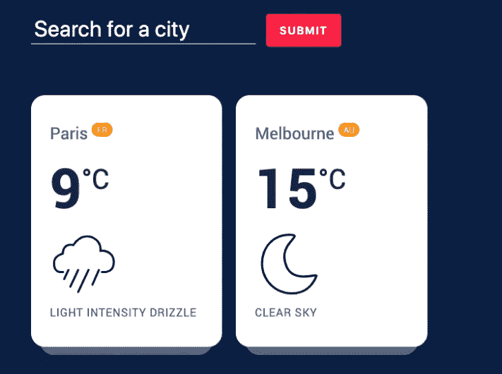

# 您可以将 5 个 JavaScript 项目添加到您的投资组合中

> 原文：<https://javascript.plainenglish.io/5-javascript-projects-you-can-add-to-your-portfolio-e07f0d668d25?source=collection_archive---------1----------------------->

## 您可以使用 JavaScript 构建出色的项目

Photo by [Cottonbro](https://www.pexels.com/fr-fr/@cottonbro) from [Pexels](https://www.pexels.com/).

作为使用 JavaScript 的开发人员，您需要构建一些令人印象深刻的项目，并将其添加到您的投资组合中。这些项目将展示你的技能和能力，让雇主或客户相信你能从他们那里构建出令人敬畏的项目。

构建项目也是练习知识和提高编码技能的好方法。无论你是哪种类型的开发人员，你都需要经常练习。

在这篇文章中，我们会给你一个可以添加到你的投资组合中的一些很棒的 JavaScript 项目的列表。所以让我们开始吧。

# 1.构建一个天气应用程序

您可以构建一个使用第三方 API 的简单天气应用程序。它不必是一个复杂的应用程序。真正重要的是，该应用程序根据用户的位置显示天气信息。

试着让它看起来很棒，有反应，这样用户就能有很好的体验。你也可以添加额外的功能，例如黑暗模式。这是一个展示您的 JavaScript 技能和使用第三方 API 的能力的好项目。

Capture by author.

# 2.建立一个电子商务购物车

在这个项目中，您将需要建立一个电子商务购物车，用户可以看到不同的产品，并将它们添加到购物车。您还应该有一些其他功能，如计算价格和从购物车中删除产品的能力。

因此，该项目必须具有良好的功能和良好的界面完全响应。您可以使用 JavaScript 框架(React 或 Vue)来实现这一点，或者您甚至可以只使用普通的 JavaScript。

Shopping cart capture from Udemy by author.

# 3.建立一个博客网站

如果使用 React，可以使用静态站点生成器，如 Gatsby 如果使用 Vue，可以使用 Gridsome。它可以让你很容易地建立一个简单的博客网站，在那里你可以写文章。这样用户就可以访问网站，阅读你写的文章。

使用静态站点生成器也可以让你的博客比 WordPress 博客更有性能。因此，这可能是一个很好的项目添加到您的投资组合。

Capture by author.

# 4.构建聊天应用程序

这是一个很棒的全栈项目，您可以自己构建并添加到您的投资组合中。因此，您可以构建一个聊天应用程序，允许用户彼此私下聊天，甚至分组聊天。

这是一个很好的项目，可以教会你很多东西，比如实时数据传输、身份验证等等。对于技术栈，我推荐使用一个 JavaScript 前端框架和 Firebase 和 Firestore。

Capture by author.

# 5.使用 API 的求职网站

在这个项目中，你需要创建一个使用 API 的求职网站。你可以为这个项目使用一个带有 [GitHub jobs API](https://jobs.github.com/api) 的 JavaScript 前端框架。

在这个职位搜索网站中，用户可以在默认位置搜索不同的职位。他还可以搜索特定位置的工作，并单击任何工作来查看所有详细信息的描述。除此之外，您还可以添加任意多的特性，比如分页、评级等等。

Capture by author.

# 结论

正如你所看到的，这些都是很酷的项目，你可以用 JavaScript 来构建，并添加到你的投资组合中。通过建立这些，你将提高你的编码技能，增加你被录用为开发人员的机会，如果这是你想要的。

感谢您阅读这篇文章。希望你觉得有用。

**更多阅读**

 [## 构建用户界面时节省时间的 10 个免费工具

### 为你的项目构建用户界面时帮助你的神奇工具。

javascript.plainenglish.io](/10-free-tools-to-save-time-when-building-user-interfaces-e8406c58ba6c)