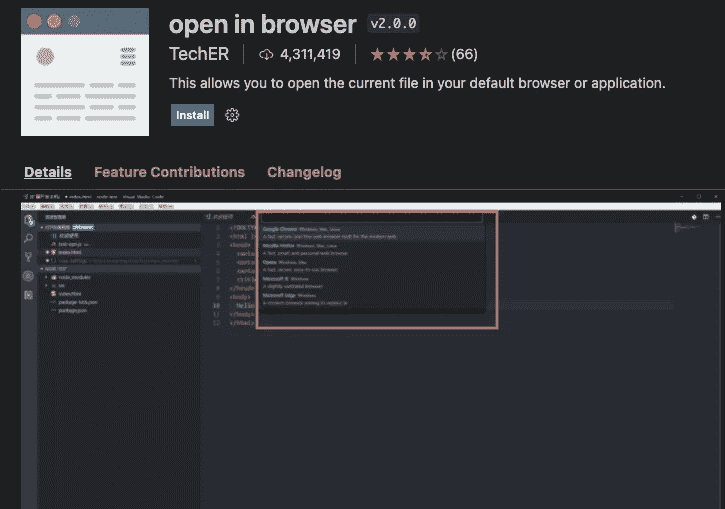

# 5 黑仔 VS 编写 HTML 的代码扩展

> 原文：<https://javascript.plainenglish.io/5-killer-vs-code-extensions-for-writing-html-b44c9ddeea0a?source=collection_archive---------10----------------------->

## 在这些扩展的帮助下，编写 HTML 很容易。

Photo by [Luca Bravo](https://unsplash.com/@lucabravo?utm_source=medium&utm_medium=referral) on [Unsplash](https://unsplash.com?utm_source=medium&utm_medium=referral)

VS Code 是目前最流行的代码编辑器之一。VS 代码完全免费，界面清晰。

大多数开发人员使用 VS 代码来完成他们的工作。如今，Vs 代码在开发环境中被大量使用。VS 代码中可用的扩展使开发人员的生活变得简单而有趣。

这里有五个扩展可以帮助你更快地编写 HTML。

# 1.实时服务器

Photo from [Live Server](https://marketplace.visualstudio.com/items?itemName=ritwickdey.LiveServer)

[直播服务器](https://marketplace.visualstudio.com/items?itemName=ritwickdey.LiveServer)下载量超过 1400 万次。每当开发人员编写一行新的 HTML 或者对他的代码进行一些修改时。他们必须单击浏览器中的刷新按钮才能看到更改。

这个实时服务器扩展节省了开发人员的时间。每次点击刷新按钮都会消耗开发人员的时间。这个扩展将有助于自动反映变化。

开发人员将能够启动一个本地服务器，将有一个实时重载功能。一旦成为开发人员，对以前编写的 HTML 进行更改或编写新的 HTML 行。浏览器会自动更新。开发人员会很快很容易地看到这些变化。

# 2.较美丽

Photo from [Prettier](https://marketplace.visualstudio.com/items?itemName=esbenp.prettier-vscode)

[更漂亮](https://marketplace.visualstudio.com/items?itemName=esbenp.prettier-vscode)有超过 1500 万的下载量。作为一名开发人员，保持代码整洁和格式良好是非常重要的。

保持代码的正确格式对你有好处。当你重读你的代码时。可以快速阅读。当你的代码变得很长时，阅读就变得很困难。

这个扩展帮助你快速格式化你的长代码，使它更具可读性。即使当你的同事阅读你的代码时，他们也会读得很快。格式化你的代码也会节省他们的时间。

漂亮地帮助你与代码格式。它很容易配置，并帮助您使您的代码看起来干净漂亮。当您安装这个扩展时，它会自动格式化您保存的代码。

# 3.自动关闭标签

Photo from [Auto Close Tag](https://marketplace.visualstudio.com/items?itemName=formulahendry.auto-close-tag)

[自动关闭标签](https://marketplace.visualstudio.com/items?itemName=formulahendry.auto-close-tag)下载量超过 500 万。作为一名开发人员，当我们编写 HTML 时。我们需要写开始标签和结束标签。

写结束标签很无聊。开发人员不想浪费时间写结束标签。这个扩展可以帮助你自动编写结束标签。

当您键入开始标记的结束括号时，该扩展会自动为您编写结束标记。当自动插入结束标记时，光标位于开始标记和结束标记之间。

您还可以配置不需要任何结束标记的标记列表。这个扩展还会自动关闭自结束标记。

# 4.自动重命名标签

Photo from [Auto Rename Tag](https://marketplace.visualstudio.com/items?itemName=formulahendry.auto-rename-tag)

[自动重命名标签](https://marketplace.visualstudio.com/items?itemName=formulahendry.auto-rename-tag)下载量超过 600 万。这个扩展有助于重命名 HTML 标签。

当开发人员编写 HTML 并希望对标签进行更改时。他们已经手动更改了开始和结束标记。这使得改变标签的整个过程非常耗时。

作为一名开发人员，我们希望能够自动对这两个标签进行更改。如果我们对开始标记进行了更改，它也应该自动反映在结束标记中。

在这个扩展的帮助下，当你对其中一个标签进行修改时，不管它是开始还是结束。它会自动反映到另一个人身上。这意味着如果你重命名一个 HTML 标签，成对的标签将被自动重命名。

# 5.在浏览器中打开

Photo from [open in browser](https://marketplace.visualstudio.com/items?itemName=techer.open-in-browser)

[在浏览器中打开](https://marketplace.visualstudio.com/items?itemName=techer.open-in-browser)已有超过 400 万次下载。如果想在浏览器中直接从 VS 代码打开文件，是不行的。

不能通过从 VS 代码中拖放来直接在浏览器中打开文件。这个扩展有助于在默认浏览器中直接打开任何 HTML 文件。您还可以在不同类型的浏览器中打开 HTML 文件。

该扩展与各种类型的浏览器兼容。该扩展支持的浏览器包括 Google Chrome、Mozilla Firefox、Opera、Apple Safari、Edge 和 Chromium。

# 想联系作者？

[加入一个人人社区，享受与科技相关的文章。我们讨论最新的技术和独特的见解。](https://codertoentrepreneurs.substack.com/)

*更多内容请看*[***plain English . io***](http://plainenglish.io/)