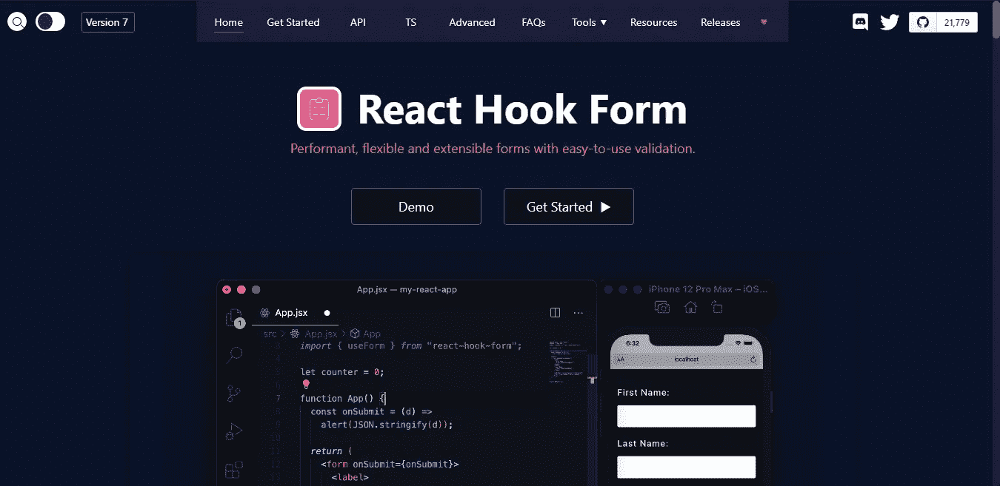

# 5 个鲜为人知的 NPM 软件包，我不知道我作为一个 Web 开发人员需要它们

> 原文：<https://javascript.plainenglish.io/5-lesser-known-npm-packages-i-didnt-know-i-needed-as-a-web-developer-135e0bd460ac?source=collection_archive---------14----------------------->

## 很少被提及的 npm 包非常有用。


Photo by [Vanessa Garcia](https://www.pexels.com/@vanessa-garcia?utm_content=attributionCopyText&utm_medium=referral&utm_source=pexels) from [Pexels](https://www.pexels.com/photo/photo-of-man-in-deep-thoughts-6325938/?utm_content=attributionCopyText&utm_medium=referral&utm_source=pexels)

依赖是 web 开发的一个关键部分，但是像所有事情一样，它也有自己的优点和缺点。

事实上，构建没有依赖的东西是如此罕见，以至于它成为了一个独特的产品特性。但是这并不意味着依赖是不好的或者使你的程序变慢。

我最近写了关于 [7 个荒谬的 npm 包，你看到](/7-ridiculous-npm-packages-you-wont-believe-exist-4bf1ac8c884d)会很惊讶。

这种包存在的主要原因是有数以百万计的 npm 包，没有进入壁垒，开发者可以自由发布他们自己的包。

因此，你一定会发现相当多的无意义的软件包。**同样，你也会发现一些非常有用的软件包。**

在这个博客中，我们将讨论我在每个项目中使用的一些有用的包。

以下是我不知道自己需要的 5 个 npm 包:

## #1. [Editor.js](https://editorjs.io/)


[Demo of Editor.js](https://editorjs.io/)

去年，我建立了一个博客平台，因此需要一个富文本编辑器，允许我的用户设计和定制他们的博客。

我实现了流行的所见即所得编辑器 [React Draft](https://www.npmjs.com/package/react-draft-wysiwyg) 。在撰写本文时，Editor.js 的周下载量为 [13，778 次，而](https://www.npmjs.com/package/@editorjs/editorjs) [React 草案包的下载量接近 20 万次](https://www.npmjs.com/package/react-draft-wysiwyg)，几乎是下载量的 15 倍。

Editor.js 的突出特点是，它是一个块样式的编辑器，这意味着它为不同的元素(如段落、图像、列表等)创建单独的块。

这也使 Editor.js 能够呈现干净的 JSON 数据。其他文本编辑器，如 Draft.js，会产生难以存储的 HTML 标记数据。这是数据输出的样子:

```
{
   "time": 1550476186479,
   "blocks": [
      {
         "type": "header",
         "data": {
            "text": "Editor.js",
            "level": 2
         }
      },
      {
         "type": "paragraph",
         "data": {
            "text": "Hey. Meet the new Editor. On this page you can see it in action — try to edit this text. Source code of the page contains the example of connection and configuration."
         }
      },
      {
         "type": "header",
         "data": {
            "text": "Key features",
            "level": 3
         }
      },
}
```

您可以看到 JSON 数据的好处，比如构建定制阅读器、管理和保存它们的能力，等等。

此外，[插件非常容易安装](/build-a-rich-text-editor-with-editor-js-b31a28583015)，软件包也非常少，与 React Draft 的 280kB 相比只有 150kB。

## #2.[日期-fns](https://date-fns.org/)


[Source](https://date-fns.org/)

我使用 date-fns 包已经有一段时间了，原因很简单，它很好用。

我已经尝试了一些日期和时间库，如 [Moment.js 和 Luxon.js](/stop-using-moment-js-for-dates-and-time-in-javascript-e51e6a708148) ，从我自己的经验来看，date-fns 是更好的包。

正如 date-fns 这个名字所暗示的，你有几个操作日期的函数，你只需要导入你需要的函数，而不是导入整个 API 或者创建实例(就像在 Moment.js 中一样)。

这些函数是纯函数，而且您还可以获得 i18n 支持，这是通过利用本机日期 API 实现的。

```
import { format, formatDistance, formatRelative, subDays } from 'date-fns' format(new Date(), "'Today is a' eeee") //=> "Today is a Monday"formatDistance(subDays(new Date(), 3), 
               new Date(), 
               {addSuffix: true }) //=> "3 days ago" formatRelative(subDays(new Date(), 3),
               new Date()) //=> "last Friday at 7:26 p.m."
```

## #3. [nodemon](https://www.npmjs.com/package/nodemon)


[Source](https://www.npmjs.com/package/nodemon)

Nodemon 是一个非常受欢迎的包，截至 2021 年 7 月，每周下载量超过 350 万次(从上图中可以看出)。

它本质上是一个自动化工具，每当您更改并保存文件时，它都会重新启动基于 node.js 的应用程序。

它并不意味着在生产中使用，而是在开发阶段使用，因此，将它作为开发依赖项下载是明智的。

```
npm install --save-dev nodemon
```

然后，您必须修改 package.json 的脚本属性。

```
....
"scripts": {
    "start": "nodemon my_file.js"
  },
....
```

然后您可以在 CLI 中使用`npm start`命令，现在您的服务器将自动重启以反映最新的更改。

您还可以使用 Nodemon 运行非节点脚本，如 python 程序。

## #4.[反应钩形态](https://react-hook-form.com/)



[Source](https://react-hook-form.com/)

在我的开发过程中，构建和保存表单是一个麻烦且不必要的繁琐部分。

表单验证、错误处理、表单状态只是使用表单的一些核心方面。

我再次尝试了一些流行的选择，如 [Formik](https://formik.org/) 。Formik 被许多受欢迎的公司使用，如 NASA、lyft、Stripe、Nasdaq 等。

我真的很喜欢 Formik，但最近偶然发现了 React Hook 表单，它克服了 Formik 的许多缺点。

首先，React 钩子形式有 0 个依赖项，而 Formik 有 9 个。依赖关系的数量越少越好。

你也可以[看到](https://blog.logrocket.com/react-hook-form-vs-formik-a-technical-and-performance-comparison/)与 Formik 相比，React 钩子表单渲染的很少。

然而，我最喜欢的一点是 React Hook Form 提供了一个表单生成器，你可以在任何框架或库中使用它。

Formik 获得[140 万的周下载量](https://www.npmjs.com/package/formik)，相比之下 [Hook Form 在 npm 上的周下载量](https://www.npmjs.com/package/react-hook-form)为 89 万。

## #5. [uuid](https://www.npmjs.com/package/uuid)


[Source](https://www.npmjs.com/package/uuid)

这是一个非常强大的软件包，理所当然地非常受欢迎，每周下载量接近 5000 万次。

这个包允许您轻松地生成通用的唯一标识符。您可以使用这些标识符来命名文件、为用户提供唯一的标识号以及其他类似的任务。

它有 0 个依赖项和超过 37，000 个依赖项(也就是说，该包由超过 37，000 个包使用)。

它使用[复杂的算法](https://www.ietf.org/rfc/rfc4122.txt)来创建 UUIDs，并为[提供不同的版本](https://www.npmjs.com/package/uuid#:~:text=API,Summary)。

还有一个检查 UUID 有效性的选项。

## 最后的想法

NPM 有超过 100 万个软件包，要为你的项目找到好的和合适的软件包是相当困难的。

我已经分享了一些我最近经常使用的，还有一些不太受欢迎，比如 Editor.js 和 React Hook Forms。

但希望在不久的将来，围绕这些方案的更多讨论能够展开。

我已经排除了一些软件包，如 [amCharts](https://www.amcharts.com/) ，因为不是每个项目都需要使用图表，我将很快就它做一个详细的指南，而不只是给出一个概述。

希望你喜欢阅读这篇文章！

*更多内容请看*[***plain English . io***](http://plainenglish.io/)