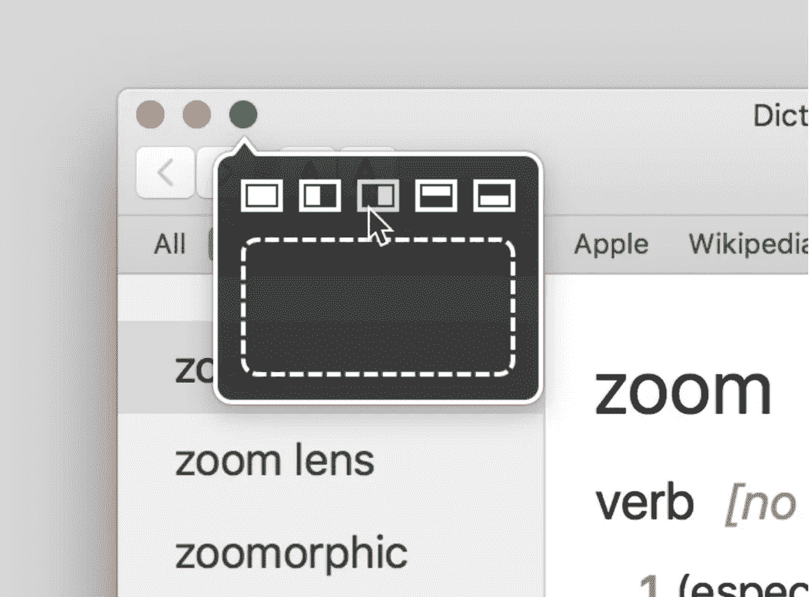
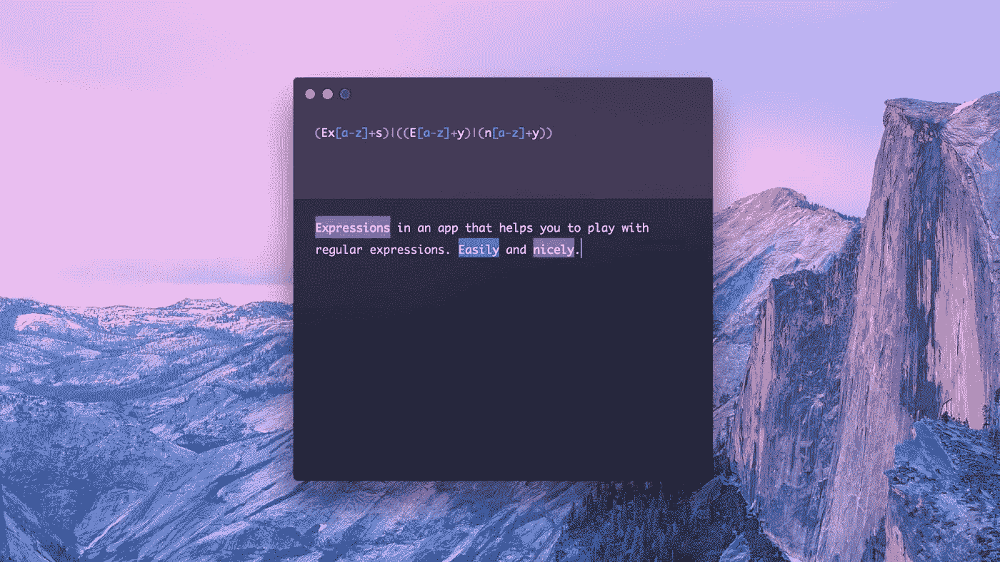
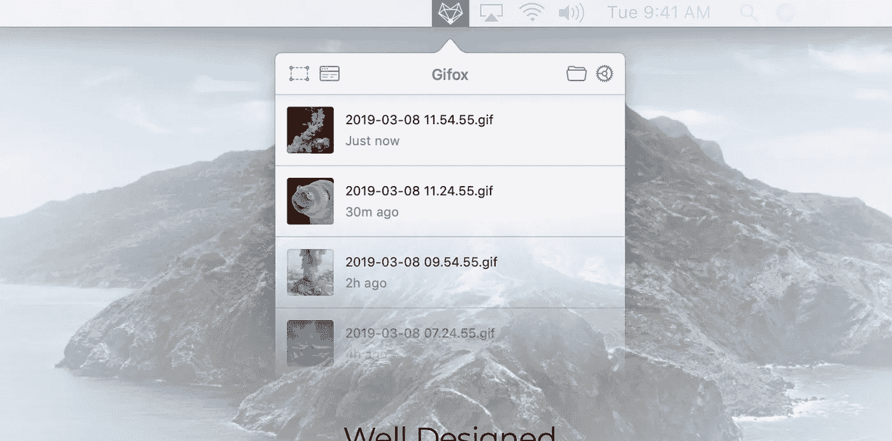
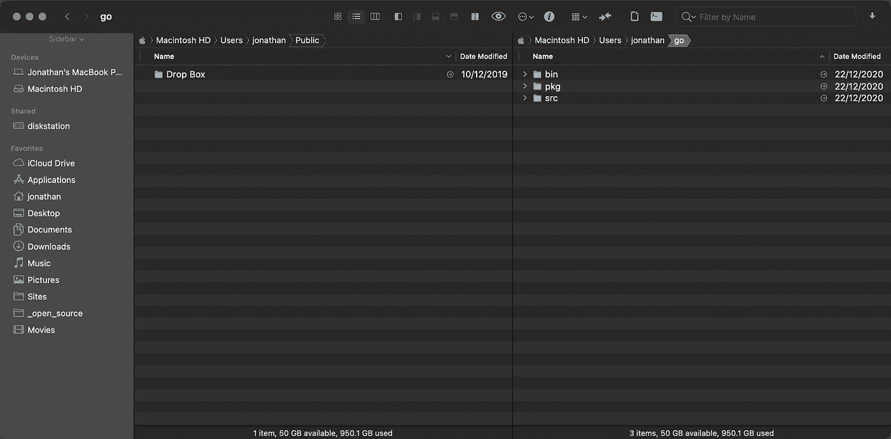
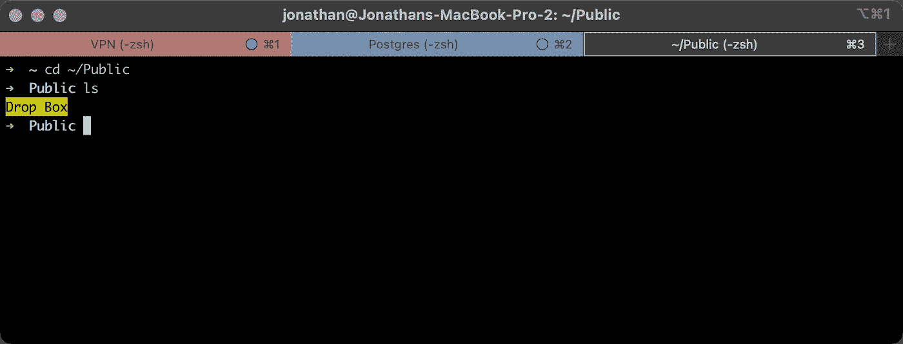

# 软件工程师需要的 5 款 Mac 应用

> 原文：<https://javascript.plainenglish.io/5-mac-applications-you-need-as-a-software-engineer-3558b3087b39?source=collection_archive---------0----------------------->

Photo by [Mikaela Shannon](https://unsplash.com/@mikaelashannon?utm_source=unsplash&utm_medium=referral&utm_content=creditCopyText) on [Unsplash](https://unsplash.com/s/photos/apps-mac?utm_source=unsplash&utm_medium=referral&utm_content=creditCopyText)

作为一个在英国长大的孩子，我经常听到的一句谚语是“拙劣的工匠责怪他的工具”。这背后的意思是，不是工具让我们变得优秀，而是我们如何使用它们。

随着年龄的增长，我开始意识到，在某种程度上，我不同意这句谚语。虽然我同意拥有最好的画笔不会让我成为一个更好的艺术家，但我相信使用一个合理的画笔会比使用一个刷毛都是旧的和弯曲变形的画笔更有效。

我作为一名软件工程师使用的应用程序也是如此，虽然它们本身并不能让我成为超级程序员，但有一些工具可以让我作为一名工程师更加高效，我想我会与你分享我最喜欢的 5 个工具。

# 5.Moom 工具

我想分享的第一个应用是 Moom，它极大地改善了 MacOS 中的窗口管理。Moom 通过允许你快速调整窗口大小并使其与屏幕的不同部分对齐来实现这一点。

Screenshot of Moom from [https://manytricks.com/moom/](https://manytricks.com/moom/)

我使用 Moom 最常见的方式是在屏幕的两边各贴一个窗口，都有 50%的宽度，这样我可以并排看到它们。通常我会使用 Visual Studio 代码和 Chrome，这样当我在编辑器中对代码进行调整时，就可以看到浏览器中发生了什么。

对我来说，有一个工具来管理我的窗口节省了我手动调整窗口大小的大量时间。

在[https://manytricks.com/moom/](https://manytricks.com/moom/)找 Moom，那里有免费试用版，你可以试用。

# 4.公式

作为一名 JavaScript 工程师，我不会每天都写正则表达式，但是当我需要写的时候，我会求助于表达式来帮助我找到合适的正则表达式来解决我的问题。

Screenshot of Expressions from [https://www.apptorium.com/expressions](https://www.apptorium.com/expressions)

我喜欢表达式的一点是它的界面非常简洁，就像一个文本框用于正则表达式，另一个文本框用于测试文本一样简单。除此之外，它还内置了你可以在正则表达式中做的不同事情的提醒，并允许你保存你的正则表达式以备后用。这两者都在默认隐藏的可切换面板中。

你可以从 https://www.apptorium.com/expressions[网站](https://www.apptorium.com/expressions)上获得表情

# 3.吉福克斯

下一个应用程序并没有帮助我编码，相反，它帮助我改善了与同事沟通的方式。我所说的应用程序是 Gifox，这是一个允许你记录部分屏幕或整个窗口并保存为 Gif 格式的应用程序。

Screenshot of application taken from Gifox website [https://gifox.io](https://gifox.io)

Gifox 位于屏幕顶部的 Mac 菜单栏中，当你想要开始录制时，你可以点击它或使用键盘快捷键。然后，您可以选择记录窗口或屏幕的特定部分。

我喜欢这个应用程序的原因是它允许我制作简短的 gif 来展示我想给同事看的东西。一个特别好的例子是报告可视化错误，您希望显示导致您发现的问题的交互。

可以在 [https://gifox.io](https://gifox.io) 获取。

# 2.路径查找器

我要讲的下一个应用是 Cocoatech 的 Path Finder。Path Finder 是 MacOS 的 Finder 应用程序的替代产品，它提供了许多有益于软件工程师的增强功能。

Path Finder by Cocoatech (Screenshot by Author)

我最喜欢的 Path Finder 功能有:

*   通过一个可以添加到工具栏的按钮，可以轻松切换隐藏文件，非常有用，这样你就可以看到那些以点开始的配置文件
*   并排视图，用于在一个窗口中同时查看两个文件夹
*   在终端中打开当前文件夹，如果我想从文件系统跳到一个编码项目中，这个功能很棒

你可以在 http://cocoatech.com 的[买到](http://cocoatech.com)

# 1.iTerm2

除了我的文本编辑器和浏览器，我最常用的第三个应用是我的终端。多年来，我只是简单地使用内置的终端应用程序，然而一位同事说服我尝试 iTerm2，从那以后我就成了它的用户。

Screenshot of iTerm 2, demonstrating customisable tabs.

iTerm2 通过提供一些真正强大的特性使您变得更加有效，从而在终端中脱颖而出。

*   分割窗格允许您并排跨多个终端会话工作，如果您同时对多台服务器运行命令，并且希望一次监视所有服务器，这可能特别有用
*   可定制标签允许您对标签进行颜色编码，以便轻松切换回您需要的标签，热键允许您在不离开键盘的情况下进行切换
*   自动配置文件切换，因此您可以让选项卡根据您在其中运行的内容进行自我配置

在其网站【https://iterm2.com 上免费获得 iTerm2】

设置 iTerm 本身就是一篇博文，幸运的是 [Aude Faucheux](https://medium.com/u/f3ab200f6322?source=post_page-----3558b3087b39--------------------------------) 已经就此写了一篇很棒的博文:

 [## 用 iTerm2 升级你的终端

### 拥有一个配有合适工具的终端可以成倍地提高生产率，这就是我们的目标！

aude53.medium.com](https://aude53.medium.com/level-up-your-terminal-with-iterm2-and-oh-my-zsh-8f66a5fe279d) 

# 结论

我希望你喜欢阅读我关于我作为软件工程师经常使用的文本编辑器和浏览器之外的应用程序的帖子。

我很想知道其他人在用什么，所以我鼓励你在 Medium 上回复或者给我发一条推特[http://twitter.com/jonthanfielding](http://twitter.com/jonthanfielding)。

*注意:我不属于这篇文章中推荐的任何应用程序，所有的推荐都是基于我经常使用的基础上的真实推荐。*

# 乔纳森的其他帖子

 [## 软件架构的阅读清单

### 作为一名软件工程师，了解不同的系统设计方法是很重要的，让我们一起来看看…

javascript.plainenglish.io](/a-reading-list-on-software-architecture-108b33398fe8)  [## 伟大软件工程师的 5 个习惯

### 早在 2008 年我加入 ADP 时，我就开始了作为一名软件工程师的旅程，为构建…

javascript.plainenglish.io](/5-habits-of-great-software-engineers-65ee4ac5b235) 

*更多内容尽在*[***plain English . io***](http://plainenglish.io)