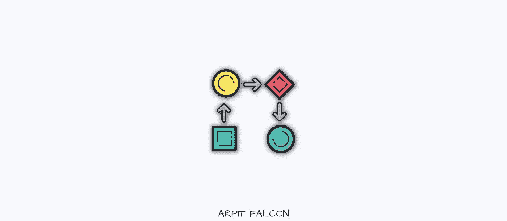

# 5 分钟例行程序，提高我的生产力，同时编码

> 原文：<https://javascript.plainenglish.io/5-minute-routine-to-boost-my-productivity-while-coding-e0535f2080dd?source=collection_archive---------6----------------------->

## 进入心态开始编码。

Photo by author

当人类融入系统时，他们会工作得更好。

[我们日常工作的 80%都是自动完成的。](https://www.newscientist.com/article/2151137-your-autopilot-mode-is-real-now-we-know-how-the-brain-does-it/)任务和步骤被植入大脑，因此只需最少的精神能量就能完成。

**去年，我发现在一项具有精神挑战性的任务前做些小事情会让你进入实现它的心态。这有助于你以更充沛的精力开始工作，并持续下去。**

编码是精神上的疲惫。

因此，我遵循一个简单的 5 分钟程序，让我进入编码和解决挑战性问题的心态。

# 1.最小环境

在开始编码之前，我做的第一件事就是清理掉我桌子上不必要的东西。

任何在编码过程中对我没有帮助的东西都被扔掉了。我可能需要的东西都放在一臂之外。在我的视线里，只有三样东西:我的显示器，我的键盘，我的鼠标。

它帮助我最大限度地减少分心，因为即使注意到一个简单的待办事项清单也可能引发许多想法，并夺走你宝贵的时间和解决问题的心态。

清理完外部环境后，我通过移除任何不必要的标签来清理我的浏览器和 ide。**您可以使用**[**One Tab Extension**](https://www.one-tab.com/)**将您打开的标签保持在一个地方，只需点击一下。**

# 2.水合作用

程序员的一个重大问题是，他们太专注于任务，以至于长时间忘记喝水。

水对大脑的功能至关重要，可以帮助你恢复活力和思考。

我相信身边有一个水瓶对我的帮助比什么都大。它让我保持水分，每当我想睡觉的时候，我都会喝一小口来提神。

# 3.电话是黑仔的终极生产力

你的智能手机(如果你不是为了自己的利益而使用它)可能会成为你的敌人。据研究显示，我们每天解锁**[**手机超过 100 次**](https://techland.time.com/2013/10/08/study-says-we-unlock-our-phones-a-lot-each-day/#:~:text=According%20to%20a%20study%20released,phone%20110%20times%20each%20day.) **。****

**每次我们在工作间隙查看手机，都会对我们自己和我们的工作效率造成精神伤害。你可能认为你只花了 2 分钟检查你的通知和回复别人。尽管如此，[一个上下文切换负载](https://insights.sei.cmu.edu/blog/addressing-the-detrimental-effects-of-context-switching-with-devops/#:~:text=From%20a%20human%20workforce%20perspective,task%20on%20a%20different%20project.&text=Context%20switching%20most%20commonly%20occurs,are%20assigned%20to%20multiple%20projects.)比你看到的要多得多。**

****我通常把手机静音，放在另一个房间。****

**分批工作，一个小时后才查看，这有助于我及时了解最新情况，不会错过任何紧急事件。**

****Adobe 的一项调查还发现，除了手机，现代员工每天花 3.5 个小时查看电子邮件。**相同的上下文切换负载与之相关联。**

**当他们发送邮件时，没有人期望你在一分钟内回复。给自己一些特定的时间，打开所有的邮件，然后回复别人。**

# **4.清晰是流动触发器**

**拥有清晰的目标可以帮助你比你想象的更加专注。**

**拖延症最重要的因素之一是你不清楚下一步该做什么，或者害怕手头的任务。**

**有小而明确的目标可以帮助你解决拖延症，开始工作并建立动力。当你清楚自己在接下来的一个小时里想要实现什么时，你就投入了时间和精力去实现它。**

**一旦我开始为自己设定明确的目标，我就能够优化我的时间和效率。**

**一个清晰和不清晰目标的例子—**

****目标不明确—** 我要学 Python。**

****目标明确—** 接下来的 2 个小时，我要学习如何用 Python 写循环。我会在第一个小时了解理论，然后在下一个小时实践它。**

# **5.让思维活跃起来**

**研究表明，在做一些有挑战性的脑力工作前锻炼有助于你清晰地思考。**

**做体力活会释放我们体内的内啡肽，让我们开心，注意力更集中。它将帮助你接受编程带给你的新挑战。**

**当你编码时，锻炼可以帮助你更加专心、专注和警觉。**

**我做了 25 个跳跃动作来让血液流动起来，并且进入了全神贯注于编码的状态。**

**编码是最具精神挑战性的任务之一，建立一个常规可以帮助你走很长的路。**

**我们的身体喜欢常规和系统。所以给自己做一个吧。**

**你想更快地学习新技能吗？ [***抓住我的免费 7 步学习框架，加速你的学习，让技能坚持下去。***](https://dedicated-innovator-3432.ck.page/47cebcc022)**

**如果你是新来的，喜欢这篇文章，在 Medium 上还有很多这样的文章。你可以注册阅读它们，每月只需 5 美元。**

**[**这里是无限制访问媒体上所有内容的链接。如果你用这个链接注册，我会赚一小笔钱，不需要你额外付费。**](https://arpitfalcon.medium.com/membership)**

***更多内容请看*[***plain English . io***](http://plainenglish.io/)**