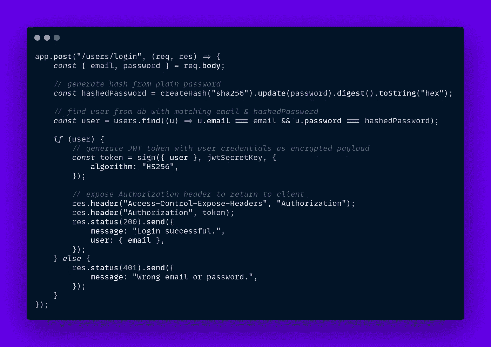

# JavaScript 中的 JWT 认证只需 5 分钟

> 原文：<https://javascript.plainenglish.io/5-minutes-to-jwt-authentication-in-javascript-6cc4551494a3?source=collection_archive---------3----------------------->

## 如何使用 JWTs 对用户进行身份验证—快速 JWT 中间件、Node.js Crypto & React

身份验证是一个复杂且经常被分裂的话题，有些人更喜欢有状态会话 Cookies 方法，而其他人则选择无状态 jwt。我是后者中的一员，因为我喜欢实现 JWT 认证的快捷和有效。

每当我们创建应用程序时，我们都需要了解一些重要的安全方面:

# 1.密码

密码不应该以纯文本的形式存储在数据库中，因为这可能是一个巨大的漏洞。

假设攻击者(黑客)访问了我们的数据库，这已经是一个巨大的安全问题，我们的应用程序因此受到了威胁。如果我们以纯文本形式存储登录信息，攻击者可以重复使用电子邮件和密码组合来访问用户可能使用的其他常见网站，如谷歌甚至在线银行。

是的，大多数这些平台需要 [2FA](https://authy.com/what-is-2fa/) 或其他额外的步骤来进行身份验证，但这并不是故意暴露客户凭证的理由。

幸运的是，解决方案相当简单，那就是在数据库中存储一个散列而不是普通的密码。

哈希是加密函数的结果，该函数接收输入并始终返回该特定输入的唯一固定大小(SHA256 为 256 位)。

# 生成 [SHA256](https://qvault.io/cryptography/how-sha-2-works-step-by-step-sha-256/)

# 2.认证( [JWT](https://jwt.io/) )

JWT (JSON Web Tokens)是一种存储用户凭证并以安全的方式在双方(前端客户端和后端服务器)之间传递凭证的全球标准化方法。

基本上，JWT 是一个字符串，它应该在后端生成并存储在前端，随每个请求一起发送。

> 但是，我们如何生成这个令牌，以及我们将令牌存储在客户端的什么位置呢？

让我们看看如何在 Express 应用程序中使用 JWTs 对用户进行身份验证:

我将使用 [express-jwt](https://www.npmjs.com/package/express-jwt) 中间件库，因为它非常简单明了，注意还有其他可能更健壮的包，如 [passport](https://www.npmjs.com/package/passport) 。

# 生成 JWT

我们首先必须使用以下命令创建我们的示例项目:

之后，只需创建一个`index.js`文件，并向 package.json 添加一个启动脚本，如下所示`"start": "node index"`

我们需要公开 2 个端点，一个用于用户注册，另一个用于登录。

# 注册

在这里，我们必须生成散列密码，并将其与提供的电子邮件一起插入数据库。

# 注册

与注册类似，我们需要密码的哈希值，并使用它来检查数据库中是否存在 email 和 hashedPassword 对。使用用户对象，我们对 JWT 令牌进行签名，并在公开的授权响应头中返回它。

# 商店 JWT

在客户端保持 jwt 持久化有两种常见的方法:

*   饼干
*   局部存储器

两者都存在安全问题，比如 XSS、T2、CSRF、T4 和 XST，因此这两种存储方式都不完全安全。

我更喜欢将 jwt 存储在 cookies 中，因为这可能比本地存储 IMOP 稍微安全一点。

让我们假设我们的客户机是一个 SPA，更准确地说是一个 React-powered 应用程序，客户机经常使用 Axios 客户机向 API 发出请求。

让我们创建一个自定义的 Axios 客户端类，我们称之为 request.js。

我们将使用 [react-cookie](https://www.npmjs.com/package/react-cookie) ，因为它提供了一个简单的钩子 API 来操作 cookie。

# 包扎

安全性是一个棘手的领域，身份验证通常更棘手，因为保护用户数据是应用程序最重要的目标。

如果你想检查这里的代码是 [CodeSandbox](https://codesandbox.io/s/express-jwt-example-ln0og?file=/index.js) 链接。

*在*[*alexstreza . dev*](https://www.alexstreza.dev/)*查看更多我的作品。*

我希望您喜欢这个简短的 JavaScript JWT 认证展示，如果您给它一个👏！

*更多内容请看*[***plain English . io***](http://plainenglish.io/)