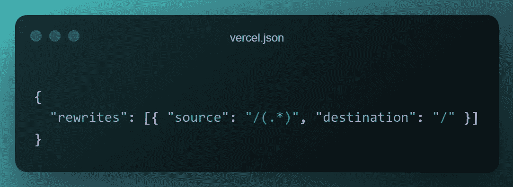
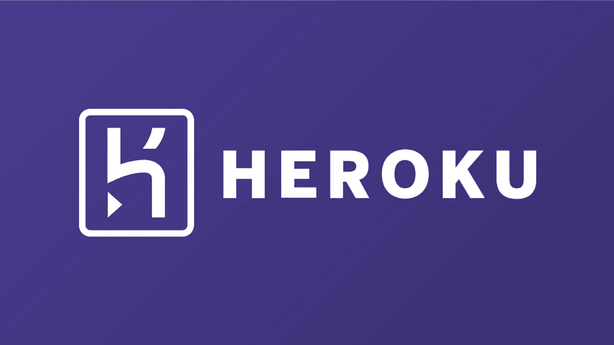
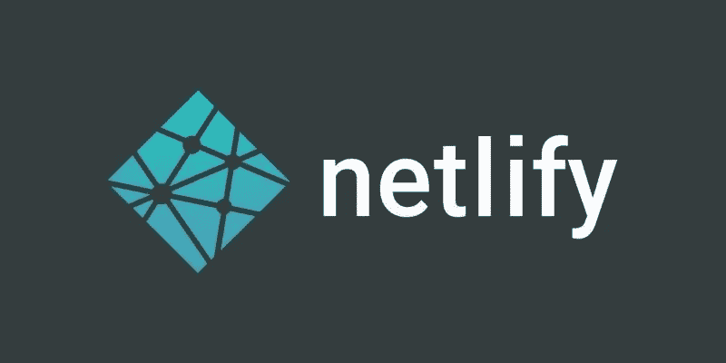

# 将您的 Web 应用程序部署到互联网的 5 种现代方法

> 原文：<https://javascript.plainenglish.io/5-modern-ways-to-deploy-your-web-app-to-the-internet-bd8c2f095fda?source=collection_archive---------1----------------------->

## Web 开发指南

## 这一步对于许多新手开发者来说通常很难。嗯，不再是了。

Cover by [Author](https://candurmuss.medium.com/) — Inspired by [Vercel](http://vercel.com) Home Page

当我开始从事 web 开发时，我有许多技术需要学习。有 HTML，CSS，JavaScript，SASS，框架等等。学习所有这些对我来说是相当困惑的，但毕竟，我学会了它们，并且有能力创建一个基本的网站。一切都很完美，直到我想起一位智者的戏剧性话语:

[Barney Stinson](https://en.wikipedia.org/wiki/Barney_Stinson) — The writer of Playbook

> 这辈子无论做什么，都不是传奇，除非你的朋友在那里看到。
> 
> **巴尼·斯丁森**

说完这些话，我不得不把我的网站分享给我的朋友，这样他们就可以看到并欣赏它。所以，这里是我最喜欢的 5 个工具，让你不费吹灰之力就能把网站上线。

## 1.韦尔塞尔

在这个列表中，Vercel 是我最喜欢的部署工具，因为它的易用性和性能。您可以通过两种不同的方式将应用部署到 Vercel:CLI 工具和 Web GUI。要使用 CLI 工具部署应用程序，您必须安装 Vercel CLI 并在项目的根目录中键入`vercel`。仅此而已！神奇的事情发生了，你可以免费与你的朋友分享你的链接。

[Vercel](https://vercel.com/) is my go-to tool for deploying frontends.

此外，它默认支持 30+前端框架，这是非常令人印象深刻的，并提供了多功能性。但是，基于您使用的框架，您可能需要提供一个名为`vercel.json`的配置文件。例如，如果你的项目是 [SPA](https://en.wikipedia.org/wiki/Single-page_application) (React，Vue…)，那么由于应用程序的架构，你必须通过在`vercel.json`中添加以下内容将所有的 URL 重定向到`/`。

部署后，域名末尾将包含`.vercel.app`。要删除它，你必须购买一个域名，并支付一点。[这是我部署到 Vercel 的一个项目。](https://home2.vercel.app/)

 [## 发展。预览。船。最佳前端团队- Vercel

### Vercel 将最好的开发人员体验与对最终用户性能的专注结合起来。我们的平台支持…

vercel.com](https://vercel.com/) 

## 2.赫罗库

Heroku 是另一个为开发者提供免费部署服务的平台。它通常在后端部署中很流行，但是您可以在前端和后端都使用它。部署阶段比 Vercel 稍微复杂一些，因为它多了 4-5 个步骤，并且您必须在部署之前初始化 Git 存储库。

Heroku is the perfect tool for server deployment because of its performance.

Heroku 支持 Node 等所有主流编程语言。JS、Python、Scala、PHP、Go……这使得 Heroku 语言变得独立，并且使得为每个开发人员快速部署应用变得容易。

与 Vercel 相比，Heroku 的免费层有点有限，因为与 Vercel 不同，在 Heroku 中，你只能免费创建和部署 5 个 web 应用程序。要创建更多的应用程序，你必须支付少量的费用。此外，URL 在自由层以`.herokuapp.com`结尾。[这是](https://xenover.herokuapp.com/)我部署到 Heroku 的一个网络应用。

 [## 云应用平台| Heroku

### 无论您是在构建简单的原型还是关键业务产品，Heroku 的全托管平台都能为您提供…

www.heroku.com](https://www.heroku.com/) 

## **3。网络生活**

这一个与其他的略有不同，因为 Netlify 主机，正如他们所说，用于 JAMStack 应用程序。这意味着，在服务器端没有动态文件和处理。相反，您可以将您的前端部署到 Netlify，并使用 HTTP 请求从 API 获取数据。这就是为什么，对于只处理 HTML、CSS 和 JS 的新程序员来说，Netlify 是一个优秀的平台。例如，如果你创建了一个简单的计算器，并想与你的朋友分享，Netlify 就非常方便，因为它有简单的用户界面。你所要做的就是拖放包含源代码的文件夹就完成了！你的前端是活的。

Due to its straightforward UI, you can use Netlify for simple project deployments.

Netlify 在免费层方面相当慷慨，如 Vercel。一旦你有一个帐户，你可以免费创建无限的自定义域名的项目。但是，在自由层中，域名必须以`.netlify.app`结尾。如果想去掉它，增加带宽，就得付出一点。这是我在 Netlify 上部署的一个网络应用。

 [## Netlify:在创纪录的时间内开发和部署最佳网络体验

### 您的企业 Jamstack 迁移分步指南现在下载数百万开发人员使用 Netlify 来发布…

www.netlify.com](https://www.netlify.com/) 

## 4.GitHub 页面

另一个为你的项目提供免费托管和域名的平台是 GitHub。除了存储库之外，GitHub 还允许你直接从存储库部署你的应用。如果你想快速在线测试你的应用或者 JS 库，这是非常方便的。

GitHub lets you deploy your apps quickly from your repository for free.

这个部署选项也是免费的。它会根据您的用户名提供一个域名，并以`.github.io`结尾。[这是我创建的](https://xenoverseup.github.io/react-clamped/) [JavaScript 库](https://www.npmjs.com/package/react-clamped)的示例页面。我使用 GitHub 页面部署它。

 [## GitHub 页面

### 使用你最喜欢的文本编辑器，在你的项目中添加一个 index.html 文件:Hello World I hosted with GitHub Pages…

pages.github.com](https://pages.github.com/) 

## 5.重火力点

Firebase 是一个移动和 web 开发平台，提供许多服务，如实时数据库、分析、认证等。托管也是 Firebase 提供的服务之一。Firebase 有一个可靠的 CLI 和 GUI，可以轻松地部署前端和后端。它的免费服务相当慷慨，付费服务也非常不错。[这里是](https://emoji-m.firebaseapp.com/)一个部署到 Firebase 的 web 应用程序。

Firebase is a Google-backed cloud service provider for mobile and web apps.

# 最后的想法

如果您不愿意付费，我在本文中展示的部署平台不是用于生产部署，而是用于小型测试项目。以下是我在使用这些平台部署 web 应用程序时的路线图。

*   对于前端部署，只需选择 Vercel，因为它真正提供了一个易于使用的 UX 和著名的主机。作为替代，您也可以使用 Netlify。
*   如果是你要部署的后端，Heroku 正好为此量身定制。将您的后端部署到 Heroku，不要担心其他任何事情。
*   如果您想在 GitHub 上测试您的库或项目示例，请使用 GitHub Pages，因为它与 GitHub 集成得很好，并且部署过程是无缝完成的。

谢谢你们的阅读。当时，与朋友分享我的项目对我来说相当困惑，在这个故事中，我向新手程序员阐明了这个过程。如果你喜欢，一定要鼓掌。如果你有另外喜欢的部署平台，请在回复部分分享给我。这里是[我的 GitHub 简介](https://github.com/XenoverseUp)，如果你感兴趣的话。

如果你喜欢阅读这样的故事，并想支持我成为一名作家，可以考虑[注册成为一名媒体成员](https://candurmuss.medium.com/membership)。每月 5 美元，你可以无限制地阅读媒体上的故事。如果你用我的链接注册，我会赚一点佣金。

 [## 通过我的推荐链接加入 Medium-Can dur mus

### 作为一个媒体会员，你的会员费的一部分会给你阅读的作家，你可以完全接触到每一个故事…

candurmuss.medium.com](https://candurmuss.medium.com/membership) 

## 有关系的

 [## 11 个罕见的 JavaScript 一行程序会让你大吃一惊

### 因为谁不喜欢只用一条线来建造东西呢

better 编程. pub](https://betterprogramming.pub/11-rare-javascript-one-liners-that-will-amaze-you-331659832301)  [## 7 个必须知道的网站来提升你的前端

### 简单而有用的网站，你会每天使用

better 编程. pub](https://betterprogramming.pub/7-must-know-websites-to-boost-your-frontends-b3ea0bb282e6)  [## 加速开发过程的 3 个奇妙的 JavaScript 技巧

### 下面是我最喜欢的节省时间的 JavaScript 技巧

better 编程. pub](https://betterprogramming.pub/3-marvelous-javascript-tips-to-speed-up-the-development-process-ba1bb8e3fb7a) 

*更多内容请看*[***plain English . io***](http://plainenglish.io/)