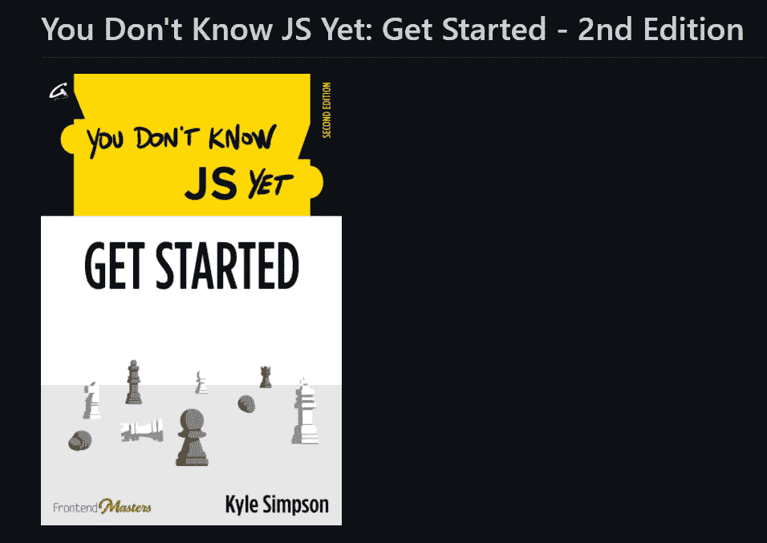

# 学习 Web 开发的 5 个最受欢迎的 GitHub 库

> 原文：<https://javascript.plainenglish.io/5-most-popular-github-repositories-to-learn-web-development-71953ac7ae91?source=collection_archive---------7----------------------->

## 学习和掌握 Web 开发的流行知识库

Photo by Geeks For Geeks

GitHub 是最大的开源社区。GitHub 上有上百万的资源可供你学习任何你想学的东西。

但是在信息的海洋中，很容易迷失。所以，我整理了一份最受欢迎的 GitHub 库的列表，我个人用它来学习 Web 开发。

从要遵循的路线图开始，到最好的资源和书籍。我已经包括了所有你需要成为一名网络开发人员。

# 1.Web 开发人员-路线图

GitHub 明星:17.2 万

[GitHub 链接](https://github.com/kamranahmedse/developer-roadmap)

如果你想在不久的将来成为一名 web 开发人员，这就是你要遵循的路线图。

这个存储库是一个全面的指南，包含了成为全栈开发人员应该学习的每一项技术。除了存储库中提到的堆栈，您不需要任何其他东西。

Photo of the repository, taken by Author

存储库分为三个部分:

1.  前端 Web 开发
2.  后端 Web 开发
3.  DevOps

当您第一次打开存储库中给出的路线图时，不要感到不知所措。一次做一件事，按照你的速度，然后继续下一件事。因为这是一个全面的路线图，所有的内容都包括在内，从你可以在一个小时内完成的主题到需要几个星期才能完成的主题。

通过坚持不懈的练习，你将会成为一名出色的开发人员。

# 2.你不知道 JS

GitHub 明星:14.4 万

[GitHub 链接](https://github.com/getify/You-Dont-Know-JS/tree/2nd-ed)

你不知道 JS 是 JavaScript 系列书籍。这是社区中强烈推荐的学习 JavaScript 的工作和高级概念的书籍之一。

JavaScript 是一种神秘的语言。有很多事情你第一次去不会懂。但是 JavaScript 的开发者并没有纠正它们，因为这可能会破坏一些旧网站。

Photo of the repository, taken by Author

《你不知道》JS 系列揭秘了 JavaScript 的核心机制，将帮助你了解该语言的内部工作原理。

它们可以在知识库中免费阅读，我可以说你将会学到 JavaScript 中的东西，这些东西是任何视频课程都不会告诉你的。

从你觉得你懂 JS 的时候你不懂 JS 开始。更简单地说，从学习实现的基础开始，然后在这里学习每一行代码如何在 JavaScript 引擎中执行。

# 3.免费编程书籍

GitHub Stars:20.5 万

[GitHub 链接](https://github.com/EbookFoundation/free-programming-books)

我喜欢这个仓库。对于喜欢读书的程序员来说，这是天堂(我知道你们很多人都喜欢)。

免费编程书籍是一个资源库，包含您可能想学习的任何技术的免费电子书。你说出技术的名字，这个知识库有免费的书籍可以学习。

这些书由 6，000 多名投稿人精心策划，为您提供可用的最佳资源。

存储库现在扩展到包括备忘单、课程和教程。

对于任何想通过接触书籍来学习的人来说，这是一个必去的地方。

# 4.干净代码 JavaScript

GitHub Stars:56900

[GitHub 链接](https://github.com/ryanmcdermott/clean-code-javascript)

Picture of cartoon, taken from the first page of Clean Code

[Robert c . Martin(Bob 叔叔)的《干净的代码》(Clean Code)](https://www.amazon.com/Clean-Code-Handbook-Software-Craftsmanship/dp/0132350882)是最受欢迎的书籍之一，教你编写干净代码的最佳实践。

但是书中的例子最初是用 Java 实现的，但它可以超越任何其他编程语言。因此，这个库的所有者已经将这些代码转换成了 JavaScript。

《干净代码 JavaScript》是用 JavaScript 编写可读、可重用和可重构软件的指南。

在阅读了整个存储库之后，你不会学到如何编写干净的代码。这是一个不断学习和应用的过程。一遍又一遍的实现对于快速编写干净漂亮的代码是非常重要的。

我强烈推荐每个开发者阅读罗伯特·c·马丁的《干净的代码》,如果你是一个 JavaScript 开发者，你可以从[这个资源库开始。](https://github.com/ryanmcdermott/clean-code-javascript)

# 5.前端清单

GitHub Stars:56300

[GitHub 链接](https://github.com/thedaviddias/Front-End-Checklist)

前端清单是一个项目的清单，你应该照顾当建立一个网站。

它是基于在行业中工作多年的前端开发人员的建议和第一手经验。

前端清单给你一系列的任务，你需要这样做，使你的网站在互联网上超过其他草率的 95%的网站。

这份清单涵盖了从为网站设置替代语言等微小(但重要)的任务到制作错误页面等更高级、更重要的事情。

在检查了列表中的大部分任务后，你可以放心，你的网站在可访问性和 SEO 方面是最好的。

我几乎每天都使用其中的一些库来更顺利地导航我的 web 开发之旅。

如果你喜欢这篇文章，媒体上还有很多这样的文章。你可以注册阅读它们，每月只需 5 美元。

[**这里是无限制访问媒体上所有内容的链接。如果你用这个链接注册，我会赚一小笔钱，不需要你额外付费。**](https://arpitfalcon.medium.com/membership)

*更多内容看*[***plain English . io***](http://plainenglish.io)