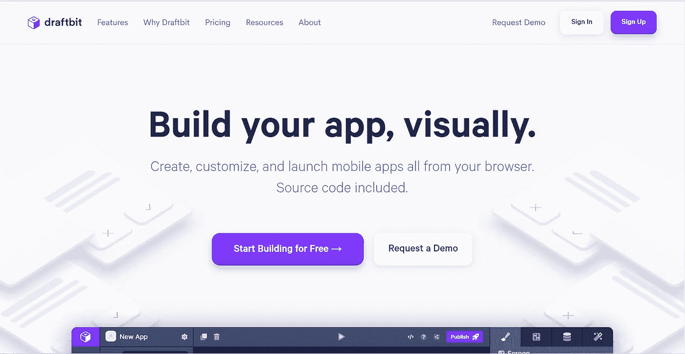
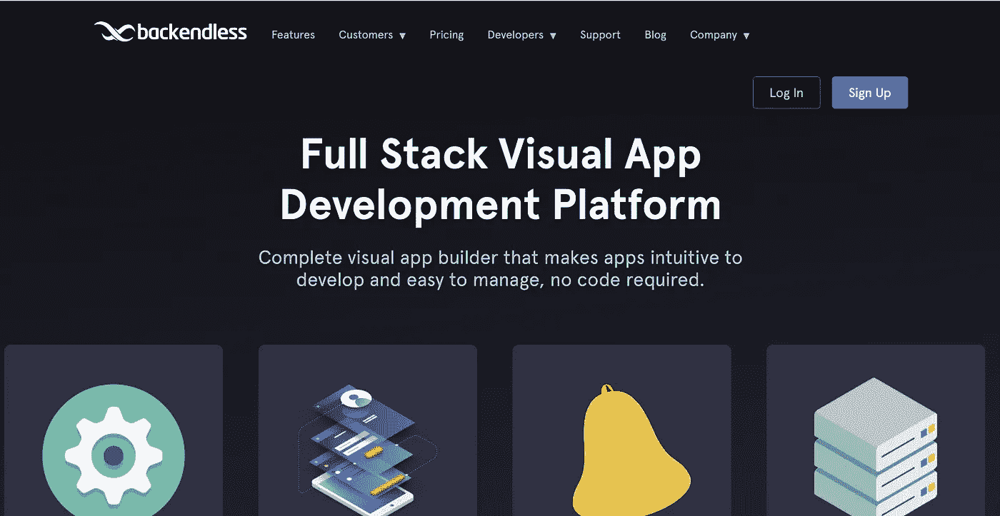
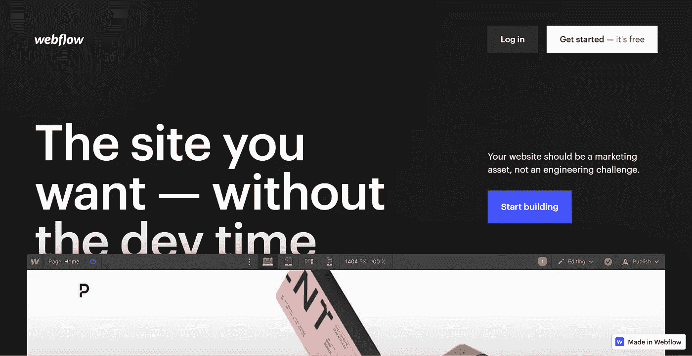
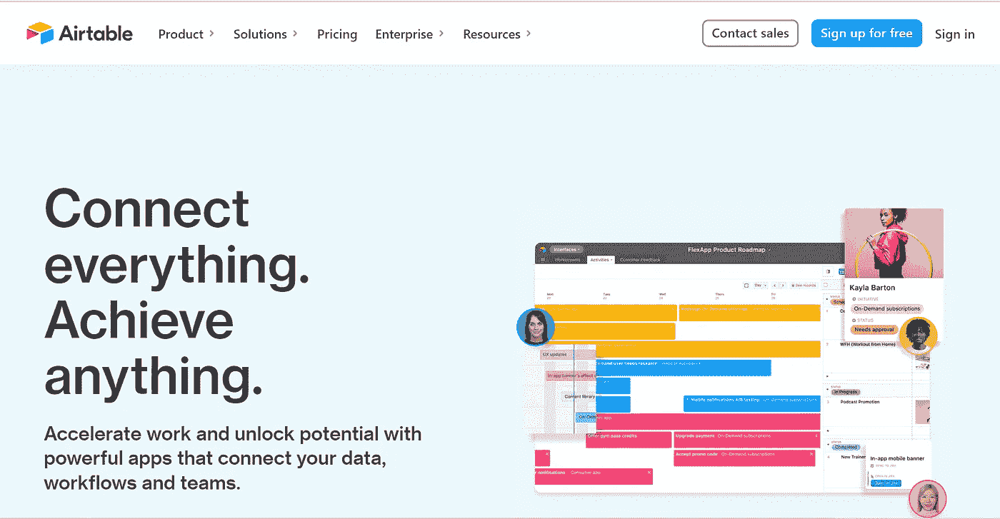

# 你需要尝试的 5 种无代码工具

> 原文：<https://javascript.plainenglish.io/5-no-code-tools-you-need-to-try-out-b8e7859a1c14?source=collection_archive---------3----------------------->

## 开发人员友好的无代码工具，你需要检查

Photo by [Buro Millennial](https://www.pexels.com/@buro-millennial-636760?utm_content=attributionCopyText&utm_medium=referral&utm_source=pexels) from [Pexels](https://www.pexels.com/photo/selective-focus-photo-of-man-using-laptop-1438081/?utm_content=attributionCopyText&utm_medium=referral&utm_source=pexels)

## 什么是无代码工具？

无代码工具是让您无需编写代码就能构建应用程序或发布产品的工具。无代码工具完全由代码构建，让您通过拖放或选择开发您想要的方式来自动化人员。这些工具允许您根据您想要的设计和想法定制构建。

有大量的非代码工具可以解决各种需求。因此，根据您需要和想要构建的内容，有各种各样的非代码工具供您使用。

然而，我发现其中一些工具在编排和自动化过程中是独一无二的。使用过这些工具后，我对它们的能力感到惊讶。

## **为什么要使用无代码工具？**

没有什么代码工具可以派上用场，尤其是当你想加快开发速度，并在固定的时间表上工作，而没有太多的时间进行调整的时候。非代码工具解决了不同的目的和不同的领域。无代码工具很容易被不时地采用，并帮助我们提供一些问题的解决方案，而不是自动化。

无代码的一些目标包括。

*   更快的开发过程。
*   提供丰富的功能/能力来扭转项目。
*   为你自动化枯燥的东西。
*   更短的学习曲线——无代码工具更容易学习和掌握。
*   为您省钱。
*   更容易维护。

在这篇文章中，我将分享一些我尝试过的令人惊奇的无代码工具，它们可以改进你的开发过程，并为你自动完成枯燥的工作。

## **1。Draftbit**

Draftbit landing page

Draftbit 是一个完全为开发本地移动应用程序而构建的无代码工具。Draftbit 提供了许多开箱即用的定制，像任何现代应用程序构建器一样具有丰富的功能和能力。

它的一些核心特性包括。

*   使用 API 的功能。
*   与数据库集成。
*   登录/注册配置。
*   部署到苹果的 Testflight 或 Google Play 的测试程序中。
*   各种模板可供选择。
*   完全反应本地和博览会源出口。

可以在这里查看 Draftbit 平台 [***。***](https://draftbit.com/)

## **2。Backendless**

Backendless landing page

Backendless 提供全栈可视化应用开发。Backendless 还提供无代码后端作为核心的服务平台。它还提供了编排的数据库，您可以设计并与其他各种无代码平台集成。

Backendless 的核心功能包括。

*   UI 主题。
*   无尽的建设者。
*   数据库管理。
*   缓存。
*   用户管理。
*   发布/订阅消息。
*   无代码—可视化构建后端逻辑和 API，无需任何代码。
*   与其他平台集成(Draftbit 等。)

你可以在这里查看 Backendless [***。***](https://backendless.com/)

## **3。网络流量**

Webflow landing page

Webflow 是另一个高效且优秀的无代码工具。Webflow 是一个 SaaS 应用程序，允许设计人员使用基于浏览器的可视化编辑软件来构建响应式网站。这样，Webflow 将使您能够创建具有独特用户界面和重要定制的漂亮网站。

它的一些独特功能包括

*   羧甲基淀粉钠
*   SEO 优化。
*   顺畅的跨职能协作。
*   托管。
*   安全性——最先进的 web 应用程序安全性。
*   漂亮的用户界面模板

你可以在这里查看 Webflow [***。***](https://webflow.com/)

## **4。气动工作台**

Airtable landing page

Airtable 是一个用于构建协作应用的低代码平台。它允许您定制您的工作流程、协作并实现宏伟的目标。

Airtable 提供的核心特性包括。

*   与其他平台的集成
*   自定义字段。
*   筛选、排序和重新排列记录。
*   自定义视图。
*   在表之间链接记录。
*   关系数据库功能。
*   数据同步。
*   标签和关键字。
*   电子邮件集成。

你可以在这里查看 Airtable [***。***](https://www.airtable.com/)

## **5。购物化**

Shopify landing page

Shopify 以免你建立一个在线业务，无论你在哪个行业。Shopify 让您创建一个由漂亮的界面和引人注目的电子商务功能驱动的在线业务。Shopify 是一个强大的工具，可以为销售建立一个可靠的电子商务平台，并在现代网络上推动与销售相关的计划。

**Shopify 的特点**

*   无限产品。您可以在您的 Shopify 商店中销售的产品数量不受限制。
*   无限带宽和在线存储。
*   购物销售点。
*   礼品卡。
*   在线销售渠道。
*   欺诈分析。
*   手动创建订单。
*   折扣代码。

你可以在这里查看 Shopify [***。***](https://www.shopify.com.ng/)

## **走之前**

在网络空间的黎明，当你想立刻自动化产品运输时，利用无代码平台是非常有效的。无代码平台在各种情况下都是救命稻草，多年来一直很有效。

感谢您花时间来检查这些惊人的无代码工具。

每周三，我都会发送一封独家邮件，里面有我发现的有用的、与技术写作相关的技巧、文章、应用、书籍和想法。

[***加入像你一样想提高写作技巧的人。***](https://artisanal-thinker-2556.ck.page/6e2ba71172)

**更读**

 [## 技术作家的 10 大惊人资源

### 满足您所有技术写作需求的综合列表

javascript.plainenglish.io](/top-10-insanely-amazing-resources-for-technical-writers-a5262c46cdb7)  [## 这里是每个开发人员都应该知道的 10 个终端命令

### 改善工作流程和日常使用的有用命令

javascript.plainenglish.io](/here-are-10-terminal-commands-every-developer-should-know-52bbdb03242b) 

*更多内容请看**[***说白了. io***](http://plainenglish.io/) ***。*** *报名参加我们的* [***免费每周简讯这里***](http://newsletter.plainenglish.io/) ***。****