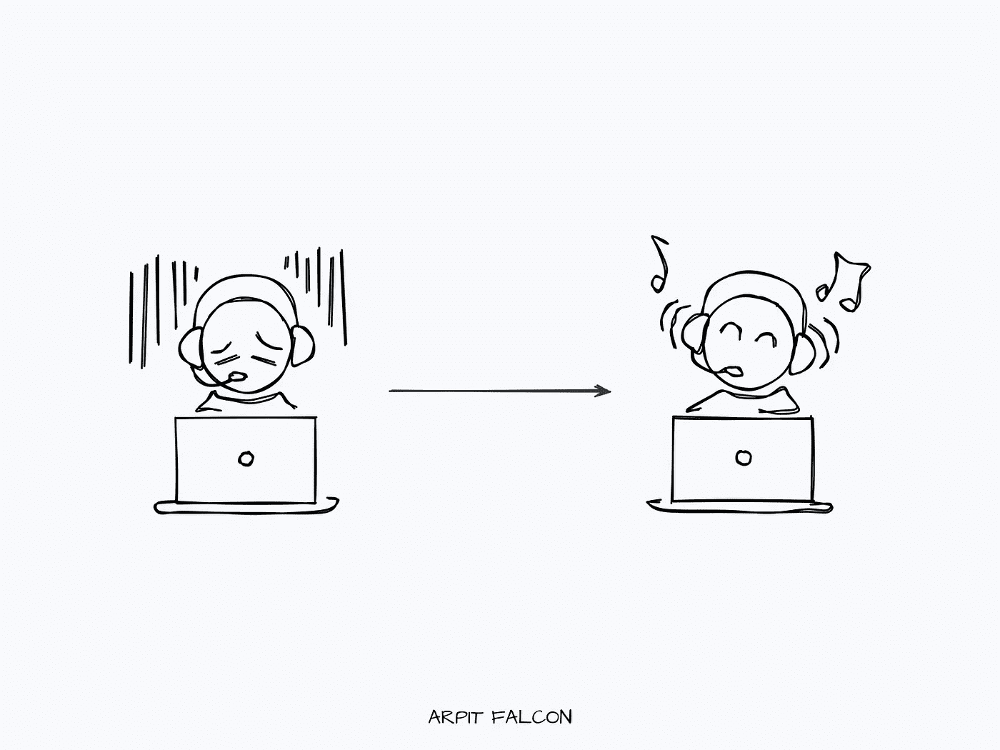

# 5 种非常规的方法来提高你的编程能力

> 原文：<https://javascript.plainenglish.io/5-non-conventional-ways-to-improve-your-programming-now-bbb05a6ebc23?source=collection_archive---------19----------------------->

## 编程很难。但是你也可以让它变得有趣。

有很多方法可以提高你的编程水平。你可以拿起不同的工具，使用调试器，喝一杯浓咖啡。虽然所有这些都很好，但有一些非常规的方式让编程对我来说就像是一出戏。

硅谷顶级风险投资人之一的 Naval Ravikant 说，对你来说是游戏，对别人来说是工作的东西会让你变得无价。

以下是一些改进我编程的方法。

# 1.找点乐子

编程很难。这是毫无疑问的。你会有很多挣扎，你有时会失败，你会面临似乎压倒你的挑战。

解决这个问题的最佳方法是什么？找点乐子！

坐在电脑前并不是你必须做的事情。放下手头的工作，休息一会儿，让你的思想开小差。研究新技术并学习它的基础知识。解决一些算法难题或做[创意编码。](https://en.wikipedia.org/wiki/Creative_coding)

目标是不要在编程时耗尽精力。就是一边工作一边玩。

我采用了游戏化的系统。我把每天的任务分成更小的子任务，并在完成每一项任务后奖励自己。奖励可以小到一张 Twitter 卷轴，让自己享受一顿美餐。

# 2.不要陷入教程地狱

教程地狱就是看一个接一个的教程，没有任何自己的实现或者实践。很容易掉进去。

在我 2020 年的前半年，我一直在地狱般的教程中。我在看课程，看书，以编程的名义修改笔记。事实上，我没有编写一行代码来实现我所学到的东西。

我担心我还没有准备好自己写代码。

事实是，再多的教程也不能让你成为更好的程序员。你需要把手弄脏。您构建的一个项目抵得上一打教程。

建造。接受反馈。提高。迭代。

# 3.尽快把你的手弄脏

没有人会在第一次尝试时就创造出完美的应用或网站。你的第一件事会很糟糕。那就不会那么糟糕了。总有一天会变好，然后变得更好。

刚开始就是成功了一半。不要陷入如何做的无休止的分析中。拿起一个小的子问题，开始解决它。当你获得动力并开始布局基础时，你会看到其他部分开始自己告诉自己它们适合哪里。

你听着并为他们写代码。

# 4.读，读，读

提高写作水平的一个最重要的建议就是阅读你理想中的作品。你读得越用心，你的工作和手艺就会提高得越多。你会学到新的单词、结构和风格。

编程也是一样。

看别人的作品。GitHub 有大量优秀的程序员和他们的开源软件，你可以从那里看到他们的代码。

阅读他们的代码，看看他们如何构建每个应用程序，如何解决他们的问题，以及他们的代码看起来有多优雅。你可以通过看别人的代码获得一百万种东西。

# 5.博客/教学

> 如果你想掌握某样东西，就去教它。—理查德·费曼

在软件工程中，有一种技术叫做橡皮鸭。如果你遇到了一个 bug，而你无法解决它。拿一只橡皮鸭，一行一行地向它解释代码。这是找到代码中的 bug 的有效方法。

你可以把这种方法应用到几乎任何事情上。正如理查德·费曼所说，如果你能用通俗的语言解释清楚，你就理解了这个概念。把橡皮鸭当成你的学生，把你知道的一切都教给它。

我遵循的另一个很好的方法是写博客，记录我正在建立和学习的东西。你将被迫提炼概念，因为有可能你的读者对这个话题一无所知。

如果你只能从这篇文章中得到一样东西，我建议你遵循第一条建议:在编程时享受乐趣。强调是没有意义的。

这是一个有趣的过程。如果没有，想办法让它变得有趣。

这 5 种方式都是—

1.  一边编程一边享受乐趣。
2.  不要陷入教程地狱。
3.  尽快开始实施和做事。
4.  看别人的代码。
5.  教给别人。

如果你喜欢这篇文章，媒体上还有很多这样的文章。你可以注册阅读它们，每月只需 5 美元。

[**这里是无限制访问媒体上每一个内容的链接。**](https://arpitfalcon.medium.com/membership) 如果你用这个链接注册，我会赚一小笔钱，不需要你额外付费。

*更多内容请看*[***plain English . io***](http://plainenglish.io/)