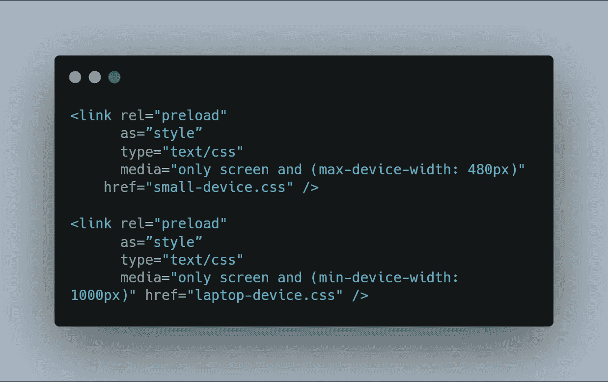

# 提高 CSS 性能的 5 种优化技术

> 原文：<https://javascript.plainenglish.io/5-optimization-techniques-that-will-boost-your-css-performance-c16ad808d32e?source=collection_archive---------4----------------------->

构建突出的前端应用程序

## 1.简单选择器

CSS 选择器在 web 应用程序中被广泛使用，因为 CSS 选择器有助于编写更具描述性的代码，开发人员通常最终会拥有庞大而复杂的代码。编写不必要的 CSS 会影响浏览器解析 CSS 的方式。

例如，在下面给出的 CSS 代码中，你可以观察到选择器有多复杂，如果你允许的话。

在这种情况下，在后台，浏览器从右到左解析**选择器**，从通用**选择器(*)** 开始遍历**主**选择器。然而，由于这个原因，浏览器必须工作几毫秒，但是当这种情况增加时，您将在 web 应用程序中面临许多速度问题。

> 尽可能简单地使用 CSS 选择器和短选择器，如下所示。

*   **选择器**越长，添加到**样式表**中的 ***字节*** 就越多。

## 2.使用动画

我见过很多应用程序提供令人敬畏的用户界面，带有平滑的动画，有很棒的*颜色*和*字体*，但当涉及到网站的整体性能时，它需要时间来加载，这让用户很快就疯了。你不必在每个**滚动效果**、**点击响应**、**复选框**处添加动画。避免使用这类用户不关心的动画。

*   添加更多的动画会导致一个糟糕的产品，而且开发人员不得不编写代码，这对应用程序的性能没有好处。
*   不要用不必要的动画让你的用户不知所措，这会降低他们的浏览器速度。

## 3.@导入语句

永远记住 CSS 是渲染阻塞的，这意味着如果我们获取任何 ***字体*** 或任何其他 ***CSS 文件*** ，浏览器将在继续处理剩余的 CSS 代码之前获取资源。这就是为什么 CSS 中使用的 **import** 语句会降低 web 应用程序的速度，因为必须先下载**字体**。

*   关于 **import** 语句的另一个大问题是，即使您不是开发人员，也可能在 web 应用程序中观察到，当您打开应用程序后，字体会快速切换。这正是 import 语句要对 web 应用程序做的事情。

*   代替使用**导入**语句，建议使用 **HTML** 中的**链接** *标签*来加载字体，这样可以确保在节省双方大量带宽的同时尽快下载字体。

## 4.使用样式

总是尽量减少**样式**的数量，使用过多的样式会毫无理由地减慢你的 web 应用程序，因为用户必须下载他们可能不需要的所有样式表。请注意，每增加一秒钟的等待时间，就会增加用户离开网页的机会。

*   尽量根据不同的设备将**样式**分开，只加载需要的样式。

## 5.使用回退样式

CSS 最大的优点在于它是**防错的，**你不用担心事情会失败。*例如*如果浏览器因为某种原因遇到了它不支持的样式，那么在后台 CSS 会自动使用该**属性**的最后可用**值**。大多数开发人员并没有利用 CSS 的这个特性，您只需要为您不支持的属性提供一个第二值，其余的由 CSS 处理。

*例如*假设您正在使用 **rgba** 添加一些 ***不透明度*** ，这在***Internet Explorer***上是不支持的，作为后备，您可以简单地添加该浏览器支持的**十六进制**值。

 [## 3 个隐藏的 CSS 功能

### 对前端开发人员有用的 CSS 特性

javascript.plainenglish.io](/3-hidden-features-of-css-566e8c27597f)  [## 6 个让你成为前端忍者的用户界面概念

### 使用棒极了的用户界面构建应用程序的基本概念

javascript.plainenglish.io](/6-ui-concepts-that-makes-you-a-frontend-ninja-c6c0a29fa954)  [## 作为前端开发人员，您应该了解 3 种 CSS 特性

### 了解 CSS 鲜为人知的特性

javascript.plainenglish.io](/3-css-features-you-should-know-as-frontend-developer-f1b5536bf179) 

*更内容见于* [*中*](http://plainenglish.io/)