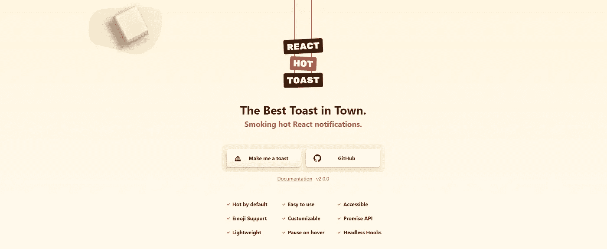
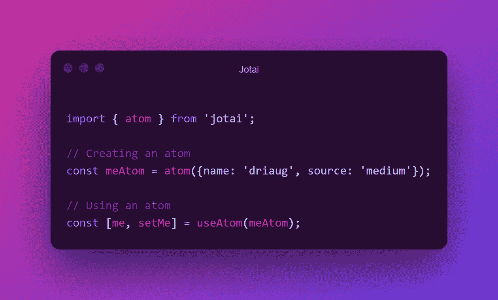
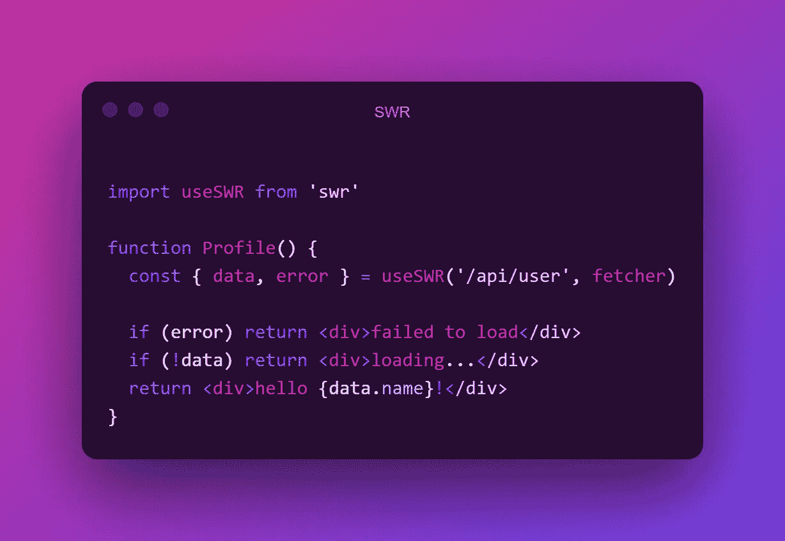

# 每个 React 开发人员必须知道的 5 个包

> 原文：<https://javascript.plainenglish.io/5-packages-every-react-developer-must-know-e06bf1b96514?source=collection_archive---------3----------------------->

好吧，React 是一个我们都喜欢的神奇的图书馆。React 使得创建高性能的用户界面变得非常容易！

如果你想让 React 的使用变得更加简单，那么有很多库可以轻松地添加到你的应用程序中。

今天，我将向大家介绍一下我一直以来最喜欢的 5 款游戏，让我们一起来吧！

Photo by [Jo Jo](https://unsplash.com/@hanness?utm_source=medium&utm_medium=referral) on [Unsplash](https://unsplash.com?utm_source=medium&utm_medium=referral)

# [反应-热-吐司](https://react-hot-toast.com/)

我们都喜欢那些小小的祝酒通知。它们是向用户提供反馈而不干扰应用程序流程的好方法。
React-Hot-Toast 让显示通知变得超级简单。你所需要做的就是在你的应用程序中添加一个烤面包机组件，然后调用任何一个`toast`函数。

Sample code showing how to display a toast

不仅 API 真的很容易使用，而且吐司真的很漂亮，完全可定制，这使得这个库更好！

## 我用反应热吐司做什么？

*   创造镇上最好的祝酒词🤠

# [成帧器动作](https://www.framer.com/motion/)

Framer Motion 是 Framer 团队的一项惊人创造。如果你曾经使用过他们的原型制作工具，你就会知道这些动画有多流畅。这种能力是由 Framer Motion 提供的，它是一个完全开源的动画库！

Framer Motion 的 API 包括许多动画和过渡属性，您可以使用它们来创建平滑的动画！

你知道吗，在我的媒体上已经有一个方便的框架运动教程了？点击这里查看！

## 我用帧运动做什么？

*   平滑动画😎

# [查克拉 UI](https://chakra-ui.com/)

没有模块化组件库，React 库列表就不完整。你可能已经听说过 Bootstrap 或者 Material UI，但是你见过 Chakra 吗？

Chakra UI 有一个永无止境的组件列表。从文本组件、表单输入和覆盖，它们应有尽有！Chakra UI 的一大优势是它的可访问性。所有组件都经过精心制作，符合所有现代标准。

如果你有一点闲钱，你甚至可以试试 [Chakra UI Pro](https://pro.chakra-ui.com/) ，这是一套完整的用标准 Chakra UI 模块创建的预建组件。

## 我用查克拉 UI 做什么？

*   用最少的 CSS 实现漂亮的用户界面💎

# [约泰](https://jotai.pmnd.rs/)

React 中的状态管理是一个很难解决的问题。Jotai 试图用一个简单灵活的 API 来解决这个问题。

用 Jotai 存储你的数据非常简单，看看这个代码样本吧！它向你展示了如何以最简单的方式设置和读取原子。

Code sample showing how to read and write a Jotai atom

Jotai 使用了一个叫做 atoms 的概念，在这个概念中，你可以存储所有你想要的数据。稍后，你可以检索这些原子，并读取或写入其中的数据。

## 我用 Jotai 做什么？

*   简单、原始的状态管理📦

# [SWR](https://swr.vercel.app/)

这个比之前的稍微复杂一点。看看 SWR 的创造者维尔塞尔的解释。

> “SWR”这个名字来源于`stale-while-revalidate`，一种由 [HTTP RFC 5861](https://tools.ietf.org/html/rfc5861) 推广的 HTTP 缓存失效策略。SWR 是一种策略，首先从缓存返回数据(陈旧)，然后发送获取请求(重新验证)，最后是最新的数据。

听起来很复杂，但是相信我，一旦你理解了这个概念，就很容易了。看看这段代码，它可能是我从官方文档中偷来的，也可能不是😉

Code sample showing how to fetch data with SWR

使用 SWR，您指定想要获取的密钥，SWR 将为您管理获取和更新。这样就不会执行重复的提取，因为 SWR 会自动重新验证重复键的数据。超级高效对吧？

## 我用 SWR 做什么？

*   性能数据提取📩

祝你有创意的一天！💗

*更多内容请看*[***plain English . io***](http://plainenglish.io/)