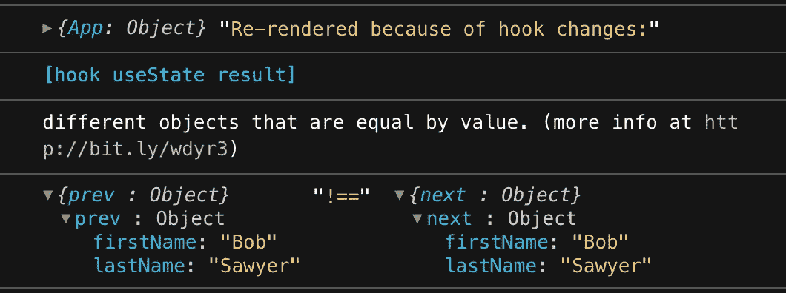
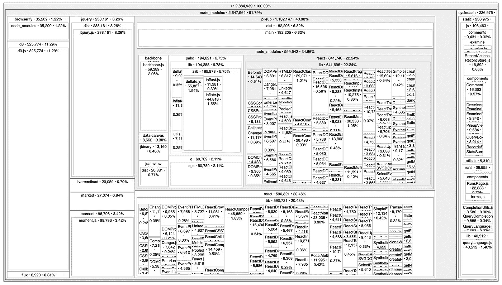
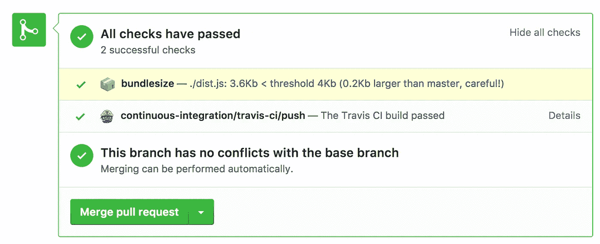

# 在开发过程中优化和加速 React 应用程序的 5 个软件包

> 原文：<https://javascript.plainenglish.io/5-packages-to-optimize-and-speed-up-your-react-app-during-development-51d7e4297d8d?source=collection_archive---------3----------------------->

使用这些包在开发阶段优化您的 React 应用程序，并避免生产过程中出现问题。

Photo by [Ales Nesetril](https://unsplash.com/@alesnesetril?utm_source=unsplash&utm_medium=referral&utm_content=creditCopyText) on [Unsplash](https://unsplash.com/s/photos/laptop?utm_source=unsplash&utm_medium=referral&utm_content=creditCopyText)

由于时间限制和其他因素，我们继续开发应用程序，而不考虑副作用。但有时，一个应用程序会导致现场场景中的重大问题。然后，我们可能需要更新我们的应用程序，有时我们可能需要重建一些模块或进行一些架构级别的更改来解决问题。

我们可以避免在开发过程中产生这样的问题，而不是在生产中处理这样的情况。所以我列出了一些包，可以帮助你在开发过程中发现这样的问题。让我们深入研究一下。

# 1.为什么渲染(6.6K ⭐️)

[Why-do-you-render](https://github.com/welldone-software/why-did-you-render)是一个 React 包，允许你找到潜在的可避免的重渲染。大多数性能问题都是由不必要的重新渲染引起的。如果一个大列表组件多次重新渲染，会让 app 无响应。

为了避免这些问题，我们将使用`pureComponents`或`useMemo`，但在某些情况下，由于状态更新的误用，这些也会重新呈现。我们可以使用**为什么渲染**包来避免这些。它将通知组件重新渲染的时间和原因！

**注意:仅供开发使用！**

查看下图，了解警告消息是如何得到安慰的。

# 2.源地图浏览器(3.3K ⭐️)

[Source Map Explorer](https://github.com/danvk/source-map-explorer) 给出了一个包含每个文件大小的构建视图。它允许知道哪个依赖项在包中占用更大的文件大小。我们可以根据视图优化文件。

**为什么这很重要？**随着应用功能的增加，构建规模也会增加。较大的构建规模将花费更多的时间来构建。我们需要尽可能保持较小的构建规模。使用 Source Map Explorer，我们可以分析构建并优化它。它还支持 Sass 和更少的文件。

**注意:仅供开发使用！**

查看下图。你可以看到文件的大小，所占的百分比。此外，我们可以详细查看每个文件。

# 3.Redux 不可变状态不变量(800+⭐️)

[Redux 不可变状态不变量](https://github.com/leoasis/redux-immutable-state-invariant)是一个 Redux 中间件。它检测 Redux 调度之间和之外的突变。如果您使用 Redux 进行状态管理，您**不应该在 Redux 内部或外部改变状态**。因为**减速器**总是返回一个**新的状态对象**。

改变状态会导致你的应用出现几个问题。为了避免这种情况，我们可以使用 Redux 不可变状态不变中间件。如果状态发生变化，这个包将抛出一个错误。所以我们可以在开发阶段就解决这些问题。

**注意:仅供开发使用！**

# 4.捆绑包大小(4.2K ⭐️)

[捆绑包大小](https://github.com/siddharthkp/bundlesize)可以控制您的捆绑包大小。我们可以在配置文件中配置每个文件的大小。因此，如果大小超过，我们会收到警告。这确保了束尺寸在控制之中。

检查[引导](https://github.com/twbs/bootstrap/blob/main/.bundlewatch.config.json)使用的以下捆绑包大小配置。

您也可以将它添加到 GitHub 中，以便在每次请求 pull 时检查。查看下图。

# 5.音麦(20.7K ⭐️)

改变一个状态会导致更多的问题。为了避免这种情况，我们需要手动克隆每个状态对象，并对其进行变异。我们可以使用 Immer 来代替手动克隆，Immer 将以一种更高效和优化的方式来处理它。 [Immer](https://github.com/immerjs/immer) 更方便的允许状态突变。你也可以使用 Immer 在 [Redux](https://redux.js.org/) 中变异状态。

检查以下代码的 Immer 使用 Redux。

# 资源

[你为什么渲染](https://github.com/welldone-software/why-did-you-render)

[源地图浏览器](https://github.com/danvk/source-map-explorer)

[Redux 不可变状态不变量](https://github.com/leoasis/redux-immutable-state-invariant)

[捆尺寸](https://github.com/siddharthkp/bundlesize)

伊梅尔

# 结论

我们还可以使用 react-devtools 和 redux-devtools 来优化应用程序。我希望你已经发现这是有用的。感谢您的阅读。

## 进一步阅读

 [## 帮助您在 React 中更快开发的 5 种工具和实践

### React 工具、技巧和最佳实践将帮助您更快地构建应用

javascript.plainenglish.io](/5-tools-practices-to-help-you-develop-faster-in-react-b884c1b20fc2) 

*更多内容请看*[***plain English . io***](https://plainenglish.io/)*。报名参加我们的* [***免费周报***](http://newsletter.plainenglish.io/) *。关注我们关于*[***Twitter***](https://twitter.com/inPlainEngHQ)[***LinkedIn***](https://www.linkedin.com/company/inplainenglish/)*[***YouTube***](https://www.youtube.com/channel/UCtipWUghju290NWcn8jhyAw)*[***不和***](https://discord.gg/GtDtUAvyhW) *。***