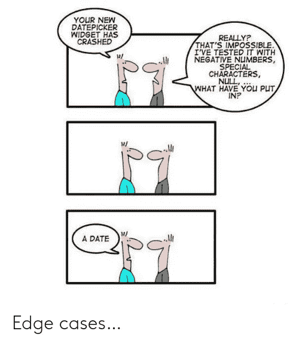
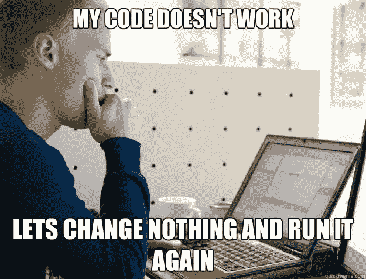
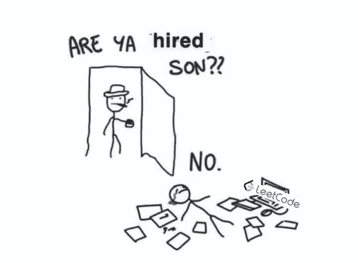
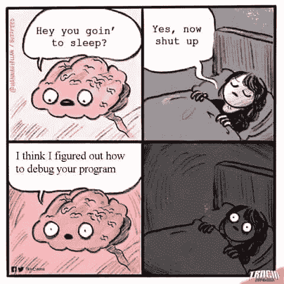

# 互联网上 5 个痛苦相关的编程迷因(2021 年 3 月)

> 原文：<https://javascript.plainenglish.io/5-painfully-relatable-programming-memes-on-the-internet-march-2021-ed1f27591936?source=collection_archive---------9----------------------->

## 经过精心挑选、解释和审查

[https://www.sportskeeda.com/wwe/7-times-fans-turned-wwe-superstars-into-hilarious-memes-and-their-origins/3](https://www.sportskeeda.com/wwe/7-times-fans-turned-wwe-superstars-into-hilarious-memes-and-their-origins/3)

程序员过着只有其他程序员才能真正感同身受的生活。痛苦喜欢有人陪伴，程序员肯定也经历过痛苦。

事不宜迟，我向你展示截至 2021 年 3 月互联网上五个精心挑选的编程迷因。

# 1.边缘案例

[http://www.quickmeme.com/meme/3uaxof](http://www.quickmeme.com/meme/3uaxof)

程序员经常陷入奇怪的边缘情况，只有恶意用户才能接触到，以至于我们错过了明显的情况。这是对编程中经常出现的过度思考的证明，这是一个兔子洞，我已经跌了太多次了。

我经常提醒自己远离我的代码库，尤其是当我和它一起工作了几个月的时候，并且花一些时间让它安定下来。过度分析你的代码是没有成效的，通常最好记住 KISS:

> 简单点，笨蛋。

这里有一条相关的推文。

Twitter / [Brenan Keller](https://medium.com/u/96bd3de7fa96?source=post_page-----ed1f27591936--------------------------------)

测试是所有软件的一个必要方面。QA 或质量保证工程师负责测试软件。

在同一篇 Twitter 帖子中，作者对此做了最好的解释:

> 这基本上是一个关于常见 QA 陷阱的笑话:测试大量疯狂的案例，所有这些案例都与每个人都专注于开发的内容相关，而完全忽略了其他看似明显的用例或场景。

# 2.重新运行代码

[http://www.quickmeme.com/meme/3uaxof](http://www.quickmeme.com/meme/3uaxof)

我这样做有两种情况，通常是出于绝望和沮丧。

第一种是当我真正相信我的代码是正确的时候。代码的重新运行通常以关闭一切并重新启动开始，包括文本编辑器、正在运行的服务器，甚至整个计算机，如果不考虑中断查看代码的话。

第二种情况包括不重启软件、简单的代码运行和一个小小的祈祷，以及盲目相信一个更高的力量会介入。

# 3.被录用了

[https://www.reddit.com/r/ProgrammerHumor/comments/ikeid0/finding_an_entrylevel_job_be_like/](https://www.reddit.com/r/ProgrammerHumor/comments/ikeid0/finding_an_entrylevel_job_be_like/)

像 LeetCode 这样的网站允许开发人员花几天时间研究数百种编码算法，为软件面试做准备。

谷歌等科技公司为这些面试铺平了道路，通常会提出一个问题，观察开发人员如何解决这些问题。

我个人不喜欢这些问题，因为它们经常会忽略开发人员在工作中实际要做的事情。

它类似于 SAT、MCAT 或任何基准测试，因为它旨在为该领域的一般智力建立一个标准。

像克莱门特·米哈伊尔斯库这样的人以培训谷歌面试人员为生。

不幸的是，对许多人来说，无论编程技能如何，要在这些面试中表现出色都需要付出相当大的努力。如果你正在努力，知道你并不孤单！

# 4.不睡觉

[https://www.reddit.com/r/ProgrammerHumor/comments/872kzi/why_developers_dont_sleep/](https://www.reddit.com/r/ProgrammerHumor/comments/872kzi/why_developers_dont_sleep/)

编程往往是一个我们无法强求的过程，有时候问题的解决方案只会下意识的来。这就是史蒂夫·乔布斯经常散步来帮助他进行创造性思考的原因。

潜意识无法控制，不关心你在做什么。有几次，我突然有了一个解决方案的想法，要么写在我的笔记上，要么带着我聪明的新想法半睡半醒地走向我的笔记本电脑。

# 5.生产中的修复

如果您经历过一个产品的开发生命周期，您可能会熟悉一旦产品发布后需要进行的快速修复，以解决主要的 bug。

除非有一个高度复杂的 DevOps 系统，否则这通常会导致一些开发人员对代码进行修改，做一个小小的祈祷，然后将代码直接发布到产品中。

在我自己的小公司里，我开发了一个 SaaS，现在有一千多个用户在使用它，我经常发现自己处于这种情况。我需要快速解决问题，并且经常依赖于对我的解决方案完全不应该有的信心，而不是彻底和正确地测试代码。聪明地工作，而不是努力。

## 结论

感谢您的阅读！如果你喜欢这篇文章，请考虑在 Medium ( [Charlie Levine](https://medium.com/u/6da6b651e31a?source=post_page-----ed1f27591936--------------------------------) )上关注我，获取频繁的编程和技术相关文章。