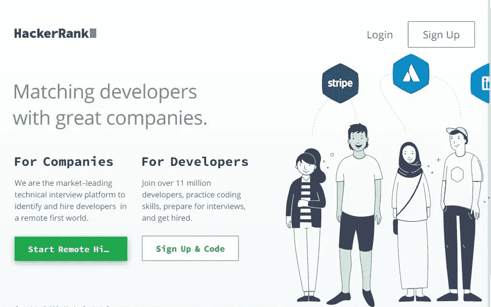
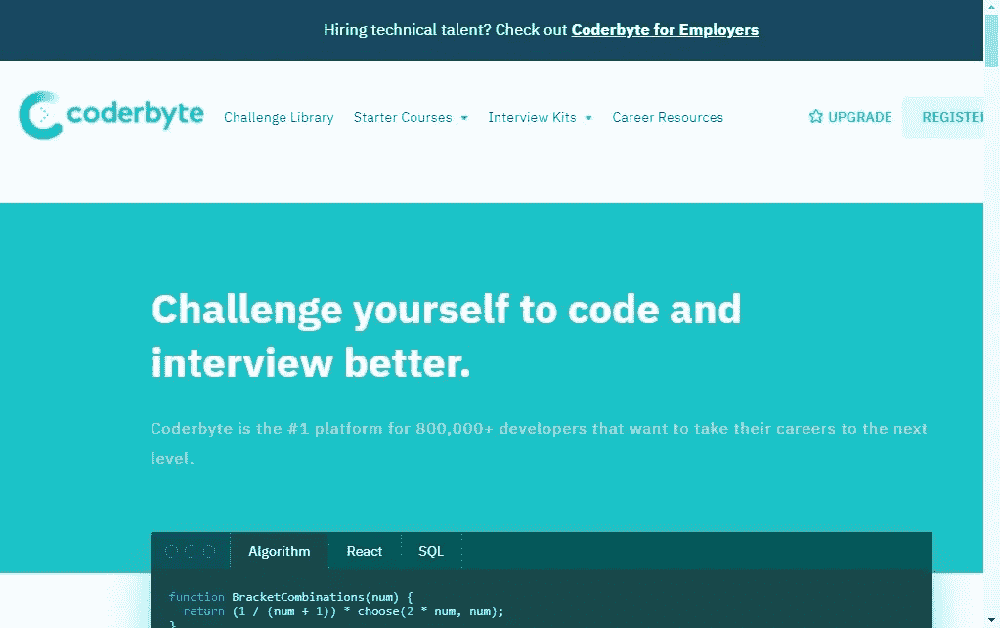
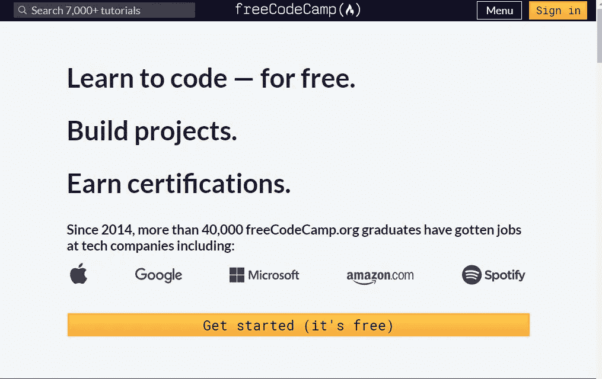
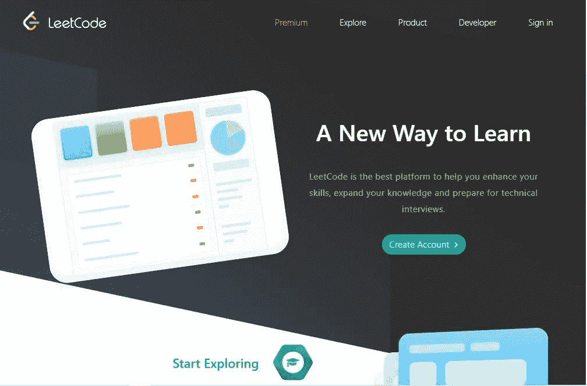

# 学习算法和数据结构的 5 个平台

> 原文：<https://javascript.plainenglish.io/5-platforms-to-learn-algorithms-and-data-structures-3152238de56c?source=collection_archive---------0----------------------->

## 利用这些网站学习数据结构和算法。

Photo by [Lala Azizli](https://unsplash.com/@lazizli?utm_source=medium&utm_medium=referral) on [Unsplash](https://unsplash.com?utm_source=medium&utm_medium=referral)

作为程序员，数据结构和算法是一些最基本和最重要的概念。

更好地理解算法是成为更好的程序员和解决问题专家的关键。算法对于让我们像程序员一样思考至关重要。这更像是给我们的大脑做俯卧撑运动。这也是理解我们的代码如何在幕后工作的关键。它让我们写出能够解决问题的好代码。

在本文中，我们将查看一些可以免费学习数据结构和算法的网站资源。

## **1。黑客排名**

Hackerrank

HackerRank 是最受欢迎的学习算法和数据结构的网站之一。它提供的课程非常用户友好，甚至可以容纳初学者。

最重要的是，它被许多公司用来评估候选人的面试过程。

大多数公司在入职系统和面试中使用它来访问开发人员。

使用这个 [**链接**](https://www.hackerrank.com) 查看平台

## **2。算法专家**

Algo expert

AlgoExpert 也是学习算法和数据结构的最佳平台之一。他们的问题在为初学者和关于计算机科学的各种主题的专家提供初学者友好的问题方面是至关重要的。

使用此 [**链接**](https://www.algoexpert.io/product) 查看网站

## **3。代码字节**

Coderbyte

Coderbyte 是一个为技术和非技术编程面试做准备的平台。许多公司使用 Coderbyte 来访问开发人员有关他们相关职位的各种主题。

它还提供关于学习数据结构和算法的免费课程。

使用此 [**链接访问 Coderbyte 平台。**](https://coderbyte.com)

## **4。免费代码营**

Freecodecamp

Freecodecamp 是最好的免费学习编程的在线平台之一。他们的课程非常有序，对初学者也很友好。

他们的算法和数据结构课程是带你了解编程基础的最好课程之一。

同样，它也提供各种课程的评估测试。许多开发者推荐它的课程，因为它是最受欢迎的免费学习编程的平台之一。你只需要奉献精神和意志力来完成课程。

查看 freeCodeCamp 网站 [**这里。**](https://www.freecodecamp.org)

## **5。LeetCode**

Leet code

LeetCode 是帮助你提升技能、拓展知识面、准备技术面试的最佳平台。

LeetCode 为各种编程语言提供了问题。当准备技术面试和磨练你的数据结构和算法时，这个平台是最好的。

使用此 [**链接查看 LeetCode。**](https://leetcode.com)

## **出发前**

简单回顾一下，我们已经看到了一些最有用的学习算法和数据结构的平台。这些网站将提高你使用代码解决问题的技能。

感谢您阅读本文到目前为止；希望对你有帮助。请在评论区告诉我，不要犹豫分享。

## **更多阅读:**

 [## 启动 Vue.js 开发之旅的 5 个有用资源

### 利用这些资源掌握 Vue.js。

javascript.plainenglish.io](/5-useful-resources-to-kick-start-your-vue-js-development-journey-98336b8dcb8f)  [## 每个前端开发人员需要知道的 3 个设计概念

### 面向每个前端开发人员的设计理念。

javascript.plainenglish.io](/3-design-concepts-every-front-end-developer-needs-to-know-fccb072e675c) 

*更多内容请看*[*plain English . io*](http://plainenglish.io/)