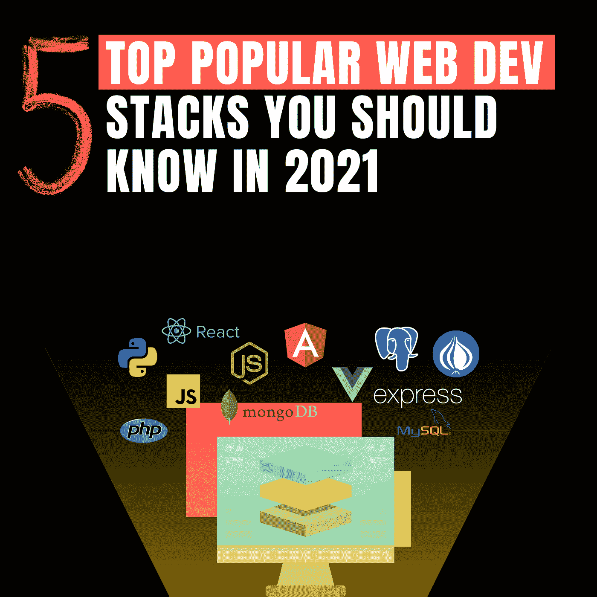
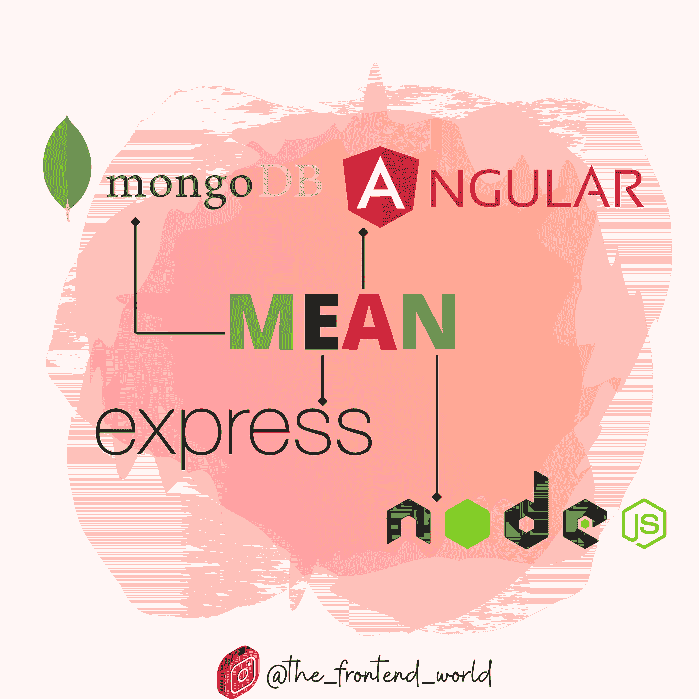
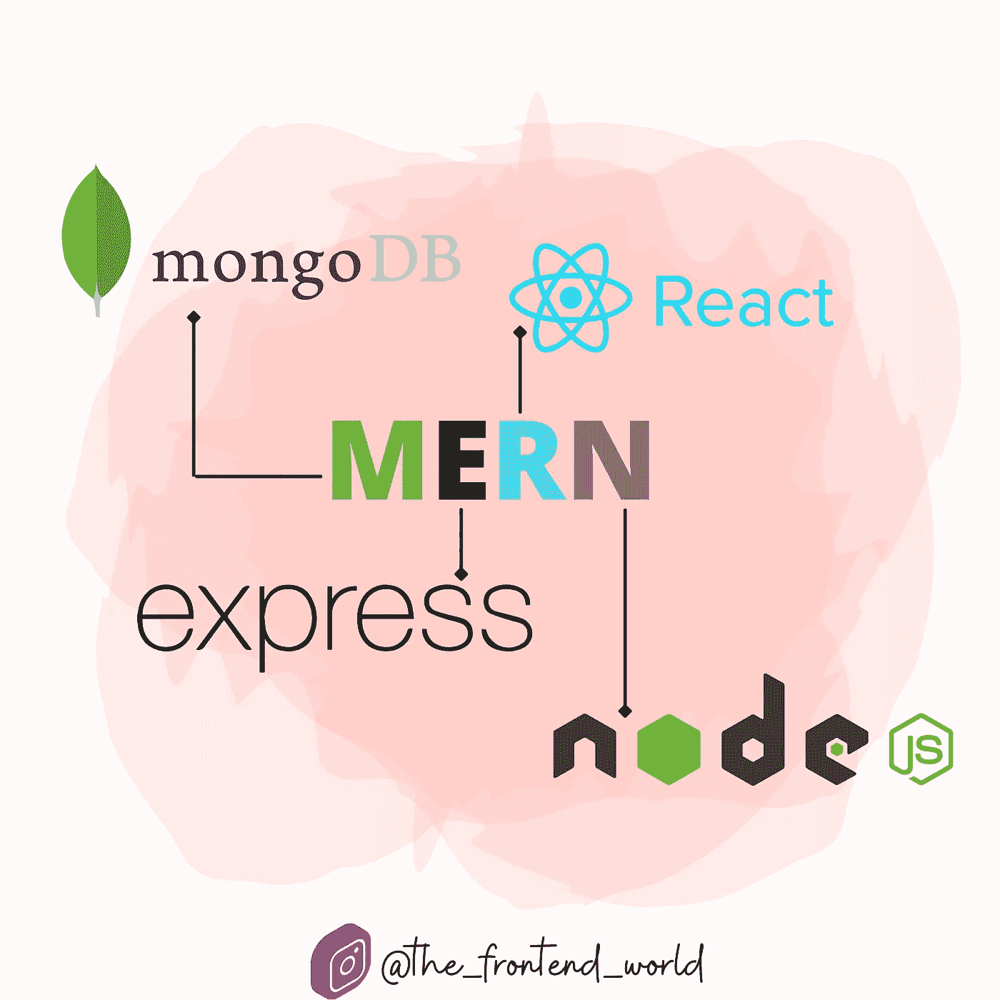
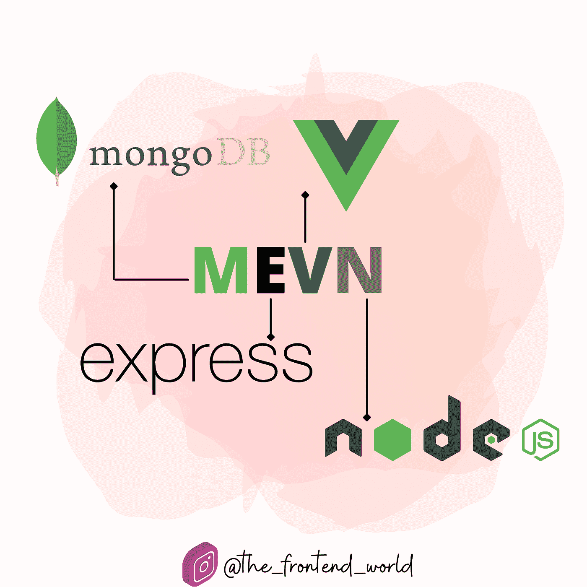
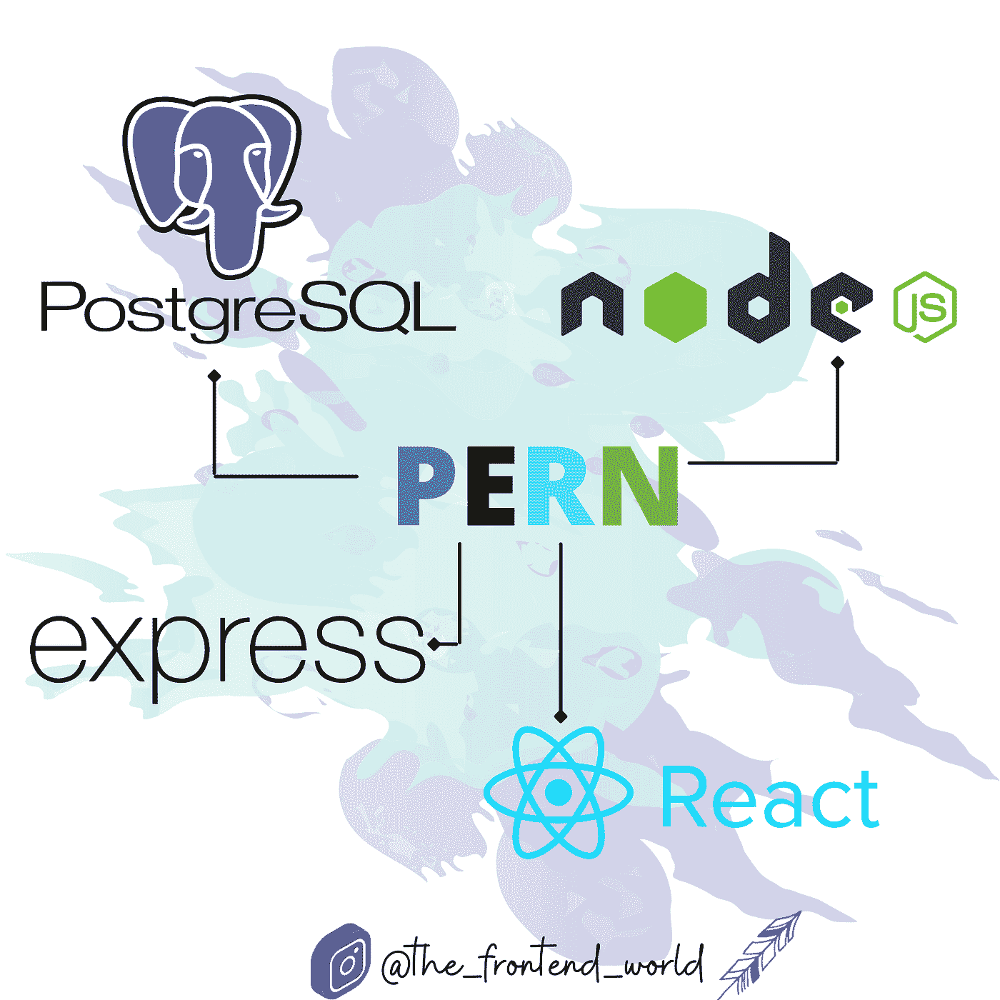
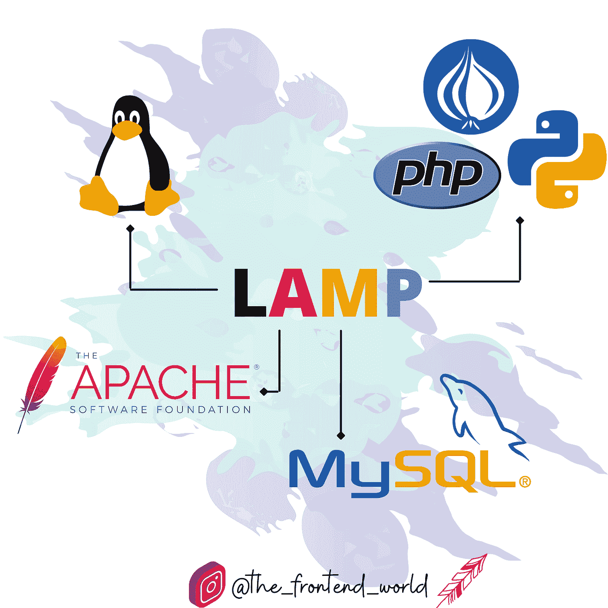

# 2021 年你应该知道的 5 个流行的 Web 开发栈

> 原文：<https://javascript.plainenglish.io/5-popular-web-development-stacks-you-should-know-in-2021-1147f719a0d5?source=collection_archive---------0----------------------->

## 发现最受欢迎的 web 开发堆栈

By @the_frontend_world

嗨！

你是网页开发者吗？您使用最多的堆栈是什么？如果你想知道 2021 年最流行的书库是什么，这篇文章就是为你准备的！

本文涵盖了开发人员中最流行的 5 个堆栈。

# #1-平均堆栈

> MEAN 是一个免费的开源 JavaScript 软件栈，用于构建动态网站和 web 应用程序。因为 MEAN stack 的所有组件都支持用 JavaScript 编写的程序。
> 
> MEAN 应用程序的最大优势在于，它们可以用一种语言编写，既适用于服务器端，也适用于客户端。

MEAN Stack

## 前端:

*   有角的
*   以打字打的文件

## 后端:

*   表达
*   节点. js

## 数据库:

*   MongoDB

# 第二名- MERN 堆栈

> MERN 是[MEAN stack](https://en.m.wikipedia.org/wiki/MEAN_(solution_stack))(MongoDB Express Angular Node)的几个变种之一，其中传统的 Angular 前端框架被 React JS 取代。

MERN Stack

## 前端:

*   反应
*   JavaScript 或类型脚本

## 后端:

*   表达
*   节点. js

## 数据库:

*   MongoDB

# #3- MEVN 堆栈

> MEAN Stack 的其他变体，MEVN Stack (MongoDB，Express，Vue，Node)，以及任何前端 JavaScript 框架都可以工作。

MEVN Stack

## 前端:

*   某视频剪辑软件
*   JavaScript 或类型脚本

## 后端:

*   表达
*   节点. js

## 数据库:

*   MongoDB

# #4-永久堆栈

这个栈由 PostgreSQL、Express、React 和 Node.js 组成，结合这些技术，您也可以构建一个具有 CRUD 操作的全栈 web 应用程序。

PERN Stack

## 前端:

*   反应
*   JavaScript 或类型脚本

## 后端:

*   表达
*   节点. js

## 数据库:

*   一种数据库系统

# #5-灯组

> **LAMP** ( **L** inux， **A** pache， **M** ySQL，**P**HP/**P**erl/**P**ython)是一个[首字母缩略词](https://en.wikipedia.org/wiki/Acronym)，表示许多 web 最流行的[应用](https://en.wikipedia.org/wiki/Web_application)最常见的[解决方案堆栈](https://en.wikipedia.org/wiki/Solution_stack)之一。
> 
> LAMP 现在指的是一种通用软件栈模型，其组件在很大程度上是可互换的。

LAMP Stack

## 网站开发

*   PHP/ Python/ Perl
*   街头流氓
*   Linux 操作系统

## 数据库:

*   关系型数据库

Express 和 Node 构成了中间层(应用程序层)。Express.js 是一个服务器端的 web 框架，Node.js 是流行且强大的 JavaScript 服务器平台。无论您选择哪种变体，ME(RVA)N 都是使用 JavaScript 和 JSON 的理想方法。

# 最后的想法…

如果你注意到，所有这些堆栈之间有一个共同点。都是 JavaScript 栈。这种语言是当今 web 应用程序中最流行和使用最多的语言。如果你想开始 web 开发，你需要开始学习这种语言和 web 基础知识，如 HTML 和 CSS。

你用过哪些栈，哪一个是你的最爱？在我的例子中，我使用了#1、#2 和#3。我的最爱？这取决于我正在构建的应用程序。如果是为了我的博客和[网站](http://www.fam-front.com/)，那么我会保持 **MERN** 的原样。如果是大型企业应用，我宁愿选择**的意思是**。

你呢？你最喜欢哪一叠？请和我们分享一下你之前的经历和观点！❤

By @the_frontend_world

亲爱的读者，我希望这是明确和有用的。我希望你和你的家人无论在哪里都平安无事！坚持住。明天会更好！

**让我们联系一下** [**中**](https://medium.com/@famzil/)**[**Linkedin**](https://www.linkedin.com/in/fatima-amzil-9031ba95/)**[**脸书**](https://www.facebook.com/The-Front-End-World)**[**insta gram**](https://www.instagram.com/the_frontend_world/)**[**Youtube**](https://www.youtube.com/channel/UCaxr-f9r6P1u7Y7SKFHi12g)**或**********

****[www.fam-front.com](http://www.fam-front.com/)****

*****更多内容请看*[*plain English . io*](http://plainenglish.io/)****