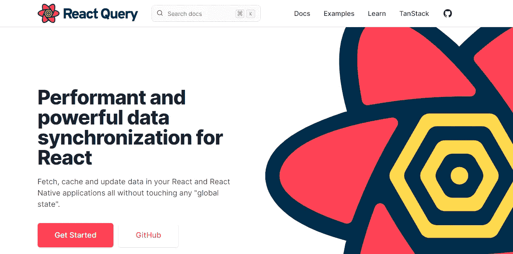
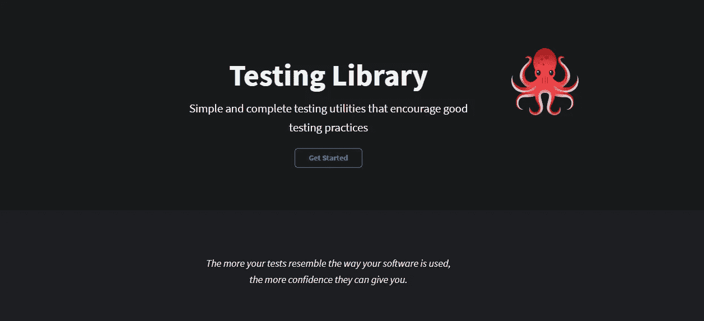

# 您可以在 2021 年使用的 5 个强大的 React 库

> 原文：<https://javascript.plainenglish.io/5-powerful-react-libraries-that-you-can-use-in-2021-496b975c7bef?source=collection_archive---------4----------------------->

## React 库使开发应用程序变得更加容易

Photo by [Luke Peters](https://unsplash.com/@lukepeters?utm_source=medium&utm_medium=referral) on [Unsplash](https://unsplash.com?utm_source=medium&utm_medium=referral)

毫无疑问，ReactJS 是一个非常强大的 JavaScript 库，用于构建用户界面和前端 web 应用程序。很多开发人员喜欢它，它的需求量很大，尤其是当涉及到前端开发工作时。

React 库的伟大之处在于它就像一个框架。React 生态系统附带了许多有用的包和库，我们可以在 React 应用程序中使用它们，以便拥有框架的所有功能。因此，作为 React 开发人员，您可以使用许多库来简化开发过程。

在本文中，我将向您提供一些有用且强大的库，您可以在 2021 年作为 React 开发人员使用这些库。让我们开始吧。

# 1.反应查询

[React Query](https://react-query.tanstack.com/) 是一个非常有用的 React 库，用于数据获取。这个库为您提供了一种在 React 应用程序中获取、缓存、同步和更新服务器状态的简单方法。

你可以查看他们的[文档](https://react-query.tanstack.com/overview)来获得更多关于这个库的信息。

Capture by the author from [React Query](https://react-query.tanstack.com/).

# 2.祖斯坦德

[Zustand](https://github.com/pmndrs/zustand) 是一个伟大而快速的国家管理库。这个库的伟大之处在于，你可以用对象创建你的状态，也可以创建函数来更新那个状态。除此之外，这个库还提供了一个钩子，可以用来访问数据。

Zustand 在 GitHub 上有近 200 万次下载和超过 8000 颗星。绝对值得一试。

Capture by the author from [Zustand](https://github.com/pmndrs/zustand).

# 3.测试库

测试库是最好的工具，它为 React 应用程序中良好的测试实践提供了简单的测试工具。它给你信心，因为它帮助你写可维护和可读的测试。查看他们的网站了解更多信息。

Capture by the author from [Testing Library](https://testing-library.com/).

# 4.蚂蚁设计

[Ant Design](https://ant.design/) 是一个设计系统，作为材质 UI 的替代。它提供了您需要的所有组件。你可以很容易地用它来构建丰富的用户界面。

查看[文档](https://ant.design/docs/react/introduce)获取更多信息。

Capture by the author from [Ant Design](https://ant.design/).

# 5.反应挂钩形式

React Hook Form 是一个非常有用和简单的 React 库，用于处理表单验证。在我看来快多了，好用多了。如果你还没有用过，我会一直建议你试一试。

Capture by the author from [React Hook Form](https://react-hook-form.com/).

# 结论

如你所见，所有这些 React 库都非常强大且易于使用。它们非常有用，在开发 React 应用程序时帮助很大。

感谢您阅读这篇文章。希望你觉得有用。

**更多阅读**

 [## 你应该知道的最好的 JavaScript ES2019 方法

### 通过示例了解一些有用的 ES2019 方法。

javascript.plainenglish.io](/best-javascript-es2019-methods-that-you-should-know-380cf370c5)  [## 6 个对所有 Web 开发者有用的 GitHub 库

### 每个 web 开发人员都应该知道的令人敬畏的 GitHub 库。

javascript .平原英语. I](/6-useful-github-repositories-for-all-web-developers-44f26912fd66) 

*更多内容尽在*[***plain English . io***](http://plainenglish.io)