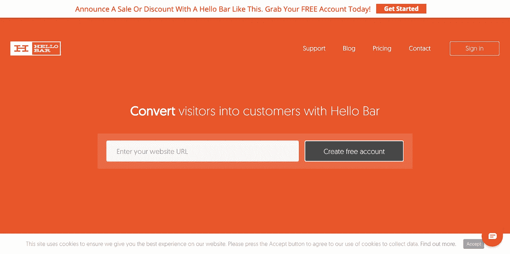
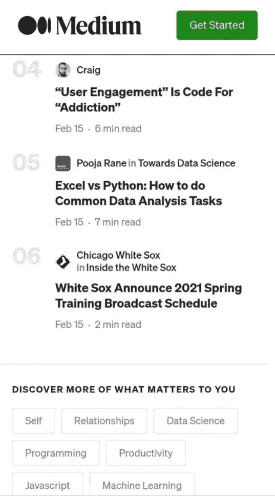

# 极简主义中有用的 UX 设计的 5 个原则

> 原文：<https://javascript.plainenglish.io/5-principles-of-useful-ux-design-in-minimalism-5a88d18ef309?source=collection_archive---------15----------------------->

## 这将有助于使界面不仅美观而且有用。

从设计师在工作中使用的规则中，我收集了几个基本的 UX 原则，它们将有助于使界面美观和有用——帮助用户解决他们的问题。

极简界面的本质是它们应该只包含支持用户任务的必要元素。好的设计应该通过页面上足够多的元素来争取最大的有用性和可用性。

如果过度清理空间，可能会出现问题:

*   用户的工作缺少一些重要的元素。没有提示和解释，不清楚点哪里，会给出什么；
*   网站看起来很空，与公司的品牌无关，没有唤起必要的联想，也没有被记住。

另一方面是，当网站管理员试图预测所有可能的情况，并用最有可能不需要的信息塞满网站。这也导致了一些问题:

*   你需要的物品更难找到；
*   按钮、脚注和解释的多个副本出现，这应该有所帮助，但会使他们研究很长时间并感到烦恼。

这里有一个例子:

HelloBar 的主页在视觉上非常简约，但主页缺乏关于该公司做什么或用户可以使用什么功能的信息。这是极简主义但并不实用，虽然看起来很时尚。

遵循这些视觉设计原则有助于抓住用户的注意力，提高网站的可用性。

# 1.更少的视觉“噪音”

元素必须传递“信号”，也就是说，它们必须是有用的。它们是快捷方式和指针的用户指南，需要解释的元素的描述中的简单语言，以及直观显示对象的清晰图像。

最大限度地减少“噪音”——包含最少信息内容的元素。这些都是没有意义的图片，无关的信息，没有解释的专业术语，任何只打算用来装饰的东西。

有些信息和功能可以不立即显示，而是根据需要显示，以免屏幕上出现过多细节。

# 2.规模:最重要的元素是最大的

最重要的设计元素比不太重要的元素要大。原因很简单——大的东西更容易被注意到，所以首先，他们看最大最亮的。为了视觉上的愉悦，通常不超过三种不同的尺寸。

选择优先对象，使它们比其他对象更明显。在产品信息页面上，了解用户如何做出决定非常重要:

*   衣服，室内物品，食物，其他由外表选择的东西——图片更重要。
*   零件、设备、仪器——物体在外观上差别不大；主要特征值得强调。
*   编程课程，应用，为工作服务，无形的功能和内容很重要，截图证实。

# 3.视觉层次

视觉层次的原则是按照重要性的顺序将用户的眼睛引导到网站的元素上。一般的经验法则是在设计中包含小型、中型和大型组件。

这是通过比例、颜色、对象间距、位置和各种其他线索的变化来实现的。例如，为了创建一个清晰的视觉层次，使用 2-3 种字体大小来告诉用户哪些内容更重要。或者用透明色和鲜艳的颜色来强调。

例如，在中型文章网站上，在品牌和订阅按钮之后，文章标题优先，然后是来源，然后是出版日期和其他信息。

在同一段中，我将提到邻近理论——元素的位置越近，它们之间的联系就越强。在它的帮助下，您可以组合相互依赖的元素，或者在元素放置不正确的情况下打破这种关系。

# 4.平衡——物体的均匀排列

平衡原则指的是页面上设计元素的排列。当视觉提示在页面上均匀分布时，平衡就出现了，在屏幕中间的一个假想的垂直轴或者有时是水平轴的两边。这个不一定对称。

重要的是屏幕一侧的元素数量以及它们所占的面积。一边是小的 UI 元素，另一边是大的 UI 元素，让设计不平衡。

一个假想的轴——一条划分屏幕的线——将有助于理解页面上是否有平衡。余额可以是:

*   对称:元素围绕一个中心虚轴对称排列。
*   不对称:元素不对称排列，传达动态。
*   径向:特征从中心公共点沿圆形方向辐射。

# 5.对比将帮助你比较和传达差异

颜色常用于此。例如，在界面中通常使用红色来表示删除。明亮的颜色表示红色元素不同于其他元素。

通常，界面使用降低文本相对于背景对比度的技术，而不是突出最不重要的文本。但是有降低对比度太多的风险，以至于不可读。

# 情人眼里出西施。

有些视觉效果大家普遍接受，读的也差不多。但是也有不同的颜色，比如白色，我们在婚礼上选择它作为礼服，在印度则是在葬礼上。与一个受众相关的信息可能与另一个受众不相关；另一个人会批评某个群体中的时尚或有趣的东西。

这意味着你必须很好地了解你的受众，并创造一个会被你优先考虑的人所欣赏的产品。做好每个人都不喜欢你的准备也没关系。

看一个具有美学设计的网站是令人愉快的，但主要的事情仍然是受益——设计对完成网站上的任务有多大的帮助。清除网站上无意义的修饰，留下有用的也可以是美丽的元素。文章中的提示将有助于使它们变得美丽和谐。

*更多内容尽在*[*plain English . io*](http://plainenglish.io/)