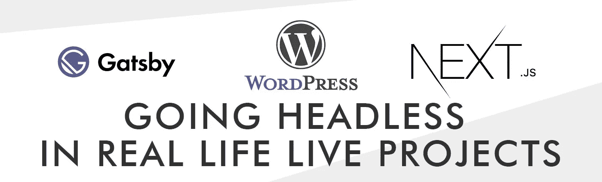

# 在 Live WordPress 项目中切换到无头 CMS 时出现的问题

> 原文：<https://javascript.plainenglish.io/5-problem-tou-will-face-when-switching-to-headless-wordpress-20e8fb7d7005?source=collection_archive---------10----------------------->



大多数关于无头 WordPress(以及一般的无头 CMS)的教程和文章都会引导你完成设置的基础，几乎从一个全新的 CMS 安装开始，有一些基本的文章和页面。但是当你开始做一个真正的项目时会发生什么呢？

在我们的最新项目中，一个客户(根据我们的建议)想从一个单一的 WordPress 转换到一个无头的 React 前端。他们经营着一家杂志——自 2012 年以来一直在线——有数千篇已经发表的文章，他们在搜索引擎优化方面很有名气，他们有一群作者不能(或不想)学习新的编辑界面或新的编辑指南，他们想提高网站的性能，但仍然保持实际的(单一的)界面(有一些改进)，他们想无缝迁移分析(他们用谷歌标签管理器处理高级分析)和广告(他们的主要收入渠道)。

这是一大堆你在网上找到的指南中通常没有考虑到的要求，这些指南通常解释了如何连接到 CMS，获取内容，以及生成一个静态网站(使用框架)。

当我们开始制定项目时，我们就开始着手解决问题，做出决定，并指明方向。我们决定列出我们发现的 5 个主要问题以及我们如何解决它们，记住我们提供的解决方案实际上是依赖于项目的，可能有数百种方法来解决这些问题。

# 1.选择框架

这是我们的第一项任务，它将指导我们所有其他的决定，所以在决定之前，您应该非常清楚接下来会发生什么，如果所选择的框架将与所有东西兼容，等等。

假设我们在 reaction 工作，并且我们精通[](https://www.gatsbyjs.com/)****和 [**Next**](https://nextjs.org/) 这两个被认为是从 CMS 构建静态网站的标准，我们必须在这两者之间做出选择。****

****盖茨比为几乎所有人提供了一个广泛的插件(我们真的很喜欢新的[盖茨比插件图像](https://www.gatsbyjs.com/plugins/gatsby-plugin-image))，而 Next 有一个更窄的生态系统，但是我们认为在构建什么和什么时候构建方面更灵活(一个稍后会出现的问题)，我们真的很喜欢 [*动态路由*](https://nextjs.org/docs/routing/dynamic-routes) 处理(另一个即将出现的问题)。****

****因此，我们决定牺牲很多很酷的前端功能(包括图像处理和页面转换)，专注于后端和构建的性能和灵活性，出于这些原因，我们选择了 Next.js****

# ******2。决定构建什么和何时构建******

****我们选择 Next 最有价值的特性之一是增量静态再生，即不仅在构建时，而且在运行时创建静态页面并在运行时重新生成它们的能力。****

****由于该网站已经填充了超过 3000 篇文章，每天都有文章添加和修改，我们认为完整的构建(即使后续的构建是增量的)将花费太多时间(并且可能永远不会成功)。****

****所以我们选择了这样的构建模式:****

*   ****我们在构建时生成主页，主页中链接的所有文章(大约 20 篇)，每个类别档案的前两页(我们有 3 个类别，每个档案页面有 24 篇文章)。****
*   ****我们还列出了访问量最大(最老)的页面；所以，最多，在构建时，我们生成不到 200 个静态页面；****
*   ****当用户请求时，其余的页面在运行时被构建和服务器化。在最后一种情况下，我们使用了 true 的后备策略。请注意，一旦页面根据要求生成，所有未来的请求都将是生成的内容。****
*   ****我们还计划增加构建时生成的页面数量(根据测试，我们可以在一分钟的构建时间内生成大约 800 页)，并实施*重新验证*政策，以提高效率，避免在新帖子上进行重建。****

# ****3.永久链接****

****当从一个平台移动到另一个平台时，永久链接是另一个重要方面。如果处理不当，人们会失去他们的书签，但更糟糕的搜索引擎优化可以被摧毁。处理永久链接通常有两种方法:简单的一种是建立一个新的舒适的永久链接结构并创建一个重定向地图(这需要非常精确),而(可能)困难的一种是在新网站上镜像永久链接结构。****

****当然，我们选择了更难的一个，因为我们认为依赖重定向结构来处理大量的页面太冒险了，而且我们发现这个解决方案更加优雅。****

****做出决定后，我们对当前的永久链接结构进行了布局，大致如下:****

*   ****[*https://www.oursite.com/*](https://www.oursite.com/)>首页****
*   ****[*https://www.oursite.com/*](https://www.oursite.com/)*我的范畴* >第一页的范畴档案****
*   ****[*https://www.oursite.com/*](https://www.oursite.com/)*my category/page/2*>第二页类目档案****
*   ****[](https://www.oursite.com/)**my category/article-title*>单篇文章*****
*   *****[](https://www.oursite.com/)**my category/subcategory*>子类别档案首页(与其他档案和文章页面的类别结构相同******
*   ******[](https://www.oursite.com/)**作者/* >存档作者*******
*   ******[【https://www.oursite.com/】](https://www.oursite.com/)*作者/作者姓名* >作者页面******

******在 Next.js 中，动态路由用文件夹和文件的特殊名称(在方括号中)来处理，如:`blog/[page].js`。******

******但是由于类别档案和单篇文章在同一个文件夹下，这将导致路径冲突。为了解决这个问题，我们使用 WordPress 路由思想来处理这个结构，并且我们还利用了 Next 动态路由的一个不太为人所知的功能:可选的捕获所有路由。******

******我们在页面文件夹中创建了以下路径/文件结构:******

```
****pages/[category]/[[...slug]].js****
```

******文件名前的三个点是 catch all 扩展名，带有双方括号，使其可选，以便路径与几乎任何参数组合相匹配，如:******

```
****/magazine/
/magazine/article-title
/magazine/food/article-title
/magazine/page/2
...
and so on****
```

******此时，所有的路由逻辑都放置在`[[..slug]].js`页面组件内部；根据收到的参数，我们能够决定执行哪个查询，并将结果传递给适当的组件(我们为归档创建了一个组件，为单个页面创建了一组组件，基于类别等等)。其他页面(如 about、contact 等)很简单，因为它们有自己的页面模板。******

# ******4.内容处理******

******尽管许多指南使这个任务变得简单，但是一旦你加载了你的内容，你不能简单地把它放在一个 div 中，就像这样:******

```
****<div dangerouslySetInnerHTML={{ __html: post.content}} />;****
```

******仅仅是因为它不会像你预期的那样工作，在 99%的情况下，内容被保存以与 WordPress 模板一起工作，它是用 Gutenberg 编写的，依赖于 WordPress CSS(用于样式)，有时依赖于 WordPress JavaScript(例如，如果有图像曾经点击打开一个 lightbox)。我们发现这个任务是最耗时和最复杂的，我们尝试了不同的方法才最终确定下来。******

******一开始，我们认为从 WordPress 中抓取 CSS 并将其添加到 React 中是可行的，而且几乎可行，但我们最终得到了一个“肮脏”的 CSS，需要进行许多调整才能按预期工作，此外，许多功能都丢失了(例如视频嵌入或文章内广告)，有时格式也会变得奇怪。******

******所以我们停了一会儿，我们也放弃了修改帖子以使它们在我们的界面中工作的想法(它们太多了，而且编辑者也需要对新格式进行培训)，我们开始分析一堆随机的帖子以寻找模式，事实上，我们发现了一个模式，大多数(如果不是全部)帖子基本上是由文本组成的(包含在`<p>`标签中)， 在文本之间有古腾堡画廊区块(在`<figure>`标签中),点击后图片在 lightbox 上打开，有时是视频嵌入(仍在`<figure>`标签中),在第二个`<p>`之后是广告。******

******我们分析的所有帖子都遵循这个模式:******

```
****<p>Some text</p>
  <p>Some more text</p>
 <figure class=...">
     <ul class="...">
       <li class="...">
         <figure>
           <a href="..">
             
           </a>
         </figure>
       </li>
       ...      
       <li class="...">
         <figure>
           <a href="..">
             
           </a>
         </figure>
      </li>
     </ul>
  </figure>
  <p>More text</p>
  <figure>....</figure>
  <p>And so on</p>****
```

******所以我们决定“分解”这个 HTML，转换成一个对象，并把它放回 JSX。我们使用了 [xmldom](https://www.npmjs.com/package/xmldom) 来完成这项任务，它是 dom 的 JavaScript 实现，支持 React 应用程序中的 DOMParser 接口:******

```
****const { DOMParser } = require('xmldom');let parser = new DOMParser();let doc = parser.parseFromString(post.content, 'text/html');****
```

******此时，我们遍历文档，访问节点，并将结果放入将构建我们的对象的数组中，获得如下内容:******

```
****[{type:'p', content:'Some text'}, {type:'gallery' content:['img_1_url', 'img_2_url', ...]}, ... ]****
```

******然后在我们的 JSX 中，我们可以映射得到的数组，根据数组的类型，我们可以有条件地呈现一个文本、一个图库(这是我们遗憾没有像 Gatsby 那样强大的图像插件的地方)、一个视频或一个 adv 单元；所有这些使我们的 CSS 保持整洁。******

******正如您可能理解的那样，完成这项工作没有单一的方法，它几乎取决于内容的外观、可以牺牲多少功能等等；请在参与这种任务之前做一个深入的分析，许多编辑使用 Gutenberg 块，这可能是一个痛苦的转换，或者得到了一些他们不想丢失的格式等等。******

# ******5.整合谷歌服务******

******接下来提供一个[定制文档实现](https://nextjs.org/docs/advanced-features/custom-document)，这对于在`<header>`和整个网站中包含脚本非常有用。对于广告，我们在`<header>`中包含了提供的谷歌脚本:******

```
****<script async src="https://pagead2.googlesyndication.com/pagead/js/adsbygoogle.js?client=ca-pub-XXXXX" crossorigin="anonymous"></script>****
```

******然后，我们创建了几个广告组件(一个用于文章，一个用于标题横幅，等等),放在广告单元应该出现的地方，例如:******

```
****import React, { useEffect } from "react";

const inArticle= () => {
  useEffect(() => {
    try {
      (window.adsbygoogle = window.adsbygoogle || []).push({});
    }
  }, []); //this part is usally in script on the provided coded

  return (
  <ins className="adsbygoogle"
     style={{display:"block", textAlign:"center"}}
     data-ad-layout="in-article"
     data-ad-format="fluid"
     data-ad-client="ca-pub-XXXXX"
     data-ad-slot="xxxx">
  </ins>
  );
};

export default inArticle;****
```

******如果你在本地主机上开发，广告不会出现。******

******标签管理器的工作方式几乎相同，通过向 **_document.js** 添加代码，他们提供了两个代码片段，一个在`<header>`之后，一个在`<body>`之后，我们将这样插入代码:******

```
****<script dangerouslySetInnerHTML={{ __html: `(function(w,d,s,l,i){w[l]=w[l]||[];w[l].push({'gtm.start':
new Date().getTime(),event:'gtm.js'});var f=d.getElementsByTagName(s)[0],
j=d.createElement(s),dl=l!='dataLayer'?'&l='+l:'';j.async=true;j.src='https://www.googletagmanager.com/gtm.js?id='+i+dl;f.parentNode.insertBefore(j,f);
})(window,document,'script','dataLayer','GTM-YOURCODE');`}}></script>****
```

******并且:******

```
****<noscript dangerouslySetInnerHTML={{ __html: `<frame src="https://www.googletagmanager.com/ns.html?id=GTM-YOURCODE"
height="0" width="0" style="display:none;visibility:hidden"></iframe>`}}></noscript>****
```

******使用标签管理器进行测试对于检查一切是否正常非常有用，我们发现使用“所有页面”作为 Google Analytics 的激活器并不总是正常工作，所以我们使用“历史更改”来更改“所有页面”,并且我们能够跟踪访问。******

# ******其他需要考虑的事情******

******在一个大规模的真实项目中工作与在一个测试/指导环境中工作是不同的，有许多变量需要跟踪，许多问题需要解决，还有一堆东西需要艰难地学习。通常，已发布的 CMS 使用插件来实现不应该丢失的功能(例如共享插件、图库、滑块)，有时你会发现一些现成的 npm 模块可以完成这项工作，有时编写自己的模块和组件最有效。******

******无论如何，迁移到一个分离的发布系统确实提高了性能和安全性，有时您可以用它来换取一些奇特的前端功能。******

*******更多内容尽在*[***plain English . io***](http://plainenglish.io)******