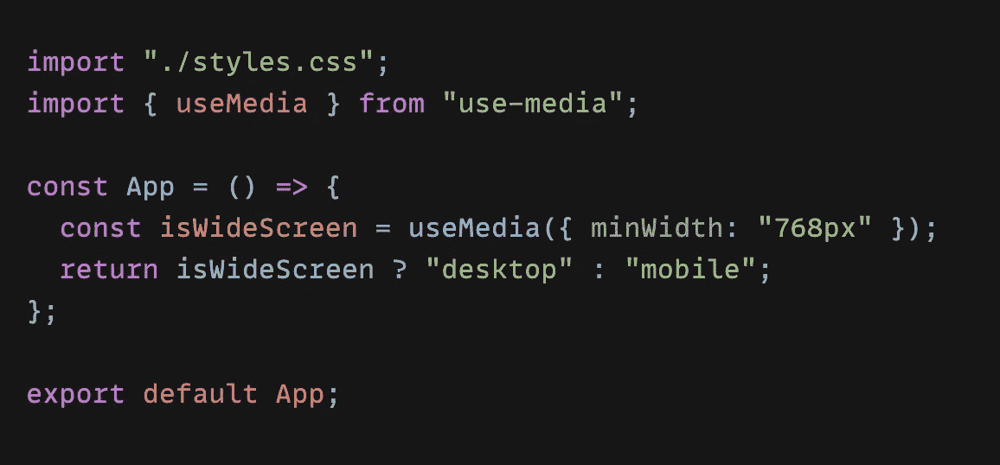
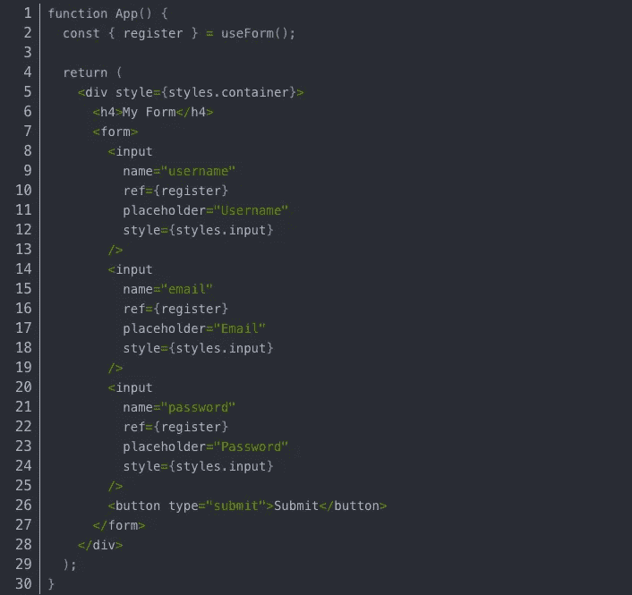
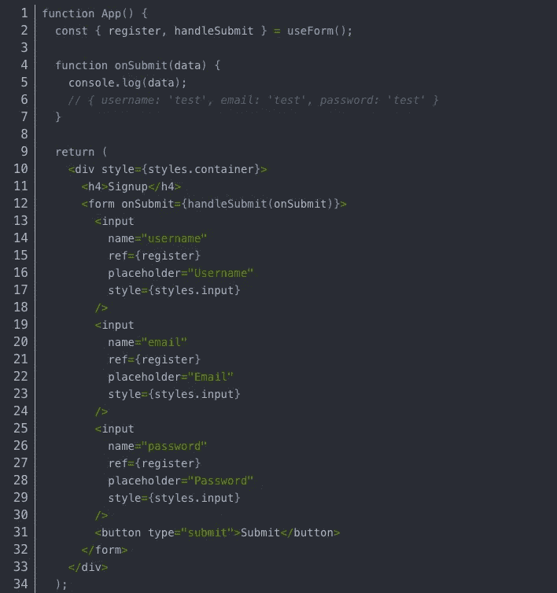
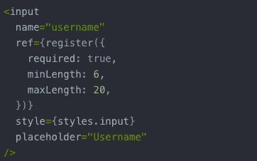
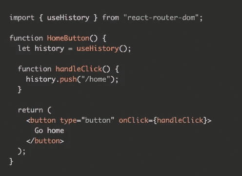
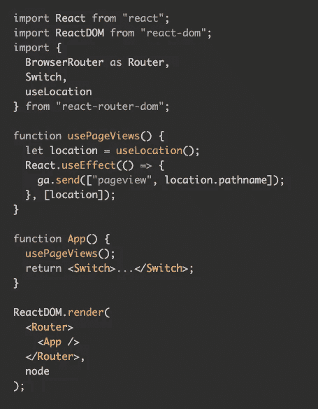
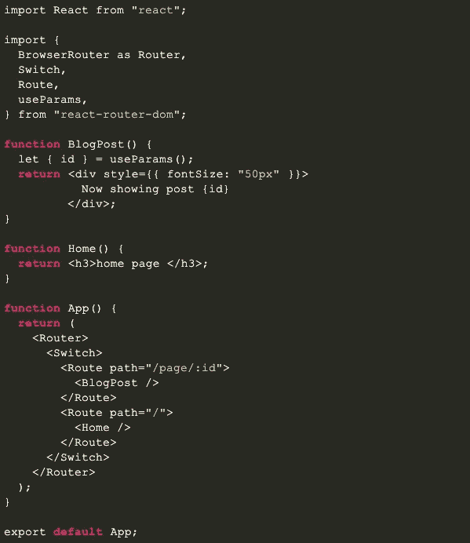
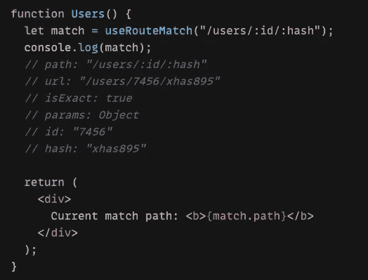
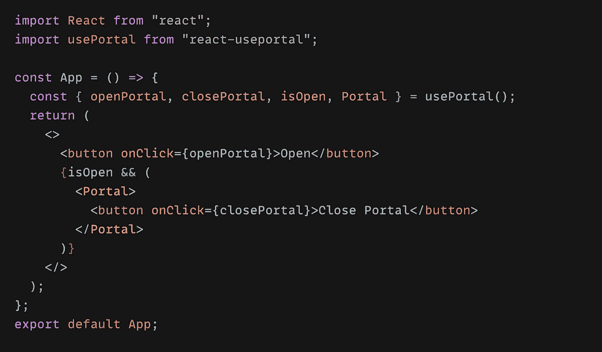

# 您可以使用的 5 个 React 钩子库

> 原文：<https://javascript.plainenglish.io/5-react-hook-libraries-you-could-use-d7f13066ebba?source=collection_archive---------9----------------------->

大三学生的建议——试一试。

我已经和 **React** 接触了近 10 个月，我的看法是 React 钩子不仅让代码更干净，还提高了可读性，减少了代码量。对于我这种没有太多经验的大三学生来说，入门并不难。

*如果你还没有使用过钩子，你应该试着把它们添加到你的项目中，因为它真的可以让你的编程变得简单有趣。*

在这个博客中，我想与你分享我在一些项目中尝试的 5 个 React hook 库。

**1。✂️使用媒体**

这个钩子提供了一个简单的方法来跟踪 CSS **媒体查询**，它在响应性网站中起着至关重要的作用，它有助于在不同的**视口**呈现不同的组件。

例如，您可能有一个汉堡包图标，您想只在较小的屏幕上显示它的下拉列表字段，但在较大的屏幕上隐藏它们。 **useMedia** 提供了一个快速解决方案来帮助解决这个问题。

代码示例:

Resize the screen and trigger different content

**2。反应钩形📋**

[*https://react-hook-form.com/*](https://react-hook-form.com/)

没有人喜欢创建和重新创建带有验证的复杂表单，包括 React 开发人员。

**React-hook-form** 是一个关于表单的钩子:“*高性能、灵活、可扩展的表单，带有易用的验证*”，以其更简单的语法、更快的速度、更少的重复渲染、更好的可维护性，开始在 GitHub 中登峰造极。

要使用 react-hook-form，我们只需要调用 **useForm** 钩子，当我们这样做时，我们将获得一个对象，我们将从该对象中解构 **register** 属性。

***Register****是一个函数，它会接受用户输入的输入值并对其进行验证，它还会将每个值传递给一个函数，这个函数会在表单提交时被调用，所以我们需要将它连接到每个输入，作为一个****ref****。*

为了让 register 正常工作，我们需要为每个输入提供一个合适的" **name"** 属性。例如，对于用户名输入，它的名称是“**用户名**”，这样做的原因是当我们提交表单时，我们将获得单个对象上的所有输入值。

代码示例:

The attributes of each object will be named according to the input name attribute we specified.

*为了处理提交表单和接收输入数据，我们将向表单元素添加一个****on submit****并将其连接到同名的本地函数。*

从 **useForm** 我们将得到一个名为 **handleSubmit 的函数，**我们将将其包装在 **onSubmit** 作为一个**高阶函数**， **handleSubmit** 函数将负责收集所有输入到每个输入中的数据，我们将在 **onSubmit** 中收到一个名为 data 的对象。

代码示例:

With console.log(data), we can see what we entered in each input of the same attribute

为了验证表单并为每个输入值添加约束，我们只需要将信息传递给**寄存器**功能。

第一个属性为**必输项**。默认设置为**假**，但我们可以设置为**真**以确保未填妥时不提交表单。

To apply this verification, username value is required, we can set the value length greater than 6 characters but less than 24 characters

*如果我们用* ***数*** *来进行这个输入(假设这个输入是关于一个人的* ***年龄*** *的)，我们就会用属性****min**和*T42*max***T46 代替**min length**

**3 .反应路由器📍**

[https://reactrouter.com/web/guides/quick-start](https://reactrouter.com/web/guides/quick-start)

React router 是最流行的 React 库之一，用于路由和获取应用程序 URL 历史记录。

提供的最醒目挂钩有:

**使用历史
使用位置
使用参数
用户输出匹配**

*它的名字不言自明:*

**使用历史**将获得应用历史数据的方法。

Click on the button, page will be navigated to “home” page

**useLocation** 将返回一个表示当前 URL 的对象。

Trigger a new “page view” event whenever a new page loads

**UseParams** 将返回当前路由的 URL 参数的键值对的对象。

In this way, with “: id” you can access the parameters of the current route’s URL

**useRouteMatch** 将尝试将当前 URL 与给定的 URL 进行匹配，给定的 URL 可以是字符串，也可以是具有不同选项的对象。

“match” is an object which contains current path, url…

**4 .Redux 钩子🛒**

[*https://react-redux.js.org/api/hooks*](https://react-redux.js.org/api/hooks)

Redux 在整个应用程序中用作全局状态管理器。几个月后，钩子被反应社区发布，Redux 增加了钩子的支持。该钩子可以用来代替以前的高级构件方法**连接()**。

提供的最引人注目的挂钩有:

**使用选择器
使用显示补丁
使用存储**

**useSelector** 允许你从 Redux 存储状态中提取数据，使用一个选择器函数，结果可能返回任何值，而不仅仅是一个对象。

**useDispatch** 从 Redux 存储中返回对`dispatch`函数的引用。您可以根据需要使用它来调度操作。

**useStore** 返回对传递给`<Provider>`组件的相同 Redux 存储的引用。

我个人的意见是，文档很好，但有点复杂，要开始使用它，你仍然必须阅读文档，🧩，直到现在我只是在初级阶段。

**5。🖼使用门户**

[*https://github.com/alex-cory/react-useportal*](https://github.com/alex-cory/react-useportal)

usePortal 使得创建下拉菜单、模态框、通知弹出窗口、气泡提示框等变得容易…

它提供了一种在应用程序的 **DOM** 层次之外创建元素的方法。

代码示例:

With “Open” button you can open Portal with a “Close Portal” button, hit **ESC** or click **outside** to close it

上面的例子只是我个人的建议。我在每个挂钩标题下面添加了一个链接，您可以直接参考原始网站，如果您发现任何可以改进或更正的内容，请联系我。

如果你对我上一篇关于我作为初级 web 开发人员的 web 开发之路的文章感兴趣，你可以点击这里:🎈

[*https://xiaominzhu . medium . com/from-music-to-web-development-my-junior-path-7421 e 0 DDD 65*](https://xiaominzhu.medium.com/from-music-to-web-development-my-junior-path-7421e0ddd65)

非常感谢您的阅读！

*更多内容请看*[*plain English . io*](http://plainenglish.io/)