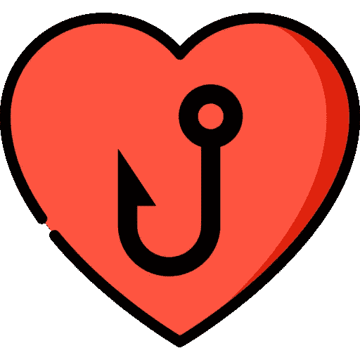

# 喜欢 React Hooks 的 5 个理由

> 原文：<https://javascript.plainenglish.io/5-reasons-to-love-react-hooks-98bcd46ddcbe?source=collection_archive---------15----------------------->

了解为什么 React Hooks 改变了我们编写 React 代码的方式，以及为什么我们应该对此感到非常兴奋。

在 Hooks 出现之前，React 世界是非常不同的。在这个世界里，我们必须学习两种完全不同的方式来编写组件。每当我们需要挂钩到一个组件的“生命周期”或者拥有一个有状态的组件时，我们必须使用基于类的组件。仍然有功能组件，但是它们没有能力做我刚才提到的两件事。直到 React Hooks 的出现改变了人们编写 React 代码的方式。以下是你应该喜欢 React Hooks 的 5 个理由。

# 1.较少样板文件

这对我来说是个大问题。作为开发人员，少写代码有很多好处。首先，显而易见的是，屏幕上的文字越少，显示错误的面积就越小。不仅如此，在这种情况下更容易阅读。与基于类的同类相比，钩子在它们所做的事情上更加明确。下面是做同样事情的两个代码片段，唯一的区别是其中一个是基于类的组件，另一个是使用钩子的功能组件。

**这里是基于类的组件:**

**下面是使用钩子的功能组件:**

# 2.更容易理解

与基于类的组件不同，我发现功能组件更容易理解(这只是我的观点)。钩子也引入了一些我们将在后面讨论的东西，它们是许多第三方库正在集成的定制钩子。关键是在定制钩子出现之前，有两种普遍接受的方式将逻辑结合到 React 代码中。这两种编程风格是高阶组件和渲染道具。没有一个是非常易读或用户友好的。多亏了钩子，我们有了一种更理想的方式在组件之间传递逻辑。

*如果你想了解更多关于高阶组件和/或渲染道具的知识，这里有一些文档链接。*

 [## 高阶组件-反应

### 高阶组件(HOC)是 React 中重用组件逻辑的一种高级技术。hoc 不属于…

reactjs.org](https://reactjs.org/docs/higher-order-components.html#gatsby-focus-wrapper)  [## 渲染道具-反应

### 术语“渲染道具”指的是一种使用道具在 React 组件之间共享代码的技术，该道具的值是…

reactjs.org](https://reactjs.org/docs/render-props.html) 

# 3.一致代码

在 hooks 出现之前，不可避免地会出现基于类的组件和功能组件的混合，这是不太理想的，尤其是在一个工作环境中，您必须让人们跟上速度并教给他们代码库。现在有了 React 钩子，新的项目可以只用功能组件来完成，正如我们后面将要谈到的，旧的项目可以转换成使用它们。

# 4.定制挂钩

也许我最喜欢 React Hooks 的部分是人们发现的一些惊人的创造性的使用方法。我可能会写一整篇文章来分享一些我最喜欢的钩子和使用它们的库(铺垫)。我不打算深入研究这个问题的技术方面，但是基本上，自定义钩子是基本的 React 钩子的组合，它们一起工作来以某种方式操纵数据或修改 UI。

下面是一个非常棒的网站，有很多定制的挂钩

 [## 使用挂钩

### 这个钩子使得订阅 Firestore 数据库中的数据变得非常容易，而不必担心状态…

usehooks.com](https://usehooks.com/) 

# 5.逐步采用

这是一笔不为人知的大交易。对于那些只做小项目的人来说，这可能没什么大不了的，但是对于大项目来说，这就是一切。React 已经存在了一段时间，它继续发展壮大的部分原因是这些大公司推动/塑造了我们所热爱的工具的未来。随着 React 允许逐步采用，大公司可以继续使用它，这将推动 hooks 比它是一个全包解决方案时发展得更快。

*下面是 React 文档的链接，解释了他们对 hooks 的想法和计划。*

 [## 介绍钩子-反应

### 钩子是 React 16.8 中的新增功能。它们允许您使用状态和其他 React 特性，而无需编写类。这个…

reactjs.org](https://reactjs.org/docs/hooks-intro.html) 

# 结论

React 钩子已经改变了整个 React 社区编写代码的方式，在我看来，社区能够以多快的速度和多高的效率接受这种范式转变还远远不够。React Hooks 万岁！