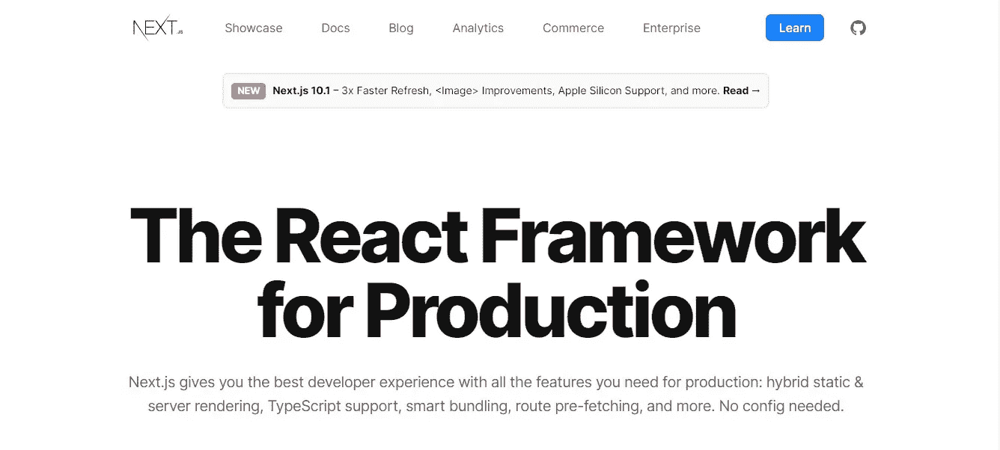

# 从 React 转到 Next.js 的 5 个理由

> 原文：<https://javascript.plainenglish.io/5-reasons-to-switch-from-react-to-next-js-f776413693d0?source=collection_archive---------3----------------------->

## 选择错误的框架可能会成为一场可怕的噩梦

Photo by [arash payam](https://unsplash.com/@arash_payam?utm_source=medium&utm_medium=referral) on [Unsplash](https://unsplash.com?utm_source=medium&utm_medium=referral)

那是 2020 年，第一次封锁刚刚开始。像来自世界各地的人们一样，我发现自己有了计划外的空闲时间。

我决定利用这段闲暇时间学习新技术，并最终学习了 React 和强化了 Node.js 技能。

我构建了一个博客平台，前端使用 React，后端使用 Node.js 服务器。该平台拥有生产就绪型应用所具备的所有特性:

1.  多种登录选项(使用 Google、Twitter 等登录)。
2.  功能丰富的编辑器写美丽的博客。
3.  能够创建草稿和编辑已发布的帖子。
4.  分析以及管理面板。

但是在这里，我学到了一些关于 web 开发的最重要的经验。

从用户的角度来看，一切似乎都很好，但从开发人员的角度来看，维护代码库是一场噩梦。

就在这个时候，我明白了 Next.js 的口号*“生产的 React 框架”*的真正含义。

Source: [Next.js landing page](https://nextjs.org/)

我从 React 转到 Next.js 主要有 5 个原因。

# 1.React 对搜索引擎优化不友好

每个博客或生产就绪的网站都需要针对搜索引擎进行优化，除了一些网站，如控制面板或用户设置。

已经快一年了，尽管我使用 URL 和其他工具进行搜索，但我 React 网站上的大多数博客都没有出现在谷歌搜索上。

这是在我尽力使用像 [React 头盔](https://www.npmjs.com/package/react-helmet)这样的库使 React SEO 友好之后。

React 的 SEO 成绩差是因为它没有在服务器上渲染。另一方面，Next.js 的主要优势是它支持服务器端渲染。

增加有机流量需要一个好的 SEO，Next.js 似乎是保证这一点的解决方案。

然而，我想指出的是，客户端 ReactJS 应用程序没有被谷歌机器人抓取是不正确的。他们是，但是 SEO 没有 Next.js 提供的好。

如果你想详细了解 JavaScript 应用程序中的渲染和 SEO，可以看看我的博客，我用通俗易懂的语言讲述了这些话题。

 [## JavaScript Web 应用程序 SEO 初学者指南

### 在建立了多个网站后，以下是我对有机流量和 SEO 的了解

javascript.plainenglish.io](/a-beginners-guide-to-seo-for-javascript-web-applications-c67d55728291) 

# 2.AdSense 审批问题

React 创建了单页面应用程序(SPAs ),它本质上是一个页面，只需加载一次。

当您浏览页面并浏览其他页面时，数据会动态加载。

尽管 spa 以速度快、响应快、提供原生应用氛围而闻名，但它们也有自己的缺点。

当我试图用[谷歌的 AdSense 赚钱时，我遇到了一个缺点。](https://www.google.com/adsense/start/#/?modal_active=none)

AdSense 根本没有检测到他们要求我放入 index.html 文件的代码，当它意外地检测到时，它在网站上找不到任何内容。

这是因为博客是动态加载的，AdSense 需要在批准您的网站显示广告之前看到真正的内容。

通过简单的谷歌搜索，我发现这是许多水疗网站的共同问题。

这个问题源于缺乏适当的服务器端渲染支持，这是 Next.js 可以轻松解决的另一个问题。

# 3.更轻松的导航

理解 React 中的导航和路由需要经历一个陡峭的学习曲线，尤其是如果这个人来自 Vue 这样的框架(比如我自己)。

React 中的路由使用了一个包 React-Router-Dom，乍看之下，该代码似乎令人生畏。这里有一个 React 中路由的例子。

由于我的网站功能丰富，我有大量的页面，从预期的博客和登录页面到常见问题和服务条款页面。

Next.js 简化了所有这些页面的路径。它提供了一个基于文件系统的路由器，构建在页面的概念上&页面基本上是一个 React 组件。

将这些“页面”文件添加到“页面”目录会自动使其成为可用的路径。

这大大简化了路由，作为一个来自 Vue 和 Nuxt 的人，这看起来很熟悉。

你可以在这里找到更多关于 T2 的信息。

# 4.API 路线

Next.js 内置了对 API 路由的支持，这使您能够使用已知的基于文件的系统创建快速 API 端点。

您放在‘pages/api’目录中的任何文件都将被视为 API 端点(作为 Node.js 无服务器函数)。

如果您需要执行一些服务器端功能，这是一个非常有用的特性，因为这些端点不是客户端捆绑包的一部分。

例如，如果您的站点上有一个输入表单，您可以将“POST”请求发送到 API 端点，该端点将验证输入并将数据存储到数据库中。

这将允许您创建无服务器的函数，并允许我将 Node.js 和 React codebase 合并到一个 Next.js 应用程序中。

Next.js 创建的 API 路由是 Next 本身使用的数据的前端。

如果您计划创建一个移动应用程序并从服务器获取数据，它会有所帮助。

# 5.内置图像组件

正如我前面提到的，我建立了一个博客网站，任何博客都需要有媒体内容以及文本。

只看这个博客本身，除了文字内容之外还有几张图片。

[根据 Next.js 文档，图片占网页总字节数的 50%。](https://nextjs.org/blog/next-10#images-on-the-web:~:text=Images%20take%20up%2050%25%20of%20the%20total%20bytes%20on%20web%20pages.)

通常，媒体文件大小有一个限制，比如 25 兆字节。

此外，一些加载的照片不在用户的视口中，也就是说，用户必须向下滚动到图像。

因此，必须考虑许多因素，如延迟加载、压缩、大小和格式。

Next.js 使用 Next.js 图像组件和自动图像优化来解决所有这些问题，它取代了`` HTML 标签。

通过使用它，默认情况下图像是惰性加载的，浏览器尊重图像的尺寸，在加载图像之前将空间留空。这避免了图像的随机跳跃，增强了用户体验。

此外，Next.js 的“next/image”组件使用最新的格式(如 WebP)按需缩小图像大小，该格式比相应的 JPEG 格式轻 30%。

此外，这些优化是按需进行的，因此您的构建时间不受影响，并且来自外部源的图像也得到优化。

## 结论

React 是最受欢迎的框架(《T2 》),毫无疑问，这是每个网络开发者的必读之书。

然而，这并不意味着 reaction 适合每一种类型的网站。像其他任何框架一样，React 也有自己的陷阱。

Next.js 建立在 reactor 之上，旨在为 reactor 的一些问题提供解决方案，同时通过引入内置解决方案来应对一些现代挑战，从而简化整体开发。

从“反应”切换到“下一步”是可能的，但是如果您正在起步，明智的做法是选择“下一步”而不是“反应”，而不是以后再迁移。

也就是说，在每个项目中使用 Next.js 并完全放弃 React 也是不可取的。

每个网站和应用程序都有特定的意图和目标，这在选择正确的框架和库时起着至关重要的作用。

不幸的是，在我的例子中，当我在 reactor 中完全构建好网站后，我发现我应该使用 Next.js，而不是 reactor，原因如上所述。

希望你能从我的错误中学到一些东西，并且能够选择恰当的框架。

谢谢你的阅读！

*更内容于* [***通俗地说就是***](https://plainenglish.io/)