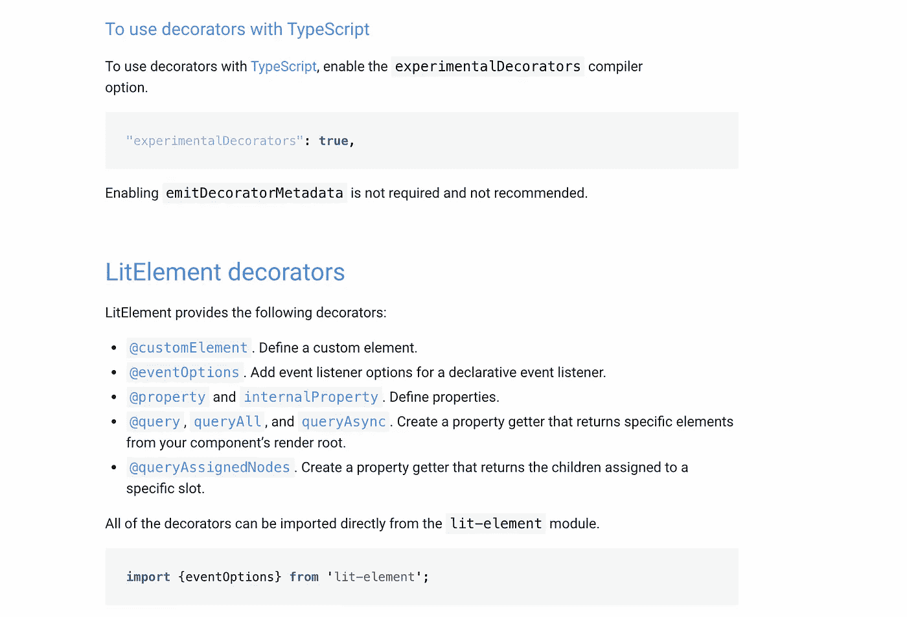

# 你应该在下一个项目中尝试 LitElement 的 5 个理由

> 原文：<https://javascript.plainenglish.io/5-reasons-why-you-should-try-litelement-in-your-next-project-b75f143fbb78?source=collection_archive---------3----------------------->

## 可能是构建 web 组件的最佳库


Photo by [Christina @ wocintechchat.com](https://unsplash.com/@wocintechchat?utm_source=medium&utm_medium=referral) on [Unsplash](https://unsplash.com?utm_source=medium&utm_medium=referral)

假设您使用一个广泛的应用程序。而且你需要提供一些小部件，这些小部件向其他应用程序表示你的应用程序的一些部分。开发者可以在任何框架上编写这些应用，所以你的小部件应该是框架无关的。你会选择什么技术栈？

对我来说，当我听到“框架不可知”时，首先想到的是 web 组件。我们可以用普通的 js 方式实现它们，或者使用库来简化开发人员的生活。在这个故事中，我将分享为什么我们决定使用 LitElement。

> LitElement——它是一个简单的基类，用于创建快速、轻量级的 web 组件。

我们首先要检查什么？当然，它的工作速度有多快。LitElement 显示了自己的潜力。

# 1.表演

快速的性能主要归功于 Lit-html。这是一个非常有效的模板引擎，可以只重新呈现更新的 UI 部分，而不需要接触整个应用程序。良好的性能不会损害开发的可用性。对于开发人员来说，用循环、条件和自定义事件来编写动态模板非常容易，因为 **Lit-html 有一个简单的语法**。

要与其他库比较性能，您可以打开[这一页](https://webcomponents.dev/blog/all-the-ways-to-make-a-web-component-april2020/?ref=hackernoon.com)，但让我节省您的时间，在这里显示图表:


Not the best, but not far from the top

你可以看到，更好的只是原生解或苗条，它无疑比 Angular/React/Vue 元素更快。

好吧，看起来很快，但是保养呢？用 LitHtml 编写和扩展你的组件有多舒服？

# 2.声明式编程

LitElement 的简单、熟悉的开发范式使得构建 Web 组件比以往任何时候都更容易。

听起来不错，实际上，这是真的。看起来很像 react/Vue 组件。没有必要学习定制模板语言——你需要知道 JavaScript，这就足够了。

下面是 LitElement 组件的一个示例。

```
**import** { LitElement, html, property, customElement } **from** 'lit-element';

@customElement('simple-greeting')
**export** **class** SimpleGreeting **extends** LitElement {
  @property() name = 'World';

  render() {
    **return** html`<p>Hello, ${**this**.name}!</p>`;
  }
}
```

然后在 HTML 中将其用作自定义元素。

```
**<simple-greeting** name="Everyone"**></simple-greeting>**
```

# 3.类型脚本支持

我需要描述 2021 年 TypeScript 的好处吗？我相信没有，所以我会告诉你 LitElement 有一个 [TS starter 项目](https://github.com/PolymerLabs/lit-element-starter-ts)，内置的 decorators，接口，甚至还有文档，里面有一些关于 TypeScript 项目的说明。



非常感谢，但是文档中缺少 TS 接口的代码示例。幸运的是，IDE 可以提供帮助。

# 4.Web 组件优势

对于我来说，当我需要为第三方应用程序提供小部件时，使用 web 组件是最好的选择之一，甚至可能是最好的解决方案！因为 web 组件是封装的，它们不能破坏使用它们的父应用程序中的某些东西。同样的规则起相反的作用。该应用程序不能影响您的小部件的用户界面，因为它的内容和样式在影子 dom 中。

好吧，web 组件看起来很酷，但是如果我有支持 IE 的需求呢？我知道，就连微软也放弃了对这只恐龙的支持，但不是所有人。就我而言，很不幸，我不得不支持 IE。

# 5.浏览器兼容性

默认情况下，IE 不支持自定义元素和 CSS 变量。但是当你查看 LitElement 的文档时，你会看到一个非常令人印象深刻的浏览器列表。连 IE 都支持！


在引擎盖下，它使用 ShadyCSS polyfill。这个 polyfill 实现了所有的魔法，所以 slots、CSS 变量和 shadow dom 成了 IE 的代名词。还是很难在 IE 上调试，但至少可以用！

# 结论

在与 LitElement 合作了三个多月后，我仍然喜欢它和我的团队。基于 LitElement 开发、扩展和集成组件到任何 JS 框架上编写的其他应用程序都很方便。

**感谢阅读！**你可以在 Medium 上关注我的更多科技文章，也可以在 [Twitter](https://twitter.com/golosay) 上找到我。