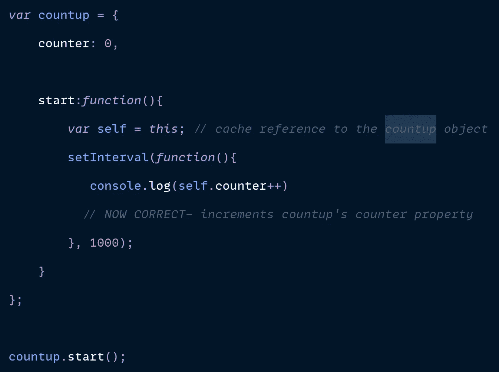

# 在 JavaScript 中掌握“这个”的 5 个简单规则

> 原文：<https://javascript.plainenglish.io/5-simple-rules-to-master-this-in-javascript-2b5d8df31fc4?source=collection_archive---------4----------------------->

您需要阅读的唯一一篇文章就是了解 JavaScript 中的“**”关键词。**

****

**在本文中，我们涵盖了 JavaScript 中至关重要但又令人困惑的话题，即“ ***这个*** 关键词。**

## **TL；速度三角形定位法(dead reckoning)**

**如果*这个*吓到你了，不要担心！我们将学习如何使用五个简单的规则来确定“*”这个*”关键词的值。**

**这五个简单的规则如下:**

*   ***常规绑定—* **默认绑定****
*   ***物体内部的功能* — **隐含结合****
*   ***功能借用* — **显式绑定****
*   ***使用函数创建对象* — **新绑定****
*   ***Arrow 函数与常规函数有何区别—* **词汇绑定****

**不用担心这些可怕的名字。计算机科学的人喜欢给术语命名，这样它们听起来就像外星人。在幕后，它们只是普通的概念，任何有意愿的人都能理解。**

***这个“*变量对应于你如何调用一个函数。这些规则帮助我们在各种场景下确定*这个*的值。**

**一旦你理解了这些规则，你就不会再害怕它们了。**

**在我们开始之前，[请通读本文](/why-do-developers-fear-this-fb7497f95570?sk=7c1a7d83bd97af7ce9a9cd97fc8abda2)以了解*这个*是如何工作的。**

# **简而言之，什么是“这个”**

**在 JavaScript 中，每当调用一个函数时，JavaScript 引擎就会创建一个新的执行上下文。该执行上下文一直存在，直到函数完成执行。每个执行上下文都包含一个名为“this”的变量。**

# **#规则 1。默认绑定**

****

**当以上面所示的标准方式调用一个函数时，“*这个*实际上会引用全局对象！**

**在浏览器中，全局对象是指窗口对象。**

****

**需要记住的一个例外是，当启用严格模式时。通过编写“use-strict”，您可以防止在全局对象上声明任何内容。**

****

# **#规则 2。**隐性约束****

**如果函数包含在一个对象中，那么该对象将被“this”引用。**

****

**对于上面的内容，`this`关键字将指向`personObj`**

# **#规则 3。**显式结合****

**我们看到了`this`如何指向全局对象，在另一种情况下，它指向包含它的对象。当函数被调用时，能够控制这个变量的最终状态不是很好吗？**

**像*调用*、*应用*、*绑定*这样的词通常会让新开发者感到恐惧。实际上都是可以用来*显式*设置“this”的值的函数。**

## **让我们用一个例子来理解一下。**

**假设我们有两个对象，比如说`personObj`和`readerObj`**

****

**这两个对象都有一个名称属性。`personObj`有打印`name`内部数值的功能，但是`readerObj`没有这个功能！**

**这里我们可以使用三种方法之一— `call`、`apply`或`bind`。**

**这个过程叫做函数借用。**

****

**我们为`readerObj.`借用了`sayName`方法**

**现在我们可以打印出`readerObj`中的 name 属性**

****

**我们从`personObj`调用`sayName`方法，但同时，我们指示 JavaScript 引擎`sayName`方法中的‘this’变量应该指向`readerObj`。**

**所以当 JavaScript 引擎执行代码时，`sayName`函数中的 ***这个*** 变量不是指向`personObj`而是指向`readerObj`。**

**这有意义吗？**

**不仅如此，当我们使用`call`函数时，我们还可以传递一些参数。**

****

**We passed Namaste as an argument**

**我们可以利用`sayName`方法中的参数。**

****

**当我们执行代码时，我们将获得输出以及传递的参数。**

****

**apply 方法以同样的方式工作，但是它不是使用常规参数，而是使用一个数组作为参数。**

********

**bind 方法也以同样的方式工作—它可以接受一个常规参数。**

****

**但是不像*调用* 和*应用——****绑定*** 返回一个函数——那个函数可以存储在一个变量中，以后可以执行。**

********

**我们可以看到 bind 在函数 currying 中的使用——这是我们将在以后讨论的主题。**

# **#规则 **4。新绑定****

**我们使用 ***new*** 关键字来创建一个对象的实例或副本。**新**关键字的作用是:**

*   **它创建一个**空对象**，然后指示关键字 **this** 指向那个空对象。**
*   **然后，它将一个`return this`语句添加到该函数的末尾。**

**记住，当使用 *new* 关键字创建一个对象的实例时，“ ***this*** ”总是指向那个新创建的实例。**

## **让我们用一个例子来理解这一点。**

****

**当我们运行这段代码时，我们应该得到什么？**

****

**正如我们所说——一个空的物体！**

**引擎盖下发生的事情是**

****

**什么？我们要调用这个函数吗？**

**是啊！**

****

**See, I told you it is getting invoked.**

**让我们看看整个事情。**

****

**如果我们在函数中放入一些值，它会把这些值放入新创建的对象中，然后返回！**

****

**当我们`console.log(newPersonObj)`**

****

**让我们用一个动画来完成这个概念。**

****

**在上面的例子中，我们使用一个函数来创建一个对象。**

**这种类型的函数被称为函数构造函数。**

**记住，在`newPersonObj`中，存储了`personObj`的副本——“this”变量指向空的`personObj`**

**现在有意义吗？**

**很好！现在让我们理解最后一条规则。**

# **#规则 **5。词汇绑定****

**随着 ES6 的出现，我们有了箭头功能。具有超精简语法的 Arrow 函数是传统匿名函数的自然替代品。**

**要显式调用箭头函数，就像使用常规匿名函数一样，首先要将它赋给一个变量:**

****

**箭头函数就像普通的匿名函数一样，只有一个主要的例外——函数内部对象的行为。**

**在常规函数中，“`this`”的值是基于上下文的——调用链接内部的函数，“`this`”指向链接的对象；在一个类似`setInterval()`的函数中调用它，然后“`this`指向全局窗口对象。**

**例如，下面的示例尝试调用自定义对象的`start()`方法，每秒钟将其 counter 属性递增 1，尽管由于“`this`”对象引用计数器的错误假设而失败。**

********

**在上面的例子中，`this.counter`未能正确引用`countup`对象的 counter 属性，尽管这个错误可能不那么明显。人们可能会错误地或粗心地认为“`this`指向了`countup`对象，而实际上由于上下文“`this`”在全局窗口方法`setInterval()`内被调用，它指向了全局`window`对象。**

**结果是对一个不存在的`window.counter`属性的引用，当我们试图增加它时，这个属性将重复返回`NaN`。为了正确地引用匿名函数中的`countup`对象，我们应该在上下文变为不同的对象之前缓存对正确的“`this`”对象的引用:**

********

**arrow 函数中的“`this`”对象是词汇绑定的，这只是一种奇特的说法，即它的值是静态的，由定义“`this`”关键字的位置决定。**

**相比之下，常规函数中的“`this`”是动态的，基于上下文调用，而不考虑定义“`this`”时的作用域。**

**让我们以之前给我们带来麻烦的例子为例，看看改用箭头函数如何直观地解决问题:**

********

**我们通过使用一个箭头函数解决了这个问题。**

# **结论**

**如果你理解了所有的规则，那就拍拍自己的背——这是你应得的！现在，您不再害怕 JavaScript 最令人困惑的概念——“*this*”关键字。**

**在本文中，我们了解到:**

*   **当以上面所示的标准方式调用一个 ***函数*** 时，*这个*实际上会引用全局对象！**
*   **如果函数包含在一个*对象中，那么 ***这个*** 将指向那个对象。***
*   ******调用*** 、 ***应用*** 和 ***绑定*** 是我们可以通过 JavaScript 来改变程序中 ***这个*** 的行为的函数。***
*   ******new*** 关键字或运算符在使用时会使一个空对象，然后指示***this***指向那个新创建的对象***
*   ***Arrow 函数使我们能够在程序中对“ ***这个*** ”关键字进行词汇绑定，这意味着它的值是静态的，由定义“`this`”关键字的地方决定。***

# ***感谢信***

***我想利用这最后的机会说声谢谢。***

***感谢您的光临！没有像你这样的人，我不可能做我现在做的事情。***

***我希望你能 [**和我一起**](https://twitter.com/tweetsbysoma) 发表 [**我未来的博文**](https://polymathsomnath.medium.com/) 并留下来，因为我认为我们这里有一些很棒的东西。我希望在未来的许多年里，我能在你的职业生涯中帮助你！***

***下次见。再见！***

***[*更多内容尽在 plainenglish.io*](http://plainenglish.io/)***