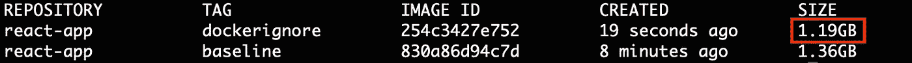

# 缩小 Docker 图片尺寸的 5 个简单技巧

> 原文：<https://javascript.plainenglish.io/5-simple-tips-to-reduce-your-docker-image-size-9c562792af88?source=collection_archive---------13----------------------->

## 使用基于阿尔卑斯山的图像不是唯一的方法！


Photo by [Kinsey](https://unsplash.com/@finalhugh?utm_source=medium&utm_medium=referral) on [Unsplash](https://unsplash.com?utm_source=medium&utm_medium=referral)

在流了很多汗(可能还有眼泪)之后，您终于完成了 web 应用程序的构建。现在是时候向世界展示你出色的工作了，把它装在容器里并部署到某个地方。

“容易。我将只写一个简单的 Docker 文件，它使用来自 [Docker Hub](https://hub.docker.com/_/node) 的基本`node:<version>`映像，”你对自己说。您只需这样做，构建 Docker 映像，并在本地测试您的 web 应用程序——一切看起来都很棒！但是当你决定检查 Docker 图像的大小时，你会发现它…大约有**千兆字节**！尺寸必须是可缩小的，对吗？毕竟，您的独立应用程序大小只是其中的一小部分。

“啊，没问题。我将使用来自 [Docker Hub](https://hub.docker.com/_/node) 的小得多的基础`node:<version>-alpine`图像来代替。虽然这样做在大多数情况下会让你走很长一段路，但也有潜在的不兼容性和缺点。正如我们将在后面的章节中讨论的那样，基于 Alpine 的图像与 C 语言的另一个标准库打包在一起，这可能会导致意想不到的行为，特别是当您的应用程序处理预编译的二进制文件时。稍后您还将了解到，如果您担心生产中的容器安全性，还可以考虑其他紧凑的基本映像。

在本文中，我们将探索一些技巧和窍门来紧凑和安全地封装 web 应用程序。

# 创建应用程序

出于演示目的，让我们首先使用 [create-react-app](https://create-react-app.dev/) 创建一个基本的 React 应用程序:

```
**npx** create-react-app docker-image-size
**cd** docker-image-size/
**npm** start
```

转到 [http://localhost:3000](http://localhost:3000) ，您应该会看到您的工作应用程序:


Screenshot of the stock application from [create-react-app](https://create-react-app.dev/). Image by [Author](https://wilsonlouie.medium.com/).

# 基线:普通基础图像

在应用程序根目录(`docker-image-size`目录)中，创建一个以官方标准 [Node.js Docker image](https://hub.docker.com/_/node) 开始的`Dockerfile`，并执行设置和启动 React 应用程序的标准步骤:

```
**FROM** node:14
**WORKDIR** /app
**COPY** package.json package-lock.json ./
**RUN** npm install
**COPY** . ./
**EXPOSE** 3000
**CMD** ["npm", "start"]
```

通过以下方式构建图像(标记为`baseline`):

```
docker **build** -t react-app:**baseline** .
```

并且可以选择通过构建容器并导航到 [http://localhost:3000](http://localhost:3000) 来检查应用程序是否工作:

```
docker **run** --**rm** -it -p 3000:3000 react-app:**baseline**
```

太好了！让我们通过以下方式检查图像大小:

```
docker **images**
```


Screenshot of docker images output. Image by [Author](https://wilsonlouie.medium.com/).

果然图像挺大: **1.36GB** ！幸运的是，我们只能从这里开始改进。

# 1.使用排除不重要的文件。dockerignore

请注意 docker 文件中的行`**COPY** . ./`。该命令指示我们的本地项目根目录(`docker-image-size`)中的所有内容都应该复制到 Docker 映像的工作目录中。前面的 Docker 命令`**RUN** npm install`将项目依赖项安装到映像中的`node_modules`目录*中。回想一下，在开发期间，你会有*你自己的*T4 的本地副本。将其复制到映像中是多余的，也是不必要的。在本地项目目录中，还有一些应用程序不需要的额外文件，比如`Dockerfile`本身、`README.md`，构建工件等等。*

通过向本地项目根目录添加一个`.dockerignore`文件，可以很容易地排除文件和目录:

```
# Things we should exclude from the Docker Image
Dockerfile
.dockerignore
.gitignore
README.md
build
node_modules
```

如果你熟悉的话，它与一个`.gitignore`文件非常相似，你可以在这里阅读更多关于它的内容。一般来说，包含一个`.dockerignore`文件不仅仅是为了最小化图像大小，也是为了防止秘密文件和源代码的意外暴露。

同样，通过以下方式构建映像(标记为`dockerignore`):

```
docker **build** -t react-app:**dockerignore** .
```

并通过以下方式检查图像尺寸:

```
docker **images**
```



Screenshot of docker images output. Image by [Author](https://wilsonlouie.medium.com/).

进步！我们已经将图像大小从之前的 1.36GB 减少到了 1.19GB。但是我们肯定能做得更好？实际应用仍然只占该规模的一小部分…

# 2.用 Alpine 变小

如果应用程序相对较小，但是 Docker 映像最终占用了 1.19GB 的空间，那么是什么用完了应用程序之外的所有空间呢？

Docker 文件中的`**FROM** node:14`行指定从 [Docker Hub](https://hub.docker.com/_/node) 中提取事实上的`node`版本 14 基础映像。这个映像在一个成熟的操作系统(Debian)上运行 Node.js、`npm`、`yarn`和其他二进制文件。这非常臃肿，占了我们的 Docker 图像大小的很大一部分。幸运的是，Node.js Docker 团队还提供了`node:<version>-alpine`图片，这些图片基于流行的 [Alpine Linux 项目](https://alpinelinux.org/)。尽管 Alpine Linux 仍然是一个成熟的操作系统，但它比大多数操作系统都要小得多。

但是有一个小问题:Alpine Linux 使用了 C 语言的最小替代标准库`[muslc](http://musl-libc.org/)`，而不是大多数其他发行版如 Ubuntu 和 Debian 使用的更常见的`glibc`。这意味着您可能会遇到 Alpine 和预编译二进制文件(如 Node.js C++扩展)之间的意外行为或不兼容，如果您的应用程序需要它们的话。[这里的](https://github.com/grpc/grpc/issues/8528)和[这里的](https://github.com/grpc/grpc/issues/6126)是一些真实世界的例子。然而，正如 Docker Hub 上所说，“大多数软件都没有这个问题，所以这个变种通常是一个非常安全的选择。”不管 Alpine 是否适合你，一定要看看技巧 4，它讨论了另一种“Distroless”图像。

要使用基于 Alpine 的图像，替换 Dockerfile 文件中的`**FROM** node:14`到`**FROM** node:14-alpine`:

```
**FROM** node:14-alpine
**WORKDIR** /app
**COPY** package.json package-lock.json ./
**RUN** npm install
**COPY** . ./
**EXPOSE** 3000
**CMD** ["npm", "start"]
```

同样，通过以下方式构建映像(标记为`alpine`):

```
docker **build** -t react-app:**alpine** .
```

并通过以下方式检查图像尺寸:

```
docker **images**
```


Screenshot of docker images output. Image by [Author](https://wilsonlouie.medium.com/).

好多了！我们已经将图像大小从之前的 1.19GB 减小到了 **362MB** ！这是一个巨大的胜利，但我们可以做得更好。

# 3.通过多阶段构建变得更小

到目前为止，我们的 docker 文件已经被编写得好像我们正在进行 React 开发一样。在生产中，我们将使用`npm run build`构建应用的优化版本，这将在`build`目录中生成最终的自包含应用(另请参见 [create-react-app 文档](https://create-react-app.dev/docs/production-build))。因此，在生产中，只有`build`目录的内容是必要的；`node_modules`下的源代码和依赖项应该从映像中排除。

Docker 的[多阶段构建](https://docs.docker.com/develop/develop-images/multistage-build/)允许您在 docker 文件中使用多个`FROM`语句指定多个构建阶段，并选择性地将工件从一个阶段复制到另一个阶段。这样，您可以构建只包含最低限度的最终图像。

要看到这一点，请将您的 docker 文件修改为:

```
# Stage 1 (named "builder"): Production React Build
**FROM** node:14-alpine AS builder

**WORKDIR** /app
**COPY** package.json package-lock.json ./
**RUN** npm install

**COPY** . ./
**RUN** npm run build

# Stage 2: Start fresh, install a static server,
# and copy just the build artifacts from the previous stage.
**FROM** node:14-alpine

**WORKDIR** /app
**RUN** npm install -g serve
**COPY** --from=builder /app/build ./build

**EXPOSE** 5000
**CMD** ["serve", "-s", "build", "-l", "5000"]
```

上面指定了多阶段构建:

1.  阶段 1 执行 React 应用程序的生产构建。它从基于 Alpine 的`node`映像开始，安装应用程序依赖项，并运行`npm run build`来生成`build`目录。
2.  阶段 2 从一个新的基于 Alpine 的`node`映像开始，并从阶段 1 复制*和*目录(不包括`node_modules`、源代码等)。).它还根据文档[安装了一个静态服务器](https://create-react-app.dev/docs/deployment)在端口 5000 监听应用程序。

通过以下方式构建图像(标记为`alpine-multistage`):

```
docker **build** -t react-app:**alpine-multistage** .
```

可选地，通过运行容器，然后导航到 [http://localhost:5000](http://localhost:5000) ，检查应用程序是否工作:

```
docker **run** --**rm** -it -p 5000:5000 react-app:**alpine-multistage**
```

通过以下方式检查图像尺寸:

```
docker **images**
```


Screenshot of docker images output. Image by [Author](https://wilsonlouie.medium.com/).

利润！我们已经将图像大小从之前的 362MB 减少到了 **123MB** (我们开始时是 1.36GB)！对于大多数用例来说，这可能就足够了。

# 4.试试 Distroless 而不是 Alpine

虽然紧凑，但基于 Alpine 的映像仍然包含一个成熟的操作系统。理论上，我们的应用程序只需要 Node.js 及其依赖项就可以运行，因此一个更小的映像应该是可能的。

谷歌工程师有同样的想法，并提出了“Distroless”图像。显示他们的[项目页面](https://github.com/GoogleContainerTools/distroless):

> “发行版”映像只包含您的应用程序及其运行时依赖项。它们不包含包管理器、shells 或任何其他您期望在标准 Linux 发行版中找到的程序。

它们提供了几种图像风格，特别是提供 Node.js 的[。与基于 Alpine 的图像相比,“Distroless”图像:](https://github.com/GoogleContainerTools/distroless/blob/master/nodejs/README.md)

1.  基于 Debian，使用 [bazel](https://bazel.build/) 工具构建，因此完全兼容`glibc`。
2.  可以说更安全，因为它的极简主义和没有外壳。这意味着成功访问您的容器的攻击者在没有 shell 访问的情况下将无法造成同样大的损害。在生产中，你不需要外壳。如果您想要调试，您应该依赖于适当的日志记录和监控。
3.  通常比基于阿尔卑斯山的图像更瘦，或者差不多一样瘦。

要看到这一点，首先通过在项目根目录下添加一个包含以下内容的`server.js`文件来添加一个简单的 [Express](https://expressjs.com/) 后端:

```
**const** express = **require**('express');
**const** path = **require**('path');
**const** app = express();
app.**use**(express.static(path.join(__dirname, 'build')));

app.get('/', **function** (req, res) {
  res.sendFile(path.join(__dirname, 'build', 'index.html'));
});

app.listen(5000);
```

这实现了两件事:

1.  模拟一个更真实的场景，您有一个使用 Node.js 后端和 React 前端的全栈应用程序。Node.js 后端可能需要依赖于`glibc`的依赖项，这就是为什么您使用“Distroless”映像而不是 Alpine。在我们的例子中，Express 后端所做的只是充当一个监听端口 5000 的静态服务器。
2.  “Distroless”节点映像包含 Node.js，几乎没有其他内容(没有`npm`、`yarn`等)。).有了`server.js`，我们可以简单地执行`node server.js`来启动应用程序。

然后修改 Dockerfile 文件:

```
# Stage 1 (named "builder"): Production React Build
**FROM** node:14 AS builder

**WORKDIR** /app
**COPY** package.json package-lock.json ./
**RUN** npm install

**COPY** . ./
**RUN** npm run build

# Stage 2 (named "final"): Produce final app
# by bundling Express backend with React frontend
**FROM** node:14 AS final

**WORKDIR** /app
**RUN** npm install express

**COPY** ./server.js /app
**COPY** --from=builder /app/build /app/build

# Stage 3: Copy the app from "final" stage
# to the minimal and secure distroless image
**FROM** gcr.io/distroless/nodejs:14

**COPY** --from=final ./app ./app
**WORKDIR** /app

**CMD** ["server.js"]
```

上面指定了多阶段构建:

1.  阶段 1 使用一个节点映像来构建 React 应用程序静态文件。
2.  阶段 2 安装 Express，将我们的本地副本`server.js`复制到映像，并且只复制包含前一阶段的 React 应用程序的`build`目录。
3.  阶段 3 将来自阶段 2 的最终应用程序(Express dependency，`server.js`和`build`目录)复制到最小且安全的“distroles”`node`映像。

通过以下方式构建映像(标记为`distroless-multistage`):

```
docker **build** -t react-app:**distroless-multistage** .
```

并通过运行容器，然后导航到 [http://localhost:5000](http://localhost:5000) ，检查应用程序是否工作。

```
docker **run** --**rm** -it -p 5000:5000 react-app:**distroless-multistage**
```

通过以下方式检查图像尺寸:

```
docker **images**
```


Screenshot of docker images output. Image by [Author](https://wilsonlouie.medium.com/).

还不错！得到的映像大小是 **121MB** ，这不仅(稍微)比基于 Alpine 的映像(123MB)小，而且为您提供了更好的安全性和与用`glibc`预编译的包的完全兼容性。缺点是由于缺少 shell，调试和开发可能会更加痛苦，所以最好是在准备投入生产时才切换到“Distroless”。

# 5.只提供静态文件？请改用 Nginx。

在我们之前的所有技巧中，最终的 Docker 映像有一个 Node.js 依赖项，用于服务或后端。如果您正在部署一个纯静态的 React 应用程序，您只需要一个强大的轻量级 web 服务器，比如 [Nginx](https://nginx.org/en/) 来服务静态文件。因此，在这种情况下，我们实际上可以摆脱庞大的 Node.js 依赖关系，节省更多的空间:

```
# Stage 1 (named "builder"): Production React Build
**FROM** node:14-alpine AS builder**WORKDIR** /app
**COPY** package.json package-lock.json ./
**RUN** npm install**COPY** . ./
**RUN** npm run build# Stage 2: Start fresh, use Nginx as webserver,
# and copy just the build artifacts from the previous stage.
**FROM** nginx:alpine**WORKDIR** /app
**COPY** --from=builder /app/build /usr/share/nginx/html# Run nginx with global directives and daemon off
**CMD** ["nginx", "-g", "daemon off;"]
```

上面的 Dockerfile 文件指定了一个多阶段构建:

1.  阶段 1 使用一个节点映像来构建 React 应用程序静态文件。
2.  第二阶段从一个基于 [Alpine 的 Nginx 映像](https://hub.docker.com/_/nginx)开始，复制第一阶段构建的静态文件，并启动一个 Nginx web 服务器来服务静态文件。

同样，通过以下方式构建图像(标记为`nginx-multistage`):

```
docker **build** -t react-app:**nginx-multistage** .
```

还可以通过运行容器，然后导航到 [http://localhost:80](http://localhost:80) 来检查应用程序是否正常工作:

```
docker **run** --**rm** -it -p 80:80 react-app:**nginx-multistage**
```

通过以下方式检查图像尺寸:

```
docker **images**
```


Screenshot of docker images output. Image by [Author](https://wilsonlouie.medium.com/).

太棒了。得到的图像大小只有 **22.8MB** ！

# 结论

概括地说，执行每个提示后的图像尺寸为:

1.  香草底座图像: **1.36GB**
2.  增加`.dockerignore` : **1.19GB**
3.  使用阿尔卑斯图片: **362MB**
4.  使用 Alpine 映像的多阶段构建: **123MB**
5.  使用无分布映像的多阶段构建: **121MB**
6.  使用 Nginx 的多阶段构建: **22.8MB**

总之，总是包括一个`.dockerignore`文件。普通节点映像非常适合开发和测试，但是对于部署来说太大了。

如果您正在部署一个纯静态的 React 应用程序，那么采用最终利用 Nginx Alpine 映像的多阶段构建是一个非常好的选择，并且提供了最小的大小。

如果您的最终映像需要 Node.js，您想要一个用于调试的 shell，并且您不关心`muslc`的不兼容性，那么基于 Alpine 的`node`映像可能适合您。

如果您在生产环境中运行，关注安全性，并且需要`glibc`兼容性，那么也许使用“无发行版”映像更合适。

希望这对你有启发和帮助。编码快乐！