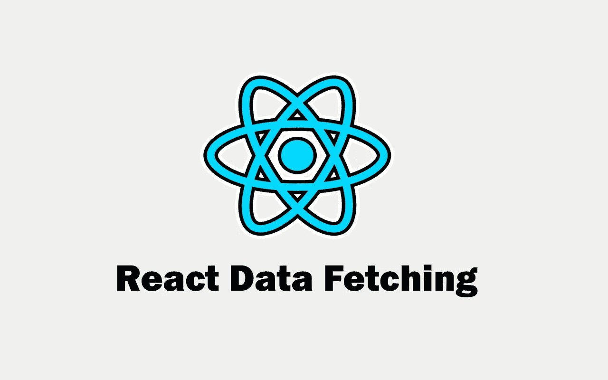
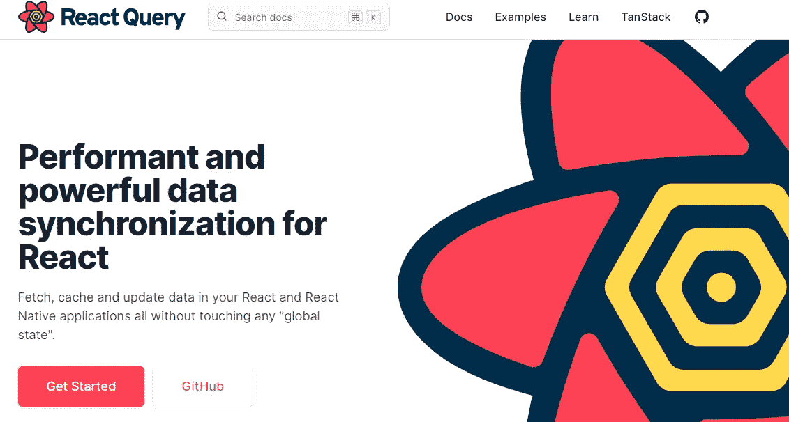

# 在 React 中获取数据的 5 种简单方法

> 原文：<https://javascript.plainenglish.io/5-simple-ways-to-fetch-data-in-react-e72db174c71a?source=collection_archive---------3----------------------->

## 用实例反应数据获取。



Image created with ❤ ️️By author.

毫无疑问，ReactJS 仍然是构建用户界面和 web 应用程序前端的最佳框架之一。React 实际上是一个库，而不是一个框架，但它充当了一个框架，并拥有它的所有优势。

从 API 获取数据是使用 React 可以做的常见事情之一。React 中有多种从 Rest APIs 获取数据的方式，特别是现在我们可以使用钩子的能力。

在本文中，我们将介绍一些在 React 中轻松获取数据的方法。所以让我们开始吧。

# 1.获取 API

在 React 中获取数据的方法之一是使用 fetch API。

fetch API 返回一个承诺，并允许我们发出 HTTP 请求。我们可以在 React 中通过使用钩子`useEffect()`的参数函数中的 fetch API 来实现。

在本文中，我们将使用一个简单的伪用户 API 在页面上显示这些用户的名字列表。

这里有一个例子:

```
*//App.js*import React,{useState, useEffect} from "react";const App = () => {//Our State.
  const [users, setUsers] = useState([]) useEffect(()=>{
    **fetch("https://jsonplaceholder.typicode.com/users")**
    **.then**(response => **response.json()**)
    **.then**(data => **setUsers(data)**)
    .catch(err => console.log(err))
  },**[]**);return (
    <div className="container">
      <ul>
        {users.map(user => <li key={**user.id**}>{**user.name**}</li>)}
      </ul>
    </div>
  )
};
export default App;
```

*输出:*


Capture by the author.

正如您在上面看到的，由于 fetch API 返回一个承诺，我们使用了`then()`和`catch`语法来处理该承诺，并在页面上显示请求的数据。

我们还添加了一个空数组`[]`作为函数`useEffect()`的第二个参数，这样这个请求在初始渲染时只需要发出一次。

# 2.Axios

Axios 是一个超级有用的库，允许我们轻松地从 API 获取数据。它支持几乎所有的浏览器，我们可以在 React 中使用它。

我认为使用 Axios 比使用 fetch API 容易得多。至少在我看来是这样。

在使用 Axios 之前，你必须先安装它，或者如果你愿意的话，使用一个 CDN。在本例中，我们将使用 NPM 来安装它。

```
npm install axios
```

然后，我们只需将它导入到我们的文件中，并开始使用它。

这是我们用 fetch 做的同一个例子，但是现在使用 Axios:

```
import React,{useState, useEffect} from "react";
**import axios from "axios";**const App = () => {//Our State.
  const [users, setUsers] = useState([])useEffect(()=>{
    **axios.get**("https://jsonplaceholder.typicode.com/users")
    .**then**(response => setUsers(**response.data**))
    .catch(err => console.log(err))
  },**[]**);return (
    <div className="container">
      <ul>
        {users.map(user => <li key={**user.id**}>{**user.name**}</li>)}
      </ul>
    </div>
  )
};
export default App;
```

*输出:*


Capture by the author.

Axios 有很多方法可以用来处理 HTTP 请求，比如`get()`、`post()`、`put()`、`delete()`等等。

在上面的例子中，我们使用了方法`get()`，我们将 API URL 传递给它，然后我们访问响应对象来获取所有数据，并将它传递给我们的状态。Axios 有一个非常简单的语法，这就是为什么许多开发人员在 React 中使用它。

# 3.异步/等待语法

因为 fetch API 和 Axios 是基于承诺的。可以对它们使用 async/await 语法。因此，您将从`then()`、`catch()`和`finally()`语法中清理您的代码。

您只需要创建一个单独的异步函数`getUsers()`并在函数`useEffect()`中调用它。

*异步/等待获取:*

```
import React,{useState, useEffect} from "react";const App = () => {const [users, setUsers] = useState([])
const API_URL = "https://jsonplaceholder.typicode.com/users" //The separate async function
 const **getUsers = async** ()=>{const response = **await** fetch(API_URL) const userdata = **await** response.json() **setUsers(userdata)
 }** **useEffect(()=>{
    getUsers()
  },[])** return (
    <div className="container">
      <ul>
        {users.map(user => <li key={**user.id**}>**{user.name}**</li>)}
      </ul>
    </div>
  )
};
export default App;
```

*与 Axios 异步/等待:*

```
import React,{useState, useEffect} from "react";
import axios from 'axios'const App = () => {const [users, setUsers] = useState([])
const API_URL = "https://jsonplaceholder.typicode.com/users"//The separate async function
 const getUsers = **async** ()=>{
    **await axios.get(API_URL)**
    .then(response => **setUsers(response.data)**)
 }

useEffect(()=>{
    **getUsers()**
  },**[]**)

return (
    <div className="container">
      <ul>
        {users.map(user => <li key={**user.id**}>{**user.name**}</li>)}
      </ul>
    </div>
  )
};
export default App;
```

*输出:*


Capture by the author.

# 4.使用自定义钩子

在 React 中获取数据的另一种有效方法是使用自定义钩子。无论您使用 Fetch 还是 Axios，您都可以用它来创建一个自定义的可重用钩子。

自定义钩子只是一个允许您在项目的不同地方使用功能的函数。它允许您为您的组件创建一个特定的功能，并在应用程序中的任何地方使用它，而不必从头开始编写代码。

如果您不熟悉创建自定义钩子，您可以查看我下面的文章:

[](/how-to-create-custom-hooks-in-react-a756b1d54c45) [## 如何在反应中创建自定义钩子

### 了解如何在“反应”中创建第一个自定义钩子。

javascript.plainenglish.io](/how-to-create-custom-hooks-in-react-a756b1d54c45) 

因此，您可以创建一个自定义钩子，允许您从 API 中获取数据。为此，创建一个新文件，并在其中创建一个以`use`开头的函数(这是强制性的)。在我们的例子中，由于我们想要获取数据，我们将称其为`useFetch()`。

该函数应该有一个参数，这是我们要从中获取数据的 URL。因此，它应该返回该 API 的数据。

以下是示例:

```
*//useFetch.js*import {useState, useEffect} from 'react'//give a url parameter for the function.
const **useFetch** = (**url**)=>{ const [data, setData] = useState([]) const getData = async ()=>{
    const response = await fetch(**url**)
    const userdata = await response.json()
    setData(userdata)
  }

 useEffect(()=>{
    getData()
  },[url])

  //return data that we will need in other components.
  **return {data};**
}export default useFetch;
```

现在您只需要将这个自定义钩子导入其他组件并在那里使用它。

由于我们的自定义钩子`useFetch`采用了一个 URL 参数，当我们想在应用程序的其他组件中获取数据时，我们可以将 API URL 传递给它。

下面是一个例子:

```
//App.jsimport React from "react";//importing our custom hook that we created.
**import useFetch from './useFetch'**const App = () => {
  const API_URL = 'https://jsonplaceholder.typicode.com/users';

  //using our custom hook.
  const **{data} = useFetch(API_URL)**

  return (
    <div className="container">
      <ul>
        {data.map(user => <li key={user.id}>{user.name}</li>)}
      </ul>
    </div>
  )
};
export default App;
```

*输出:*


Capture by the author.

# 5.使用反应查询

[反应查询](https://react-query.tanstack.com/)是一个很好的反应库，如果你想把你的数据获取提升到一个新的水平。它允许您以简洁的方式使用自定义钩子，并让您可以完全控制提取的数据。



Capture by the author from [React Query](https://react-query.tanstack.com/)(link outside Medium).

我认为反应查询是在反应中获取数据的最佳库，尤其是对于大型项目。它有很多很酷的功能，你可以从中受益。您可以查看他们的文档，了解更多关于图书馆的信息。

# 结论

正如您所看到的，这是在 reactor 中从 API 获取数据的 5 种方法。如果您正在构建一个小型项目或中型项目，在我看来，使用 Axios 的自定义数据获取钩子(或直接获取)是有意义的。但是如果你正在构建一个大规模的项目，我认为反应查询是一个很好的选择。

谢谢你阅读这篇文章。我希望你发现它有用。

**更多阅读:**

[](/5-exciting-reactjs-projects-for-all-junior-frontend-developers-eb7f28098ab4) [## 5 所有初级开发人员都应该构建的反应项目

### 令人敬畏的反应项目，你应该作为前端开发人员来构建。

javascript.plainenglish.io](/5-exciting-reactjs-projects-for-all-junior-frontend-developers-eb7f28098ab4) [](/6-awesome-javascript-libraries-to-speed-up-the-coding-process-d75acf4dfd5f) [## 6 个令人敬畏的 JavaScript 库来加速编码过程

### 作为开发人员，您可以使用的有用的 JavaScript 库的列表。

javascript.plainenglish.io](/6-awesome-javascript-libraries-to-speed-up-the-coding-process-d75acf4dfd5f) 

*更多内容看*[***plain English . io***](http://plainenglish.io/)