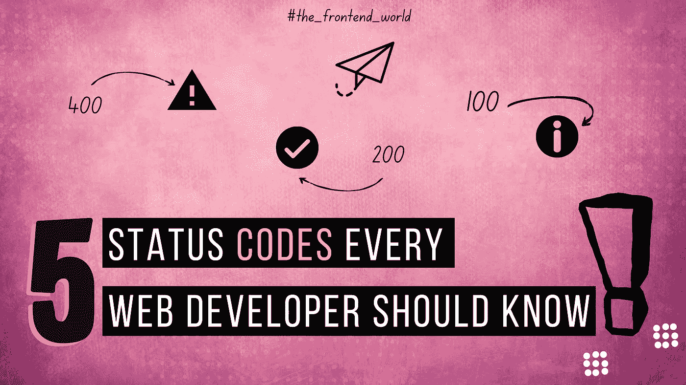
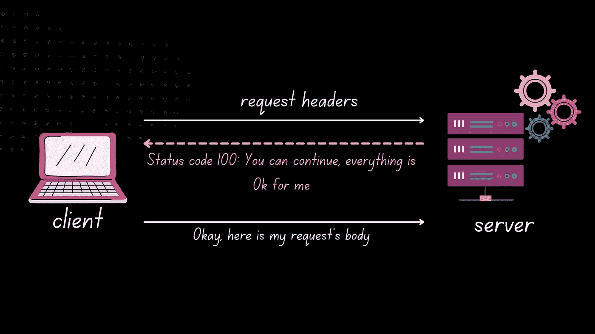
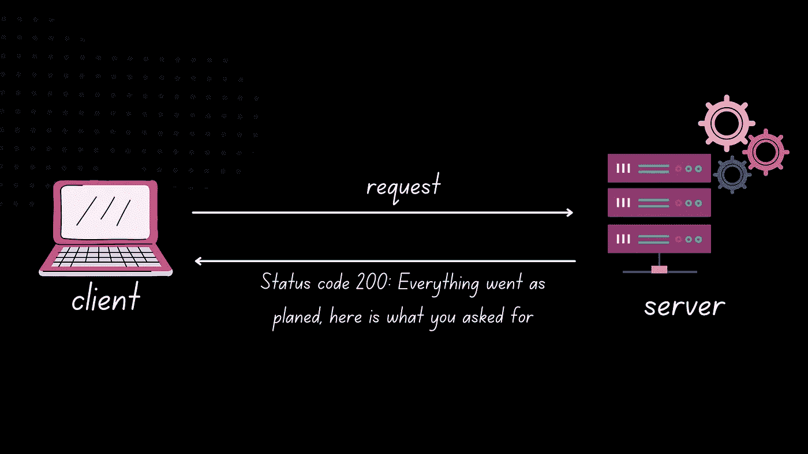
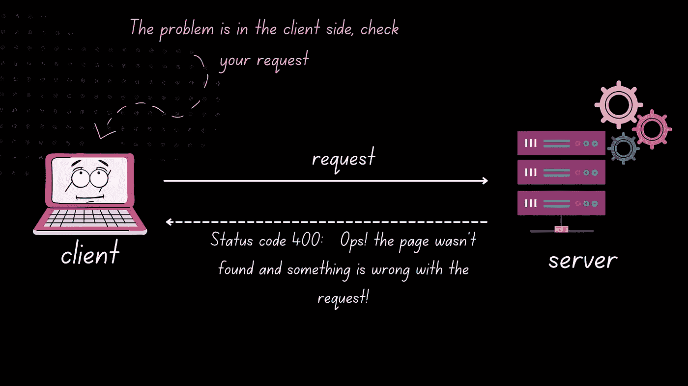
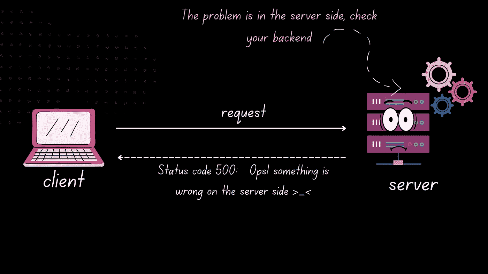

# 每个 Web 开发人员都应该知道的 5 个状态代码

> 原文：<https://javascript.plainenglish.io/5-status-codes-every-web-developer-should-know-c38923c8230?source=collection_archive---------7----------------------->

## 学习这些网络开发的基本状态代码

By FAM

# 1.100 信息

> HTTP `**100**`信息状态响应代码表明一切正常，客户端可以继续请求。

要让服务器检查请求的报头，客户机必须在初始请求中发送`[Expect](https://developer.mozilla.org/en-US/docs/Web/HTTP/Headers/Expect): 100-continue`作为报头，并在发送正文之前接收到一个`100 Continue`状态码作为响应。

By FAM

其他信息代码:

*   100 —继续；
*   101 —交换协议；
*   103-检查站。

# 2.200 成功

> HTTP `**200**`成功状态响应代码表示请求已经成功。默认情况下，200 响应是可缓存的。

成功的意义取决于 HTTP 请求方法:

*   `[GET](https://developer.mozilla.org/en-US/docs/Web/HTTP/Methods/GET)`:资源已经获取，并在消息体中发送。
*   `[HEAD](https://developer.mozilla.org/en-US/docs/Web/HTTP/Methods/HEAD)`:响应中包含表示头，没有正文消息。
*   `[POST](https://developer.mozilla.org/en-US/docs/Web/HTTP/Methods/POST)`:描述动作结果的资源在消息体中发送
*   `[TRACE](https://developer.mozilla.org/en-US/docs/Web/HTTP/Methods/TRACE)`:主体包含服务器收到的请求消息。

一个`[PUT](https://developer.mozilla.org/en-US/docs/Web/HTTP/Methods/PUT)`或者一个`[DELETE](https://developer.mozilla.org/en-US/docs/Web/HTTP/Methods/DELETE)`的成功结果往往不是一个`200` `OK`而是一个`[204](https://developer.mozilla.org/en-US/docs/Web/HTTP/Status/204)` `No Content`(或者第一次上传资源的时候是一个`[201](https://developer.mozilla.org/en-US/docs/Web/HTTP/Status/201)` `Created`)。

# 3.300°重定向

> HTTP `**300**` 重定向状态响应代码表示请求有多个可能的响应。用户代理或用户应该选择其中之一。由于没有选择一种响应的标准化方法，这种响应代码很少使用。

如果服务器有首选，它应该生成一个`[Location](https://developer.mozilla.org/en-US/docs/Web/HTTP/Headers/Location)`头。

重定向类型:

*   301 —永久移动；
*   302 —发现；
*   304 —未修改；
*   305 —使用代理；
*   307 —临时重定向。

# 4.400 个客户端错误

> HTTP(超文本传输协议)`**400 Bad Request**`响应状态代码表示，由于被认为是客户端错误的原因(例如，格式错误的请求语法、无效的请求消息组帧或欺骗性的请求路由)，服务器无法或不会处理请求。

其他客户端错误代码:

*   400:请求错误；
*   401:未授权；
*   403:禁止；
*   404:没有找到；
*   408:请求超时；
*   410:没了；
*   418:茶壶；
*   429:请求太多。

# 5.500 个服务器错误

> HTTP `**500 Internal Server Error**`服务器错误响应代码表示服务器遇到了意外情况，导致无法完成请求。

这个错误响应是一个通用的“无所不包”的响应。通常，这表明服务器找不到更好的 500 错误代码来响应。有时，服务器管理员会记录错误响应，如 500 状态代码，其中包含有关请求的更多详细信息，以防止将来再次发生错误。

其他服务器错误代码:

*   500 —内部服务器错误；
*   502 —错误的网关；
*   503 —服务不可用；
*   504 —网关超时。

Designed by FAM

亲爱的读者，我希望这是明确和有用的。我希望你和你的家人无论在哪里都安全！坚持住。明天会更好！

**让我们在** [**上取得联系**](https://medium.com/@famzil/)**[**Linkedin**](https://www.linkedin.com/in/fatima-amzil-9031ba95/)**[**脸书**](https://www.facebook.com/The-Front-End-World)**[**insta gram**](https://www.instagram.com/the_frontend_world/)**[**Youtube**](https://www.youtube.com/channel/UCaxr-f9r6P1u7Y7SKFHi12g)**或**********

******[www.fam-front.com](http://www.fam-front.com/)******

*******更多内容请看*[***plain English . io***](http://plainenglish.io)******