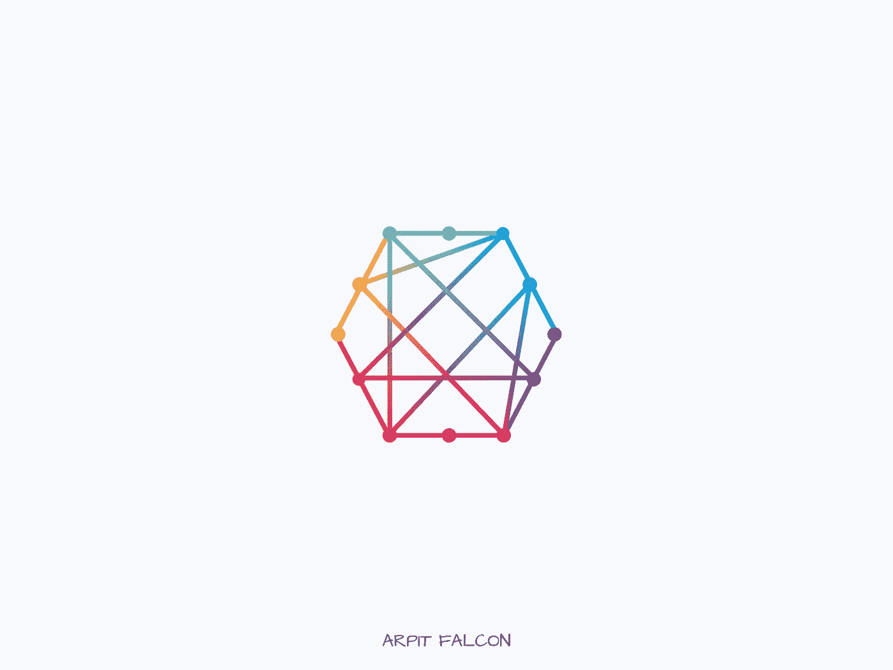

# 解决复杂编程问题的 5 步流程

> 原文：<https://javascript.plainenglish.io/5-step-process-to-solve-complex-programming-problems-8e4f74cfd88e?source=collection_archive---------9----------------------->

## 我使用的有效解决问题的步骤。

Photo by Author

你是否一直在纠结一个编程问题？作为一名开发人员，在日常生活中，你必须面对数十个编程问题，你必须解决这些问题才能让软件运行。

这是一个令人筋疲力尽的过程，但这就是为什么你会得到报酬。公司可以培训任何人写代码，但不是每个人都能解决他们的问题并将解决方案转换成代码。

解决问题是 21 世纪最需要的关键技能之一。

当你面对一个新问题时，有一个系统可以依靠，这会有所帮助。当我面临一个编程问题时，我会采用以下 5 个步骤。

## 1.理解问题

解决生活中任何事情的第一步是理解你想要达到的目标。不要犯这样的错误，在你明白自己在寻找什么之前就试图寻找解决方案。

理解问题的解决方案将导致的目标，然后尽量使问题具体化。人类的头脑与抽象的事物斗争。

## 2.将它分解

理解了问题之后，接下来的过程就是把问题分解成更小的子问题。

跑 10 英里似乎让人无法承受，但是跑一英里是可行的。我在生活的很多领域都遵循同样的原则。

将问题分解成小问题有助于我一次处理一件事，而不会感到不知所措。

## 3.创建解决方案列表

你可能会有不同的解决方法。

我喜欢把我的想法列成一个清单，这样我就不需要记住所有的事情。这解放了我的思想，让我有了新的想法，并帮助我获得更大的视野。

列出可能的解决方案，并开始钻研简单的方案。不要犹豫地划掉解决方案，如果它不起作用，就把它从清单上扔出去。

快速迭代，获得反馈，改进。

## 4.取得微小的进步

人们很容易看不到更大的图景，感觉没有动力。不断取得小进步是让你坚持到底的好方法。

这就是为什么我们开始把问题分解成更小的问题。解决容易的和较小的问题，然后逐渐地在它们的基础上继续发展。

## 5.不要害怕寻求帮助

如果你仍然被这个问题困扰，在网上搜索一下。[栈溢出](http://stackoverflow.com)已超[3100 万答案](https://en.wikipedia.org/wiki/Stack_Overflow#:~:text=As%20of%20March%202021%20Stack,Python%2C%20jQuery%2C%20and%20HTML.)。你找到解决办法的可能性极高。

向你的同事和有经验的程序员询问这个问题，如果他们遇到过类似的事情，他们是如何解决的。

一个好的程序员不是靠多年的经验，而是靠知识的积累和解决问题。

## 5 步流程是—

1.  理解问题和目标
2.  把它分解成更小的子问题。
3.  创建一个解决方案列表并尝试它们。
4.  取得微小但持续的进步来激励自己。
5.  遇到困难时寻求帮助。

## 其他提示-

1.  休息一会儿，出去走走，洗个澡，或者做些屏幕之外的事情。
2.  列出过去对其他问题有效的解决方案，并重复使用它们。
3.  搜索类似问题。

如果你喜欢这篇文章，媒体上还有很多这样的文章。你可以注册阅读它们，每月只需 5 美元。

[**这里是无限制访问媒体上所有内容的链接。**](https://arpitfalcon.medium.com/membership) 如果您使用此链接注册，我将免费为您赚取一小笔费用。

*更多内容请看*[***plain English . io***](http://plainenglish.io/)