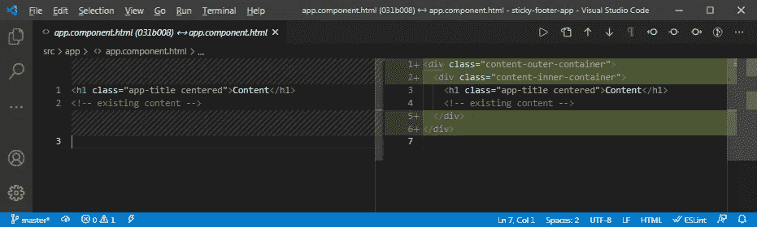

# 通过 5 个步骤在你的 Angular 应用程序中添加一个粘性页脚

> 原文：<https://javascript.plainenglish.io/5-steps-to-adding-a-sticky-footer-to-your-angular-11-application-6c185c2ed99f?source=collection_archive---------0----------------------->

一个常见的设计失误是，当没有足够的内容来填充页面时，页脚决定爬到页面的中间。粘性页脚模式将把你的应用程序的页脚放在适当的位置。


Photo by [Joe Taylor](https://unsplash.com/@joetaylorland?utm_source=medium&utm_medium=referral) on [Unsplash](https://unsplash.com?utm_source=medium&utm_medium=referral)

让我们为您的 web 应用程序添加一个粘性页脚。

## 先决条件/假设

在开始之前，让我们回顾一些需求和假设。首先，应该对粘滞页脚模式的定义达成一致。根据 Mozilla 的说法，“粘性页脚模式是指页面的页脚粘在一起；在内容短于视口高度的情况下，移动到视口的底部。"


Regular footer floating up to the bottom of the view port content vs. Sticky footer at bottom of viewport.

我们将扩展 Mozilla 的定义，并且说当视图端口没有足够的空间容纳所有内容和页脚时，页脚也应该被推出用户的视图端口，在任何内容的下面。


Sticky footer being pushed out of the view port when excess content is available to display.

用于生成本文应用程序的框架是 Angular 11。任何受支持的 Angular 版本(在本文发布时)也可以使用本文向它们的应用程序添加一个粘性页脚。

示例中的应用程序是通过命令`ng new sticky-footer`创建的。在生成之后，在撰写本文之前做的第一件事就是从`app.component.html`文件中删除所有内容，从头开始。

我们正在创建的粘性页脚的高度将是 24 像素，所以所有不同的`padding`和`margin`值设置都是为了匹配这个高度的页脚。

撰写本文时使用的工具的其他版本信息；[节点](https://nodejs.org/en/download/) v12.19.0， [NPM](https://nodejs.org/en/download/) v6.14.1，[角度 CLI](https://cli.angular.io/) v11.2.5， [Visual Studio 代码](https://code.visualstudio.com/download) v1.54.3

# 1.设置文档、正文和应用程序根高度

我们要做的第一步是进入您的`style.css`，或者您正在使用的任何样式表类型，并为整个文档、body 标签和应用程序根标签设置高度。我们将这三个的高度都设置为 100%，以确保我们的应用程序总是充满屏幕，并将我们的粘性页脚推到底部。

因为我们将应用程序设置为填充屏幕，所以我们还想覆盖浏览器设置的一些样式。我们想要覆盖的第一个样式是 body 标记的边距。Firefox 和 Chrome 会默认设置为 8 像素。我们希望确保上边距和下边距为零。如果我们不覆盖这个样式，页面仍然是 100%的高度，加上顶部和底部的 16 个像素的边距。


Application with default body tag style properties.

你可以在上面看到，如果没有设置主体的上下边界，应用程序将会有一个滚动条，但实际上没有内容可以查看。


Application with body top and bottom margins set to zero.

现在你可以看到，我们已经覆盖了*用户代理样式表*，滚动条消失了。一旦我们做了这些更改，styles.css 文件应该包含以下代码片段。

```
/* global styling for sticky footer*/
html, body, app-root {
  height: 100%;
}body {
  margin-bottom: 0;
  margin-top: 0;
}
```

# 2.创建内容包装

下一步是为应用程序中的所有内容创建包装容器。通过进入根组件，将所有内容包装在一个`div`标签中，并添加一个容器类名，可以做到这一点；.即`.content-outer-container`。然后，在应用程序的现有内容周围添加另一个包装器`div`，使用第二个容器类名；即`.content-inner-container`。



Changes in root component template to add a content container.

# 3.设置内容包装样式

一旦您添加了包装器，在组件样式表中，您将为`min-height`的`.content-outer-container`类设置样式属性为 100%。然后将`padding-bottom`的`.content-inner-container`类的属性设置为`36px`。

外部容器用于确保应用程序填充整个浏览器，并将页脚推到页面底部。内部容器在那里，以便当您的内容超出视口时，内容不会溢出到页脚。

## 附加保证金票据

在所使用的应用程序示例中，应用程序的顶部元素是一个`h1`标记。大多数浏览器中的*用户代理样式表*会将`margin-block-start`和`margin-block-end`属性的默认值都设置为值`0.67em`。

类似于正文页边空白会导致滚动条出现，在正文顶部有页边空白的元素也会出现。类似于`body`标签，对于`h1`标签，将上下边距设置为零。在这种情况下，我们可以改为设置顶部和底部填充属性，并获得类似的效果。


Style sheet changes when after adding the content container.

以上是我们添加容器类并更新 hour `h1`标记类的样式后 app.component 样式表的变化。

# 4.创建页脚包装

现在创建页脚包装，并添加任何页脚内容。这是在作为具有`.content-outer-container`类的`div`的直接兄弟的`div`元素中完成的。然后，在新的页脚容器中，您可以在页脚中添加您想要的内容。为了简单起见，在这个示例应用程序中，我将在一个`p`标签中添加我的名字。


The footer container added directly below the content container.

# 5.设置页脚包装样式

我们要设置的第一个样式是`.footer-container`类的。正如本文开头提到的，我们将赋予页脚 24 像素的高度，因此我们可以添加`height: 24px;.`我们将为该类设置的下一个样式属性是`top-margin`。容器类顶部的边距实际上是负数。这是将我们的页脚拉到我们身体的底部，它占据了我们屏幕的 100%。为了给页脚一些喘息的空间，我们可以设置上边距为，`margin-top: -36px`。

因为有了*用户代理样式表*，我们需要为`p`标签类设置上下边距属性，这样我们就有了页脚的所有内容。类似于我们的应用程序顶部的`h1`标签边距将`body`标签推过 100%高度并导致滚动条，标签的`margin-block`属性默认值将导致页边距显示在页面底部，超过应用程序高度的 100%。为了避免这个问题，我们可以将`p`标签类的底部和顶部边距设置为零。

通过一些附加的样式属性，我们可以使用`text-align`、`margin-left`和`margin-right`属性将页脚内容居中。由于我们正在设置`left`、`right`、`top`、`bottom`、`margin`属性，所以我们可以将它们压缩成一行来进行；`margin: 0 auto;`。

在我们完成并压缩了我们的`.footer-content` margin 属性之后，app.component 样式表将具有下面的 CSS 代码片段。

```
.footer-container {
  height: 24px;
  margin-top: -36px;
}
.footer-content {
  margin: 0 auto;
  text-align: center;
}
```

# 成品

现在我们有了一个正常工作的粘性页脚。下面有一些在[lorem ipsum文本为申请内容。当内容没有填满浏览器时，页脚会粘在屏幕底部。](https://loremipsum.io/)


Sticky footer when application on has a little content.

当插入的内容填满屏幕时，页脚会消失，并出现一个滚动条，您可以滚动和查看页脚，而不会有任何内容重叠。


Sticky footer when content overflows past view port.

## 最终审查

看完这篇文章后，你应该有一个很好的方法来为你的 Angular 应用程序添加一个粘性页脚。在这个例子中，我们将页脚的高度设置为 24 像素，并相应地设置填充。可以调整该大小以适合您正在设计的页脚。

有一些默认的样式值是由*用户代理样式表*设置的，特别是`margin-block-start`和`margin-block-end`属性。当问题出现时，特别是不必要的滚动条，这些属性是最有可能的罪魁祸首。

# 结论

祝你好运，编码快乐！

*更多内容请看*[***plain English . io***](https://plainenglish.io/)