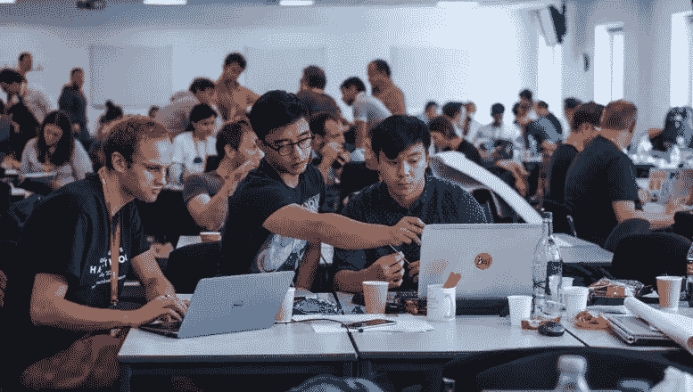

# 在任何黑客马拉松中找到你的团队的 5 个步骤

> 原文：<https://javascript.plainenglish.io/5-steps-to-find-your-awesome-team-at-any-hackathon-3fdbea41f3ea?source=collection_archive---------20----------------------->

# 关于我

我是 Abir，是美国职业黑客联盟的一名工程研究员，在**美国职业黑客联盟**赢得了两次全球黑客马拉松，主题是定向和数据伦理。除此之外，我还被邀请担任大联盟黑客奖学金项目的评委。所以我觉得，我应该分享一部分我在为黑客马拉松选择和发展团队时获得的经验。

## 理想情况下，一个团队应该具有以下规格

*   前端团队/人员
*   后端团队/人员
*   一个可以推销产品，为整个项目制作视频和图片，并跟踪所有截止日期的人。**(通常，第一次参加黑客马拉松的人可以这样做)**

**注意:一个团队应该有一个中等经验的人，如果每个人都是初学者，当然，你们都不会学到任何东西，所以确保你是团队的一部分，其中至少有一个人有一些开发经验。**

# 步骤 0

如果这是你第一次参加黑客马拉松，那么你要有良好的推销技巧，展示和理解项目结构，帮助他们制作图形和视频。

# 第一步

*   如果你是一个前端的人，接触一个有后端和推销技巧的人。
*   如果你是一个后端的人，联系一个有前端和推销技巧的人。

# 第二步

*   集思广益，提出与任何一个主题相关的想法。
*   避免挑选非常基本的想法(如信息展示，或其他任何东西)
*   总是选择一个你认为 70%有信心，30 %没有信心的想法，这样你们都可以在黑客马拉松中学习和探索。

# 第三步

*   制作一个 discord 服务器，定期召开音频会议，了解他们正在做的事情。和你的团队相处愉快，分享你的兴趣，也放松一下。

# 第四步

*   最后，你会有一个团队和好朋友，你们互相认识，你们可以一起创造东西。也许你的第一份工作推荐是由你的队友完成的。

# 感谢您的阅读！

*更多内容请看*[***plain English . io***](http://plainenglish.io/)