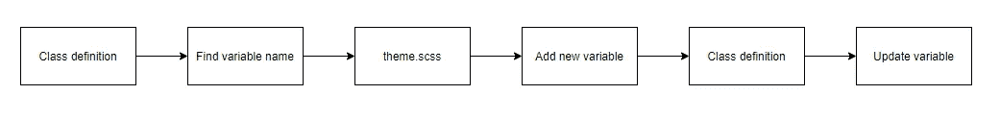

# 在复杂项目中实现可维护和可扩展的 Sass 主题的 5 个步骤

> 原文：<https://javascript.plainenglish.io/5-steps-to-implement-maintainable-and-scalable-sass-theming-in-complex-projects-76bb6da0a8e6?source=collection_archive---------2----------------------->

样式通常是任何项目中最无组织的方面之一，因为做事情的方式太多了。

你使用内嵌样式吗？自举？朴素的老 CSS？样式组件？在我最近开始的工作中，我的任务是重构一个笨拙的 Sass 代码库，该代码库用于设计一个大型 monorepo React 项目。当我第一次接触这个项目时，即使是对最简单的样式进行更改也是一场噩梦——有些组件是内联样式的，有些是在 Sass 文件中作为类定义的，有些是用于样式化 monorepo 中其他项目的 CSS，这些项目使用了可怕的“！重要”。

通过利用 Sass 最擅长的东西，我很高兴地说，随着事情更加简化，这个项目的状态现在看起来更加光明，我认为这是一件非常愉快的事情。我相信这种精简的结构肯定会帮助团队中的其他人在将来任何样式需要更新时更有效率，更少沮丧。

在这篇文章中，我将分享我为达到这一点所做的决定，以及为什么我希望能给你带来一些我正在经历的好处。

## 5 个时髦的步骤

**步骤 1:创建标准化的文件夹结构**

如果你对萨斯有所了解，你可能知道由[凯蒂·吉罗德](https://kittygiraudel.com/)撰写的[https://sass-guidelin.es/](https://sass-guidelin.es/)萨斯指南。

在这篇文章中，Kitty 回顾了 Sass 的架构，并指出架构样式是项目中最难做的事情之一。没有人说过更明智的话。

在我目前从事的项目中，所有的 Sass 文件都被简单地放在一个文件夹中。更糟糕的是，有些文件毫无理由地存在于自己的文件夹中。这使得浏览代码进行更改变得相当混乱，尤其是对于像我这样最近才加入团队的人来说。在 sass 指南文章中，Kitty 继续介绍了 7–1 模式，在该模式中，您将 Sass 文件分为 7 个类别，它们位于各自的文件夹目录中。这 7 个类别是:

*   基地/
*   组件/
*   布局/
*   页数/
*   主题/
*   摘要/
*   供应商/

我认为这是一个很好的主意，因为我不想花费大量的时间对我必须编写的 Sass 文件进行分类(请不要给我太深的嵌套结构)，同时保持一些有序的外观。团队中的其他开发人员也应该能够很容易地知道新的 Sass 文件需要放在哪里。关于 7–1 结构的一个问题是，我认为项目不需要所有提议的文件夹，所以我根据我们的需要对其进行了修改，最终得到了这些目录:

*   组件/
*   布局/
*   页数/
*   摘要/
*   第三方/

当然，你可以使用任何你想要的文件夹，并不局限于这 7 个，但是它们是一个很好的开始思考如何组织你的项目的地方。

第二步:反思自己的工作流程
在更新整个项目的主题时，我清楚地意识到更新 CSS 有一个非常特殊的工作流程。对这个工作流程的理解，尤其是从一个不熟悉代码库的人的角度，帮助我以一种任何开发人员都应该能够快速做出主题更改的方式来构建主题。

那么，如何对项目的特定组件进行 CSS 更改呢？请注意，在本文中，我们讨论的是捆绑 Sass 在项目中的使用，而不是其他方法，如样式化组件。

对于 Sass 方法，我认为大多数人会直接使用浏览器的开发工具，并使用选择工具来找出组件的 HTML 元素是什么。如果幸运的话，您会看到样式是由一个 CSS 类应用的，您可以简单地返回到您的编辑器，搜索项目的文件，并从那里快速进行更改。

Tools like Vscode lets you quickly search through all the files in your project

现在考虑一下，如果样式是内联应用的——没有办法从你的文本编辑器中找到它的位置，因为同样的样式可能已经应用在一百万个其他地方。您将不得不从默认的开发工具切换到 React DevTool(您肯定应该有),您正在使用它来找出组件名，在您的项目中找到组件，然后在那里进行更改。

How in-line styling slows down the workflow

现在，这可能看起来有些吹毛求疵，你可能不认为这样做不需要太多时间，但是当你在一个大项目中工作时，这些小的不便会很快增加到几百个文件，并且会成为一个巨大的时间陷阱。这里的教训是，事情应该是一致的——如果您的项目是由 Sass 设计的，那么就利用 Sass，不要为了方便而在项目是由 Sass 设计的时候编写内嵌样式。

**第三步:避免特定于颜色的变量**
Sass 最棒的一点是，您可以定义变量，并在将它们导入包层次结构后在任何地方使用它们。这对于定义项目的整体主题非常有用，您可以将所有主题变量存储在一个文件中。这样，如果你想改变一个元素的特定颜色，你就知道在哪里改变它。

这里的事情是，我在上一步中描述的工作流仍然适用——如果你对项目一无所知，你仍然会首先检查 dev 工具，然后你去类定义所在的地方。在类定义中，您将会看到使用了什么变量，然后您可以使用您的主题 Sass 文件来更新该变量。

考虑这样一个场景，您有一个在类定义中使用的名为`$project-dark-red`的变量。现在您不能简单地对`$project-dark-red`进行修改，因为其他组件可能正在使用这个变量。你必须创建另一个变量(例如`$project-dark-red2`)，然后返回到类定义来更新这个变量。对我来说，这很不方便。

Too many steps for me

那么我们如何解决这个问题呢？那么，我们不在类定义中使用特定于颜色的变量怎么样？如果您正在设计一个卡组件的样式，例如使用一个名为`$card-bg`的变量。这样，当您创建主题定义文件时，您只需在那里更改变量。如果您想在多个地方使用相同的颜色，请在文件的顶部定义颜色变量，并将它们应用于特定于组件的变量。

**第四步:尽量少用“颜色”和“！**
利用“颜色”和“重要”！重要”使得改变事情变得困难。同样，你可以练习思考你的工作流程来得出这个结论。"!重要”只是当组件在新的项目中被重用时，更难重写。内嵌应用的“颜色”(又名文本颜色)更糟糕，因为它覆盖了我们的类定义。

对我来说，使用“颜色”和简单地应用像$text-color 这样的东西对于一个复杂的项目来说是不够的，在这个项目中，你可以有或亮或暗的背景元素。使用两个颜色变量，比如$text-color-light 和$text-color-dark 更好，但问题是，当元素的背景被更新为不同的颜色时，我讨厌为每个组件手动应用这些颜色变量。

让我们利用 mixins 和 functions magic 来策略性地偷懒。

有了这个 mixin，你再也不用担心元素的文本颜色是否有足够的对比度，你只需要写一行 CSS 代码。每当你去更新你的主题文件时，你将不必回到类定义来更新颜色。如果出于某种原因，您碰巧决定该元素应该有不同的文本颜色，您总是可以选择在类定义中的 mixin 之后应用该颜色。

第五步:主题切换器 Sass way
我为这个项目做的一个功能是给项目增加切换主题的功能。现在我不知道这是否是在 Sass 项目中进行主题切换的最佳方式，但它对这个项目来说足够好了。我使用的方法是从本文[中提到的方法](https://medium.com/@katiemctigue/how-to-create-a-dark-mode-in-sass-609f131a3995)和[中提到的方法](https://codepen.io/dmitriy_borodiy/pen/RKzwJp)改进而来的，增加了我在本文中已经讨论过的原则。

该方法基于使用这个 mixin，它被编译成您在 themes 变量中定义的主题。

现在，这种方法与我在第 3 步中讨论的原则很好地配合，在第 3 步中，显式地定义组件的名称，而不是指定颜色。然而，仅仅按原样使用 mixin 会破坏第 4 步，所以让我们将它与第 4 步中的 mixin 结合起来，以避免不必担心文本颜色

**它从来都不是完美的…**
在这篇文章中，我总结了我在一个复杂项目中尝试重构 Sass 主题时学到的所有经验。我不认为这是完美的解决方案，你可能同意也可能不同意我所做的一切。但是，希望这给了你灵感去思考你自己和你的团队的工作流程，让 Sass 为你服务。

## 有用的资源

萨斯指导方针:[https://sass-guidelin.es/](https://sass-guidelin.es/)

sass dark-mode:[https://medium . com/@ katiemctigue/how-to-create-a-dark-mode-in-sass-609 f 131 a 3995](https://medium.com/@katiemctigue/how-to-create-a-dark-mode-in-sass-609f131a3995)

萨斯黑暗模式密码笔:[https://medium.com/r/?URL = https % 3A % 2F % 2f code pen . io % 2f dmitriy _ boro DIY % 2f pen % 2 frkzwjp](https://codepen.io/dmitriy_borodiy/pen/RKzwJp)

## *延伸阅读*

 [## 使用 React 和 Bit 在组件中进行主题化

### 工程和设计团队面临的一个大的组织问题是分离外观和感觉…

比特云](https://bit.cloud/blog/theming-in-components-with-react-and-bit-l386casw) 

*更多内容请看*[***plain English . io***](https://plainenglish.io/)*。报名参加我们的* [***免费周报***](http://newsletter.plainenglish.io/) *。关注我们关于*[***Twitter***](https://twitter.com/inPlainEngHQ)[***LinkedIn***](https://www.linkedin.com/company/inplainenglish/)*[***YouTube***](https://www.youtube.com/channel/UCtipWUghju290NWcn8jhyAw)***，以及****[***不和***](https://discord.gg/GtDtUAvyhW) *对成长黑客感兴趣？检查* [***电路***](https://circuit.ooo/) ***。*****