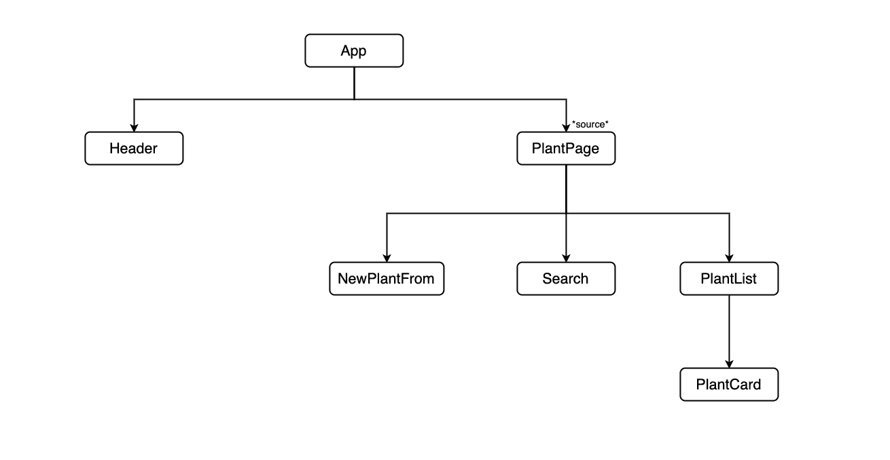
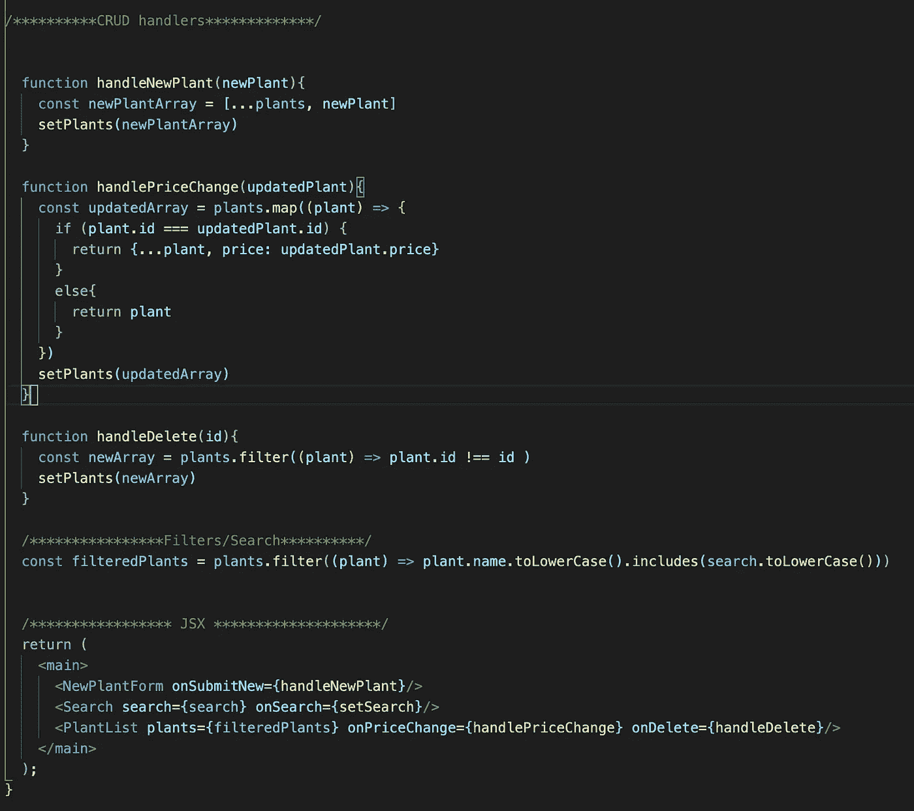
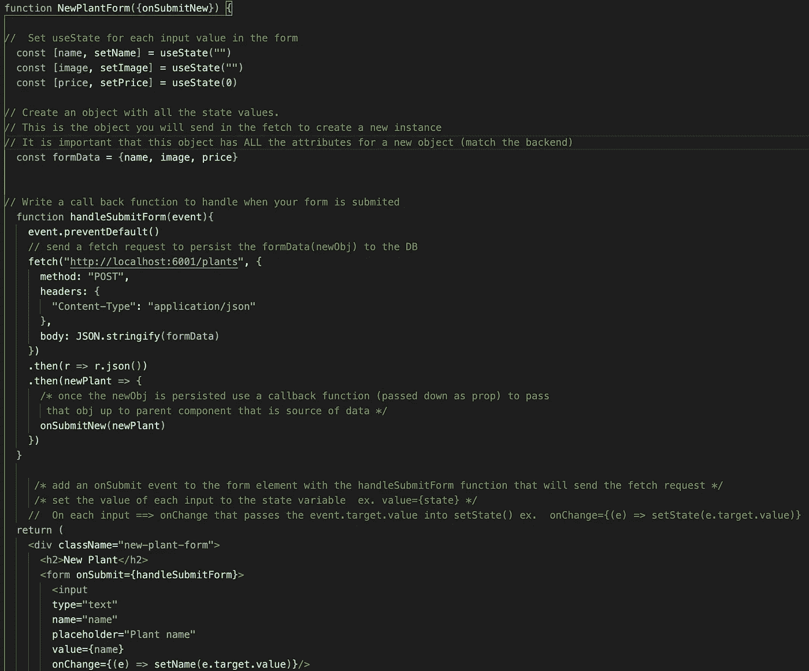
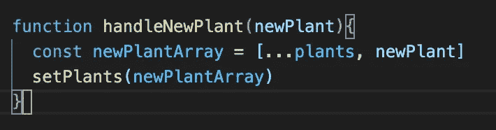
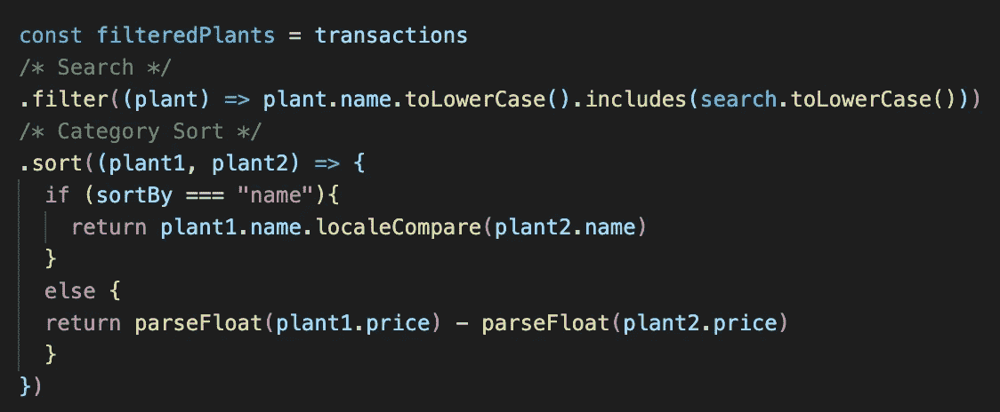

# 帮助我学会反应的 5 件事

> 原文：<https://javascript.plainenglish.io/5-things-that-helped-me-learn-react-80d6c48ada5?source=collection_archive---------6----------------------->

这是迄今为止对我来说最具挑战性的训练营阶段。一个应用程序被分解成许多组件，数据从这些组件中流入流出，这让我完全不知所措。这就像试图把一个拼图拼在一起，但所有的部分都在移动。直到我开始将 React 分解成几个部分，并试图单独理解每一部分，我才能够将它们整合在一起。我决定把一些我觉得有用的东西列成一个清单，以便让我理解 React。

# 1.画出部件流程图

老实说，在开始的时候，我认为这是一个不必要的步骤。随着组件数量的增加，跟踪和理解数据流变得更加困难。直到我们开始在超过三个组件的实践实验室中工作，我才真正理解绘制流程图的重要性。识别哪个组件需要成为数据源以及我需要通过哪些组件传递数据变得容易多了。画出这些流程图确实帮助我理解了数据流以及信息是如何通过组件传递的。

# 2.组织源组件

源组件可能会被不同的函数和变量弄得杂乱不堪，它们都试图处理传入和传出的数据，我总是在混乱中迷失方向。我发现根据功能的用途将它们组织成不同的类别，这样更容易管理。它不仅使阅读和查找东西更快，还迫使我停下来思考。我不得不停下来，通过考虑我需要的函数属于哪一类，来弄清楚我实际上想要做什么。一旦我从子组件获得了信息，我就必须暂停并思考“好吧，我要用这些信息做什么呢？”或者“这个函数属于哪一类”。这个过程真的帮助我理解了一切是如何运作和协同工作的。

# 3.分解更高功能的组件

在实践实验室中，我总是会碰到一堵墙，而那堵墙似乎总是一个表单、搜索栏或过滤菜单。这通常导致必须检查解决方案分支，这将涉及更改我已经编写的代码，并且在这个过程中我会迷失方向。我开始将这些更高功能的组件，比如表单，分解成一个我需要的通用清单。这帮助我弄清楚我在实际组件中需要什么，在父源组件中需要什么，以及需要在它们之间传递什么。将它分解有助于我更好地理解每个部分所扮演的角色，以及它在这个组件中的工作方式与在另一个组件中的工作方式之间的差异。

Inside the form component

Inside the source component

Passing the callback from the source component down to the form component

# 4.链接功能

这可能被认为是一个重新因素，但我发现它在可视化数据集合被操纵的所有方式方面是有用的。最初，我分别编写每一个搜索、过滤和排序(都来自不同的组件),我不知道如何以及何时应用它们。通过将它们链接在一起，在呈现之前，可以更容易地可视化应用于数据集合的所有内容。

# 5.实践

react 最难的部分之一是逻辑。试图弄清楚如何处理给你的数据，如何渲染你想要的东西，而忽略你不想要的东西。虽然听起来很烦人，但通过练习只会变得更容易。在这个阶段，我肯定比其他阶段做了更多的练习。虽然变得容易了，但我仍然需要更多的练习。