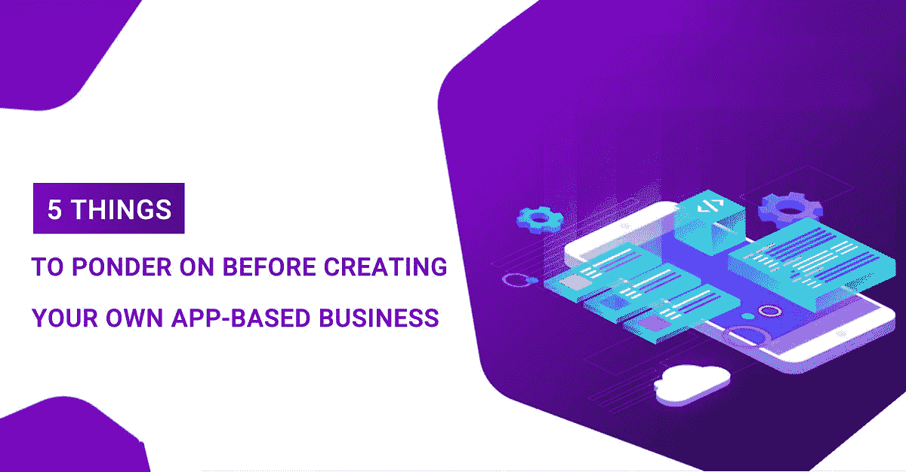
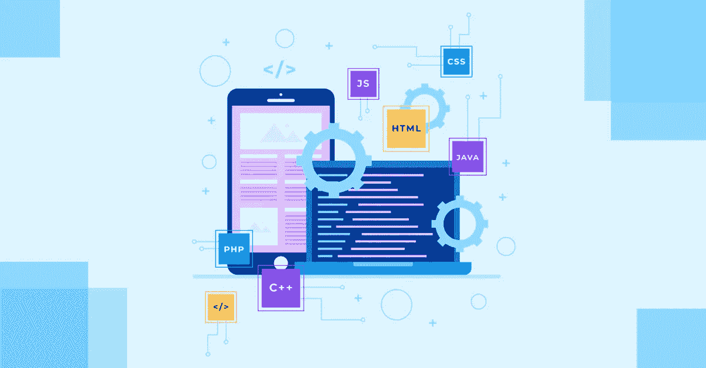

# 在创建自己的基于应用的业务之前，需要考虑的 5 件事

> 原文：<https://javascript.plainenglish.io/5-things-to-ponder-before-creating-your-own-app-91cb5bb14edb?source=collection_archive---------16----------------------->

*“你有独特的商业理念吗？你为它做了一个 app 吗？你了解* [***app 开发成本***](https://www.technource.com/blog/mobile-app-development-cost-complete-guide/) *吗？”这是当今初露头角的企业家在分享他们发展新业务的想法时会被问到的典型问题。看看技术是如何颠覆几乎每个行业的，你很难摆脱这样一种观念，即拥有一个适合你业务的应用程序可以证明对你的业务非常有益。*

但是仅仅有一个独特的商业想法是没有回报的。在线应用市场竞争如此激烈，以至于那些没有计划好前进道路的人肯定会失败。此外，开发一个应用程序可能会被证明是一件昂贵的事情。毫无准备地进入应用程序开发过程无异于职业自杀。

那么，我们应该做些什么呢？

请继续阅读！这篇博客分享了一些基本的见解，这些见解肯定会增强你对应用程序开发过程的理解。

让我们来看看与应用程序业务相关的一些统计数据。这将为我们提供一个你应该参加什么样的竞争的概述。

# **统计分析:**

> 2020 年第三季度不同平台上的应用数量如下:

*   谷歌 Play 商店
*   苹果应用商店:19，60，000
*   Windows 应用商店
*   亚马逊应用商店

> 多年来移动应用收入的增长和未来预测:

*   2015 年:1520 亿美元
*   2020 年:5820 亿美元
*   2023 年:9350 亿美元

> 预计 2020 年至 2024 年移动应用的 CAGR 分别为 10.4 %。预计到 2024 年市场容量将达到 52 . 74 亿美元。

通过前面几点，我们了解到移动应用程序开发领域以前和当前的市场场景。我们还深入了解了应用程序世界的未来。

现在，让我们把注意力集中在了解哪些方法可以被反复灌输，以创建一个成功的移动应用程序，满足其用户并赚取收入。

# **评估你的利基市场的期望&必需品:**

你愿意通过你的应用程序提供服务或产品。但是，在考虑添加什么功能之前，最重要的问题应该是“你为谁构建它？”

如果你想出的答案是“每个人”，那么你不是在为任何人建造它。了解你的定位有助于缩小你的应用程序中许多重要的附加物。你应该深入研究你的人群的年龄、性别、爱好、偏好、观点和其他相关信息。

如果您打算选择最小可行产品(MVP ),上面提到的括号将帮助您决定包括哪些特性。如果你想让成千上万的人从一开始就喜欢和崇拜你的应用，你的应用必须是可扩展的。

# **选择最小或最大可行产品:**

您可以通过决定是否要构建最小或最大可行产品来开始您的项目。这两者是相反的策略，需要不同的计划和方法。这两种策略各有利弊。但是就风险而言，构建最大可行的产品风险更大。

MVP 的概念最适合你的预算，或者你想在投资一个全功能应用之前知道你的应用是否可行。创建 MVP 的额外优势是您有时间将产品推向市场，并可以选择创建多功能产品。

使用 MVP，你可以映射即时变化，这取决于你的利基如何响应你的应用程序。例如，如果你有一个足够成功的网站，你想提供一个商业应用程序，你可以建立一个 MVP。根据回应，如果你看到了进展，那么你可以分配资源来开发一个成熟的应用程序，具有更好的 UX 和移动特定的功能。

记住，一个 MVP 并不适用于你想涉足的所有行业。如果你的人群喜欢具有独特地位和功能的产品，那么选择 MVP 不会产生丰硕的成果。

苹果仍然是一个最好的例子，说明一个最可行的产品如何颠覆整个行业，并让人们痴迷于它。想象一下，如果史蒂夫·乔布斯想要获得 MVP，今天的世界还会是这样吗？

# **App 开发&预算分配:**

在 [***app 开发框架***](https://www.technource.com/blog/top-10-mobile-app-development-frameworks/) 中做出选择后，创建一个 app 最具挑战性的任务之一就是预算。尤其是当企业家或投资者完全不知道开发过程是如何运作的时候。简单地说，它分为两部分。

1.  **时间&材料:** 这里一切都是按小时收费的。小时工资乘以开发团队在沟通、开发、质量检查和其他事情上花费的小时数。
2.  **固定价格:**

项目范围固定，整个项目规划周密。

然而，prior 是一个更灵活的选择，因为它给了客户在项目进行过程中改变独立部分的自由。通过通常的实践，观察到客户总是有建议和改变要做。

从项目开始到结束，很难对整个项目进行评估。甚至更多，如果项目很大的话。因此，建议只对小项目采用“固定价格”合同。

## **第三方服务:**

你在应用中使用的所有其他服务都不会是免费的。例如，在你的应用中反复灌输谷歌或苹果地图是要收费的。所以，如果你的目标是一个大的用户群，那么考虑这些成本是必须的。

举个例子，

**服务器费用:**最低 200-300 美元/年

**支付网关:**每笔交易的小百分比

谷歌地图:100-300 美元/年

## **分析:**

你要花钱的另一件事是分析。你应该考虑到，这些成本在开始时可能看起来不太昂贵，但一旦你启动你的应用程序，每个月或每年都会收取。

## **维护:**

维护是另一项必须考虑的固定费用。因为客户总是忘记制作一个应用是成功的一半，另一半是在发布后维护他们。

App 开发是一个过渡市场。每年新的框架、安全更新、新的设备和操作系统版本、库以及其他类似的更新都要花钱。

## **营销:**

应用开发投资的另一个关键领域是营销。也许是最昂贵的一个。可以理解的是，企业级应用不需要任何营销，但面向消费者的应用需要健康的预算和有效的战略。

# **丰富 UI & UX:**

大多数投资应用程序的企业家读到这里时都会感到惊讶。对他们来说，设计只是局限于应用程序的外观和感觉。嗯，这比表面上看到的要多得多。

它反映了您的团队在使应用程序功能和流程方便直观方面所付出的努力。应用程序提供的用户界面是用户与应用程序交互的平台。你以功能的形式来表现你的业务，而你的用户界面就是向你的用户提供这些功能的方式。

一个 app 的用户体验就是用户使用你的 app 几次后的感受。这是你对你的应用的看法和用户对它的反应之间的差异。用户体验与你使用的用户界面成正比。用户体验负责将潜在消费者转化为忠实用户。

# **参与策略:**

开发一个应用程序很容易，更具挑战性的任务是产生一个忠实的用户群。突出的问题是“如何推动用户继续使用你的应用？”用户参与是无数事物的结合以及它们之间的良好平衡。

你可以使用传统的“推送通知”让用户参与进来，但是它们太烦人了。你的应用程序的效率只能通过分析来评估。大约 80%的客户在他们的应用程序发布时避免使用分析。分析帮助你了解用户在使用你的应用时的行为，以及应用的哪些部分对你的用户不起作用。

例如，想象你 [***雇佣了一个电子商务开发者***](https://www.technource.com/ecommerce-development-company/) 并开发了一个电子商务网站，但根据你的计算，它并没有产生收入。因此，如果你的应用程序没有在一分钟内发送验证码，结账过程令人困惑，那么所有这些细节都将在你的分析中描绘出来。

因此，了解你的客户如何参与到你的应用中，发现他们面临的问题，并针对这些问题部署解决方案是分析的一部分。

企业家梦想开发能够为客户生活增值的应用，但这并不是唯一需要检验的参数。就收入和用户满意度而言，创建一个成功的应用程序完全是另一回事，需要个人参与和周密的计划。如果你是一个想要开发成功应用的初露头角的企业家，那么你必须遵循正确的[移动应用开发指南](https://www.technource.com/blog/mobile-app-development-guide-to-beginners/)以及从一开始的实践。

*更多内容请看*[***plain English . io***](http://plainenglish.io/)