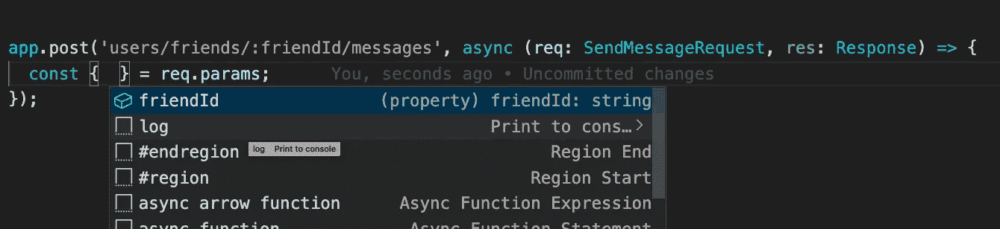

# 如何提高你的快递申请

> 原文：<https://javascript.plainenglish.io/5-things-you-can-do-to-make-an-express-application-become-better-4a357e0f7d9?source=collection_archive---------8----------------------->


Photo by [Safar Safarov](https://unsplash.com/@codestorm) on [Unsplash](https://unsplash.com/?utm_source=medium&utm_medium=referral).

## 1.使用 TypeScript

这只是我的推荐。我在 2017 年开始与 TypeScript 合作，然后我成为 Typescript 爱好者。我的团队成员也很喜欢它。

使用 TypeScript 的主要好处是在错误进入生产之前捕捉更多的错误，并使您更容易使用代码库。

**打字优惠:**

*   静态类型——如果您来自强类型语言，如 Java 的 C#，那么很容易开始。
*   大型编码项目的更好选择——当您在团队中工作时，您的团队应该保持代码库的整洁和可维护性。当大型编码项目有许多开发人员时，就有可能出现混乱的编码。并且错误的数量增加，这使得处理它们变得困难。因此，类型安全具有在编码时检测错误的特性。这使得代码更加高效，我们也可以轻松地调试它。
*   更高的工作效率 ECMAScript 6 代码、动态类型、IDE 或具有自动完成功能的编辑器等特性有助于开发人员提高工作效率。

**JavaScript 的好处:**

*   它有一个巨大的活跃的开发者社区，这使它成为一种流行的语言。
*   它支持原生浏览器。而 TypeScript 将首先被编译，然后被转换成 JavaScript。这就产生了一个额外的步骤。
*   更加灵活。

## 2.导出快速实例

对于 Express，我编写了这样一个 Express 服务器:

我在 Express 定义文件中启动 HTTP 服务器。如果您只导出`app`对象并使用这个`app`在另一个逻辑文件中启动 HTTP 服务器，效果会更好。

这样，你可以将你的`app`用于各种目的。尤其是你不想“启动”你的`app`的时候。例如，用`supertest`为您的`app`编写测试:

```
import app import '../app';request(app)
  .get('/user')
  .expect('Content-Type', /json/)
  .expect(200)
  .end(function(err, res) {
    if (err) throw err;
  });
```

或者，将您的 Express 服务器与另一个框架集成，如`firebase-functions`:

```
import app import '../app';
import functions from 'firebase-functions';// ...exports.app = functions.https.onRequest(app);
```

`Aws-lambda-function`同`[serverless-http](https://github.com/dougmoscrop/serverless-http)`:

```
import app import '../app';
import serverless from 'serverless-http';// ...
exports.handler = serverless(app);
```

## 3.异步处理程序

一个普通的快速错误处理程序如下所示:

```
app.use(function(error: Error, req: Request, res: Response, next: NextFunction) {
  if (error instanceof AppError) {
    res.status(error.status);
  } else {
    res.status(500);
  }
  res.json({ message: error.message });
});
```

用`AppError`:

```
export default class AppError extends Error {
  constructor(
    public status = 400,
    public message = '',
  ) {
    super(message);
    Object.setPrototypeOf(this, new.target.prototype);
  }
}
```

当前的 Express 稳定版本不能处理处理函数中抛出的错误，你必须用错误中的第一个参数调用`next`函数。

例如，您有一条使用`async/await`的路线:

```
app.get('/users/:userId', async (req: Request, res: Response, next: NextFunction) => {
  const { userId } = req.params
  const user = await userService.getUserById(userId);
  res.status(200).json(user);
});
```

如果`.getUserById`抛出一个错误(比如:`throw new AppError(404, 'User not found!');`，你的服务器会崩溃，错误无法处理。为了避免这种情况，我对许多人(包括我自己，第一次)说，使用`try/catch`块来处理它:

```
app.get('/users', async (req: Request, res: Response, next: NextFunction) => {
  try {
    const { userId } = req.params
    const user = await userService.getUserById(userId);
    res.status(200).json(user);
  } catch (error) {
    next(error);
  }
});
```

现在它工作得很好！

但是在每个请求处理程序中有一个`try/catch`语句是很糟糕的。它们使得请求处理程序看起来比实际更复杂。

我们有一个更好的方法来处理路由器中的错误——使用 wrap 异步句柄。

众所周知，异步函数总是返回一个承诺。这意味着我们可以使用`async/await`或仅仅通过`catch`链函数来处理`try/catch`的错误。

让我们创建一个函数，它使用请求句柄作为参数，调用处理函数，并在抛出错误时捕获错误。该函数还返回一个函数作为新的请求处理函数。

```
export const asyncHandlerWrap = (
  handler: (req: Request, res: Response, next?: NextFunction) => Promise<any>,
) => {
  return (req: Request, res: Response, next: NextFunction) => {
    handler(req, res, next)
      .catch(next);
  }
}
```

更新到`GET /users`路由器。

```
app.get('/users', asyncHandlerWrap(async (req: Request, res: Response) => {
  const { userId } = req.params
  const user = await userService.getUserById(userId);
  res.status(200).json(user);
}));
```

包装功能可以应用于请求处理器或中间件。我们仍然可以像平常一样调用`next`函数。但是抛出一个错误，而不是调用下一个有错误的函数。这样会让我们的逻辑容易理解。

```
// User token middleware
app.use(asyncHandlerWrap(async (req: Request, res: Response, next: NextFunction) => {
  const userToken = req.get('authorization');
  const user = await userService.findByToken(userToken); if (!user) {
    throw AppError(401, "access denied");
  } req.user = user;
  next();
}));
```

## 4.自定义请求对象的类型定义

如果您的项目不使用 Typescript，可以跳过这一部分。

自定义对象是具有一个或多个额外属性的快速请求对象。最常见的例子是“add”，它是用户认证中间件中请求对象的用户信息对象。

```
// User token middleware
app.use(asyncHandlerWrap(async (req: Request, res: Response, next: NextFunction) => {
  const userToken = req.get('authorization');
  const user = await userService.findByToken(userToken); if (!user) {
    throw AppError(401, "access denied");
  } (req as any).user = user; // This line
  next();
}));
```

然后，我们可以在“下一个”中间件或处理程序中获得`user`数据:

```
app.get('/users/friends', async (req: Request, res: Response) => {
  const { user } = (req as any); // const user: IUser = (req as any).user;
  const friends = await userService.getFriendsOfUserId(user.id);
  res.json(friends);
});
```

我们可以看到，`req.user`会抛出一个 TypeScript 错误— `Property ‘user’ does not exist on type ‘Request…`。然后，我们必须将 req 对象或包含`user`属性的类型转换为用户对象类型- `IUser`。

让我们定义一个自定义请求对象，如下所示:

```
import { Request } from "express";
interface AuthenticatedRequest extends Request {
  user?: IUser;
}
```

我们扩展`express.Request`类型，`user`是一条附加信息。`user`应该是可选的，那么新建的类型可以赋给`Request`类型。

中间件和请求处理器的`req`参数的更新类型:

```
// User token middleware
app.use(async (req: AuthenticatedRequest, res: Response, next: NextFunction) => {
  const userToken = req.get('authorization');
  const user = await userService.findByToken(userToken);
  if (!user) {
    throw AppError(401, "access denied");
  }
  req.user = user; // This line
  next();
});// Request handler
app.get('/users/friends', async (req: AuthenticatedRequest, res: Response) => {
  const { user } = req; // const user: IUser = (req as any).user;
  const friends = await userService.getFriendsOfUserId(user.id);
  res.json(friends);
});
```

我们可以对像`params, body...`这样的请求对象的现有数据做同样的事情

示例:`POST /users/friends/:friendId/messages`的请求对象

```
interface SendMessageRequest extends AuthenticatedRequest {
  params: {
    friendId: string,
  };
  body: SendMessageDTO,
}
```



Autocomplete for property name

## 5.继承路由器

这只是我们使用 Express 时的一个小技巧。在普通的 Express 应用程序中，我们通常在将路由器注册到应用程序之前注册一个中间件。

```
// "Public" routers
app.use('/auth', authRouter);// Register authenticate middleware
app.user(jwtAuthMiddleware);// Requires authentication routers
app.user('/users', userRouter);
app.user('/documents', documentRouter);// Register admin authorization
app.user(adminAuthMiddleware);// Admin routers
app.use('/admin/users', adminUserRouter);// ...
```

秩序如此重要。我们必须记住在哪里注册中间件，在哪里注册新的路由器。

这个提示将帮助我们更好地控制这种情况。

我们创建一个路由器“工厂”来生成一个基础路由器，然后使用这个路由器来创建一个新的路由器。基本路由将在返回之前注册“公共”中间件。

```
// base router
class AuthenticatedRouter {
  protected router: Router; constructor() {
    this.router = Router();
    this.router.use(jwtAuthMiddleware);
  } getRouter() {
    return this.router;
  }
}class BaseAdminRouter extends AuthenticatedRouter {
  constructor() {
    super();
    this.router.use(adminAuthMiddleware);
  }
}// child routers
class UserRouter extends AuthenticatedRouter {
  constructor() {
    super();
    this.router.get('/', userController.getUsers);
    // ...
  }
}class AdminUserRouter extends BaseAdminRouter {
  constructor() {
    super();
    this.router.post('/', adminController.createUser);
    // ...
  }
}
```

现在，在应用程序中，不需要注册“公共”中间件，顺序也无关紧要。

```
// "Public" routers
app.use('/auth', authRouter);// Admin routers
app.use('/admin/users', adminUserRouter);// Requires authentication routers
app.user('/users', userRouter);
app.user('/documents', documentRouter);
```

## 摘要

我们有太多的东西可以帮助改进我们的应用程序。但是每当我用 Express 开始一个新项目时，这是我经常做的 5 件事。

感谢您的阅读！

*更多内容尽在*[*plain English . io*](http://plainenglish.io/)