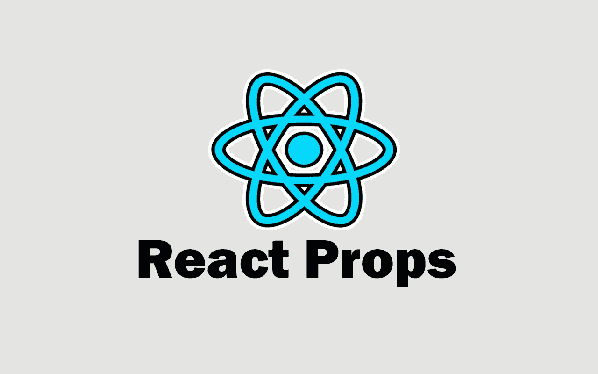
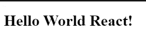

# 关于 React 中的道具，你应该知道的 5 件事

> 原文：<https://javascript.plainenglish.io/5-things-you-should-know-about-props-in-react-7e1d13cd80d8?source=collection_archive---------8----------------------->

## 关于反应道具需要知道的重要事情。



Image created with ❤ ️️️️By author.

在构建用户界面或 web 应用程序时，React 是一个非常流行的 JavaScript 库。它是当今大多数前端开发人员的最佳朋友。

React 有许多强大的特性，使得构建 web 应用程序更加容易。道具就是其中一个特征。这就是为什么在本文中，我们将介绍作为 React 开发人员应该了解的关于 props 的一些事情。所以让我们开始吧。

# 1.道具是在对象内部定义的

道具是在我们可以访问的对象内部定义的。当你把一个道具传递给一个组件时。React 会将该道具作为属性添加到一个名为`props`的对象中。它还会将您在组件中传递的属性值作为对象`props`中的属性值。

这就是为什么我们在 React 中使用带点符号的对象`props`来访问我们的道具。

让我们来看一个例子:

```
*//index.js*import ReactDOM from "react-dom";import App from "./App";const rootElement = document.getElementById("root");
ReactDOM.render(
    <App **message="Hello World"** />,
  rootElement
);
```

如你所见，在 React 项目的文件`index.js`中，我们渲染了组件`App`，并传递给它道具`message`。结果，属性`message`被添加为对象`props`的属性。

所以现在我们可以使用点符号来访问 props 对象，以便使用我们刚刚传递的 props。

下面是一个例子:

```
*//App.js*import React from "react"
import "./styles.css";export default function App(**props**) {
  return (
    <>
     <h1>{**props.message**}</h1>
    </>
  )
}
```

*输出:*


Capture by the author.

因此，屏幕上会显示出正确的值`hello world`。

# 2.您可以析构道具对象

如果您只有几个想要传递给组件的 props，那么在组件的参数中析构 props 对象是一个好的做法。这是一个很好的方法，可以很容易地访问这些道具，并保持你的代码更整洁。

这是我们上面使用的同一个例子，但是现在使用对象析构:

*传递一些道具:*

```
*//index.js*import ReactDOM from "react-dom";import App from "./App";const rootElement = document.getElementById("root");
ReactDOM.render(
    <App **tool="React"** **message="Hello World" ** />,
  rootElement
);
```

*使用 ES6 析构:*

```
*//App.js*import React from "react"
import "./styles.css";export default function App( **{message, tool}** ) {
  return (
    <>
     <h1>{**message**} **{tool}**!</h1>
    </>
  )
}
```

*输出:*



Capture by the author.

如你所见，通过析构 props 对象，我们不再需要使用点符号来访问我们的 props。所以如果你没有什么道具可以传递的话，一定要使用析构。

# 3.真实道具

当涉及到编写 truthy props 时，你甚至不需要给它们赋值`true`。

默认情况下，只传递名称的属性将有一个值`true`。

```
<App **message={true}** />
```

上例与下例相同:

```
<App **message** />
```

所以如果你想写 truthy props，只需传递它们的名字，默认情况下它们会有布尔值`true`。

# 4.轻松传承多个道具

通过将所有道具放入一个对象中，您可以轻松地将多个道具传递到一个组件中。

我们可以通过创建一个包含所有道具的对象来做到这一点。然后我们只需要使用 spread 操作符和对象名就可以轻松地传递所有的道具。

这里有一个例子:

```
*//index.js*import ReactDOM from "react-dom";
import App from "./App";const rootElement = document.getElementById("root");**const articleData = {
  title: "Hello world",
  desc: "Hello world text...",
  readTime: 5,
}**ReactDOM.render(
    <App **{...articleData}** />,
  rootElement
);
```

正如你在上面看到的，我们创建了一个包含我们需要的所有道具的对象`articleData`。然后我们通过使用 spread 操作符和对象名`articleData`将所有的道具作为一个值传递下去。

现在，我们可以轻松访问这些道具:

```
import React from "react"
import "./styles.css";function App( {title, desc, readTime} ) {
  return (
    <>
     <h1>{title}</h1>
     <p>{desc}</p>
     <h4>{readTime}min read.</h4>
    </>
  )
}
export default App;
```

# 5.你可以把任何东西当作道具

任何有效的 JavaScript 数据类型都可以作为属性值传递。你可以把数字、对象、字符串、函数，甚至一个组件作为道具传下去。

下面的例子允许我们通过传递函数`setName`作为道具，从子组件更新父组件的状态。

*父组件:*

```
*//App.js*import React, {useState} from "react"
import "./styles.css";
import Home from './Home'function App() {
  const [name, setName] = useState("VueJS")
  return (
    <>
     <h2>{name}</h2>
     <Home **setName={setName}** />
    </>
  )
}
export default App;
```

*子组件:*

```
*//Home.js*import React from "react";const Nav = (**{setName}**) => {
  return (
    <div>
      <button onClick={()=> **setName("ReactJS")**}>Update Name</button>
    </div>
  );
};
export default Nav;
```

# 结论

在向组件传递小数据和状态时，Props 非常有用。每个 React 开发人员都应该了解它们。然而，当涉及到复杂状态时，您将不得不使用 content API，可能是 Redux，或者任何其他状态管理库。

感谢您阅读这篇文章。希望你觉得有用。

**延伸阅读:**

[](/6-important-tips-to-write-clean-react-code-5ef29d6a73a6) [## 编写干净的 React 代码的 6 个重要技巧

### 作为 React 开发人员，编写干净代码的技巧。

javascript.plainenglish.io](/6-important-tips-to-write-clean-react-code-5ef29d6a73a6) [](/7-awesome-apis-for-all-frontend-developers-a06c1057661) [## 面向所有前端开发人员的 7 款出色的 API

### 您的下一个项目可能需要的有用的 API。

javascript.plainenglish.io](/7-awesome-apis-for-all-frontend-developers-a06c1057661) 

*更多内容请看*[***plain English . io***](http://plainenglish.io)