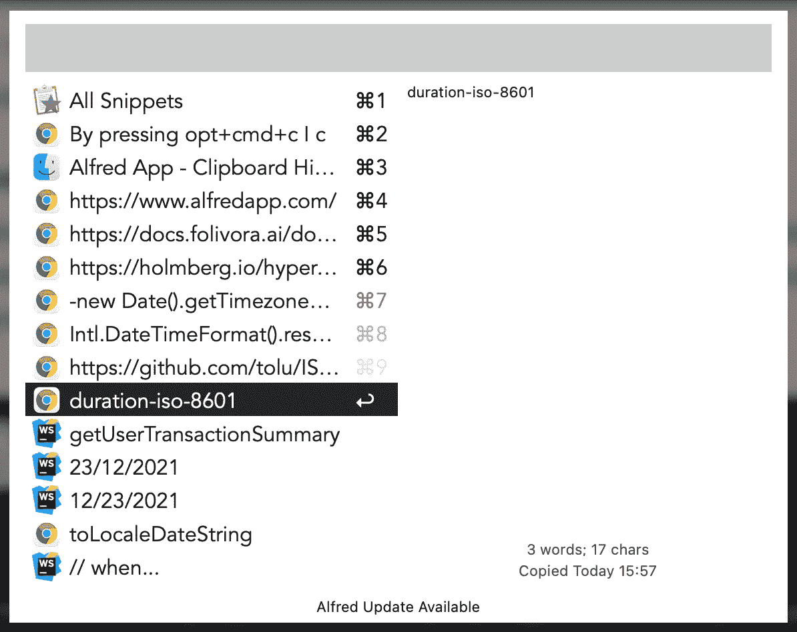

# 提高开发效率的 5 个技巧

> 原文：<https://javascript.plainenglish.io/5-tips-to-boost-your-development-productivity-eb91223f2e24?source=collection_archive---------7----------------------->

## 避免在一些事情上花费大量宝贵的时间，例如，通过这些简单的效率提示，只需要一个键盘快捷键。


Source: [https://unsplash.com/photos/BXOXnQ26B7o](https://unsplash.com/photos/BXOXnQ26B7o)

编程是我餐桌上的食物。和大多数开发人员一样，我希望尽可能地高效。作为一名开发人员，我不仅要花大量时间写代码，还要在应用程序之间切换、复制粘贴、在屏幕上移动等等。

例如，从代码编辑器切换到浏览器并不需要太多时间。你最有可能按下 **CMD + Tab** ，然后一直按下 **Tab** 键，直到你聚焦在你想要切换到的应用程序上。

选择正确的应用程序的速度取决于您当前打开的应用程序的数量，但假设这平均需要 2 秒钟。作为一名开发人员，您一天要在应用程序之间切换 500 次吗？一天 1000 次？这些数字加起来。如果你一天只在代码编辑器、浏览器或终端之间切换 1000 次，突然就变成了 33 分钟左右。

这里有一些关于如何使你的开发流程更省时的提示和技巧。请注意，本文关注的是 macOS。

# 1.大写锁定作为一个超级键

超级键是一个神奇的键，可以自动按下所有标准的修饰键——**ctrl，shift，alt，opt** 。为什么你需要一个超级键？因为很多容易够到的键盘快捷键已经被 macOS 本身或者某个应用程序占用了。

将 Caps Lock 映射到一个超级键，可以为大量易于访问和易于记忆的键盘快捷键腾出空间。

有几个选项可以让你把你的大写锁定变成一个超级键；我可以不假思索地推荐:

1.  使用**登山扣元件—**[https://holmberg.io/hyper-key/](https://holmberg.io/hyper-key/)。
2.  使用**更好的触摸工具—**[https://docs.folivora.ai/docs/1004_hyper_key.html](https://docs.folivora.ai/docs/1004_hyper_key.html)。

我一直在使用**登山扣元素，**但真正重要的是什么适合你。在这篇文章的后面，你会看到一些我如何使用快捷键的例子。

# 2.阿尔弗雷德应用程序

我已经使用 Alfred App 两年多了，我无法想象会回到过去。阿尔弗雷德为你提供了大量的功能。我将只提到我最常用的几个。

## 剪贴板历史

这个功能节省了我大量的时间。作为一名开发人员，我经常需要将多个东西复制到我的剪贴板中，而只有一个剪贴板被重写是非常有限的。


Alfred App — Clipboard History Settings

按下 **opt+cmd+c** (你的快捷键可以不同)打开一个剪贴板历史管理器，在这里我可以轻松访问我用标准系统 **cmd+c** 快捷键复制的所有内容。



Alfred App — Clipboard History Manager

您不仅可以访问文本，还可以访问使用 **cmd+ctrl+shift+3** 或 **cmd+ctrl+shift+4** 快捷键拍摄的图像截图。

如果你喜欢更简单的东西，还有像 Maccy 或 Clipy 这样的应用。

*   梅西的主页[https://maccy.app/](https://maccy.app/)。
*   Clipy 的主页[https://clipy-app.com/](https://clipy-app.com/)。

## 工作流程

要使用阿尔弗雷德功能，你必须购买阿尔弗雷德动力包—[https://www.alfredapp.com/workflows/](https://www.alfredapp.com/workflows/)。

工作流可以为您创造奇迹。我有一大堆定制的工作流，它们的目的非常简单——打开一个应用程序，或者如果它已经打开了，将它置于焦点上。此外，这是我使用大写锁定作为一个超级键。

*   T21 掀起了一场网络风暴🔥。
*   **Caps Lock + T** 打开一个终端🔥。
*   **Caps Lock + D** 打开谷歌浏览器🔥。
*   **Caps Lock + M** 打开 Facebook Messenger。
*   **Caps Lock + N** 打开便笺。
*   **大写锁定+ P** 打开 1 个密码。

总而言之，我有 16 个快捷方式来快速访问我最常用的应用程序。在我的 IDE、浏览器和终端之间切换是一个超级简单的快捷方式。我不再需要在打开的应用程序列表中寻找合适的应用程序。

见 app 首页—[https://www.alfredapp.com/](https://www.alfredapp.com/)。

# 3.窗口管理

调整窗口大小、对齐窗口、将窗口移动到不同的屏幕。这些都不应该是你用鼠标做的事情。有很多应用程序可以帮助你管理你的应用程序窗口。举几个例子——BetterSnapTool、Magnet、Divvy。

但是我用的是**矩形—**[https://rectangleapp.com/](https://rectangleapp.com/)。矩形是不再保留的应用程序眼镜的替代品。它提供了相同的功能和更多的功能。

我没有使用所有的磁铁选项，但下面是我的一些绑定:

*   **cmd+opt+ctrl+↓**将应用程序移到屏幕的左三分之一/一半/三分之二处🔥。
*   **cmd+opt+ctrl+** → **🔥。**
*   **cmd+opt+ctrl+** ↑ 将应用程序移动到屏幕的上三分之一/一半/三分之二。
*   **cmd+opt+ctrl+** ↓ 将应用移动到屏幕底部三分之一/一半/三分之二。
*   **cmd+opt+ctrl+。**将应用程序移至下一屏幕🔥。
*   **cmd+opt+ctrl+，**将应用程序移至上一屏幕🔥。
*   **cmd+opt+ctrl+enter** 最大化应用程序的窗口。

我所有的窗口管理键盘快捷键都是以 **cmd+opt+ctrl** 开始，然后是其他键。超级容易记住，超级容易获得，超级快速使用。

链接到其他窗口管理应用程序:

*   **https://folivora.ai/bettersnaptoolBetterSnapTool—**T22。
*   **磁铁**—[https://magnet.crowdcafe.com/](https://magnet.crowdcafe.com/)。
*   迪夫维——[https://mizage.com/windivvy/](https://mizage.com/windivvy/)。

# 4.快捷键

macOS 中已经有很多现成的键盘快捷键了。

## 马科斯

*   **cmd+`** 在聚焦应用程序的窗口之间切换(例如，在 Google Chrome 窗口之间切换，如果您有更多窗口的话)
*   **cmd+ctrl+space** 打开表情选择器。🔥 😌


macOS emoji selector

## 谷歌浏览器

其中一些也适用于大多数其他浏览器，如 Mozilla Firefox 或 Safari。

*   **打开新的浏览器标签。**
*   **cmd+l** 焦点网址地址栏🔥。
*   **cmd+f** 在应用程序中搜索文本。
*   **cmd+g** 高亮显示下一个搜索事件🔥。
*   **cmd+shift+g** 突出显示前一次搜索🔥。
*   **cmd+shift+[** 或 **cmd+opt+←** 转到上一个选项卡。
*   **cmd+shift+[** 或 **cmd+opt+** → 转到下一个选项卡。

## 额外小费🔥🔥🔥

像大多数开发人员一样，我有一个外部显示器。我发现自己经常在浏览器中打开一个新标签，在(通常是 youtube.com)中键入一个地址，然后想把那个标签抓取到另一个显示器上并最大化它。

**磁铁** app(还有我的键盘快捷键)可以帮我把窗口移到另一个屏幕，最大化。但我不知道如何将当前选中的谷歌浏览器标签移动到一个新窗口，然后我可以移动。

经过一番谷歌搜索，我找到了一个解决办法。你必须打开你的键盘偏好设置，进入快捷键标签，通过 **+** 按钮添加 Google Chrome.app。你为这个动作创建了一个快捷方式，在“菜单标题”输入中，你必须从谷歌 Chrome 的菜单栏中放入你想要执行的相同动作(区分大小写)。在这种情况下**移动标签到新窗口。**


macOS Keyboard Shortcuts

所以现在，整个过程只是三个键盘快捷键的问题。

1.  **Caps Lock + ↑** 将活动标签页移动到新窗口。
2.  **cmd+opt+ctrl+，**移至上一个显示画面(或。转到下一个显示)。
3.  **cmd+opt+ctrl+enter** 最大化浏览器窗口。

# 5.更多屏幕空间

当您在没有外接显示器的情况下工作时，这些提示会很有帮助。你想要尽可能多的屏幕空间。

## 隐藏 macOS 菜单栏和 Dock

通过隐藏顶部菜单栏和 Dock，您可以获得一些额外的空间。如果您将鼠标移动到屏幕的顶部边缘，菜单栏将会显示。如果您将鼠标移动到屏幕的底部边缘，Dock 将会显示。


macOS hide Menu Bar and Dock

## 停靠显示动画速度

Dock reveal 动画感觉太慢了。Dock 是隐藏的，给我一些额外的空间，但当我需要它时，我需要它越快越好。

使用以下命令完全禁用动画:

```
defaults write com.apple.dock autohide-time-modifier -int 0;killall Dock
defaults write com.apple.dock autohide-delay -float 0;killall Dock
```


macOS Dock reveal without animation

如果希望显示动画持续一秒钟，请使用以下命令:

```
defaults write com.apple.dock autohide-time-modifier -float 0.15;killall Dock
```

要恢复到默认状态:

```
defaults delete com.apple.dock autohide-time-modifier;killall Dock
defaults delete com.apple.dock autohide-delay;killall Dock
```

# 结束了

我希望这些建议能让你在电脑上工作得更快。请随意留下你的任何关于生产力的建议和技巧的评论。

下次见。

*更多内容看* [***说白了。报名参加我们的***](http://plainenglish.io/)***[***免费每周简讯点击这里***](http://newsletter.plainenglish.io/) *。****