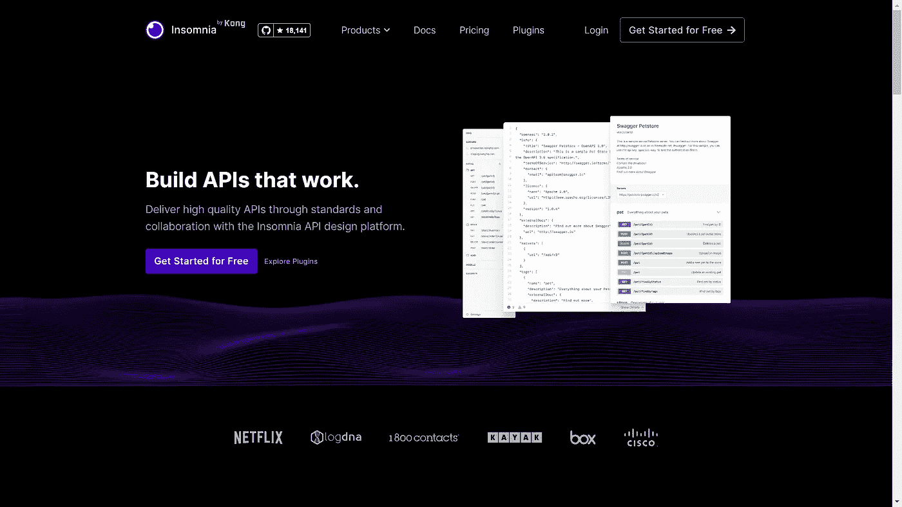
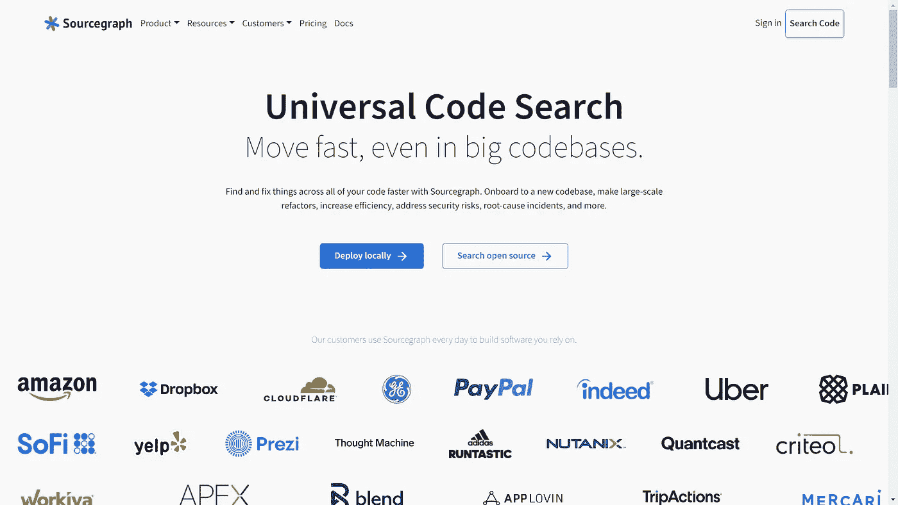
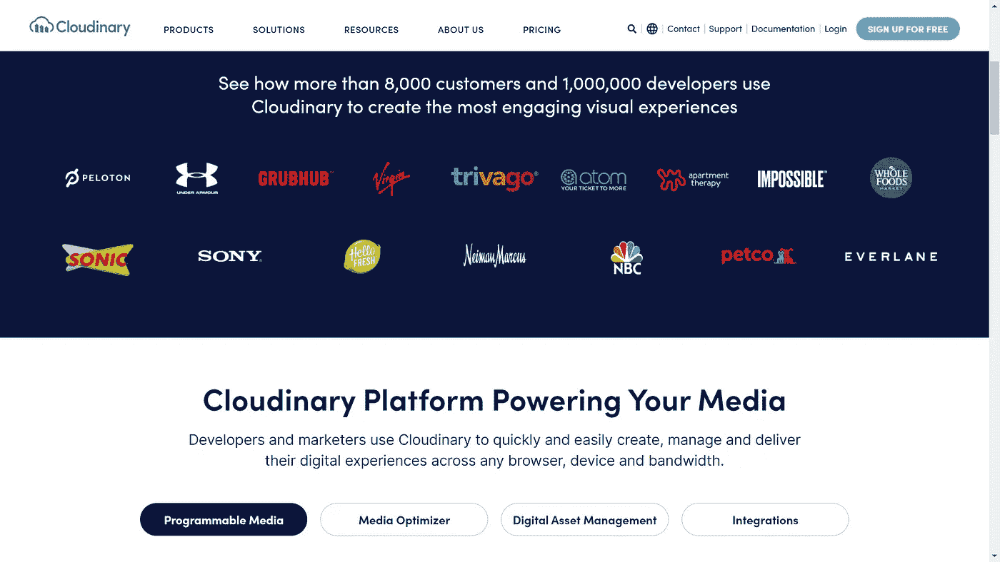
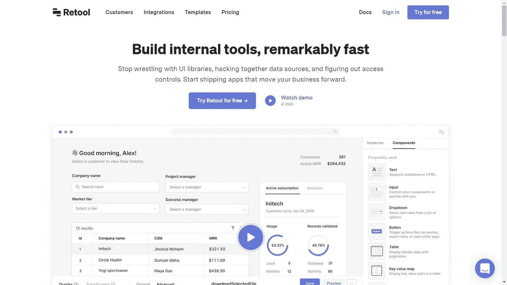
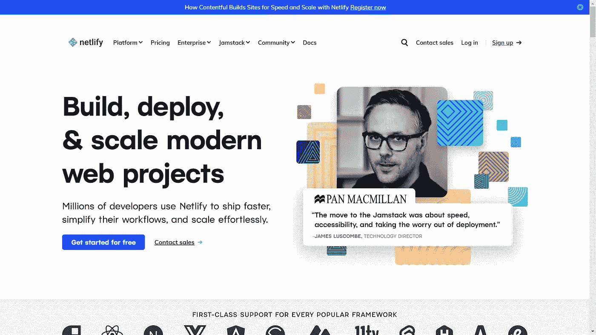

# 开发人员的 5 个工具将使你超高效💪

> 原文：<https://javascript.plainenglish.io/5-tools-for-developers-that-will-make-you-super-productive-b5a9e383856d?source=collection_archive---------3----------------------->

让我们富有成效😉然后直奔主题！

## **1。失眠**

失眠是一个软件工具，使您能够快速测试 API 端点。如果你想做以下事情，失眠是一个极好的选择:

*   构建时测试 Rest、Soap、GraphQL 和 GRPC API 端点。
*   为您的代码库生成 API 文档。
*   构建 API 管道。
*   使用 OpenAPI 设计 API。

## 2.源图

Sourcegraph 是一个软件工具，允许你搜索你所有的代码。它提供精确的代码智能和洞察力。它在几个存储库中搜索你所有的公共和私有代码。它查找整个组织中所有出现的代码。在 GitHub 和 Gitlab 上搜索其他开发人员如何使用超过 200 万个开源存储库中的特定 API 和代码块。

简而言之:

*   轻松快速地重构代码库。
*   为您的所有代码提供精确的代码智能。

## 3.云雾缭绕

Cloudinary 是一种全栈媒体服务，它通过易于使用的 API 和小部件来存储、转换、优化和交付您的所有媒体资产。

*   建立一个功能/应用程序，存储大量的图像和视频。
*   建立一个允许单次和多次上传的 Ul。

Cloudinary 提供了一个即插即用的可设置皮肤的 UI 小部件，因此您和您的团队不需要构建任何 UI。让你的应用和网站加载速度更快。Cloudinary 通过其全球 CDN 以惊人的速度提供媒体资产。

## 4.改造

Retool 是一个软件工具，让你不用写一行代码就能构建内部工具。如果你想做下面的
，重组是一个很好的选择:

*   在内部构建一个仪表板/ UI 来监控和修改数据。
*   借助 Retool，您可以连接到您的数据库或任何数据源，并使用它们的拖放组件非常快速地构建您的内部工具。
*   让非开发人员可以访问数据库，而不用为他们设置数据库环境。
*   为客户支持提供调试客户问题的工具，而无需为他们构建一套新的工具。

## 5.网络生活

如果您想做以下事情，Netlify 是一个很好的选择:

*   轻松将前端代码部署到互联网。
*   构建 Jamstack 应用程序。Netlify 在 Jamstack 上下了大赌注，并提供工具和资源来构建和开发 Jamstack 应用程序。
*   在每个 pull 请求上生成新的唯一且公开可用的 URL，并提交给其他开发人员和 QA 人员，以测试您正在动态构建的内容。
*   利用快速 CDN 服务静态资产。

*更多内容尽在* [***说白了. io***](http://plainenglish.io/) *。报名参加我们的* [***免费每周简讯这里***](http://newsletter.plainenglish.io/) *。*