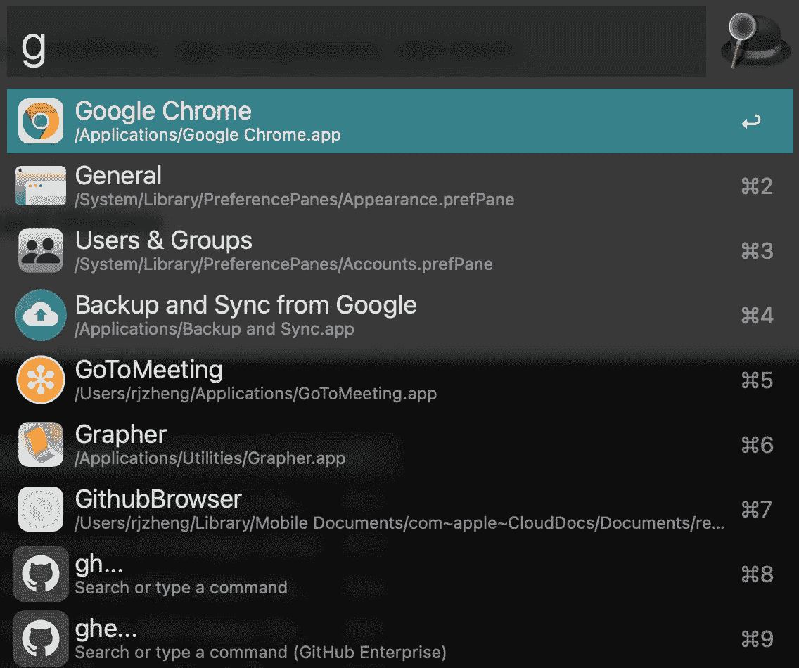
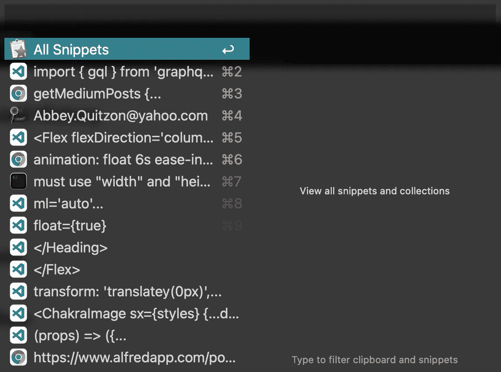
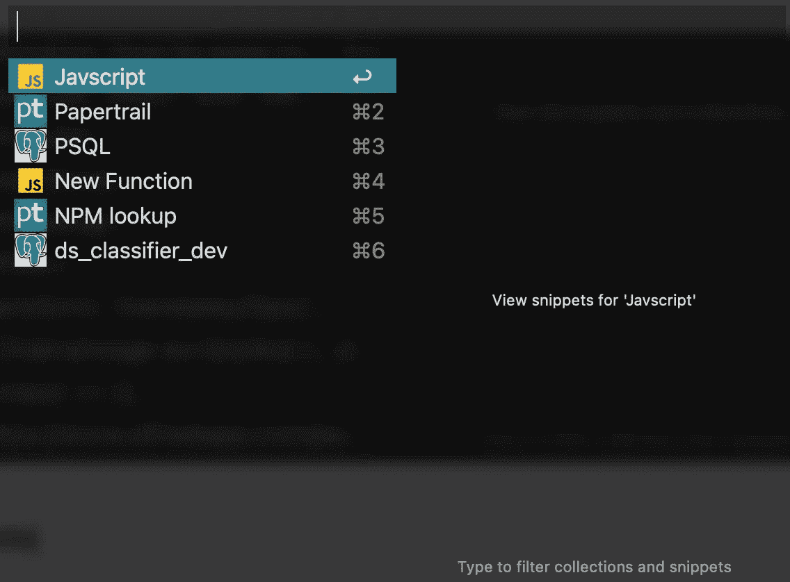
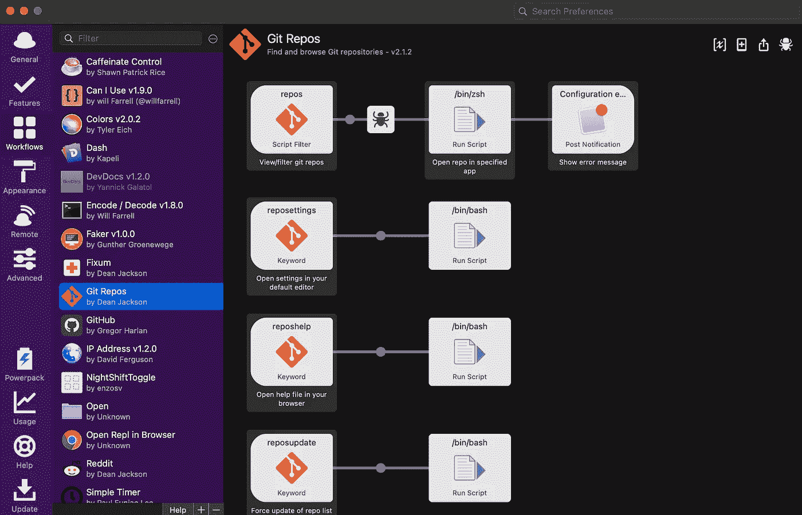
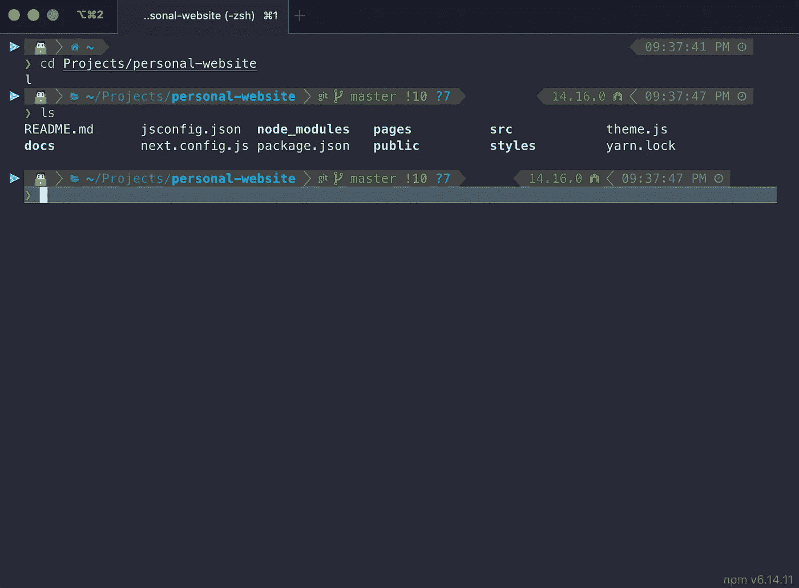
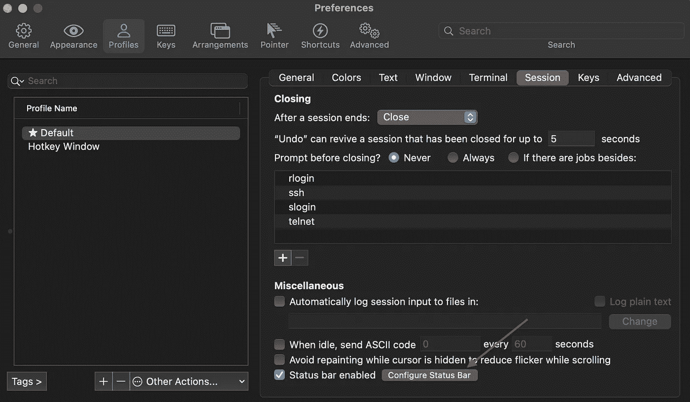
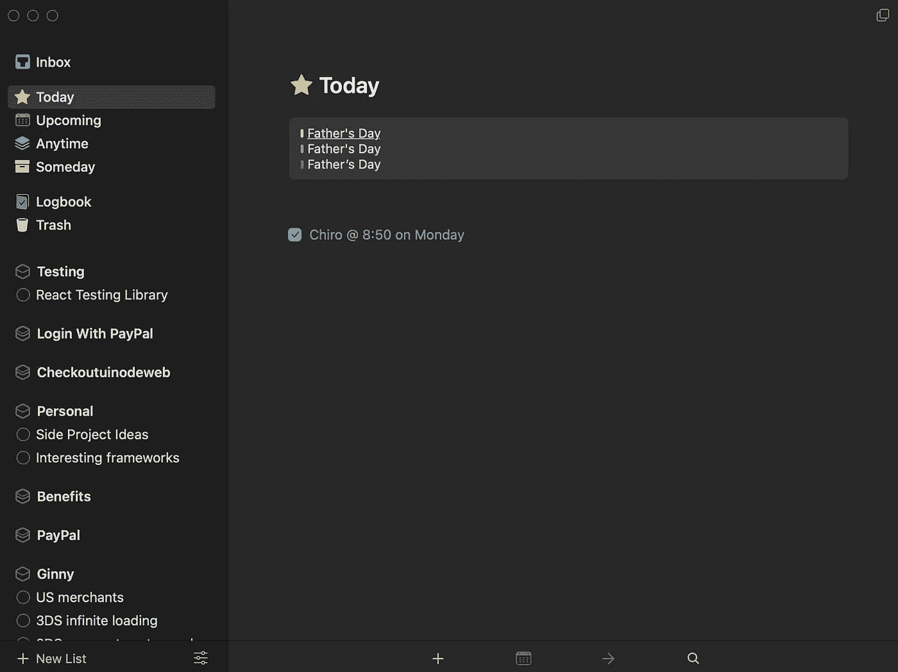
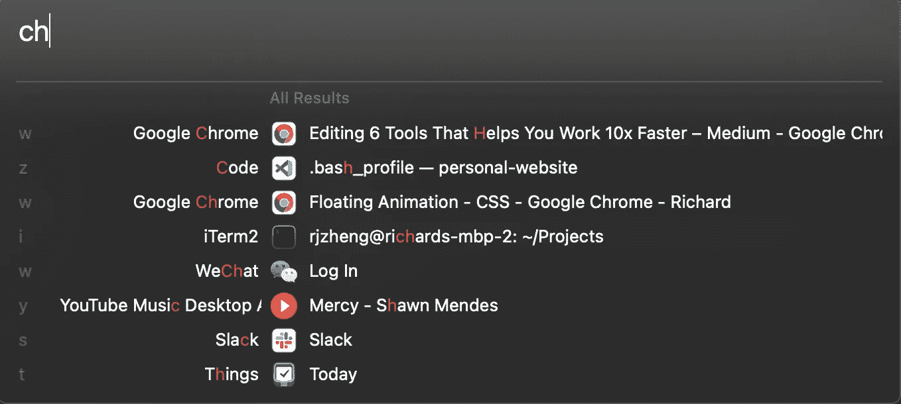

# 5 种工具帮助您将工作速度提高 2 倍

> 原文：<https://javascript.plainenglish.io/5-tools-that-help-you-work-2x-faster-f2f1644de124?source=collection_archive---------1----------------------->

## 给你的老板和同事留下深刻印象的快速简单的方法


Photo by [Max Duzij](https://unsplash.com/@max_duz?utm_source=medium&utm_medium=referral) on [Unsplash](https://unsplash.com?utm_source=medium&utm_medium=referral)

我们技术人员(开发人员、设计人员等)通过坐在椅子上成 90 度角，盯着屏幕，每天重复执行任务来将食物放在桌子上。这就是我们的惯用伎俩。无论是从 notes 中复制命令，还是从数据生成网站中收集虚假的测试数据，事实都是时间就是金钱。并且低效退格和微上下文切换数量的增加阻碍了效率。因此，我投入了大量(非工作)时间寻找工具来帮助我更有效地工作。现在让我帮你自助吧！以下是我每天使用的 5 个主要工具，它们帮助我有效地完成高质量的工作。

# 1.阿尔弗雷德 4 号(带动力包)

[Alfred 4](https://www.alfredapp.com/) 是终极生产力工具，允许您使用热键和自定义操作来打开应用程序并即时运行脚本。它打开文件和应用的核心功能与 Mac 的 Spotlight 非常相似；然而，它的速度更快，有多个主题，而且总体上更加可定制。通过 [Powerpack](https://www.alfredapp.com/powerpack/) 升级，您可以解锁剪贴板历史、代码片段、工作流、应用集成等功能。



## 1a。剪贴板历史

**Alt+tab** ， **⌘+C** ， **⌘+V** ， **Alt+tab** ，重复...我记不清一天做了多少次。当我需要从 Chrome 上复制虚假的测试数据时，这尤其令人厌烦。Alfred 的剪贴板历史显示了一个带有所有先前复制内容的模式，您可以遍历并选择您想要复制的正确内容。现在，您可以从一个应用程序中复制多个选择，并将其粘贴到另一个应用程序中，而无需来回切换。这也使您能够在复制所需内容后放心地关闭任何搜索标签。



## 1b。片段

作为一名开发人员，我保留了一个小备忘单(shh ),其中包含代码片段、编码指南的链接以及 Notes 应用程序中的有用资源。Alfred snippets 允许您存储代码片段，并通过关键字进行搜索/过滤。现在你有一个集中的地方来存储任何东西，从代码片段到你伴侣的地址**(或者更重要的周年纪念)。**您再也不用担心丢失或放错信息了。



## 1c。工作流程

Alfred Workflow 允许您将您最喜欢的应用程序集成到 Alfred 界面中。这个特性的能力是无限的。你可以从头开始开发工作流，从他们的模板中扩展，或者在线下载别人的杰作。我最喜欢的工作流程之一是迪安·杰克逊的 Git Repos。一旦集成，我只需几个键就可以打开 Vscode、Chrome 或任何兼容应用程序中的任何 git 存储库。



# 2.iTerm2

程序员创造了无数具有直观 UI 的实用工具，如 Git 北海巨妖和 Postman，它们帮助开发人员并提高性能。相反，我主张避免上下文切换，更喜欢在终端中做任何事情。 [iTerm2](https://iterm2.com) 正是实现这一目标的工具。这是一个先进的终端，支持分割窗格，热键窗口，并自动完成只是其中的一部分。它的 24 位颜色也非常适合 Oh My Zsh 和 Powerlevel10k 主题。

## 2a。哦，我的 Zsh

如果你每天都用终端工作，你可能希望它看起来有吸引力(~美学~)。[哦，我的 Zsh](https://ohmyz.sh/) 是一个管理你的 Zsh 的开源框架。它提供了无穷无尽的开箱即用的主题列表。此外，它有 [275+插件](https://github.com/ohmyzsh/ohmyzsh/wiki/Plugins)，您可以将它们添加到配置文件中，以帮助您加快工作流程。苹果还在 WWDC 2019(全球开发者大会)上宣布，他们正在[将默认外壳切换到 zsh](https://support.apple.com/en-ca/HT208050) ，所以哦，我的 zsh 是 def 必备。

## 2b。功率级 10k

虽然“哦，我的 Zsh”有许多主题选项，但“power level 10k”是迄今为止我最喜欢的主题。你可能已经想到了，如果只是一个主题，我就不会在这里列出 p10k 了。它承诺了速度、灵活性和开箱即用的体验。安装 p10k 后，配置向导快速简单，但高度可定制。此外，该主题还提供了一个即时提示选项，允许您开始输入下一个命令，而不是被上一个命令暂停。为了让你的终端看起来像下面的截图，我使用了[时髦的颜色](https://github.com/sindresorhus/iterm2-snazzy)和【p10k 配置。



## 2c。状态栏

iTerm2 过去曾多次推出有用的特性，但相对较新的状态栏无疑使画面更加完整。您可以导航到如下图所示的设置，并添加多个有用的数据，如 CPU、内存、网络速度、git 状态和您希望在终端底部显示的自定义数据。虽然您可以使用 p10k 显示这些信息中的大部分，但它添加了另一个有趣的属性来装饰您的终端，并使其成为您自己的终端。



# 3.Git 自定义命令

我的 Git CLI 用户在哪里？？相比 Git 北海巨妖、Sourcetree、Github Desktop 等应用，我们更喜欢使用 Git CLI，因为我们习惯了用键盘导航，而不是点击漂亮的 ui。一些 zsh 用户甚至安装了 [Git 插件](https://github.com/ohmyzsh/ohmyzsh/blob/master/plugins/git/git.plugin.zsh)(我们喜欢好的快捷方式，不是吗？🤓).现在让我们进入下一个层次，向 Git 路径添加定制的 Git 命令。为此，我们需要创建一个包含所有用`bash`编写的 Git 脚本的文件夹，并将其添加到`PATH`中，如下所示:

```
# syntax
export PATH=$PATH:[PATH_TO_FOLDER]# example
export PATH=$PATH:/Users/rjzheng/Helpers/git-custom-commands
```

现在，如果我们有一个类似我这里的`git-resync`命令的脚本:

并且我们给它正确的权限，我们可以很容易地将它作为 Git 本机操作的一部分:

```
$ chmod 777 git-resync
$ cd git-project
$ git resync
```

# 4.事情 3

要成为一名高效的开发人员，规划好你的一天，而不是无所事事地试图弄清楚下一步该做什么是至关重要的。 [Things 3](https://culturedcode.com/things/) 是一个很棒的待办事项应用程序，可以让你有条理地计划你的任务。您可以创建大纲以将项目放在不同的范围内，链接日历，在任务中搜索关键词，设置提醒事项等等。(但是等等，还有！)Things 3 还支持所有平台，并通过云同步事件，因此您可以在任何地方访问相同的数据。为了简单起见，我还把会议记录放在这里，把所有的东西都放在一个地方。



# 5.上下文

如果你从这篇文章中学到了什么，那就是我讨厌上下文切换。巧合的是，[上下文](https://contexts.co/)帮助你以最微妙的方式浏览上下文切换。上下文是任务切换器( **Alt+tab** )和 Dock 替换。在上下文窗口中，你可以搜索一个特定的应用程序或 chrome 标签来切换，而不是一直按住 **Alt+tab** 直到找到正确的窗口。界面的每个窗口旁边都有提示，帮助你加快搜索速度。



# 结论

重复变得无聊，我不确定这种类型的肌肉记忆是否会让我们更‘swole’。没有人希望在工作中一遍又一遍地做同样的事情。我们在开发新功能、创新和尝试新事物的过程中感到兴奋。

这 5 个工具可能每天只为你节省几分钟，但是我向你保证这些分钟将会为你节省数小时的时间。我鼓励你注意不必要的重复，并找到或建立工具来克服它。如果你发现任何酷的东西，请不要犹豫与我分享，让我们一起寻找更快的工作。

*更多内容请看*[***plain English . io***](http://plainenglish.io/)